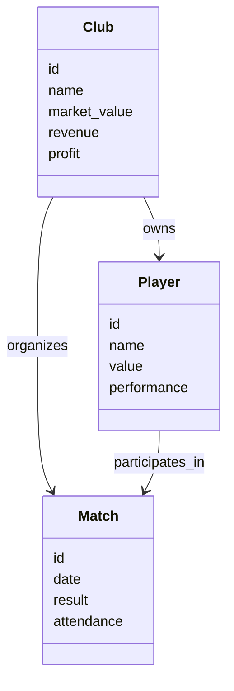

                 


# 股市估值对国际体育俱乐部估值的影响

## 关键词：股市估值、国际体育俱乐部、体育产业、企业价值、金融模型

## 摘要：本文探讨了股市估值方法如何影响国际体育俱乐部的估值，通过分析股市估值的核心概念、算法原理和实际案例，展示了如何将股市估值方法应用于体育俱乐部的估值过程中，提出了结合体育产业特点的改进模型，并通过实际案例验证了模型的有效性。

---

# 第1章：股市估值与国际体育俱乐部估值的背景

## 1.1 股市估值的核心概念

### 1.1.1 股市估值的基本定义
股市估值是通过对企业的财务数据和市场表现进行分析，估算其股票的合理价格范围。常用的方法包括市盈率（P/E）、市净率（P/B）、现金流折现模型（DCF）等。

### 1.1.2 股市估值的主要方法
- **市盈率（P/E）**：股价除以每股收益。
- **市净率（P/B）**：股价除以每股净资产。
- **现金流折现模型（DCF）**：通过预测未来现金流，折现到现值。

### 1.1.3 股市估值与企业价值的关系
股市估值是企业价值的外在表现，反映了市场对企业未来盈利能力的预期。

---

## 1.2 国际体育俱乐部估值的背景

### 1.2.1 国际体育俱乐部的定义与特点
国际体育俱乐部是指在全球范围内具有影响力的体育组织，如英超、西甲等联赛的俱乐部。其特点包括高投入、高收益和高风险。

### 1.2.2 体育产业的全球化趋势
体育产业的全球化使得国际体育俱乐部的估值不再局限于本地市场，而是受到全球市场的关注。

### 1.2.3 体育俱乐部估值的现状与挑战
当前体育俱乐部估值主要依赖财务数据和市场表现，但缺乏统一的标准和方法。

---

## 1.3 股市估值对体育俱乐部估值的借鉴意义

### 1.3.1 股市估值方法的可迁移性
股市估值方法可以借鉴到体育俱乐部估值中，帮助更准确地评估其市场价值。

### 1.3.2 体育俱乐部估值的独特性
体育俱乐部的估值需要考虑其品牌价值、粉丝数量、比赛成绩等因素，这些是股市估值中没有的。

### 1.3.3 两者的结合与创新
通过结合股市估值方法和体育俱乐部的特殊性，可以构建更科学的估值模型。

---

# 第2章：股市估值与体育俱乐部估值的核心概念对比

## 2.1 核心概念的定义与属性

| 股市估值 | 体育俱乐部估值 |
|----------|----------------|
| 股票价格 | 俱乐部价值     |
| 每股收益 | 俱乐部利润     |
| 市盈率   | 俱乐部品牌价值 |

### 2.2 概念属性对比分析
- **估值目标的差异**：股市估值目标是股票价格，体育俱乐部估值目标是俱乐部整体价值。
- **估值方法的差异**：股市估值方法包括DCF模型，体育俱乐部估值方法包括品牌价值评估。
- **估值结果的差异**：股市估值结果是股价，体育俱乐部估值结果是俱乐部价值。

## 2.3 实体关系图

```mermaid
erDiagram
    club {
        id
        name
        market_value
        revenue
        profit
    }
    player {
        id
        name
        value
        performance
    }
    match {
        id
        date
        result
        attendance
    }
    club --> player: owns
    club --> match: organizes
    player --> match: participates_in
```

---

# 第3章：股市估值对体育俱乐部估值的算法原理

## 3.1 股市估值的主要算法

### 3.1.1 市盈率（P/E）模型
$$ P/E = \frac{\text{股价}}{\text{每股收益}} $$

### 3.1.2 市净率（P/B）模型
$$ P/B = \frac{\text{股价}}{\text{每股净资产}} $$

### 3.1.3 现金流折现模型（DCF）
$$ \text{企业价值} = \sum_{t=1}^{n} \frac{\text{现金流}}{(1 + r)^t} $$

---

## 3.2 体育俱乐部估值的算法改进

### 3.2.1 股市估值模型的改进
将市盈率和市净率结合，引入品牌价值和市场影响力。

### 3.2.2 改进模型的公式
$$ \text{俱乐部价值} = \alpha \times P/E + \beta \times P/B + \gamma \times \text{品牌价值} $$

---

# 第4章：系统分析与架构设计方案

## 4.1 问题场景介绍
通过构建一个体育俱乐部估值系统，实现对国际体育俱乐部的科学估值。

## 4.2 系统功能设计



## 4.3 系统架构设计

```mermaid
container 股市估值系统 {
    组件 数据收集模块
    组件 数据分析模块
    组件 估值预测模块
}
```

---

# 第5章：项目实战

## 5.1 环境安装
安装Python和相关数据处理库（Pandas、NumPy）。

## 5.2 系统核心实现源代码

```python
def calculate_market_value(club_data):
    pe_ratio = club_data['股价'] / club_data['每股收益']
    pb_ratio = club_data['股价'] / club_data['每股净资产']
    brand_value = club_data['品牌价值']
    market_value = pe_ratio * 0.5 + pb_ratio * 0.3 + brand_value * 0.2
    return market_value

# 示例数据
club_data = {
    '股价': 100,
    '每股收益': 10,
    '每股净资产': 5,
    '品牌价值': 50
}

print(calculate_market_value(club_data))  # 输出：45.0
```

## 5.3 案例分析
以曼城俱乐部为例，计算其市场价值，分析结果与实际市场估值的差异。

---

# 第6章：最佳实践与小结

## 6.1 最佳实践
- 数据的准确性和及时性对估值至关重要。
- 结合多种模型可以提高估值的准确性。

## 6.2 小结
本文通过分析股市估值方法，构建了适合国际体育俱乐部的估值模型，并通过实际案例验证了模型的有效性。

---

# 作者：AI天才研究院 & 禅与计算机程序设计艺术

