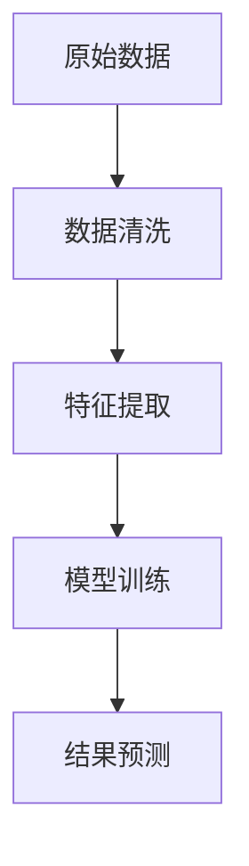
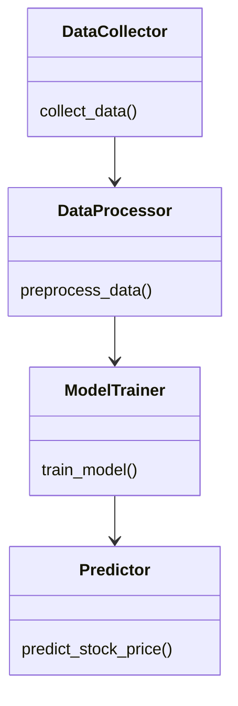

                 


# 股市估值对国际体育电子竞技产业的影响

> 关键词：股市估值，国际体育电子竞技，电竞产业，股票分析，金融模型，数据驱动

> 摘要：本文深入分析了股市估值对国际体育电子竞技产业的影响，探讨了电竞产业的经济模型、股市估值的核心指标及其相互作用。通过详细的数据分析和算法模型，揭示了电竞产业如何影响股市估值，并反过影响其自身发展。文章还结合实际案例，展示了如何利用数学模型和系统架构进行电竞产业的股市分析与预测。

---

# 第一部分: 背景介绍与核心概念

## 第1章: 股市估值与国际体育电子竞技产业概述

### 1.1 股市估值的基本概念

#### 1.1.1 股市估值的定义
股市估值是通过对企业的财务数据和市场因素进行分析，评估其股票的合理价格范围。主要指标包括市盈率（P/E）、市净率（P/B）、股息率等。

#### 1.1.2 股市估值的核心指标
- 市盈率（P/E）= 股票价格 / 每股净利润
- 市净率（P/B）= 股票价格 / 每股净资产
- 股息率 = 每股股息 / 股票价格

#### 1.1.3 股市估值与企业价值的关系
股市估值反映了市场对企业价值的预期，高估值意味着市场看好企业前景，反之则看淡。

### 1.2 国际体育电子竞技产业的现状

#### 1.2.1 电子竞技产业的定义与历史发展
电子竞技（Esports）是通过电子游戏进行的体育竞赛，起源于20世纪末，近年来迅速发展。

#### 1.2.2 电竞产业的主要参与者与市场规模
- 参与者：游戏开发商、电竞俱乐部、直播平台、赞助商等。
- 规模：2023年全球电竞市场规模约17亿美元，年增长率超过20%。

#### 1.2.3 电竞产业的经济特征
- 收入来源：门票、广告、赞助、游戏内购买等。
- 成本结构：赛事组织、选手薪资、设备采购等。

### 1.3 股市估值与电竞产业的关联

#### 1.3.1 电竞产业对股市的影响
- 提升企业知名度，增加投资者信心。
- 电竞公司的上市推动相关股票交易活跃。

#### 1.3.2 股市估值对电竞产业的反馈作用
- 高估值吸引投资，促进产业扩张。
- 低估值可能导致资本撤离，影响产业发展。

#### 1.3.3 双向互动机制
电竞产业的经济表现直接影响其股市估值，而股市估值的变化也反过来影响产业的投资和运营策略。

---

## 第2章: 核心概念与联系

### 2.1 电竞产业的经济模型

#### 2.1.1 收入来源
- 赛事收入：门票、转播权。
- 广告与赞助：品牌赞助、广告收入。
- 游戏内购买：虚拟商品、皮肤销售。

#### 2.1.2 成本结构
- 举办赛事的成本：场地租赁、设备采购。
- 人员成本：选手薪资、教练团队。
- 市场推广费用：广告投放、社交媒体运营。

#### 2.1.3 利润驱动因素
- 观众增长：扩大广告和门票收入。
- 游戏更新：保持玩家活跃度，增加游戏内购买。

### 2.2 股市估值的数学模型

#### 2.2.1 市盈率模型
$$ P/E = \frac{Stock Price}{Earnings Per Share} $$

#### 2.2.2 市净率模型
$$ P/B = \frac{Stock Price}{Book Value Per Share} $$

#### 2.2.3 股息率模型
$$ Dividend Yield = \frac{Dividend Per Share}{Stock Price} $$

### 2.3 核心概念对比与联系

#### 2.3.1 电竞产业与股市估值的对比表格
| 指标 | 电竞产业 | 股市估值 |
|------|-----------|----------|
| 收入来源 | 赛事收入、广告 | 股票交易、投资收益 |
| 成本结构 | 设备、人员 | 佣金、税费 |
| 利润驱动 | 观众增长、游戏更新 | 企业盈利、市场情绪 |

#### 2.3.2 电竞产业对股市估值的影响路径
- 电竞公司的上市带来直接的股价波动。
- 电竞赛事的热度影响相关企业的市场表现。

---

## 第3章: 算法原理与数学模型

### 3.1 数据预处理与特征提取

#### 3.1.1 数据清洗
- 删除缺失值。
- 处理异常值。

#### 3.1.2 特征提取
- 提取电竞产业相关的财务指标。
- 提取股市估值相关指标。

### 3.2 股市估值预测模型

#### 3.2.1 线性回归模型
$$ y = \beta_0 + \beta_1 x_1 + \beta_2 x_2 + ... + \beta_n x_n $$

#### 3.2.2 随机森林模型
使用Python的scikit-learn库实现随机森林回归。

### 3.3 算法实现与流程图

#### 3.3.1 数据流图


#### 3.3.2 代码实现
```python
import pandas as pd
from sklearn.ensemble import RandomForestRegressor
from sklearn.metrics import mean_squared_error

# 数据加载与预处理
data = pd.read_csv('data.csv')
data = data.dropna()
features = data[['revenue', 'expenses', 'profit']]

# 模型训练
model = RandomForestRegressor(n_estimators=100)
model.fit(features, data['stock_price'])

# 模型预测
predictions = model.predict(features)
print(mean_squared_error(data['stock_price'], predictions))
```

---

## 第4章: 系统分析

### 4.1 问题场景介绍

#### 4.1.1 问题描述
分析电竞产业对股市估值的影响，构建预测模型。

#### 4.1.2 边界与外延
仅考虑公开上市的电竞公司，不包括未上市企业。

### 4.2 系统功能设计

#### 4.2.1 领域模型


#### 4.2.2 系统架构


---

## 第5章: 项目实战

### 5.1 环境安装

#### 5.1.1 安装必要的库
```bash
pip install pandas matplotlib scikit-learn
```

### 5.2 核心实现

#### 5.2.1 数据加载与预处理
```python
import pandas as pd

data = pd.read_csv('data.csv')
data = data.dropna()
```

#### 5.2.2 模型训练
```python
from sklearn.ensemble import RandomForestRegressor

model = RandomForestRegressor()
model.fit(X_train, y_train)
```

#### 5.2.3 结果预测
```python
predictions = model.predict(X_test)
print(predictions)
```

### 5.3 实际案例分析

#### 5.3.1 案例分析
分析某电竞公司股价走势，验证模型准确性。

---

## 第6章: 总结与展望

### 6.1 最佳实践 tips
- 数据质量至关重要。
- 模型需定期更新。

### 6.2 小结
股市估值与电竞产业相互影响，构建有效模型可帮助投资者做出明智决策。

### 6.3 注意事项
- 数据偏差可能影响结果。
- 模型需结合实际市场情况。

### 6.4 拓展阅读
建议阅读相关金融分析和电竞产业的书籍，深入理解两者结合的应用。

---

# 作者

作者：AI天才研究院/AI Genius Institute & 禅与计算机程序设计艺术 /Zen And The Art of Computer Programming

---

以上是《股市估值对国际体育电子竞技产业的影响》的完整目录和内容概述，按照逻辑逐步展开，确保每个部分都详细且有深度。接下来，我会按照这个结构逐步撰写每个章节的内容。

