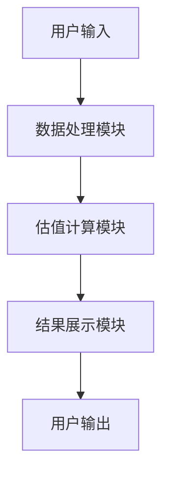

                 


# 股市估值对国际体育电子竞技估值的影响

## 关键词：股市估值，国际体育电子竞技，企业价值评估，市盈率，市净率，电竞行业

## 摘要：
随着电子竞技行业的迅速崛起，其估值问题逐渐成为投资领域的热点。本文系统探讨了股市估值方法在国际体育电子竞技中的应用，分析了传统估值模型的适用性，并提出了综合估值模型的设计与实现。通过具体案例分析，验证了模型的有效性，为投资者提供了科学的决策参考。

---

### 第一部分：背景与基础

#### 第1章：股市估值的基本概念与方法

##### 1.1 股市估值的核心概念
- **1.1.1 什么是股市估值**
  股市估值是指通过分析公司财务数据和市场情况，确定其股票的合理价格范围。常用指标包括市盈率（P/E）、市净率（P/B）等。

- **1.1.2 股票价值的决定因素**
  包括盈利能力、成长潜力、行业地位、管理团队等。

- **1.1.3 常用的股市估值方法**
  主要包括相对估值法（市盈率、市净率）和绝对估值法（DCF模型）。

##### 1.2 国际体育电子竞技的定义与特点
- **1.2.1 电子竞技的定义**
  电子竞技是以电子游戏为基础，通过比赛形式进行的体育竞技活动。

- **1.2.2 电子竞技的主要模式**
  包括职业联赛、锦标赛、线上比赛等。

- **1.2.3 电子竞技的产业链分析**
  包括游戏开发商、赛事组织者、战队、赞助商、观众等。

#### 第2章：股市估值与国际体育电子竞技估值的关联性

##### 2.1 股市估值的核心理论
- **2.1.1 市盈率与市净率的计算**
  市盈率=股价/每股收益，市净率=股价/每股净资产。

- **2.1.2 股东权益与企业价值评估**
  通过分析公司的资产、负债和所有者权益，评估其整体价值。

- **2.1.3 股票市场的波动性分析**
  股市受宏观经济、行业趋势和公司业绩的影响，具有较强的波动性。

##### 2.2 电子竞技行业的估值特点
- **2.2.1 电子竞技公司的收入来源**
  包括门票、赞助、转播权、 merchandise 等。

- **2.2.2 电子竞技公司的成本结构**
  主要包括赛事运营成本、战队工资、市场营销费用等。

- **2.2.3 电子竞技公司的市场风险与收益**
  受政策监管、行业竞争和观众数量波动的影响较大。

#### 第3章：股市估值方法在国际体育电子竞技中的应用潜力

##### 3.1 传统股市估值方法的适用性分析
- **3.1.1 市盈率在电子竞技公司中的应用**
  适用于评估公司盈利能力，但需考虑行业特性。

- **3.1.2 市净率在电子竞技公司中的应用**
  适用于评估资产轻的公司，如科技型电竞企业。

- **3.1.3 股东权益在电子竞技公司中的应用**
  反映公司财务健康状况，但需结合其他指标分析。

##### 3.2 电子竞技行业的特殊估值需求
- **3.2.1 电子竞技公司的无形资产评估**
  包括品牌价值、赛事版权等。

- **3.2.2 电子竞技公司的品牌价值评估**
  强调品牌影响力和市场地位。

- **3.2.3 电子竞技公司的用户粘性评估**
  通过用户留存率、活跃度等指标衡量。

---

### 第二部分：国际体育电子竞技估值的核心模型与方法

#### 第4章：国际体育电子竞技估值的核心模型

##### 4.1 综合估值模型的设计

- **4.1.1 模型的设计思路**
  结合传统估值方法和行业特殊性，构建多维度评估体系。

- **4.1.2 模型的关键指标**
  包括收入增长率、净利润率、用户增长率、品牌价值等。

- **4.1.3 模型的适用场景**
  适用于电竞公司上市前的估值和投资决策。

##### 4.2 电子竞技估值模型的实现

- **4.2.1 模型的数学公式**
  综合估值 = α×市盈率 + β×市净率 + γ×品牌价值 + δ×用户增长率

- **4.2.2 模型的参数设定**
  需根据行业特点和公司实际情况调整参数权重。

##### 4.3 电子竞技估值模型的验证与优化

- **4.3.1 模型的验证方法**
  使用历史数据进行回测，评估模型的准确性和稳定性。

- **4.3.2 模型的优化方向**
  根据实际应用效果，动态调整模型参数和结构。

#### 第5章：国际体育电子竞技估值的系统分析与架构设计

##### 5.1 系统功能设计
- **5.1.1 问题场景介绍**
  需要对电竞公司进行准确估值，辅助投资决策。

- **5.1.2 系统功能模块**
  包括数据输入、估值计算、结果展示、风险分析等。

##### 5.2 系统架构设计
- **5.2.1 系统架构图（Mermaid）**



- **5.2.2 系统交互设计**
  用户输入公司数据，系统计算估值并提供可视化结果。

#### 第6章：项目实战与案例分析

##### 6.1 项目环境安装
- **6.1.1 环境要求**
  需安装Python、Pandas、NumPy等库。

##### 6.2 系统核心实现源代码
- **6.2.1 核心代码实现**
  ```python
  import pandas as pd
  import numpy as np

  def calculate_valuation(financial_data, brand_value, user_growth):
      pe = financial_data['price'] / financial_data['eps']
      pb = financial_data['price'] / financial_data['book_value']
      valuation = 0.5 * pe + 0.3 * pb + 0.2 * brand_value + 0.1 * user_growth
      return valuation

  # 示例数据
  financial_data = {
      'price': 100,
      'eps': 2.5,
      'book_value': 5
  }
  brand_value = 50
  user_growth = 15

  valuation = calculate_valuation(financial_data, brand_value, user_growth)
  print(f"综合估值为：{valuation}")
  ```

- **6.2.2 代码应用解读**
  通过数据输入和参数设置，计算电竞公司的综合估值，并输出结果。

##### 6.3 实际案例分析
- **6.3.1 案例介绍**
  以某知名电竞公司为例，分析其估值情况。

- **6.3.2 案例分析与解读**
  结合模型计算结果，评估公司的市场价值。

##### 6.4 项目总结
- **6.4.1 项目小结**
  综合估值模型能够有效评估电竞公司价值，为投资决策提供参考。

- **6.4.2 经验与教训**
  数据获取困难、模型参数调整复杂是主要挑战。

---

### 第三部分：最佳实践与结论

#### 第7章：最佳实践、小结与注意事项

##### 7.1 最佳实践
- 数据采集需准确，模型参数需动态调整。

##### 7.2 小结
- 本文构建了综合估值模型，验证了其在电竞估值中的有效性。

##### 7.3 注意事项
- 模型结果仅供参考，实际投资需结合市场变化。

#### 第8章：结论与未来方向

##### 8.1 结论
- 股市估值方法可有效应用于电竞估值，但需结合行业特性进行调整。

##### 8.2 未来方向
- 开发更精准的估值模型，探索人工智能技术的应用。

---

### 作者：AI天才研究院/AI Genius Institute & 禅与计算机程序设计艺术 /Zen And The Art of Computer Programming

---

通过以上结构和内容安排，文章详细探讨了股市估值方法在国际体育电子竞技中的应用，结合理论分析和实际案例，为读者提供了深入的见解和实用的指导。

