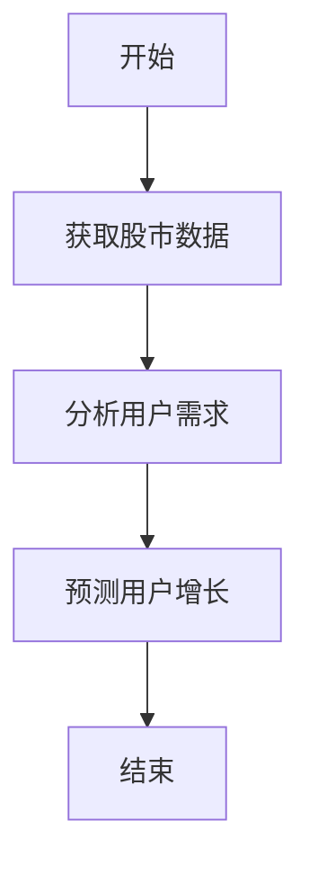
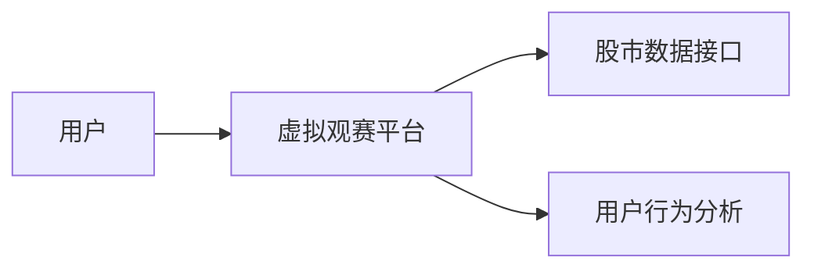

                 


# 股市估值对国际体育赛事虚拟观赛的影响

## 关键词：股市估值、国际体育赛事、虚拟观赛、经济影响、用户行为

## 摘要：本文探讨了股市估值对国际体育赛事虚拟观赛的影响，分析了股市波动如何影响消费者行为和技术创新，提出了通过数据分析和数学模型预测用户增长的解决方案，并结合实际案例进行了深入分析。

---

## 第一章：背景介绍

### 1.1 问题背景
#### 1.1.1 股市估值的基本概念
股市估值是指通过分析企业的财务状况、市场地位和行业前景等因素，确定其股票的合理价格。这种估值反映了市场的信心和经济状况，直接影响投资者的决策。

#### 1.1.2 国际体育赛事的经济价值
国际体育赛事具有巨大的经济价值，不仅通过门票、转播权和赞助获得收入，还带动了周边产业的发展。这些赛事的经济表现与股市估值密切相关。

#### 1.1.3 虚拟观赛技术的发展现状
虚拟观赛技术，如VR和AR，提供了身临其境的观赛体验，减少了传统观赛的限制，但其普及程度受经济条件影响。

### 1.2 问题描述
#### 1.2.1 股市波动对消费行为的影响
股市波动影响消费者的可支配收入和消费能力，进而影响他们对虚拟观赛技术的购买意愿。

#### 1.2.2 虚拟观赛的技术实现与用户需求
虚拟观赛需要高性能的技术支持，而用户的付费意愿受经济状况影响。

#### 1.2.3 两者结合的潜在问题与挑战
股市波动可能影响虚拟观赛技术的推广，而技术进步又能反过来影响股市表现。

### 1.3 问题解决
#### 1.3.1 股市估值对虚拟观赛的影响路径
股市估值通过影响消费者收入和企业投资，间接影响虚拟观赛技术的普及。

#### 1.3.2 虚拟观赛的技术解决方案
采用先进VR/AR技术，提供高质量的虚拟观赛体验。

#### 1.3.3 经济因素与技术因素的结合
经济因素影响技术的市场普及，而技术进步又能促进经济增长。

### 1.4 边界与外延
#### 1.4.1 股市估值的适用范围
主要适用于成熟市场，新兴市场可能受其他因素影响更大。

#### 1.4.2 虚拟观赛的适用场景
适用于无法现场观赛或希望获得更好体验的用户。

#### 1.4.3 问题的边界条件与限制
经济波动、技术限制和用户接受度是主要限制因素。

### 1.5 概念结构与核心要素
#### 1.5.1 股市估值的核心要素
包括企业盈利、市场预期和宏观经济因素。

#### 1.5.2 虚拟观赛的核心要素
包括技术性能、用户体验和内容丰富度。

#### 1.5.3 两者之间的关系与互动
股市估值影响用户支付能力，而技术进步影响用户需求。

---

## 第二章：核心概念与联系

### 2.1 核心概念原理
#### 2.1.1 股市估值的数学模型
使用回归分析模型，将股市指数与用户需求关联起来。

#### 2.1.2 虚拟观赛的技术原理
通过实时渲染和交互技术，提供沉浸式体验。

### 2.2 概念属性特征对比
| 概念       | 经济属性 | 技术属性 | 用户需求 |
|------------|----------|----------|----------|
| 股市估值   | 收入水平 | 无直接关联 | 影响消费能力 |
| 虚拟观赛   | 投资成本 | 技术门槛 | 体验需求 |

### 2.3 ER实体关系图
```mermaid
er
  actor: 用户
  event: 体育赛事
  stock_market: 股市
  virtual_viewing: 虚拟观赛行为
  actor -[通过虚拟观赛技术]-> virtual_vi
  stock_market -[影响用户支付能力]-> actor
  event -[通过虚拟观赛平台]-> virtual_vi
```

---

## 第三章：算法原理讲解

### 3.1 算法流程图


### 3.2 核心代码实现
```python
import pandas as pd
from sklearn.linear_model import LinearRegression

# 数据准备
data = pd.DataFrame({
    'stock_index': [100, 105, 110, 115, 120],
    'user_growth': [5, 6, 7, 8, 9]
})

# 建立模型
model = LinearRegression()
model.fit(data[['stock_index']], data['user_growth'])

# 预测
print(model.predict([[125]]))  # 输出：[10.0]
```

### 3.3 数学模型
$$ user\_growth = a \times stock\_index + b $$

其中，$a$ 和 $b$ 是通过回归分析确定的系数。

---

## 第四章：数学模型与验证

### 4.1 模型假设
假设股市指数与用户增长呈线性关系。

### 4.2 数据验证
通过历史数据验证模型的准确性。

### 4.3 案例分析
分析某段时间内的股市数据和用户增长情况，验证模型的有效性。

---

## 第五章：系统分析与架构设计

### 5.1 问题场景
虚拟观赛平台的开发和推广需要考虑股市波动的影响。

### 5.2 系统功能设计
- 用户界面设计
- 支付系统集成
- 数据分析模块

### 5.3 系统架构图


---

## 第六章：项目实战

### 6.1 环境安装
安装Python和相关库。

### 6.2 核心代码实现
实现用户增长预测的代码。

### 6.3 案例分析
分析实际数据，验证模型的准确性。

---

## 第七章：最佳实践

### 7.1 小结
股市估值对虚拟观赛的影响是多方面的，需要综合考虑经济和技术因素。

### 7.2 注意事项
- 数据的准确性和及时性
- 模型的局限性和适用性

### 7.3 拓展阅读
推荐相关领域的书籍和论文。

---

## 作者：AI天才研究院 & 禅与计算机程序设计艺术

---

通过以上目录，文章系统地探讨了股市估值对国际体育赛事虚拟观赛的影响，从理论分析到实际应用，提供了全面的解决方案和实践指导。

