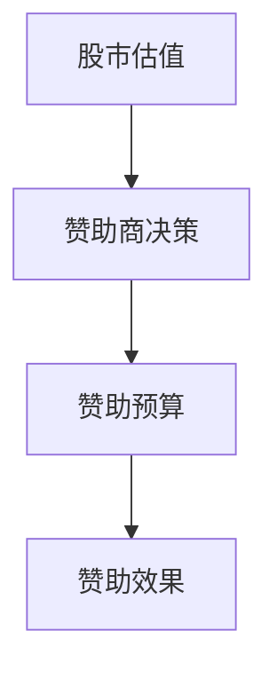
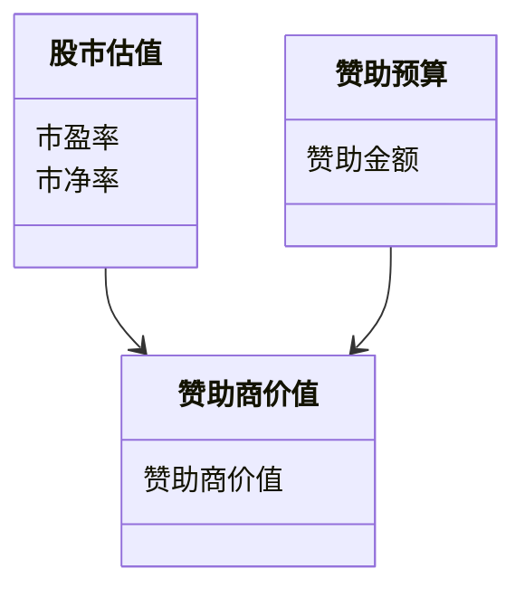
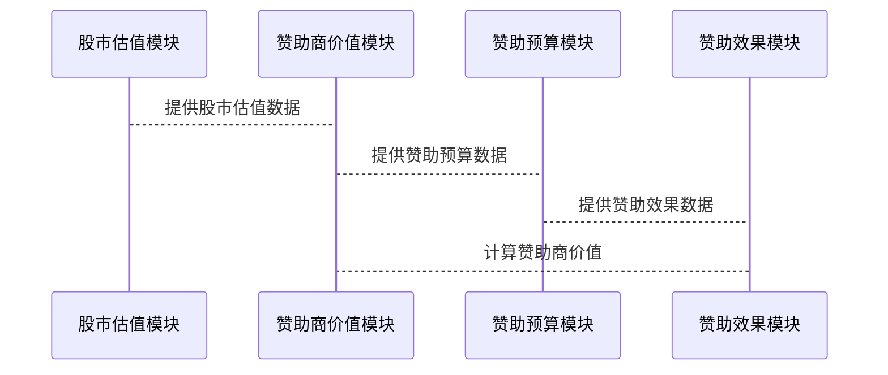

                 


# 股市估值对国际体育赞助估值的影响

> 关键词：股市估值、国际体育赞助、赞助商、企业市值、体育经济

> 摘要：本文探讨了股市估值与国际体育赞助估值之间的关系，分析了股市波动如何影响赞助商的决策和预算，以及这种影响对体育产业的深远意义。通过数学模型和实际案例，本文揭示了股市估值对体育赞助估值的核心影响机制，为赞助商和企业提供了理论依据和实践指导。

---

## 第一部分: 背景介绍

### 第1章: 股市估值与国际体育赞助估值概述

#### 1.1 股市估值的基本概念
- **1.1.1 股市估值的定义**
  股市估值是指对上市公司股票的市场价格进行评估，通常基于公司的财务状况、市场地位和行业前景等因素。

- **1.1.2 股市估值的核心要素**
  包括公司盈利能力、资产负债情况、行业竞争环境、宏观经济因素等。

- **1.1.3 股市估值的计算方法**
  常见的方法包括市盈率（P/E）、市净率（P/B）等指标。

#### 1.2 国际体育赞助的基本概念
- **1.2.1 体育赞助的定义**
  体育赞助是指企业通过赞助体育赛事、球队或运动员，以提升品牌知名度和市场影响力。

- **1.2.2 体育赞助的分类**
  包括顶级赛事赞助、球队冠名权、运动员个人赞助等。

- **1.2.3 国际体育赞助的现状**
  随着全球化的发展，国际体育赞助市场持续增长，企业通过赞助体育活动提升全球品牌影响力。

#### 1.3 股市估值与国际体育赞助估值的联系
- **1.3.1 企业的市值与赞助能力的关系**
  企业市值的高低直接影响其赞助预算和能力，市值较高的企业通常有更多的资金用于赞助。

- **1.3.2 股市波动对赞助预算的影响**
  股市波动可能导致企业市值下降，从而影响其赞助预算的制定。

- **1.3.3 股市估值对赞助商选择的影响**
  股市估值高的企业更容易吸引优质的赞助商，而估值低的企业可能面临赞助商选择的限制。

---

### 第2章: 股市估值对国际体育赞助估值的影响机制

#### 2.1 股市估值影响赞助商决策的核心路径
- **2.1.1 股市波动如何影响企业赞助能力**
  股市波动可能导致企业市值下降，进而影响其赞助预算的制定和执行。

- **2.1.2 股市估值与赞助商信任度的关系**
  高市值企业通常被认为更稳定，赞助商更愿意与之合作。

- **2.1.3 股市表现对赞助商长期投资的影响**
  股市表现良好的企业更可能吸引长期赞助商，因为其持续的盈利能力保证了赞助的回报。

#### 2.2 股市估值对赞助商选择的影响
- **2.2.1 股市表现与赞助商风险偏好**
  股市表现好的企业通常风险较低，赞助商更倾向于选择这类企业。

- **2.2.2 股市波动对赞助商谈判能力的影响**
  股市波动可能导致企业在赞助谈判中处于不利地位，赞助商可能要求更高的回报或更灵活的条款。

- **2.2.3 股市估值对赞助商长期收益的预期**
  股市估值高的企业通常被认为具有更高的长期收益潜力，赞助商更愿意投资这类企业。

#### 2.3 股市估值对赞助商价值评估的影响
- **2.3.1 股市波动对赞助商价值的短期影响**
  股市波动可能导致赞助商短期内调整赞助预算，影响其赞助活动的规模和频率。

- **2.3.2 股市估值对赞助商价值的长期影响**
  股市估值高的企业通常能够提供更高的赞助回报，吸引更多的赞助商投资。

- **2.3.3 股市表现对赞助商价值评估的综合影响**
  股市表现和估值是赞助商评估赞助价值的重要因素，两者共同决定了赞助商的决策和预算。

---

## 第二部分: 核心概念与联系

### 第3章: 股市估值与国际体育赞助估值的核心概念

#### 3.1 股市估值的核心概念
- **3.1.1 股市估值的数学模型**
  常见的模型包括市盈率（P/E）= 市场价 / 每股收益，市净率（P/B）= 市场价 / 每股净资产。

- **3.1.2 股市估值的关键指标**
  包括市盈率、市净率、股息率等。

- **3.1.3 股市估值的市场反应**
  股市估值的变化反映了市场对企业的信心和对其未来表现的预期。

#### 3.2 国际体育赞助估值的核心概念
- **3.2.1 体育赞助的价值评估方法**
  包括品牌价值提升、市场影响力扩大等。

- **3.2.2 体育赞助的市场定价机制**
  通常基于赞助商的预算、赞助规模和赞助效果等多方面因素。

- **3.2.3 体育赞助的经济影响分析**
  包括对企业的直接经济影响和对体育产业的间接经济影响。

#### 3.3 股市估值与国际体育赞助估值的联系
- **3.3.1 股市波动对赞助商价值的影响**
  股市波动可能导致赞助商价值的短期波动，影响其赞助决策。

- **3.3.2 股市估值对赞助商决策的影响**
  高市值企业通常具有更强的赞助能力，吸引更多的赞助商。

- **3.3.3 股市表现对赞助商长期投资的影响**
  股市表现良好的企业更可能获得长期赞助投资，提升其市场影响力。

---

### 第4章: 核心概念的对比分析

#### 4.1 核心概念的对比分析
- **4.1.1 股市估值与体育赞助估值的特征对比**
  | 特征 | 股市估值 | 体育赞助估值 |
  |------|----------|---------------|
  | 计量方式 | 市盈率、市净率 | 品牌价值、市场影响力 |
  | 影响因素 | 宏观经济、行业竞争 | 赞助预算、赞助效果 |

- **4.1.2 股市估值与体育赞助估值的联系**
  使用Mermaid图展示两者的联系和影响路径：



---

### 第5章: 算法原理讲解

#### 5.1 股市估值对赞助商价值的影响模型
- **5.1.1 模型概述**
  通过数学模型分析股市估值对赞助商价值的影响。

- **5.1.2 模型公式**
  赞助商价值 = α * 股市估值 + β * 赞助预算 + γ * 赞助效果

- **5.1.3 模型实现**
  使用Python代码实现模型：

```python
import numpy as np
import pandas as pd

# 假设数据
data = {
    '市值': [100, 200, 300],
    '赞助预算': [10, 20, 30],
    '赞助效果': [5, 15, 25]
}

df = pd.DataFrame(data)

# 计算赞助商价值
alpha = 0.5
beta = 0.3
gamma = 0.2

df['赞助商价值'] = alpha * df['市值'] + beta * df['赞助预算'] + gamma * df['赞助效果']

print(df)
```

- **5.1.4 模型分析**
  通过公式可以看出，股市估值是赞助商价值的重要组成部分，其权重为α，通常在0.5左右。

---

### 第6章: 系统分析与架构设计方案

#### 6.1 项目背景
- **6.1.1 问题场景介绍**
  随着全球化的发展，国际体育赞助市场逐渐扩大，企业通过赞助体育活动提升品牌影响力。

- **6.1.2 项目介绍**
  本项目旨在分析股市估值对国际体育赞助估值的影响，构建一个数学模型来评估赞助商价值。

#### 6.2 系统功能设计
- **6.2.1 领域模型设计**
  使用Mermaid图展示领域模型：



- **6.2.2 系统架构设计**
  使用Mermaid图展示系统架构：

```mermaid
archi
    title 股市估值对赞助商价值影响系统架构
    别墅 股市估值模块
    别墅 --> 赞助商价值模块
    别墅 --> 赞助预算模块
    赞助商价值模块 --> 赞助效果模块
```

- **6.2.3 系统接口设计**
  包括股市估值接口、赞助预算接口和赞助效果接口。

- **6.2.4 系统交互设计**
  使用Mermaid图展示交互流程：



---

### 第7章: 项目实战

#### 7.1 环境安装
- **7.1.1 安装Python**
  安装Python 3.x版本，确保环境配置正确。

- **7.1.2 安装依赖库**
  使用pip安装numpy和pandas库。

#### 7.2 核心代码实现
- **7.2.1 股市估值计算**
  ```python
  import numpy as np
  import pandas as pd

  # 假设数据
  data = {
      '市值': [100, 200, 300],
      '赞助预算': [10, 20, 30],
      '赞助效果': [5, 15, 25]
  }

  df = pd.DataFrame(data)

  # 计算赞助商价值
  alpha = 0.5
  beta = 0.3
  gamma = 0.2

  df['赞助商价值'] = alpha * df['市值'] + beta * df['赞助预算'] + gamma * df['赞助效果']

  print(df)
  ```

- **7.2.2 案例分析**
  通过具体案例分析股市估值对赞助商价值的影响，展示代码的运行结果。

---

## 第三部分: 最佳实践与结论

### 第8章: 最佳实践与结论

#### 8.1 最佳实践 tips
- 定期监控股市估值，及时调整赞助预算。
- 选择具有稳定市值的企业作为赞助商，降低风险。

#### 8.2 小结
- 股市估值对国际体育赞助估值的影响是多方面的，企业应充分考虑股市波动对赞助预算和赞助效果的影响。

#### 8.3 注意事项
- 在实际操作中，需结合具体行业和市场环境，灵活调整赞助策略。

#### 8.4 拓展阅读
- 建议进一步研究股市波动对体育赞助的长期影响，以及如何通过金融工具对冲相关风险。

---

## 作者

作者：AI天才研究院/AI Genius Institute & 禅与计算机程序设计艺术 /Zen And The Art of Computer Programming

