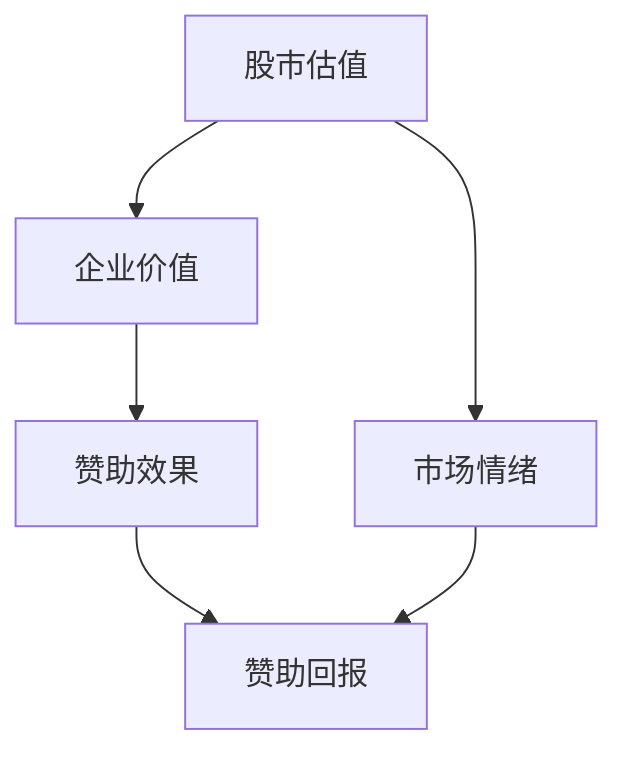

                 

# 《股市估值对国际体育赞助效果评估的影响》目录大纲

---

## 第一部分: 背景介绍

### 第1章: 股市估值概述

#### 1.1 股市估值的基本概念

- **1.1.1 股票价值的定义与计算方法**
  - 什么是股票价值？
  - 如何计算股票的内在价值？
  - 市场价值与内在价值的区别。

- **1.1.2 市场估值的主要指标**
  - 市盈率（P/E Ratio）
  - 市净率（P/B Ratio）
  - 企业价值与息税前利润（EV/EBITDA）

- **1.1.3 影响股市估值的关键因素**
  - 宏观经济环境
  - 行业发展趋势
  - 公司财务状况

#### 1.2 国际体育赞助的基本概念

- **1.2.1 体育赞助的定义与分类**
  - 赞助类型：赛事赞助、球队赞助、运动员赞助
  - 赞助形式：现金赞助、产品赞助、服务赞助

- **1.2.2 国际体育赞助的现状与趋势**
  - 全球体育赞助市场的规模
  - 主要赞助行业分析（如科技、金融、快消品）
  - 数字化赞助的兴起

- **1.2.3 体育赞助的经济与社会价值**
  - 品牌影响力提升
  - 市场份额扩展
  - 社会责任感增强

### 第2章: 股市估值与国际体育赞助的联系

#### 2.1 股市估值与企业赞助行为的关系

- **2.1.1 股市估值对企业赞助决策的影响**
  - 高估值企业为何热衷赞助？
  - 赞助行为如何影响投资者情绪？

- **2.1.2 赞助行为对企业市值的潜在影响**
  - 赞助公告对股价的短期影响
  - 赞助效果对长期市值的影响

- **2.1.3 股市估值波动与赞助效果的关联性**
  - 高估值企业赞助的高风险
  - 低估值企业赞助的高回报

#### 2.2 股市估值对赞助效果评估的核心影响

- **2.2.1 赞助效果的量化标准**
  - 品牌知名度提升
  - 销售额增长
  - 市场份额扩大

- **2.2.2 股市估值在赞助效果评估中的作用**
  - 估值变化反映赞助效果
  - 股东价值与赞助回报的关联

- **2.2.3 赞助效果与企业长期价值的关系**
  - 赞助的长期战略价值
  - 股东对赞助效果的预期

### 第3章: 股市估值与国际体育赞助的核心概念与联系

#### 3.1 核心概念原理

- **3.1.1 股市估值的多维度分析**
  - 财务指标分析
  - 市场情绪分析
  - 行业对标分析

- **3.1.2 国际体育赞助的经济模型**
  - 赞助支出与收益模型
  - 赞助回报周期模型
  - 赞助风险评估模型

- **3.1.3 两者关系的理论框架**
  - 互动关系模型
  - 价值链整合模型
  - 综合影响模型

#### 3.2 核心概念属性特征对比表

| 概念             | 定义                                                                 | 影响因素                              | 评估指标                              |
|------------------|----------------------------------------------------------------------|---------------------------------------|---------------------------------------|
| 股市估值         | 股票的市场价值                                                       | 公司业绩、市场情绪、宏观经济          | 市盈率、市净率、EV/EBITDA             |
| 国际体育赞助     | 企业对体育赛事或运动员的资助                                         | 品牌影响力、市场覆盖、赞助回报        | 投资回报率、品牌知名度提升、市场份额变化 |

#### 3.3 ER实体关系图（Mermaid）

---

## 第二部分: 股市估值对国际体育赞助效果的影响因素

### 第4章: 财务表现与股市估值的关系

#### 4.1 财务报表对企业估值的影响

- **4.1.1 财务报表分析**
  - 利润表分析
  - 资产负债表分析
  - 现金流量表分析

- **4.1.2 赞助支出与企业财务健康**
  - 赞助支出对当期利润的影响
  - 赞助支出对未来财务健康的影响

---

以上为《股市估值对国际体育赞助效果评估的影响》的部分目录大纲，后续章节将围绕算法原理、数学模型、系统架构、项目实战等内容展开详细分析。

