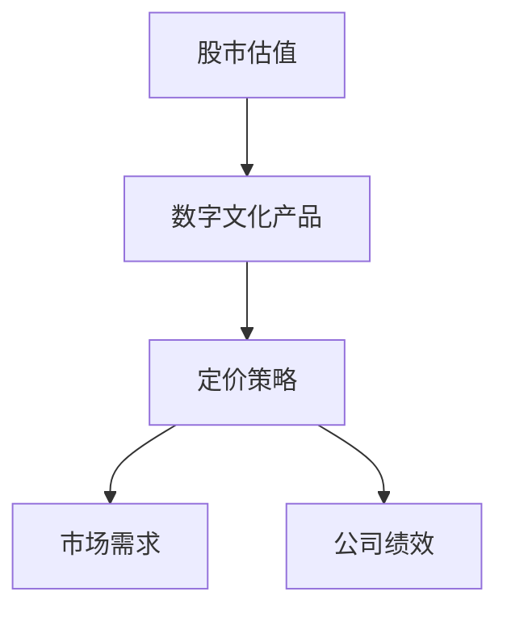
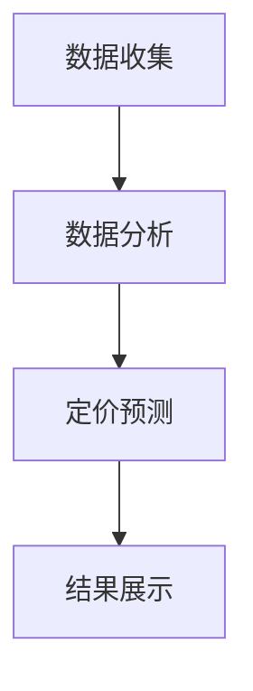
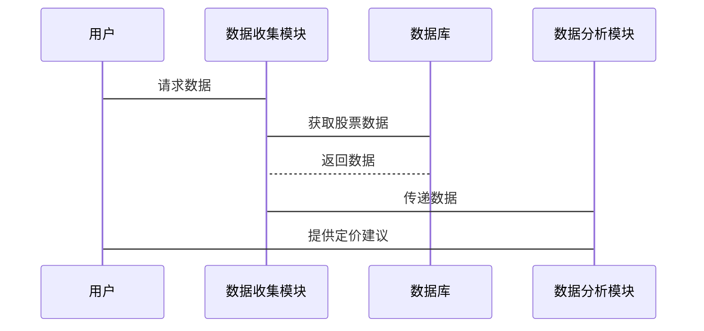

                 


# 股市估值对国际数字文化产品定价的影响

## 关键词
股市估值，数字文化产品，定价策略，全球化市场，数据分析，市场动态

## 摘要
本文探讨股市估值如何影响国际数字文化产品的定价策略。通过分析股市估值的核心概念、数字文化产品的特点，以及两者之间的关系，文章揭示了股市波动、市场趋势和公司绩效对数字文化产品定价的深远影响。结合实际案例和系统设计，本文为读者提供了全面的视角，帮助理解如何在复杂市场环境中制定有效的定价策略。

---

## 第一部分：背景介绍

### 第1章：股市估值与数字文化产品概述

#### 1.1 股市估值的核心概念
股市估值是通过分析公司财务状况、市场表现和行业趋势，预测公司股票的合理价格范围。主要方法包括市盈率（P/E）、市净率（P/B）和现金流折现法（DCF）。这些方法帮助投资者评估公司的价值，从而影响市场对股票的需求和价格。

#### 1.2 数字文化产品的特点
数字文化产品包括游戏、音乐、视频、电子书等，具有以下特点：
- 高速传播：通过互联网快速分发。
- 无形资产：产品本身是数字内容，易于复制和传播。
- 多样化：涵盖娱乐、教育等多个领域。
- 更新迭代快：产品可以频繁更新，以满足市场需求。

#### 1.3 股市估值与数字文化产品定价的关联性
数字文化产品的公司（如游戏公司、在线音乐平台）的股价受产品表现影响。高估值的公司可能通过溢价定价策略吸引用户，而低估值的公司可能采取折扣策略以提升市场占有率。

---

### 第2章：股市估值对数字文化产品定价的影响背景

#### 2.1 全球化背景下的数字文化产品市场
全球化使得数字文化产品可以快速进入国际市场。然而，不同地区的市场差异（如文化偏好、消费习惯）影响产品定价策略。

#### 2.2 数字化转型对传统估值方法的挑战
数字化转型改变了传统估值模型。例如，订阅模式的兴起使得DCF模型在评估数字公司时更为重要。

#### 2.3 数字文化产品定价的复杂性与多样性
数字文化产品的定价受多种因素影响，包括市场需求、竞争环境、内容质量和公司财务状况。例如，热门游戏可能采用免费增值模式，通过内购和广告实现收入。

---

## 第二部分：核心概念与联系

### 第3章：股市估值与数字文化产品定价的核心机制

#### 3.1 核心概念原理
- 股市估值反映市场对公司的整体看法，影响投资者信心，进而影响股价。
- 数字文化产品定价需考虑市场接受度、竞争产品价格和公司盈利能力。

#### 3.2 核心概念属性对比表格
| 概念               | 定义与特点                                   |
|--------------------|--------------------------------------------|
| 股市估值           | 通过财务指标和市场趋势预测股票价值。       |
| 数字文化产品定价   | 根据市场需求和公司策略确定产品价格。       |

#### 3.3 ER实体关系图


---

## 第三部分：算法原理讲解

### 第4章：股市估值对数字文化产品定价的算法模型

#### 4.1 算法原理
- 使用回归分析预测股票价格与产品定价的关系。
- 通过时间序列分析预测市场趋势，指导定价策略。

#### 4.2 数学模型与公式
- **线性回归模型**：$
    y = \beta_0 + \beta_1x + \epsilon
    $，其中$y$为股票价格，$x$为产品销量。
- **时间序列模型**：使用ARIMA模型预测市场趋势，指导定价调整。

#### 4.3 代码实现
```python
import pandas as pd
from sklearn.linear_model import LinearRegression

# 加载数据
data = pd.read_csv('stock_data.csv')

# 拆分特征和目标变量
X = data[['sales']]
y = data['price']

# 建立模型
model = LinearRegression()
model.fit(X, y)

# 预测
y_pred = model.predict(X)
```

---

## 第四部分：系统分析与架构设计

### 第5章：系统设计与架构

#### 5.1 系统功能设计
- 数据收集模块：收集股票数据和市场趋势。
- 数据分析模块：应用算法模型预测定价。
- 系统架构设计


#### 5.2 系统接口设计
- 数据接口：从数据库获取实时数据。
- API接口：提供定价建议给相关部门。

#### 5.3 系统交互流程


---

## 第五部分：实战应用

### 第6章：项目实战

#### 6.1 环境配置
安装必要的库：
```bash
pip install pandas numpy scikit-learn
```

#### 6.2 核心代码实现
```python
from sklearn.ensemble import RandomForestRegressor

# 加载数据
data = pd.read_csv('digital_products.csv')

# 拆分特征和目标变量
X = data[['market_trend', 'company_performance']]
y = data['pricing_strategy']

# 建立模型
model = RandomForestRegressor()
model.fit(X, y)

# 预测
y_pred = model.predict(X)
```

#### 6.3 案例分析
以某游戏公司为例，分析其股价波动如何影响游戏定价策略。通过模型预测，建议在高估时采取折扣策略，提升用户参与度。

---

## 第六部分：总结与展望

### 第7章：总结与未来展望

#### 7.1 总结
股市估值和数字文化产品定价密切相关。通过分析市场趋势和公司绩效，可以制定有效的定价策略，提升市场竞争力。

#### 7.2 未来展望
未来，随着人工智能和大数据技术的进步，股市估值对定价的影响将更加精准。建议进一步研究动态定价模型和个性化定价策略。

---

## 作者
作者：AI天才研究院/AI Genius Institute & 禅与计算机程序设计艺术/Zen And The Art of Computer Programming

---

通过以上结构，文章系统地分析了股市估值对数字文化产品定价的影响，结合理论、案例和实战，为读者提供了全面的视角。

