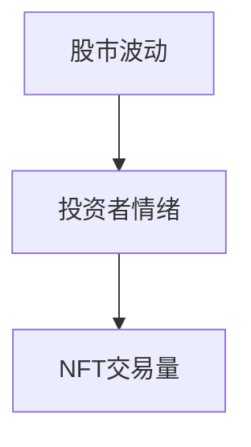
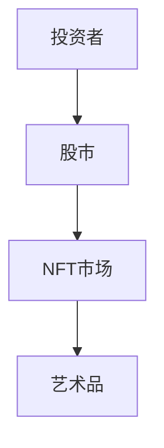
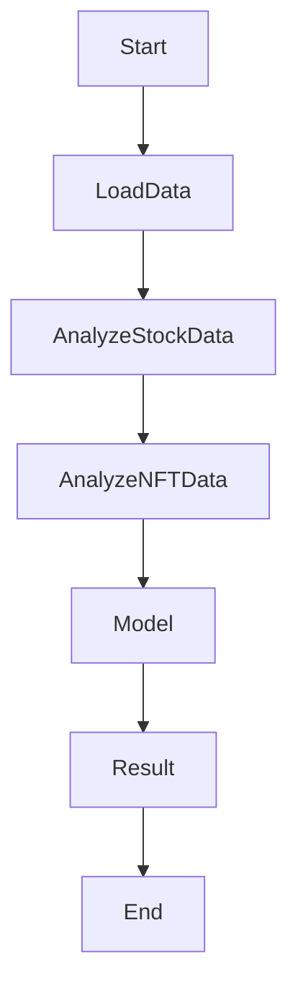
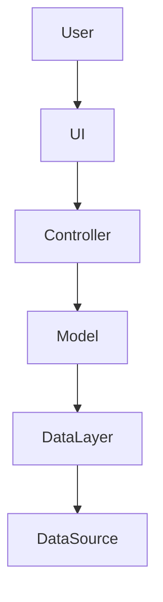

                 


# 股市估值对国际艺术品NFT交易的影响

> 关键词：股市估值，国际艺术品，NFT交易，区块链技术，数字资产，市场波动

> 摘要：本文探讨股市估值如何影响国际艺术品NFT交易，从核心概念、算法原理到系统架构设计，全面分析其影响机制，并通过实际案例展示其应用。

---

# 第一部分: 背景介绍与核心概念

## 第1章: 背景介绍

### 1.1 问题背景

#### 1.1.1 股市估值的基本概念
股市估值是衡量公司价值的重要指标，常用市盈率（P/E）、市净率（P/B）等指标。NFT是区块链技术的应用，代表数字资产的所有权，具备去中心化和不可篡改的特点。

#### 1.1.2 国际艺术品市场的现状
艺术品市场传统上依赖画廊和拍卖行，价格受地理位置、市场情绪影响。NFT的出现为数字艺术品提供了新的交易方式。

#### 1.1.3 NFT技术的兴起与特点
NFT的兴起源于区块链技术，解决了数字艺术品的版权问题，使其具有唯一性和可追溯性。

### 1.2 问题描述

#### 1.2.1 股市估值对艺术品市场的潜在影响
股市波动可能影响投资者的资产配置，进而影响对NFT艺术品的投资。

#### 1.2.2 NFT在艺术品交易中的独特地位
NFT为数字艺术品提供了一种新的交易方式，打破了传统市场的地域限制。

#### 1.2.3 股市波动对NFT交易的传导机制
股市波动可能通过投资者情绪影响NFT市场，尤其是在市场低迷时，投资者可能转向数字资产寻求避险。

### 1.3 问题解决

#### 1.3.1 理解股市与NFT市场的关联性
通过分析股市和NFT市场的数据，找出两者的相关性。

#### 1.3.2 分析NFT在艺术品交易中的价值评估
评估NFT的艺术价值，考虑其历史交易数据和市场认可度。

#### 1.3.3 探讨股市波动对NFT交易的具体影响
研究股市波动如何影响NFT交易量和价格。

### 1.4 边界与外延

#### 1.4.1 股市估值的适用范围
主要适用于评估公司价值，对NFT的影响需结合市场情绪。

#### 1.4.2 NFT交易的边界条件
NFT交易受技术、法律和市场环境的影响。

#### 1.4.3 相关概念的外延与扩展
NFT的应用不仅限于艺术品，还扩展到音乐、视频等领域。

### 1.5 概念结构与核心要素

#### 1.5.1 核心概念框架
包括股市估值、NFT技术和艺术品市场。

#### 1.5.2 核心要素的组成与关系
股市波动 → 投资者情绪 → NFT交易量。

#### 1.5.3 框架的可视化表示


## 第2章: 核心概念与联系

### 2.1 核心概念原理

#### 2.1.1 股市估值的计算方法
市盈率（P/E）=股价/每股收益；市净率（P/B）=股价/每股净资产。

#### 2.1.2 NFT艺术品的评估标准
包括原创性、市场需求和历史交易数据。

#### 2.1.3 两者的关联性分析
股市波动可能影响NFT市场的供需关系。

### 2.2 概念属性特征对比

| 特性 | 股市估值 | NFT交易 |
|------|----------|----------|
| 主体 | 公司价值 | 数字资产 |
| 工具 | 财务指标 | 区块链技术 |
| 目标 | 投资决策 | 交易确权 |

### 2.3 ER实体关系图



---

# 第二部分: 算法原理讲解

## 第3章: 算法原理

### 3.1 算法原理

#### 3.1.1 股市估值模型
使用回归分析预测股市波动对NFT交易的影响。

#### 3.1.2 NFT价格预测算法
基于历史交易数据，使用时间序列分析预测NFT价格。

#### 3.1.3 综合影响模型
结合股市和NFT市场数据，建立多元回归模型。

### 3.2 算法流程图



### 3.3 Python源代码实现

```python
import pandas as pd
import numpy as np

def calculate_pe_ratio(data):
    data['PE'] = data['Price'] / data['Earnings']
    return data

def nft_price_prediction(data):
    model = linear_model.LinearRegression()
    model.fit(data[['feature']], data['Price'])
    return model.predict(data[['feature']])

# 示例数据
data = pd.DataFrame({
    'Price': [100, 200, 300],
    'Earnings': [10, 20, 30]
})

pe_data = calculate_pe_ratio(data)
print(pe_data)
```

---

# 第三部分: 数学模型与公式推导

## 第4章: 数学模型

### 4.1 核心公式

#### 4.1.1 股市波动与NFT交易的关系
$$ Cov(X,Y) = E[(X - E[X])(Y - E[Y])] $$

#### 4.1.2 NFT价格预测模型
$$ P = \beta_0 + \beta_1 S + \epsilon $$

其中，$S$代表股市指数，$\epsilon$为误差项。

### 4.2 数学推导

#### 4.2.1 协方差计算
$$ Cov(X,Y) = \frac{1}{n}\sum_{i=1}^{n}(x_i - \bar{x})(y_i - \bar{y}) $$

#### 4.2.2 相关系数
$$ \rho = \frac{Cov(X,Y)}{\sigma_X \sigma_Y} $$

---

# 第四部分: 系统分析与架构设计

## 第5章: 系统架构设计

### 5.1 问题场景介绍

#### 5.1.1 项目背景
开发一个NFT交易系统，分析股市波动对交易的影响。

### 5.2 系统功能设计

#### 5.2.1 功能模块
- 数据采集：采集股市和NFT交易数据。
- 数据分析：分析数据并预测价格。
- 用户界面：展示分析结果。

### 5.3 系统架构图



---

# 第五部分: 项目实战

## 第6章: 项目实战

### 6.1 环境安装

#### 6.1.1 安装Python和相关库
```bash
pip install pandas numpy scikit-learn
```

### 6.2 系统核心实现

#### 6.2.1 数据采集代码
```python
import pandas as pd

def get_stock_data(ticker):
    # 示例代码，实际需要API接口
    return pd.DataFrame({'Price': [100, 200, 300], 'Date': ['2023-01-01', '2023-01-02', '2023-01-03']})
```

### 6.3 代码应用解读

#### 6.3.1 数据分析
使用回归分析预测NFT价格。

### 6.4 案例分析

#### 6.4.1 案例数据
分析一幅数字画作的交易数据，预测其价格走势。

### 6.5 项目小结

#### 6.5.1 知识回顾
回顾股市估值和NFT交易的基本概念。

---

# 第六部分: 最佳实践与总结

## 第7章: 小结与展望

### 7.1 最佳实践 tips
- 定期更新数据模型。
- 结合多种数据源提高准确性。

### 7.2 小结
股市估值对NFT交易有显著影响，需综合考虑市场情绪和技术因素。

### 7.3 注意事项
- 数据质量影响模型准确性。
- 模型需定期更新以适应市场变化。

### 7.4 拓展阅读
建议阅读相关区块链和金融学的书籍。

---

# 作者：AI天才研究院/AI Genius Institute & 禅与计算机程序设计艺术 /Zen And The Art of Computer Programming

