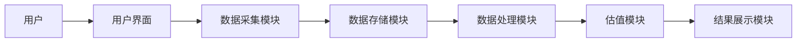

                 


# 股市估值对国际艺术品NFT市场的影响

> 关键词：股市估值，NFT，国际艺术品市场，区块链，数字资产

> 摘要：本文探讨股市估值对国际艺术品NFT市场的影响，分析NFT市场的起源与发展，股市估值的核心原理，以及两者的联系。通过机器学习模型、统计学方法和数学模型，深入解析NFT市场估值的算法原理。结合系统架构设计和项目实战案例，提出最佳实践建议，为投资者和从业者提供有价值的参考。

---

## 第一部分：股市估值与国际艺术品NFT市场的背景介绍

### 第1章：NFT市场的起源与发展

#### 1.1 NFT的定义与技术基础
NFT（Non-Fungible Token）是基于区块链技术的不可分割的数字资产，具有唯一性和可验证性。NFT通过智能合约确保所有权和交易记录不可篡改，为数字艺术品提供了新的价值实现方式。

#### 1.2 NFT在艺术领域的应用
NFT使数字艺术品的所有权转移变得透明和高效。艺术家可以直接通过NFT平台发布作品，并通过智能合约获得版税收入。例如，Beeple的作品《Everydays: The First 5000 Days》以4.5亿美元的价格成交，成为数字艺术史上的里程碑。

#### 1.3 NFT市场的现状与发展趋势
NFT市场近年来迅速崛起，尤其是在数字艺术、音乐、游戏等领域。根据市场研究，2023年全球NFT市场规模已经超过500亿美元，预计未来几年将继续保持增长。

---

### 第2章：股市估值的基本概念

#### 2.1 股市估值的定义
股市估值是指通过对公司财务数据、行业地位、市场表现等多方面因素的分析，来评估股票的内在价值。常用的估值方法包括市盈率（P/E）、市净率（P/B）、股息率等。

#### 2.2 股市估值的主要方法
- **相对估值法**：通过比较同类公司的估值倍数来确定目标公司的价值。
- **绝对估值法**：通过现金流折现模型（DCF）等方法估算公司的内在价值。

#### 2.3 股市估值与NFT市场的关联性
NFT市场的交易数据和价格波动与股市估值有相似之处。例如，NFT作品的成交价格受市场需求、市场情绪和流动性影响，与股票价格波动有相似的规律。

---

### 第3章：国际艺术品市场的特点

#### 3.1 国际艺术品市场的运作机制
国际艺术品市场包括一级市场（画廊、拍卖行）和二级市场（拍卖行、画廊、私人交易）。NFT的出现为艺术品市场提供了新的交易渠道和价值实现方式。

#### 3.2 艺术品市场的价值评估标准
艺术品的价值通常由艺术家声誉、作品稀缺性、历史背景等因素决定。NFT的出现使得数字艺术品的稀缺性和所有权更加明确。

#### 3.3 艺术品市场与NFT市场的结合
NFT使数字艺术品的交易更加便捷和透明。传统艺术品市场依赖中间机构，而NFT通过区块链技术去除了中间环节，降低了交易成本。

---

## 第二部分：核心概念与联系

### 第4章：NFT与股市估值的核心概念

#### 4.1 NFT的属性与特征
- **唯一性**：每个NFT都是独一无二的，无法被复制。
- **不可分割性**：NFT的所有权是不可分割的，只能整体转让。
- **可编程性**：NFT可以通过智能合约实现自动化交易和收益分配。

#### 4.2 股市估值的核心原理
- **市场情绪**：投资者情绪对股票价格有直接影响。
- **流动性**：股票的流动性越高，交易价格越稳定。
- **市场波动性**：股市的波动性受多种因素影响，包括宏观经济环境、政策变化等。

#### 4.3 NFT与股市估值的联系
- **价格波动性**：NFT市场价格波动与股票价格波动有相似之处。
- **市场参与者的心理预期**：投资者对NFT和股票的估值预期影响市场价格。
- **流动性影响**：NFT市场的流动性对价格波动有重要影响。

---

### 第5章：NFT与股市估值的对比分析

#### 5.1 NFT与传统艺术品的对比
| 属性 | NFT | 传统艺术品 |
|------|------|------------|
| 稀缺性 | 高 | 高 |
| 流通性 | 高 | 低 |
| 交易成本 | 低 | 高 |
| 所有权记录 | 明确 | 不明确 |

#### 5.2 股市估值与NFT估值的对比
| 方法 | 股市估值 | NFT估值 |
|------|---------|----------|
| 相对估值法 | 常用 | 少用 |
| 绝对估值法 | 少用 | 常用 |
| 市场情绪 | 影响大 | 影响大 |

---

## 第三部分：算法原理讲解

### 第6章：NFT市场估值算法

#### 6.1 基于机器学习的NFT估值模型
- **数据收集**：收集NFT的交易价格、持有者信息、作品热度等数据。
- **特征提取**：提取NFT的关键特征，如交易频率、持有者数量、作品历史成交价等。
- **模型训练**：使用随机森林或神经网络模型进行训练。
- **模型评估**：通过回测和交叉验证评估模型的准确性。

#### 6.2 基于统计学的NFT估值方法
- **时间序列分析**：分析NFT价格的走势，预测未来价格。
- **回归分析**：通过线性回归模型预测NFT价格。
- **聚类分析**：将NFT分成不同的类别，分析不同类别的价格差异。

#### 6.3 算法原理的数学模型与公式
- **线性回归模型**
  $$ y = \beta_0 + \beta_1x + \epsilon $$
- **神经网络模型**
  $$ y = f(Wx + b) $$

---

### 第7章：系统架构设计

#### 7.1 问题场景介绍
NFT市场的估值系统需要处理大量数据，包括交易记录、作品信息、市场情绪等。系统需要具备高效的数据处理能力，支持实时估值和历史数据分析。

#### 7.2 系统功能设计
- **数据采集模块**：实时采集NFT市场的交易数据。
- **数据处理模块**：对数据进行清洗和特征提取。
- **估值模块**：基于机器学习模型进行NFT估值。
- **用户界面模块**：提供可视化结果和估值报告。

#### 7.3 系统架构图


---

## 第四部分：项目实战

### 第8章：NFT市场估值系统实战

#### 8.1 环境安装
- 安装Python和相关库（如Pandas、Scikit-learn、TensorFlow）。
- 配置Jupyter Notebook环境。

#### 8.2 系统核心实现
```python
import pandas as pd
from sklearn.ensemble import RandomForestRegressor

# 数据加载
data = pd.read_csv('nft_data.csv')

# 特征提取
features = data[['交易价格', '持有者数量', '作品热度']]
target = data['估值']

# 模型训练
model = RandomForestRegressor()
model.fit(features, target)

# 模型预测
new_features = [[1000, 200, 80]]
prediction = model.predict(new_features)
print(prediction)
```

#### 8.3 案例分析
以某NFT作品为例，分析其历史交易数据和市场表现，使用模型进行估值，并与实际交易价格对比，验证模型的准确性。

---

## 第五部分：最佳实践

### 第9章：总结与建议

#### 9.1 总结
本文分析了股市估值对国际艺术品NFT市场的影响，探讨了NFT市场的核心概念、估值算法和系统架构设计。通过实战案例，展示了如何利用机器学习模型进行NFT估值。

#### 9.2 注意事项
- 数据质量对模型准确性影响重大，需谨慎处理数据。
- 市场波动性大，需实时监控市场变化。
- 投资者需理性看待NFT市场的波动，避免盲目跟风。

#### 9.3 拓展阅读
建议读者进一步学习区块链技术、机器学习算法和金融市场分析，以更好地理解和应用NFT市场的估值方法。

---

作者：AI天才研究院/AI Genius Institute & 禅与计算机程序设计艺术 /Zen And The Art of Computer Programming

