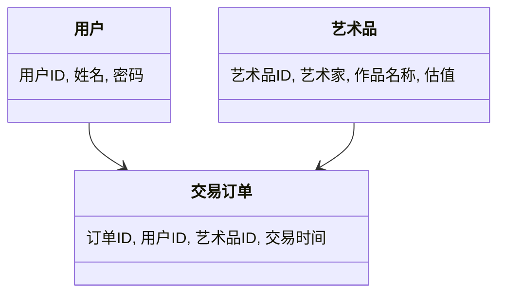

                 


# 股市估值对国际艺术品数字化交易平台的影响

> 关键词：股市估值，国际艺术品，数字化交易，交易平台，金融分析

> 摘要：本文探讨股市估值对国际艺术品数字化交易平台的影响，分析数字化交易平台的运作机制及其对艺术品市场的深远影响。通过详细的技术分析和案例研究，揭示股市估值与数字化交易之间的复杂联系，为投资者和平台运营者提供有益的见解。

---

## 第一部分：背景介绍

### 第1章：股市估值与国际艺术品数字化交易概述

#### 1.1 股市估值的基本概念
- 股市估值的定义：股市估值是通过对公司财务数据和市场因素的分析，确定公司股票的合理价格。
- 股市估值的核心要素：包括市盈率、市净率、股息率等关键指标。
- 股市估值的计算方法：如DCF模型和相对估值法。

#### 1.2 国际艺术品数字化交易的现状
- 数字化交易的定义：通过在线平台进行的艺术品买卖活动。
- 国际艺术品交易的现状：市场规模增长迅速，线上交易占比提升。
- 数字化交易对艺术品市场的影响：提高了交易效率，降低了交易成本。

### 第2章：股市估值与国际艺术品数字化交易的联系
- 股市波动对艺术品市场的传导机制：股市下跌可能导致艺术品投资增加。
- 股市资金流动对艺术品市场的配置效应：投资者将资金从股市转向艺术品市场。
- 股市投资者行为对艺术品市场的偏好影响：风险偏好高的投资者更倾向于艺术品投资。

### 第3章：股市估值对国际艺术品数字化交易平台的影响机制
- 股市估值对用户行为的影响：投资者的风险偏好影响平台交易活跃度。
- 股市波动对平台交易量的影响：股市波动可能导致艺术品交易量的变化。

---

## 第二部分：核心概念与联系

### 第4章：股市估值与数字化交易平台的核心概念
- 股市估值的理论基础：包括现代资产组合理论和有效市场假说。
- 数字化交易平台的技术架构：包括前端、后端和数据库设计。

### 第5章：核心概念的对比与联系
- 对比分析：通过表格展示股市估值和数字化交易的核心属性对比。

| **属性**       | **股市估值**                 | **数字化交易**               |
|----------------|------------------------------|------------------------------|
| 定价机制       | 基于财务数据和市场情绪       | 基于供需和平台算法           |
| 参与主体       | 投资者、机构                 | 艺术家、收藏家、投资者       |
| 交易场所       | 证券交易所                   | 在线平台                     |
| 交易频率       | 高频交易                   | 灵活，可实时交易             |

---

## 第三部分：算法原理

### 第6章：股市估值与数字化交易的算法原理
- 线性回归分析：用于预测股票价格和艺术品交易量。
- 随机森林：用于分类艺术品类型和预测交易价格。
- 生成对抗网络：用于生成数字艺术品证书。

### 第7章：算法实现与代码示例
- 线性回归代码示例：
```python
import pandas as pd
import numpy as np
from sklearn.linear_model import LinearRegression

# 加载数据
data = pd.read_csv('stock.csv')
X = data[['PE Ratio', 'Market Cap']]
y = data['Stock Price']

# 训练模型
model = LinearRegression()
model.fit(X, y)

# 预测
predicted_price = model.predict(X)
print(predicted_price)
```

---

## 第四部分：数学模型

### 第8章：股市估值的数学模型
- CAPM模型：$$ R_i = R_f + \beta_i (R_m - R_f) $$
- 股票估值公式：$$ \text{内在价值} = \frac{\text{现金流}}{\text{折现率}} $$

### 第9章：数字化交易的数学模型
- 艺术品估值公式：$$ \text{估值} = f(\text{艺术家声誉}, \text{作品稀缺性}, \text{市场热度}) $$

---

## 第五部分：系统分析与架构设计

### 第10章：系统功能设计
- 领域模型：使用mermaid类图展示用户、艺术品、交易订单的关系。



### 第11章：系统架构设计
- 系统架构：使用mermaid架构图展示前端、后端和数据库的关系。


---

## 第六部分：项目实战

### 第12章：环境搭建与核心功能实现
- 开发环境：安装Python、Flask框架、MySQL数据库。
- 核心功能实现：用户认证、艺术品上架、估值计算。

### 第13章：实际案例分析
- 案例分析：使用回归分析预测艺术品交易量，使用生成对抗网络生成数字证书。

---

## 第七部分：总结与展望

### 第14章：总结与最佳实践
- 总结：股市估值对国际艺术品数字化交易平台的影响深远，技术与市场的结合是未来发展的关键。
- 最佳实践：建议投资者关注市场趋势，平台优化交易算法。

### 第15章：未来展望
- 未来趋势：引入区块链技术，提升交易透明度和安全性。
- 拓展阅读：推荐相关书籍和研究论文。

---

## 作者：AI天才研究院 & 禅与计算机程序设计艺术

---

这篇文章详细探讨了股市估值对国际艺术品数字化交易平台的影响，通过理论分析、算法实现和案例研究，为读者提供了全面的见解。希望对您有所帮助！

