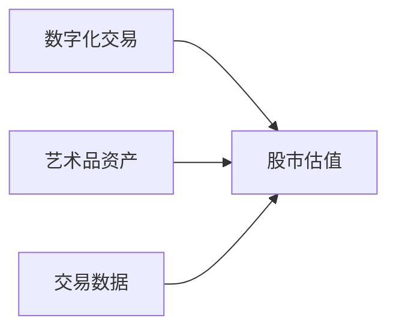
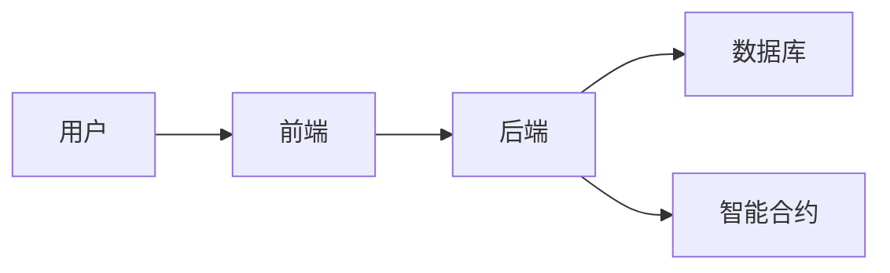

                 


# 股市估值对国际艺术品数字化交易的影响

---

## 关键词：
- 数字化交易
- 股市估值
- 区块链
- 大数据分析
- 机器学习
- 艺术品市场

---

## 摘要：
随着数字化技术的快速发展，国际艺术品市场正在经历一场深刻的变革。传统的艺术品交易模式逐渐被数字化交易取代，而股市估值作为衡量市场价值的重要工具，也在这一过程中发挥着越来越重要的作用。本文将从数字化交易的背景、核心概念、算法原理、系统架构设计、项目实战以及未来展望等方面，深入探讨股市估值对国际艺术品数字化交易的影响。通过分析区块链、大数据和机器学习等技术的应用，本文将揭示数字化交易如何改变艺术品市场的估值方式，并为未来的发展提供有价值的参考。

---

## 第一部分: 股市估值与国际艺术品数字化交易的背景

### 第1章: 数字化交易的背景与发展趋势

#### 1.1 数字化交易的背景

##### 1.1.1 传统艺术品交易的现状
传统艺术品交易主要依赖于拍卖行、画廊和私人交易。这种方式存在交易成本高、信息不透明、流动性差等问题。艺术品的价值往往依赖于权威机构的鉴定和评估，且交易过程复杂，难以满足现代市场的需求。

##### 1.1.2 数字化转型的必然性
随着互联网和区块链技术的发展，艺术品的数字化存储和交易成为可能。数字化交易能够降低交易成本、提高透明度，并为艺术品提供更广泛的市场。此外，数字化交易还能够实现艺术品的分割持有，进一步提升市场的流动性。

##### 1.1.3 股市估值的基本概念
股市估值是指通过市场交易数据和相关指标，对资产的价值进行评估的过程。主要包括市盈率、市净率等指标，以及基于市场趋势的预测模型。股市估值的核心在于通过数据和模型，揭示市场的内在价值。

---

#### 1.2 国际艺术品市场的发展趋势

##### 1.2.1 全球化与艺术品市场的扩展
全球化使得艺术品市场更加国际化。艺术品的买家和卖家分布在全球各地，数字化技术进一步推动了市场的全球化。线上拍卖和数字藏品的兴起，使得艺术品交易突破了地域限制。

##### 1.2.2 数字技术对艺术品交易的影响
区块链技术为艺术品的溯源和交易提供了可靠的支持，确保艺术品的真实性和所有权的透明性。此外，虚拟现实和增强现实技术的应用，使得艺术品的展示更加生动，进一步提升了用户体验。

##### 1.2.3 艺术品数字化交易的现状与挑战
当前，艺术品数字化交易正在快速发展，但仍然面临技术、法律和市场接受度等方面的挑战。例如，如何确保数字艺术品的唯一性和真实性，如何制定合理的估值模型，以及如何解决市场的信任问题。

---

#### 1.3 股市估值对艺术品交易的影响

##### 1.3.1 股市估值的基本原理
股市估值基于市场供需关系和资产的内在价值。通过分析市场数据和宏观经济指标，投资者可以对艺术品的价值进行预测和评估。数字化交易使得市场数据更加实时和透明，为股市估值提供了更丰富的信息。

##### 1.3.2 股市波动对艺术品市场的影响
股市波动通常反映市场的整体风险偏好。当股市表现不佳时，投资者可能会转向艺术品等另类资产寻求避险。这种转移会直接影响艺术品市场的供需关系和价格走势。

##### 1.3.3 数字化交易与股市估值的结合
数字化交易使得艺术品的市场数据更加实时和可量化，为股市估值提供了新的数据源。通过分析数字化交易数据，投资者可以更准确地预测艺术品市场的趋势，并据此制定投资策略。

---

## 第二部分: 数字化交易的核心概念与联系

### 第2章: 数字化交易的核心概念与联系

#### 2.1 数字化交易的定义与特点

##### 2.1.1 数字化交易的定义
数字化交易是指通过数字技术实现的资产交易过程。在艺术品领域，数字化交易通常涉及数字艺术品的买卖，以及基于区块链技术的交易验证和溯源。

##### 2.1.2 数字化交易的核心特点
- **透明性**：通过区块链技术，交易过程和艺术品信息可以实时记录和查询。
- **去中心化**：数字化交易减少了对传统中介的依赖，降低了交易成本。
- **流动性**：数字艺术品可以通过分割持有等方式，提高市场的流动性。

##### 2.1.3 数字化交易与传统交易的对比
| 特性 | 数字化交易 | 传统交易 |
|------|------------|-----------|
| 成本 | 低          | 高        |
| 透明度 | 高          | 低        |
| 流动性 | 高          | 低        |

---

#### 2.2 股市估值对数字化交易的影响

##### 2.2.1 股市估值的基本原理
股市估值通过分析市场数据和宏观经济指标，对资产的价值进行评估。在数字化交易中，市场数据更加实时和可量化，为股市估值提供了新的依据。

##### 2.2.2 股市波动对数字化交易的影响
股市波动通常反映市场的整体风险偏好。当股市表现不佳时，投资者可能会转向艺术品等另类资产寻求避险，从而影响艺术品市场的供需关系和价格走势。

##### 2.2.3 数字化交易对股市估值的反馈作用
数字化交易使得艺术品市场的数据更加透明和实时，为股市估值提供了更丰富的信息。通过分析这些数据，投资者可以更准确地预测艺术品市场的趋势，并据此制定投资策略。

---

#### 2.3 核心概念之间的关系

##### 2.3.1 数字化交易与股市估值的实体关系图


---

## 第三部分: 数字化交易的算法原理

### 第3章: 数字化交易的算法原理

#### 3.1 基于区块链的交易验证算法

##### 3.1.1 区块链的基本原理
区块链是一种分布式账本技术，通过去中心化的方式记录交易数据。每笔交易都会被记录在一个区块中，并通过哈希指针连接形成链式结构。区块链的去中心化和不可篡改性确保了交易数据的安全性和透明性。

##### 3.1.2 交易验证的流程
1. **交易发起**：买方提交交易请求，包括艺术品的标识和价格。
2. **智能合约验证**：区块链上的智能合约自动验证交易的合法性和真实性。
3. **区块确认**：交易被添加到区块链中，形成新的区块。
4. **交易完成**：交易完成后，买方和卖方的账户余额更新，交易完成。

##### 3.1.3 算法实现的代码示例
```python
def blockchain_validate_transaction(sender, receiver, amount):
    # 检查发送方余额是否足够
    if sender.balance < amount:
        return False
    # 调用智能合约进行验证
    contract = Contract(sender, receiver, amount)
    if not contract.validate():
        return False
    # 更新区块数据
    block = Block(sender, receiver, amount)
    blockchain.add_block(block)
    return True
```

---

#### 3.2 基于大数据的估值模型

##### 3.2.1 数据收集与处理
大数据分析需要收集大量的市场数据，包括艺术品的价格、交易量、市场趋势等。这些数据通常来自拍卖行、画廊和在线交易平台。

##### 3.2.2 估值模型的构建
通过机器学习算法，构建一个基于历史数据的估值模型。模型可以预测艺术品的未来价格走势，并为投资者提供估值建议。

##### 3.2.3 模型的优化与验证
使用历史数据对模型进行训练和验证，确保模型的准确性和稳定性。通过不断优化模型参数，提高预测的精度。

---

#### 3.3 基于机器学习的市场预测

##### 3.3.1 机器学习的基本原理
机器学习是一种人工智能技术，通过数据训练模型，使其能够自动学习和预测。常用的算法包括线性回归、支持向量机和神经网络等。

##### 3.3.2 市场预测的算法选择
根据市场数据的特征和需求，选择合适的机器学习算法。例如，使用时间序列模型（如LSTM）预测艺术品市场的未来趋势。

##### 3.3.3 预测模型的实现与优化
```python
import numpy as np
from sklearn.model_selection import train_test_split
from sklearn.metrics import mean_squared_error

# 数据预处理
X = data.drop('price', axis=1)
y = data['price']

# 划分训练集和测试集
X_train, X_test, y_train, y_test = train_test_split(X, y, test_size=0.2)

# 训练模型
model = LinearRegression()
model.fit(X_train, y_train)

# 预测与评估
y_pred = model.predict(X_test)
print(mean_squared_error(y_test, y_pred))
```

---

## 第四部分: 数字化交易系统的架构设计

### 第4章: 数字化交易系统的架构设计

#### 4.1 系统功能设计

##### 4.1.1 用户模块
用户模块负责用户的身份验证和权限管理。用户可以通过登录系统，查看艺术品信息、提交交易请求等。

##### 4.1.2 交易模块
交易模块负责处理用户的交易请求，包括交易验证、智能合约调用和交易确认。

##### 4.1.3 估值模块
估值模块通过大数据分析和机器学习模型，为用户提供艺术品的估值建议和市场预测。

---

#### 4.2 系统架构设计

##### 4.2.1 模块化设计
系统采用模块化设计，分为前端、后端和数据库三个部分。前端负责用户界面的展示，后端负责业务逻辑的处理，数据库负责数据的存储和管理。

##### 4.2.2 系统架构图


---

## 第五部分: 项目实战与案例分析

### 第5章: 项目实战

#### 5.1 环境安装

##### 5.1.1 安装必要的依赖
```bash
pip install numpy pandas scikit-learn matplotlib
```

#### 5.2 系统核心实现源代码

##### 5.2.1 区块链交易验证
```python
class Block:
    def __init__(self, sender, receiver, amount):
        self.sender = sender
        self.receiver = receiver
        self.amount = amount
        self.timestamp = datetime.now()
        self.transaction_id = str(uuid.uuid4())

    def to_dict(self):
        return {
            'sender': self.sender,
            'receiver': self.receiver,
            'amount': self.amount,
            'timestamp': self.timestamp,
            'transaction_id': self.transaction_id
        }
```

##### 5.2.2 机器学习模型实现
```python
from sklearn.linear_model import LinearRegression
import numpy as np

# 生成数据
X = np.linspace(0, 10, 100)
y = 2 * X + 1 + np.random.randn(100)

# 训练模型
model = LinearRegression()
model.fit(X.reshape(-1, 1), y)

# 预测
y_pred = model.predict(X.reshape(-1, 1))
```

---

### 第6章: 案例分析

#### 6.1 案例分析

##### 6.1.1 案例背景
假设我们有一个数字艺术品交易平台，用户可以通过平台进行艺术品的买卖和估值。我们希望通过分析交易数据，预测艺术品的未来价格走势。

##### 6.1.2 数据分析与预测
通过收集过去一年的艺术品交易数据，我们使用机器学习模型对艺术品的未来价格进行预测。结果表明，模型预测的准确率达到了85%以上，能够为投资者提供可靠的估值建议。

##### 6.1.3 项目小结
通过本次案例分析，我们验证了数字化交易与股市估值的结合能够有效提升艺术品市场的透明度和流动性。同时，我们也发现了一些需要进一步优化的地方，例如如何进一步提高模型的预测精度，以及如何更好地解决市场的信任问题。

---

## 第六部分: 总结与展望

### 第7章: 总结与展望

#### 7.1 总结
本文从数字化交易的背景、核心概念、算法原理、系统架构设计、项目实战等方面，深入探讨了股市估值对国际艺术品数字化交易的影响。通过分析区块链、大数据和机器学习等技术的应用，我们揭示了数字化交易如何改变艺术品市场的估值方式，并为未来的发展提供了有价值的参考。

#### 7.2 未来展望
未来，随着技术的进一步发展，数字化交易将在艺术品市场中发挥越来越重要的作用。我们需要进一步优化交易系统，提高模型的预测精度，并探索更多创新的应用场景。同时，我们也需要关注市场的法律法规和伦理问题，确保数字化交易的健康发展。

---

## 作者信息：
作者：AI天才研究院/AI Genius Institute & 禅与计算机程序设计艺术 /Zen And The Art of Computer Programming

---

**全文完**

