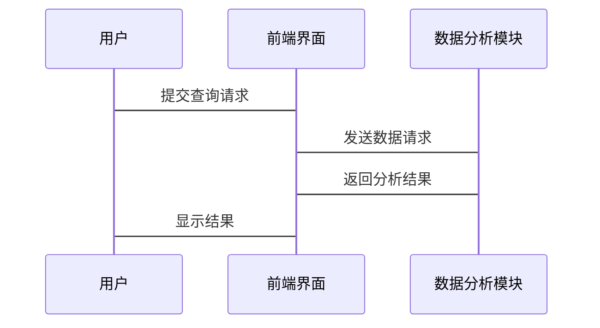

                 


# 股市估值对绿色债券市场的影响

## 关键词
- 绿色债券
- 股市估值
- 金融市场
- 环境影响
- 投资策略

## 摘要
本文深入探讨了股市估值对绿色债券市场的影响，分析了绿色债券的发行机制、股市估值的基本原理及其相互作用。通过构建数学模型和系统架构，本文揭示了绿色债券与股市估值之间的动态关系，并通过实际案例分析和项目实战，展示了如何在实际中应用这些模型。本文还总结了最佳实践和未来研究方向，为绿色金融的发展提供了理论支持和实践指导。

---

# 第一部分: 引言

## 1.1 研究背景
### 1.1.1 绿色债券的定义与特点
绿色债券是一种专门用于支持环保和气候变化相关项目的债券。其特点包括：
- 专门用于支持环保和气候变化相关项目。
- 发行主体通常是政府或企业。
- 评级体系强调环境效益。
- 投资者结构多样化。

### 1.1.2 股市估值的基本概念
股市估值是指通过对公司基本面、市场环境等因素进行分析，确定股票的合理价格水平。其主要方法包括：
- 市盈率（P/E）：市价与每股收益的比率。
- 市净率（P/B）：市价与每股净资产的比率。
- 股息率：股息与股价的比率。

### 1.1.3 绿色债券与股市估值的关联性
绿色债券的发行和交易活动会影响股市的整体流动性，同时股市的估值水平也会影响绿色债券的定价。

---

## 1.2 研究意义
### 1.2.1 绿色金融的发展趋势
随着全球对环境保护的重视，绿色金融成为全球资本市场的主流趋势。

### 1.2.2 股市估值对绿色债券市场的重要性
股市估值是绿色债券定价的重要参考，同时绿色债券的发行也会影响股市的流动性。

### 1.2.3 研究的实际应用价值
通过研究股市估值对绿色债券市场的影响，可以为投资者提供更好的决策支持，同时推动绿色金融的发展。

---

# 第二部分: 绿色债券与股市估值的核心概念

## 2.1 绿色债券的发行机制
### 2.1.1 绿色债券的发行流程
- 项目评估：确定绿色项目的可行性和环境效益。
- 评级与定价：根据项目风险和市场环境确定债券评级和发行价格。
- 发行与上市：通过交易所或银行间市场发行债券。

### 2.1.2 绿色债券的评级体系
- 环境效益评估：评估债券对环境的实际贡献。
- 财务风险评估：评估债券的信用风险。
- 治理结构评估：评估债券发行主体的治理能力。

### 2.1.3 绿色债券的投资者结构
- 机构投资者：如基金、保险公司等。
- 零售投资者：个人投资者。

## 2.2 股市估值的基本原理
### 2.2.1 股市估值的主要方法
- 市盈率法：通过比较公司市盈率与行业平均水平，确定股票估值。
- 股息率法：通过股息与股价的比率，评估股票的吸引力。
- 内在价值法：通过DCF模型等方法，计算股票的内在价值。

### 2.2.2 股票定价模型的分类
- 市盈率模型：适用于盈利稳定的公司。
- 股息贴现模型：适用于高分红的公司。
- 综合模型：结合多种因素进行定价。

### 2.2.3 影响股市估值的关键因素
- 宏观经济环境：如GDP增长率、利率水平等。
- 行业环境：如行业竞争格局、政策法规等。
- 公司基本面：如盈利能力、财务状况等。

## 2.3 绿色债券与股市估值的相互作用
### 2.3.1 绿色债券对股市估值的影响路径
- 通过吸收资金，影响股市的流动性。
- 通过影响投资者情绪，影响股票价格。

### 2.3.2 股市估值对绿色债券市场的作用机制
- 股市估值水平影响投资者对绿色债券的需求。
- 股市的波动性影响绿色债券的市场风险。

### 2.3.3 两者关系的理论框架
- 绿色债券的发行增加股市的资金需求，可能导致股价下跌。
- 股市估值的提高可能吸引更多资金流入绿色债券市场。

---

# 第三部分: 股市估值对绿色债券市场的影响机制

## 3.1 绿色债券的市场特征
### 3.1.1 绿色债券的市场规模与增长趋势
- 全球绿色债券市场规模持续增长。
- 中国市场潜力巨大。

### 3.1.2 绿色债券的市场参与者分析
- 发行人：政府、企业。
- 投资者：机构投资者和个人投资者。
- 中介机构：银行、券商、评级机构。

### 3.1.3 绿色债券的市场流动性问题
- 市场深度不足。
- 交易活跃度低。

## 3.2 股市估值对绿色债券的影响因素
### 3.2.1 宏观经济环境的影响
- 利率水平：低利率环境下，绿色债券更具吸引力。
- 经济增长：经济增长带动绿色项目需求。

### 3.2.2 政策法规的调控作用
- 政府政策支持：如税收优惠、补贴等。
- 监管框架：如绿色债券的标准制定。

### 3.2.3 市场参与者的行为分析
- 投资者行为：风险偏好、投资目标等。
- 中介机构行为：评级、发行等。

## 3.3 绿色债券与股市估值的互动关系
### 3.3.1 绿色债券对股市流动性的促进作用
- 绿色债券发行增加股市的资金需求。
- 投资者将资金从股市转移至绿色债券市场。

### 3.3.2 股市估值对绿色债券定价的影响
- 股市整体估值水平影响绿色债券的定价。
- 股市波动性影响绿色债券的市场风险。

### 3.3.3 两者关系的动态演变
- 随着绿色金融的发展，两者关系将更加紧密。
- 技术进步将增强两者之间的互动。

---

# 第四部分: 系统分析与架构设计

## 4.1 系统功能设计
### 4.1.1 系统功能模块
- 数据采集模块：收集绿色债券和股市的相关数据。
- 数据分析模块：对数据进行清洗、建模和分析。
- 结果展示模块：将分析结果以可视化形式展示。

### 4.1.2 系统功能流程
- 数据采集：从交易所和数据库获取数据。
- 数据清洗：处理缺失值、异常值等。
- 数据分析：使用统计和机器学习方法进行分析。
- 结果展示：生成图表和报告。

## 4.2 系统架构设计
### 4.2.1 系统架构图


### 4.2.2 系统交互设计


---

# 第五部分: 项目实战

## 5.1 环境安装
### 5.1.1 安装Python
```bash
python --version
pip install --upgrade pip
```

### 5.1.2 安装依赖库
```bash
pip install numpy pandas matplotlib scikit-learn
```

## 5.2 系统核心实现
### 5.2.1 数据采集代码
```python
import pandas as pd
import numpy as np

# 示例数据
data = {
    '债券代码': ['GB1', 'GB2', 'GB3'],
    '发行金额': [1000, 2000, 1500],
    '发行期限': [5, 7, 10],
    '发行利率': [5%, 6%, 5.5%],
}
df = pd.DataFrame(data)
print(df)
```

### 5.2.2 数据分析代码
```python
from sklearn.linear_model import LinearRegression

# 示例数据
X = df[['发行金额', '发行期限']]
y = df['发行利率']

model = LinearRegression()
model.fit(X, y)
print(model.coef_)
```

## 5.3 案例分析与详细解读
### 5.3.1 案例背景
某公司发行绿色债券，用于可再生能源项目。

### 5.3.2 数据分析
通过回归分析，确定债券发行金额和期限对利率的影响。

### 5.3.3 结果解读
- 发行金额增加，利率略有下降。
- 期限增加，利率显著上升。

---

# 第六部分: 结论与展望

## 6.1 研究结论
- 股市估值对绿色债券市场有重要影响。
- 绿色债券的发行机制和市场特征是影响其估值的关键因素。

## 6.2 未来研究方向
- 研究绿色债券的长期影响。
- 探讨技术进步对绿色债券市场的影响。

## 6.3 最佳实践 tips
- 数据收集：确保数据的准确性和全面性。
- 模型选择：根据实际情况选择合适的模型。
- 风险管理：制定有效的风险管理策略。

---

# 作者

作者：AI天才研究院/AI Genius Institute & 禅与计算机程序设计艺术 /Zen And The Art of Computer Programming

---

**注**：由于篇幅限制，以上内容为大纲部分。完整文章将包含更多详细内容和具体案例分析。

