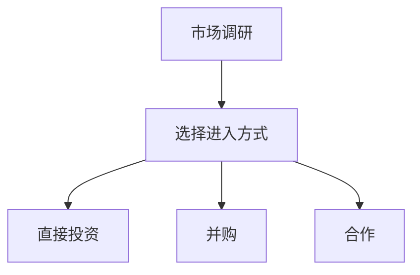
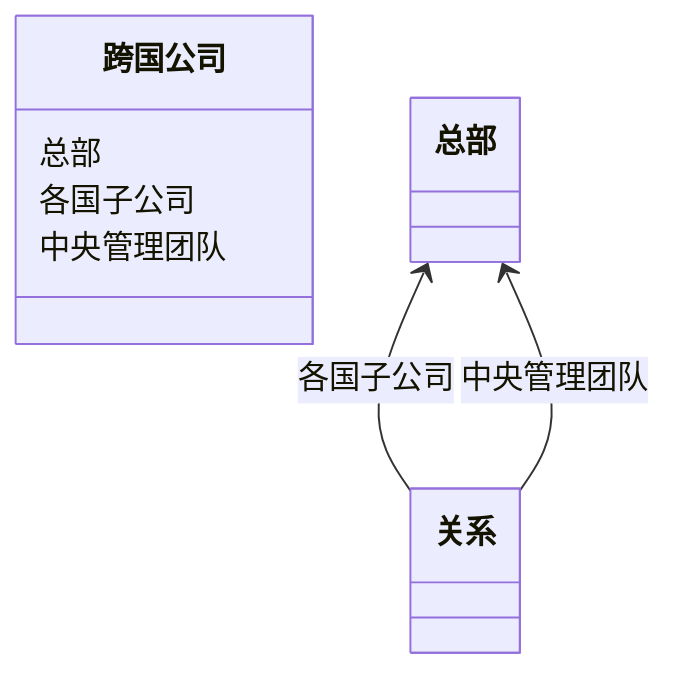

                 


# 股市估值对跨国公司全球战略的影响

---

## 关键词：
股市估值、跨国公司、全球战略、市场扩张、投资决策、风险管理

---

## 摘要：
股市估值作为反映公司价值的重要指标，对跨国公司的全球战略具有深远影响。本文从股市估值的核心概念出发，分析其对跨国公司投资决策、市场扩张和风险管理等全球战略的影响机制。通过数学模型和实际案例，探讨股市估值如何影响跨国公司的全球布局，并提出相应的优化策略。文章还结合系统架构设计，展示如何通过技术手段提升跨国公司的全球化战略能力。

---

## 第1章：股市估值与跨国公司全球战略概述

### 1.1 股市估值的基本概念

#### 1.1.1 股市估值的定义与核心指标
股市估值是指通过对公司财务数据和市场表现的分析，评估其股票的合理价格范围。核心指标包括市盈率（P/E）、市净率（P/B）和市值等。

- $$ P/E = \frac{Price}{Earnings} $$
- $$ P/B = \frac{Price}{Book\ Value} $$

#### 1.1.2 股票价格与公司价值的关系
股票价格不仅反映公司的财务状况，还受到市场情绪和宏观经济环境的影响。公司价值与股票价格的关系可以通过以下公式表示：

$$ Company\ Value = \sum_{t=1}^{n} \frac{Cash\ Flows_t}{(1 + r)^t} $$

#### 1.1.3 股市估值的计算方法与模型
常用的股市估值方法包括相对估值法（如市盈率法）和绝对估值法（如现金流折现法）。以下是市盈率法的对比分析：

| 方法 | 优点 | 缺点 |
|------|------|------|
| 市盈率法 | 简单易用 | 受市场情绪影响较大 |
| 现金流折现法 | 结果更准确 | 计算复杂 |

### 1.2 跨国公司全球战略的定义与特点

#### 1.2.1 跨国公司的定义与分类
跨国公司是指在多个国家和地区进行投资和运营的企业。根据业务范围，可以分为全球化战略型和区域型跨国公司。

#### 1.2.2 全球战略的核心要素与实施路径
全球战略的核心要素包括市场进入、资源配置和风险管理。实施路径通常包括直接投资、并购和合作。

#### 1.2.3 跨国公司与本地化战略的对比分析
本地化战略强调适应当地市场，而全球化战略则注重统一性和效率。以下是两种战略的对比：

| 战略 | 全球化战略 | 本地化战略 |
|------|------------|-------------|
| 重点 | 统一性与效率 | 适应性与定制化 |
| 适用场景 | 标准化产品 | 多样化市场 |

### 1.3 股市估值与跨国公司全球战略的关系

#### 1.3.1 股市估值对跨国公司战略决策的影响
股市估值直接影响公司的融资成本和投资决策。例如，高市盈率可能表明市场对公司未来增长的预期较高，从而影响公司的扩张计划。

#### 1.3.2 跨国公司战略对股市估值的反向作用
跨国公司的全球战略可能通过影响公司的财务表现和市场地位，进而影响股市估值。

#### 1.3.3 两者关系的理论模型与实际案例
理论模型可以用以下方程表示：

$$ Stock\ Price = f(Market\ Sentiment, Company\ Performance, Global\ Strategy) $$

实际案例分析可以参考苹果公司的全球化战略对其股价的影响。

---

## 第2章：股市估值的核心概念与影响因素

### 2.1 股市估值的核心概念与影响因素

#### 2.1.1 影响股市估值的主要因素
- 公司财务表现
- 市场情绪与宏观经济环境
- 行业竞争格局

#### 2.1.2 股市估值的数学模型与公式
以下是一个简单的股市估值模型：

$$ Valuation = \alpha \times Earnings + \beta \times Market\ Sentiment $$

其中，$\alpha$ 和 $\beta$ 是回归系数。

### 2.2 股市估值对跨国公司投资决策的影响

#### 2.2.1 投资决策的数学模型
跨国公司的投资决策可以表示为：

$$ Investment = \begin{cases} 
1 & \text{如果 } Valuation > Current\ Price \\
0 & \text{否则}
\end{cases} $$

#### 2.2.2 投资决策的优化策略
通过动态调整投资组合和风险管理，可以优化投资决策。

---

## 第3章：跨国公司全球战略的核心要素与实施策略

### 3.1 跨国公司全球化战略的实施路径

#### 3.1.1 市场进入策略
跨国公司可以通过直接投资、并购和合作进入新市场。以下是一个市场进入策略的流程图：



#### 3.1.2 资源配置与组织架构
合理的资源配置和组织架构是全球化战略成功的关键。以下是一个组织架构的类图：



#### 3.1.3 跨文化管理与本地化适应
跨文化管理需要建立有效的沟通机制和本地化策略。

### 3.2 跨国公司全球战略的评价标准

#### 3.2.1 经营绩效
经营绩效可以通过财务指标和市场份额来衡量。

#### 3.2.2 市场影响力
市场影响力可以通过品牌认知度和客户忠诚度来衡量。

#### 3.2.3 财务表现
财务表现包括净利润率和ROE等指标。

---

## 第4章：股市估值对跨国公司全球战略的影响机制与数学模型

### 4.1 股市估值对跨国公司全球战略的影响机制

#### 4.1.1 影响机制的数学模型
以下是一个简化的影响机制模型：


#### 4.1.2 影响机制的优化策略
通过动态调整投资组合和风险管理，可以优化影响机制。

---

## 第5章：系统架构与技术实现

### 5.1 系统功能设计

#### 5.1.1 系统功能模块
- 数据采集模块
- 数据分析模块
- 战略决策模块

#### 5.1.2 数据分析模块的实现
以下是数据分析模块的实现代码：

```python
import pandas as pd
import numpy as np

def calculate_valuation(df):
    df['P/E'] = df['Price'] / df['Earnings']
    df['P/B'] = df['Price'] / df['Book Value']
    return df

data = pd.DataFrame({
    'Price': [100, 200, 300],
    'Earnings': [50, 100, 150],
    'Book Value': [20, 40, 60]
})

result = calculate_valuation(data)
print(result)
```

### 5.2 系统架构设计

#### 5.2.1 系统架构图
以下是系统架构图：


#### 5.2.2 系统接口设计
系统接口设计包括数据输入接口和结果输出接口。

---

## 第6章：项目实战与案例分析

### 6.1 项目实战

#### 6.1.1 环境安装
需要安装Python和相关库（如Pandas和NumPy）。

#### 6.1.2 核心代码实现
以下是核心代码实现：

```python
import pandas as pd
import numpy as np

def calculate_valuation(df):
    df['P/E'] = df['Price'] / df['Earnings']
    df['P/B'] = df['Price'] / df['Book Value']
    return df

data = pd.DataFrame({
    'Price': [100, 200, 300],
    'Earnings': [50, 100, 150],
    'Book Value': [20, 40, 60]
})

result = calculate_valuation(data)
print(result)
```

### 6.2 案例分析

#### 6.2.1 案例背景介绍
以苹果公司为例，分析其全球化战略如何影响股市估值。

#### 6.2.2 数据分析与结果解读
通过分析苹果公司的财务数据和股市表现，得出其全球化战略的影响。

#### 6.2.3 结论与启示
全球化战略的有效实施可以显著提升公司的股市估值。

---

## 第7章：总结与展望

### 7.1 总结
本文详细分析了股市估值对跨国公司全球战略的影响，提出了优化策略和系统架构设计。

### 7.2 展望
未来，随着AI技术的发展，股市估值对跨国公司全球战略的影响将更加显著。

---

## 作者：AI天才研究院/AI Genius Institute & 禅与计算机程序设计艺术/Zen And The Art of Computer Programming

--- 

**注意事项：**  
- 本文仅用于学术研究和知识分享，不构成投资建议。  
- 如需引用，请注明出处。

