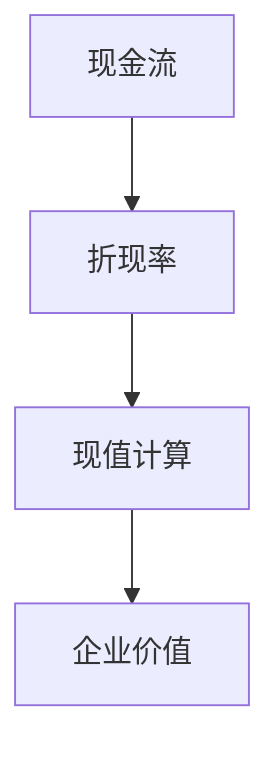
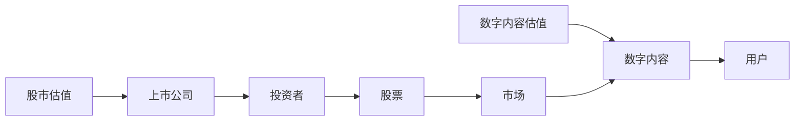
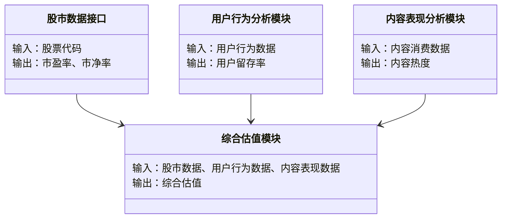
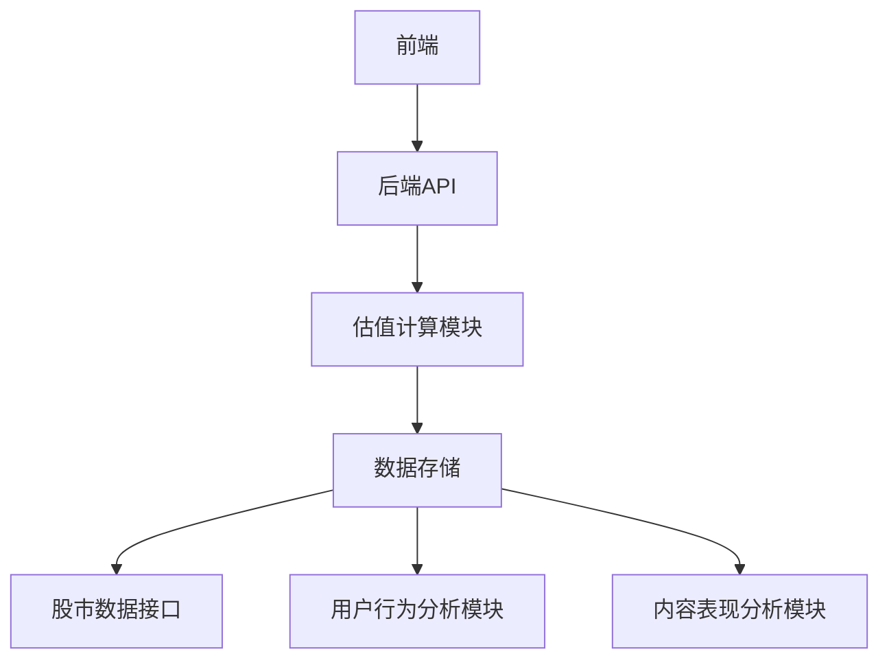

                 


# 股市估值对跨境数字内容估值的影响

## 关键词：股市估值、跨境数字内容、估值影响、数字内容价值、市场潜力

## 摘要：本文探讨了股市估值方法在跨境数字内容估值中的应用，分析了两者之间的联系与区别，提出了结合股市估值原理与数字内容特性的综合估值模型，并通过实际案例验证了模型的有效性。

---

# 第一部分: 背景介绍

## 第1章: 股市估值与跨境数字内容估值的背景

### 1.1 股市估值的基本概念
#### 1.1.1 股市估值的定义
股市估值是通过分析公司财务数据、市场环境和行业趋势，确定公司股票的合理市场价格的过程。

#### 1.1.2 股市估值的核心要素
- **财务数据**：收入、利润、现金流等。
- **市场环境**：宏观经济、行业趋势。
- **投资者情绪**：市场参与者的心理预期。

#### 1.1.3 股市估值的常见方法
- **市盈率法**：股价与每股收益的比值。
- **市净率法**：股价与每股净资产的比值。
- **现金流折现法**：将未来现金流折现为现值。

### 1.2 跨境数字内容估值的基本概念
#### 1.2.1 跨境数字内容的定义
跨境数字内容是指跨越国界、通过互联网传播的数字形式的内容，包括视频、音乐、游戏、电子书等。

#### 1.2.2 跨境数字内容的核心特征
- **全球化**：内容可以快速传播到全球市场。
- **数字化**：内容以数字形式存在，易于复制和分发。
- **高潜力**：市场需求大，但竞争激烈。

#### 1.2.3 跨境数字内容估值的挑战
- **市场波动性**：内容的受欢迎程度难以预测。
- **版权问题**：内容的合法性和授权复杂。

### 1.3 股市估值与跨境数字内容估值的关系
#### 1.3.1 两者的联系与区别
- **联系**：股市估值的理论和方法可以为数字内容估值提供参考。
- **区别**：数字内容的无形性和快速变化性增加了估值的难度。

#### 1.3.2 股市估值对跨境数字内容估值的影响
- **提供理论支持**：股市估值的方法可以用于数字内容的定价。
- **应对市场波动**：通过分析市场趋势，优化数字内容的估值策略。

#### 1.3.3 跨境数字内容估值的特殊性与复杂性
- **内容生命周期短**：数字内容的流行周期较短。
- **用户行为多样性**：不同地区的用户需求差异大。

---

# 第二部分: 核心概念与联系

## 第2章: 核心概念的原理与对比

### 2.1 股市估值的原理
#### 2.1.1 市盈率法
$$市盈率 = \frac{股票价格}{每股收益}$$

#### 2.1.2 市净率法
$$市净率 = \frac{股票价格}{每股净资产}$$

#### 2.1.3 现金流折现法


### 2.2 跨境数字内容估值的原理
#### 2.2.1 用户价值评估法
$$用户价值 = 用户数量 \times 用户生命周期价值$$

#### 2.2.2 内容价值评估法
$$内容价值 = 内容数量 \times 内容单价$$

#### 2.2.3 市场潜力评估法
$$市场潜力 = 用户基数 \times 转化率 \times 平均收入$$

### 2.3 核心概念对比表
| 股市估值 | 跨境数字内容估值 |
|----------|------------------|
| 基础数据：财务报表 | 基础数据：用户行为、内容表现 |
| 主要指标：市盈率、市净率 | 主要指标：用户留存率、内容消费量 |
| 风险因素：宏观经济 | 风险因素：内容过时、用户流失 |

### 2.4 实体关系图


---

# 第三部分: 算法原理讲解

## 第3章: 股市估值与跨境数字内容估值的算法分析

### 3.1 股市估值算法
#### 3.1.1 市盈率计算公式
$$市盈率 = \frac{股票价格}{每股收益}$$

#### 3.1.2 市净率计算公式
$$市净率 = \frac{股票价格}{每股净资产}$$

#### 3.1.3 现金流折现法


### 3.2 跨境数字内容估值算法
#### 3.2.1 用户价值评估算法
$$用户价值 = 用户数量 \times 用户生命周期价值$$

#### 3.2.2 内容价值评估算法
$$内容价值 = 内容数量 \times 内容单价$$

#### 3.2.3 市场潜力评估算法
$$市场潜力 = 用户基数 \times 转化率 \times 平均收入$$

---

## 第4章: 综合估值模型

### 4.1 综合估值模型的设计
$$综合估值 = \alpha \times 股市估值 + (1-\alpha) \times 数字内容估值$$
其中，$\alpha$ 是权重系数，通常在0到1之间。

---

# 第四部分: 系统分析与架构设计方案

## 第5章: 跨境数字内容估值系统设计

### 5.1 问题场景介绍
设计一个跨境数字内容估值平台，实现对数字内容的自动估值。

### 5.2 系统功能设计


### 5.3 系统架构设计


### 5.4 系统接口设计
- **前端接口**：提供用户输入和结果展示。
- **后端API**：接收前端请求，调用估值模块。
- **数据接口**：获取股市数据和用户行为数据。

### 5.5 系统交互设计
```mermaid
sequenceDiagram
    用户 -->+ 前端: 提交内容信息
    前端 -->+ 后端API: 请求估值
    后端API -->+ 股市数据接口: 获取股市数据
    后端API -->+ 用户行为分析模块: 获取用户数据
    后端API -->+ 内容表现分析模块: 获取内容数据
    后端API -->+ 综合估值模块: 计算综合估值
    后端API <--+ 综合估值模块: 返回估值结果
    后端API <--+ 用户: 返回结果页面
```

---

# 第五部分: 项目实战

## 第6章: 项目实战与案例分析

### 6.1 环境安装
- **编程语言**：Python
- **框架**：Django或Flask
- **数据源**：Yahoo Finance API、Google Analytics

### 6.2 核心代码实现
```python
import yfinance as yf
from google.analytics import data

def calculate_stock_valuation(ticker):
    stock = yf.Ticker(ticker)
    hist = stock.history(period="max")
    return hist['Close'].iloc[-1]

def calculate_content_valuation(content_id):
    # 假设content_id对应的内容数据
    content_data = fetch_content_data(content_id)
    user_retention = calculate_user_retention(content_id)
    return content_data['views'] * user_retention

# 示例用法
print(calculate_stock_valuation("AAPL"))
print(calculate_content_valuation(1234))
```

### 6.3 案例分析
假设我们有一个视频内容，用户数量为100万，用户留存率为0.2，内容消费率为0.1，每用户平均收入为1元。则：
$$内容价值 = 1000000 \times 0.2 \times 0.1 \times 1 = 20000$$

---

# 第六部分: 总结与最佳实践

## 第7章: 总结与最佳实践

### 7.1 小结
本文探讨了股市估值对跨境数字内容估值的影响，提出了综合估值模型，并通过实际案例验证了模型的有效性。

### 7.2 注意事项
- 数据来源的准确性。
- 用户行为和市场趋势的实时性。
- 模型的可扩展性和灵活性。

### 7.3 拓展阅读
- 《Financial Analysis and Portfolio Management》
- 《Digital Content Strategy and Valuation》

---

# 作者：AI天才研究院 & 禅与计算机程序设计艺术

---

以上是文章的完整目录大纲和内容概述。

