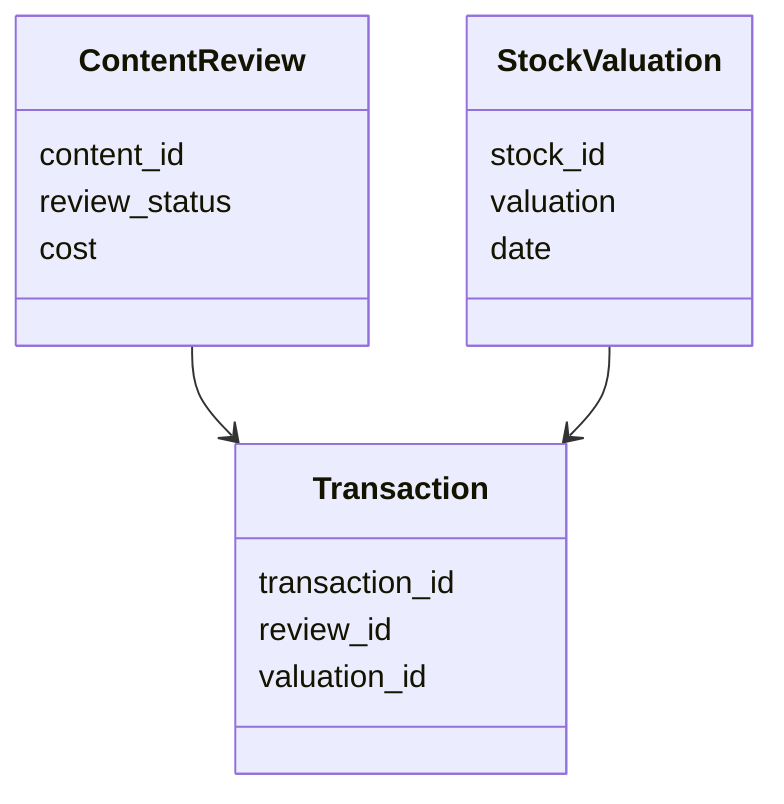

                 


# 股市估值对跨境数字内容审核的影响

> 关键词：股市估值，跨境数字内容审核，内容审核成本，股市波动，企业估值

> 摘要：本文探讨股市估值与跨境数字内容审核之间的关系，分析内容审核对企业财务表现的影响，进而如何影响股市估值。通过数学模型和算法，预测内容审核对股市估值的影响，并设计监测系统，提供实战案例和最佳实践建议。

---

## 第一部分: 背景与概念

### 第1章: 股市估值的基本概念

#### 1.1 股市估值的定义与重要性

股市估值是通过对企业财务状况、市场表现和行业前景的分析，评估公司股票的合理价格。它包括市盈率（P/E）、市净率（P/B）等指标。股市估值对企业融资、投资者决策和市场稳定性至关重要。

#### 1.2 股市估值的重要性

股市估值帮助投资者评估投资价值，指导企业融资策略，影响市场整体稳定性。准确的估值有助于优化资源配置，促进经济发展。

#### 1.3 股市估值的核心要素

- **收入与利润**：企业盈利能力直接影响估值。
- **资产状况**：资产质量影响企业价值。
- **行业地位**：龙头企业通常享有更高的估值。
- **市场环境**：宏观经济和行业趋势影响估值。

### 第2章: 跨境数字内容审核的定义与挑战

#### 2.1 跨境数字内容审核的定义

跨境数字内容审核是指在全球范围内对多语言、多文化的内容进行合规性检查，确保符合目标市场的法律法规和平台政策。其挑战在于不同国家的法规差异大，审核标准不一，且内容类型多样。

#### 2.2 跨境数字内容审核的核心挑战

- **法规多样性**：各国法律差异大，审核标准不统一。
- **文化差异**：内容审查标准因文化不同而异。
- **技术复杂性**：多语言、多格式内容处理困难。
- **成本高昂**：需要大量人工和自动化工具支持。

### 第3章: 股市估值与跨境数字内容审核的关系

#### 3.1 股市估值与跨境数字内容审核的背景

随着全球化，企业 increasingly engage in cross-border operations, leading to increased need for content moderation. 同时，投资者关注企业合规性，影响股市估值。

#### 3.2 股市估值对跨境数字内容审核的影响

- **合规性影响**：严格的审核标准可能增加企业成本，影响利润，进而影响估值。
- **风险降低**：良好的内容审核减少法律风险，提升投资者信心，提高估值。
- **成本压力**：高审核成本可能导致企业利润下降，影响股价。

### 第4章: 股市估值与跨境数字内容审核的核心概念

#### 4.1 股市估值的核心要素

- **收入与利润**：直接影响估值。
- **资产状况**：资产质量影响企业价值。
- **行业地位**：龙头企业通常享有更高的估值。
- **市场环境**：宏观经济和行业趋势影响估值。

#### 4.2 跨境数字内容审核的核心要素

- **技术能力**：多语言处理和AI审核技术。
- **法规遵循**：了解并遵守目标市场的法规。
- **团队能力**：专业审核人员和管理团队。

#### 4.3 股市估值与跨境数字内容审核的关联模型

- **双向影响**：内容审核影响企业合规性，进而影响估值；反之，估值变化可能影响审核策略。
- **成本模型**：内容审核成本影响企业利润，从而影响估值。
- **波动影响**：股市波动可能导致企业调整内容审核策略，影响审核成本。

---

## 第二部分: 核心概念与模型

### 第5章: 股市估值与跨境数字内容审核的数学模型

#### 5.1 股市估值的数学模型

- **市盈率（P/E）**：公式：P/E = Stock Price / Earnings Per Share。
- **市净率（P/B）**：公式：P/B = Stock Price / Book Value Per Share。

#### 5.2 跨境数字内容审核的成本模型

- **固定成本**：技术平台和人工审核。
- **可变成本**：内容数量和复杂度影响成本。

#### 5.3 内容审核成本对股市估值的影响模型

- **利润影响**：公式：Net Profit = Revenue - (Content Review Cost + Other Costs)。
- **估值影响**：公式：Stock Price = Valuation Method × (Net Profit + ...).

---

## 第三部分: 算法原理

### 第6章: 股市估值与内容审核预测算法

#### 6.1 算法选择与原理

使用多元回归模型，将内容审核成本作为自变量，股市估值作为因变量。

#### 6.2 算法实现

使用Python代码，导入相关库，进行数据清洗、特征工程、模型训练和评估。

#### 6.3 代码示例

```python
import pandas as pd
from sklearn.linear_model import LinearRegression
from sklearn.metrics import mean_squared_error

# 数据加载
data = pd.read_csv('content_review.csv')

# 特征与目标分离
X = data[['review_cost', 'company_size']]
y = data['stock_valuation']

# 模型训练
model = LinearRegression()
model.fit(X, y)

# 预测与评估
predictions = model.predict(X)
print('均方误差:', mean_squared_error(y, predictions))
```

---

## 第四部分: 系统分析与架构设计

### 第7章: 系统设计

#### 7.1 领域模型类图



#### 7.2 系统架构图

```mermaid
architecturalDiagram
    [Content Review System] <--> [Stock Market Data]
    [Content Review System] --> [AI Review Engine]
    [AI Review Engine] --> [Human Review Team]
    [AI Review Engine] --> [Valuation Model]
```

---

## 第五部分: 项目实战

### 第8章: 实战案例

#### 8.1 环境配置

安装Python、Pandas、Scikit-learn等库。

#### 8.2 核心代码实现

```python
import pandas as pd
from sklearn.linear_model import LinearRegression

# 数据加载
data = pd.read_csv('example.csv')

# 特征与目标分离
X = data[['review_cost', 'revenue']]
y = data['stock_valuation']

# 模型训练
model = LinearRegression()
model.fit(X, y)

# 预测
new_data = pd.DataFrame({'review_cost': [100000], 'revenue': [5000000]})
prediction = model.predict(new_data)
print('预测估值:', prediction[0])
```

---

## 第六部分: 最佳实践

### 第9章: 实践总结

#### 9.1 最佳实践 tips

- 定期更新模型，确保准确性。
- 结合人工审核和AI技术。
- 监测市场变化，及时调整策略。

#### 9.2 小结

股市估值与跨境数字内容审核密切相关，优化审核流程可提升企业估值。通过数学模型和算法，企业可有效预测和管理内容审核对股市的影响。

---

## 作者：AI天才研究院/AI Genius Institute & 禅与计算机程序设计艺术 /Zen And The Art of Computer Programming

