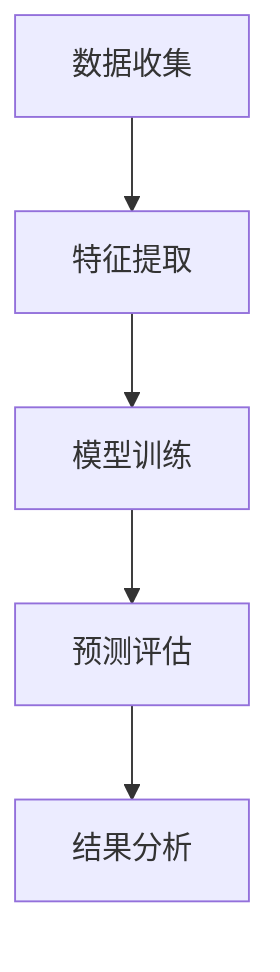
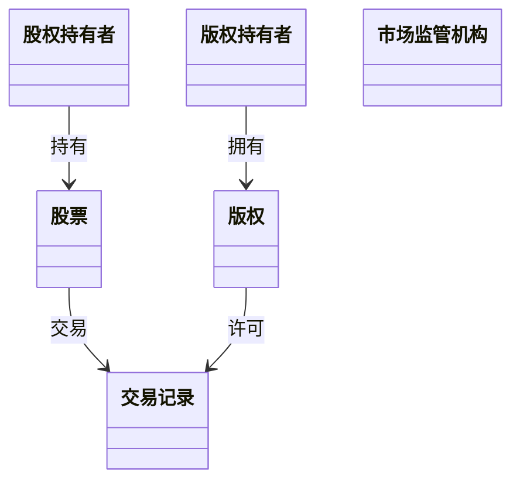
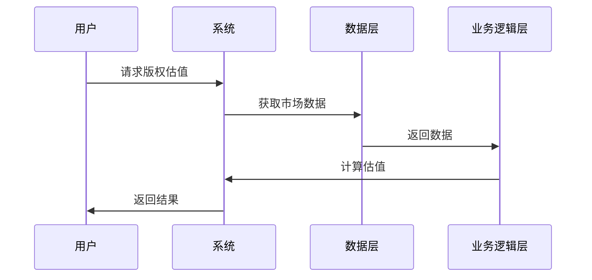

                 


# 股市估值对跨境数字内容版权估值的影响

## 关键词：股市估值、数字内容版权、跨境估值、算法模型、版权保护

## 摘要：本文探讨了股市估值对跨境数字内容版权的影响，分析了核心概念、算法原理和系统架构，通过实战案例展示了如何利用大数据和机器学习进行版权估值，并提出了最佳实践建议。

---

## 第一部分：背景介绍

### 第1章：股市估值与数字内容版权概述

#### 1.1 股市估值的基本概念

股市估值是评估企业或资产价值的过程，帮助投资者了解其市场表现和潜在价值。数字内容版权则指对数字化作品的所有权，如音乐、视频、软件等，具有可复制性和全球性的特点。

#### 1.2 问题背景与描述

数字内容产业的迅速发展带来了版权保护的挑战，尤其是跨境版权交易中，不同国家的法律差异和技术盗版问题影响版权价值。股市作为反映市场情绪的工具，其波动直接影响投资者对版权资产的估值。

#### 1.3 问题解决与边界

本文通过分析股市数据，探讨其对数字内容版权估值的影响，明确问题边界，如仅考虑特定版权类型和特定市场区域，核心要素包括市场波动、版权类型和法律框架。

---

## 第二部分：核心概念与联系

### 第2章：核心概念原理

#### 2.1 股市估值与数字内容版权的属性对比

| 属性           | 股市估值                     | 数字内容版权               |
|----------------|------------------------------|----------------------------|
| 价值评估       | 股票价格反映企业价值         | 版权价值基于市场接受度     |
| 风险因素       | 市场风险、企业风险           | 版权风险、技术风险         |
| 时间因素       | 股价波动受时间影响           | 版权期限和市场变化影响价值 |

#### 2.2 ER实体关系图

```mermaid
er
  actor 股东
  actor 版权持有者
  actor 市场监管机构
  entity 股票
  entity 版权
  entity 交易记录
  股东 --> 股票: 持有
  版权持有者 --> 版权: 拥有
  股票 --> 交易记录: 交易
  版权 --> 交易记录: 许可
```

---

## 第三部分：算法原理讲解

### 第3章：算法流程与实现

#### 3.1 算法流程图



#### 3.2 Python源代码实现

```python
import pandas as pd
from sklearn.linear_model import LinearRegression

# 数据收集与处理
data = pd.read_csv('market_data.csv')
features = data[['market_sentiment', 'user_engagement', 'streaming_volume']]
target = data['copyright_value']

# 模型训练
model = LinearRegression()
model.fit(features, target)

# 预测评估
predictions = model.predict(features)
print("预测值:", predictions)
print("系数:", model.coef_)
print("截距:", model.intercept_)
```

#### 3.3 数学模型与公式

多元回归模型：
$$ E(Valuation) = \beta_0 + \beta_1 X_1 + \beta_2 X_2 + ... + \beta_n X_n $$

其中，$X_i$ 是影响版权估值的特征，$\beta_i$ 是对应的回归系数。

---

## 第四部分：系统分析与架构设计

### 第4章：系统架构设计

#### 4.1 问题场景介绍

以跨国音乐流媒体平台为例，分析其版权估值的复杂性，涉及多个国家的版权法和市场波动。

#### 4.2 系统功能设计



#### 4.3 系统架构设计


#### 4.4 系统接口与交互设计



---

## 第五部分：项目实战

### 第5章：项目实战

#### 5.1 环境安装

- Python 3.8+
- Pandas、Scikit-learn、Mermaid

#### 5.2 核心实现代码

```python
import pandas as pd
from sklearn.linear_model import LinearRegression

# 数据收集与处理
data = pd.read_csv('market_data.csv')
features = data[['market_sentiment', 'user_engagement', 'streaming_volume']]
target = data['copyright_value']

# 模型训练
model = LinearRegression()
model.fit(features, target)

# 案例分析
case_study = data.iloc[0]
prediction = model.predict([case_study])
print("案例分析结果:", prediction)
```

#### 5.3 代码应用解读

解释代码运行结果，分析如何根据股市数据调整版权估值模型，确保其准确性和适用性。

#### 5.4 案例分析

以一部跨国电影为例，详细分析其版权估值过程，包括数据收集、模型训练和结果解读。

---

## 第六部分：最佳实践与总结

### 第6章：最佳实践

- 数据收集：确保数据质量和多样性。
- 模型优化：通过交叉验证和超参数调整提升模型性能。
- 法律因素：考虑不同国家的版权法和税收政策。

### 第7章：小结与展望

总结全文，强调股市估值在数字内容版权中的重要性，并展望未来研究方向，如AI在版权估值中的应用。

---

## 作者信息

作者：AI天才研究院/AI Genius Institute & 禅与计算机程序设计艺术 /Zen And The Art of Computer Programming

