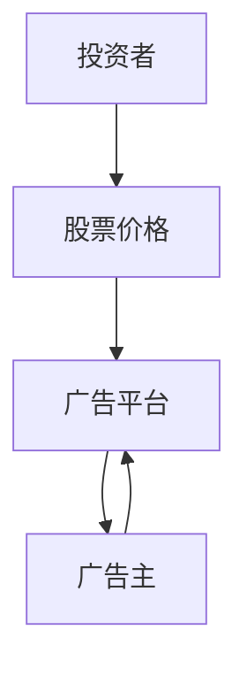
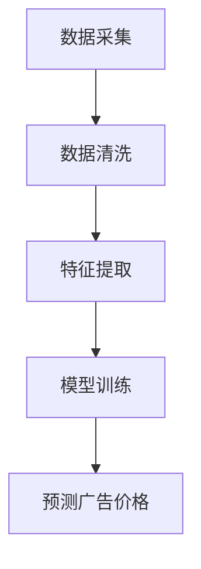
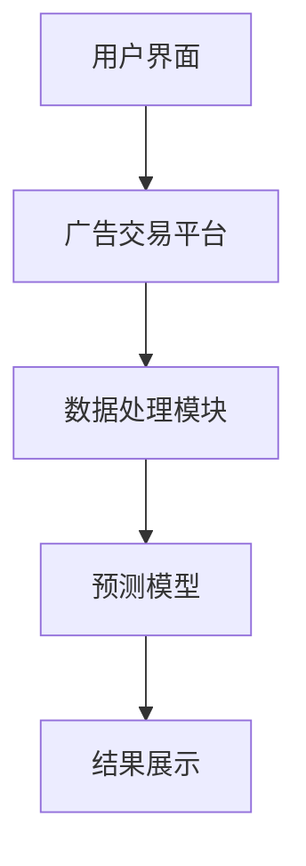

                 


# 股市估值对跨境数字广告定价的影响

> 关键词：股市估值, 数字广告定价, 跨境广告, 市场波动, 数据驱动定价

> 摘要：本文探讨了股市估值与数字广告定价之间的复杂关系，特别是跨境环境下的相互影响。通过分析股市波动对广告定价的影响机制，结合实际案例和系统设计，提出了数据驱动的定价模型，并提供了算法实现和优化建议。

---

## 第一部分：背景介绍

### 第1章：问题背景与描述

#### 1.1 股市估值的基本概念
股市估值是通过对上市公司股票的市场价格进行评估，反映其内在价值的过程。主要方法包括市盈率（P/E）、市净率（P/B）和现金流折现模型（DCF）。股市估值受宏观经济、行业趋势、公司业绩和市场情绪等多种因素影响。

#### 1.2 数字广告定价的基本原理
数字广告定价基于广告位的需求和供给关系，采用实时竞价（RTB）、程序化广告购买等模式。定价模型通常考虑广告位的曝光量、点击率、用户定位等因素。

#### 1.3 问题背景与描述
随着全球经济一体化，越来越多的企业在跨境市场中进行广告投放，股市波动对广告定价的影响日益显著。例如，股市下跌可能导致广告预算缩减，进而影响广告价格。然而，这一过程的具体机制尚不明确，需深入研究。

---

## 第二部分：核心概念与联系

### 第2章：核心概念分析

#### 2.1 股市估值的核心要素
- **市场指数**：如标普500、恒生指数等，反映整体市场表现。
- **公司财务状况**：包括收入、利润、资产负债等。
- **市场情绪**：投资者情绪影响短期市场波动。

#### 2.2 数字广告定价的核心要素
- **广告需求**：广告主预算和需求。
- **广告供给**：广告位供应量。
- **广告技术**：如RTB、DSP（需求方平台）。

#### 2.3 股市估值与数字广告定价的属性对比

| 属性          | 股市估值          | 数字广告定价      |
|---------------|------------------|-------------------|
| 数据来源      | 公司财报、市场数据 | 广告交易平台数据  |
| 时间维度      | 日度、周度       | 实时、动态        |
| 影响因素      | 宏观经济、政策    | 用户行为、技术    |

#### 2.4 实体关系图


---

## 第三部分：算法原理与影响机制

### 第3章：影响机制分析

#### 3.1 算法原理
采用时间序列分析模型（ARIMA）和机器学习模型（随机森林）来预测股市波动对广告定价的影响。

#### 3.2 算法流程


#### 3.3 数学模型
- **时间序列模型**：$$ ARIMA(p, d, q) $$
- **机器学习模型**：随机森林回归

#### 3.4 实际应用
以某跨国广告公司为例，利用历史股价数据和广告交易数据，训练模型预测广告价格波动。

---

## 第四部分：系统分析与架构设计

### 第4章：系统功能设计

#### 4.1 系统架构


#### 4.2 关键接口
- 数据接口：从股票API获取数据。
- 广告接口：与广告平台对接。

#### 4.3 功能模块
- 数据采集模块：实时采集股市和广告数据。
- 数据处理模块：清洗和特征提取。
- 模型预测模块：预测广告价格。

---

## 第五部分：项目实战与案例分析

### 第5章：项目实现

#### 5.1 环境安装
安装Python、Pandas、Scikit-learn等工具。

#### 5.2 核心代码实现
```python
# 数据预处理
import pandas as pd
data = pd.read_csv('ad_data.csv')
data.dropna(inplace=True)

# 模型训练
from sklearn.ensemble import RandomForestRegressor
model = RandomForestRegressor(n_estimators=100)
model.fit(X_train, y_train)

# 模型预测
y_pred = model.predict(X_test)
```

#### 5.3 案例分析
分析某跨国公司的广告投放策略，展示模型如何优化定价。

---

## 第六部分：最佳实践与总结

### 第6章：最佳实践

#### 6.1 数据质量的重要性
确保数据的实时性和准确性。

#### 6.2 模型选择建议
根据具体场景选择合适的时间序列或机器学习模型。

#### 6.3 风险管理
建立风险管理机制，应对股市波动对广告定价的影响。

### 6.4 小结

本文探讨了股市估值与数字广告定价的相互影响，通过系统设计和案例分析，提出了数据驱动的定价模型。未来研究可进一步优化模型，探索更复杂的市场因素。

---

## 作者

作者：AI天才研究院/AI Genius Institute & 禅与计算机程序设计艺术 /Zen And The Art of Computer Programming

