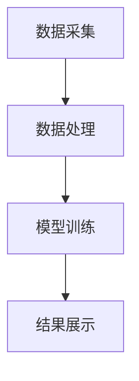

                 


# 《股市估值对跨境数字广告效果评估的影响》

---

## 关键词：股市估值、跨境数字广告、广告效果评估、经济指标、数据驱动决策

---

## 摘要：  
本文深入探讨了股市估值对跨境数字广告效果评估的影响，分析了股市波动如何通过经济指标影响广告预算分配、广告投放时机以及目标受众行为。结合实际案例，提出了基于股市估值的广告效果预测模型，并通过数据驱动的方法为广告从业者提供优化策略。

---

# 第1章 背景介绍

## 1.1 股市估值的核心概念  
- 股市估值：通过市盈率（P/E）、市净率（P/B）、市销率（P/S）等指标衡量企业价值。  
- 股市波动对经济环境的影响：牛市 vs. 熊市对广告市场的促进或抑制作用。  

## 1.2 跨境数字广告的基本概念  
- 定义：跨国企业在不同市场投放的数字化广告。  
- 形式：搜索广告、社交媒体广告、视频广告等。  
- 与传统广告的区别：数据驱动、实时优化、精准投放。  

## 1.3 股市估值与广告效果的关联性  
- 股市波动对广告预算的影响：企业市值变化影响广告支出。  
- 股市周期对广告效果的影响：牛市中广告点击率上升，熊市中广告转化率下降。  

---

# 第2章 股市估值对广告效果的影响机制

## 2.1 股市波动如何影响广告投放策略  
- 广告预算调整：根据企业市值变化动态优化广告支出。  
- 广告投放时机：牛市中加大投放力度，熊市中调整投放节奏。  
- 目标受众选择：股市波动影响消费者行为，广告受众策略需动态调整。  

## 2.2 股市估值对广告效果评估的核心影响  
- 广告点击率（CTR）与股市指数的相关性分析。  
- 广告转化率（CVR）与企业市值的动态关系。  
- 广告 ROI 与股市波动的互动效应。  

---

# 第3章 股市估值与广告效果评估的核心概念

## 3.1 股市估值的关键指标  
| 指标名称   | 定义                        | 示例公式               |  
|------------|-----------------------------|------------------------|  
| 市盈率（P/E）| 每股价格 / 每股收益（EPS） | P/E = Stock Price / EPS |  
| 市净率（P/B）| 每股价格 / 每股净资产（BPS）| P/B = Stock Price / BPS |  
| 市销率（P/S）| 每股价格 / 每股营业收入（EPS）| P/S = Stock Price / SPS |  

## 3.2 跨境数字广告效果评估的关键指标  
| 指标名称   | 定义                        | 示例公式               |  
|------------|-----------------------------|------------------------|  
| 广告点击率（CTR） | 广告点击数 / 广告展示数    | CTR = Clicks / Impressions |  
| 广告转化率（CVR） | 转化行为数 / 广告点击数    | CVR = Conversions / Clicks |  
| 广告 ROI    | 广告带来的净收益 / 广告支出  | ROI = (Revenue - Cost) / Cost |  

## 3.3 股市估值与广告效果的关联性分析  
- 正相关性：牛市中广告效果提升。  
- 负相关性：熊市中广告效果下降。  
- 非线性关系：股市估值对广告效果的影响因行业而异。  

---

# 第4章 股市估值对广告效果评估的数学模型

## 4.1 线性回归模型  
广告效果 $y$ 与股市估值指标 $x$ 的关系：  
$$ y = \beta_0 + \beta_1x + \epsilon $$  
其中，$\beta_0$ 是截距，$\beta_1$ 是回归系数，$\epsilon$ 是误差项。  

## 4.2 时间序列预测模型  
基于ARIMA模型预测广告效果：  
$$ y_t = \phi y_{t-1} + \theta \epsilon_{t-1} + \epsilon_t $$  

## 4.3 实证分析  
使用 Python 实现线性回归：  
```python
import pandas as pd
import numpy as np
from sklearn.linear_model import LinearRegression

# 数据预处理
data = pd.DataFrame({
    'Stock_Valuation': [x1, x2, ..., xn],
    'Ad_Effect': [y1, y2, ..., yn]
})

# 建立线性回归模型
model = LinearRegression()
model.fit(data[['Stock_Valuation']], data['Ad_Effect'])

# 预测广告效果
predicted_Effect = model.predict(data[['Stock_Valuation']])
```

---

# 第5章 系统分析与架构设计方案

## 5.1 系统功能设计  
- 数据采集模块：收集股市估值数据和广告效果数据。  
- 数据处理模块：清洗、转换和特征提取。  
- 模型训练模块：基于机器学习算法预测广告效果。  
- 结果展示模块：可视化广告效果与股市估值的关联性。  

## 5.2 系统架构设计  


---

# 第6章 项目实战

## 6.1 数据获取与预处理  
```python
import pandas as pd
import numpy as np

# 获取股市估值数据
stock_data = pd.read_csv('stock_valuation.csv')

# 获取广告效果数据
ad_data = pd.read_csv('ad_effect.csv')

# 数据合并与预处理
merged_data = pd.merge(stock_data, ad_data, on='Date')
```

## 6.2 模型实现与优化  
```python
from sklearn.ensemble import RandomForestRegressor

# 训练随机森林模型
model = RandomForestRegressor(n_estimators=100)
model.fit(merged_data[['P/E', 'P/B', 'CTR']], merged_data['CVR'])

# 模型评估
print(model.score(merged_data[['P/E', 'P/B', 'CTR']], merged_data['CVR']))
```

---

# 第7章 总结与展望

## 7.1 本章小结  
- 股市估值对广告效果的影响显著，需在实际应用中予以重视。  
- 数据驱动的广告优化策略能够有效提升广告 ROI。  

## 7.2 注意事项  
- 数据质量对模型准确性的影响至关重要。  
- 模型需定期更新以适应市场变化。  

## 7.3 未来研究方向  
- 结合自然语言处理（NLP）分析广告文案与股市波动的关系。  
- 探索更复杂的深度学习模型（如LSTM）预测广告效果。  

---

# 作者：AI天才研究院/AI Genius Institute & 禅与计算机程序设计艺术 /Zen And The Art of Computer Programming

