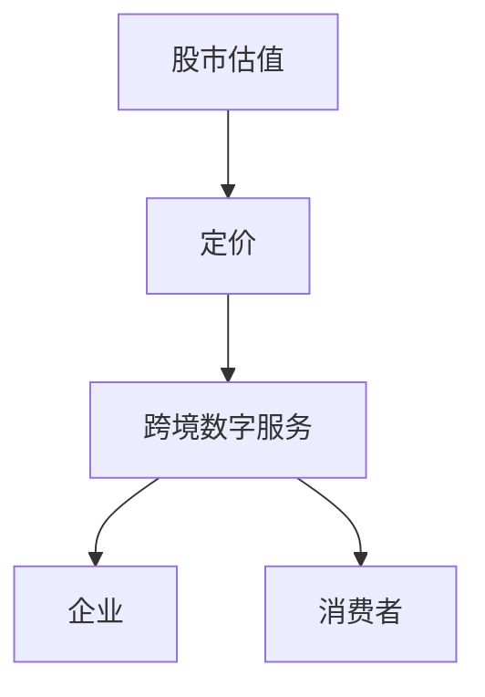
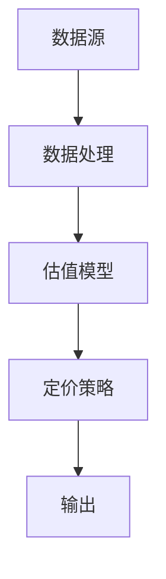
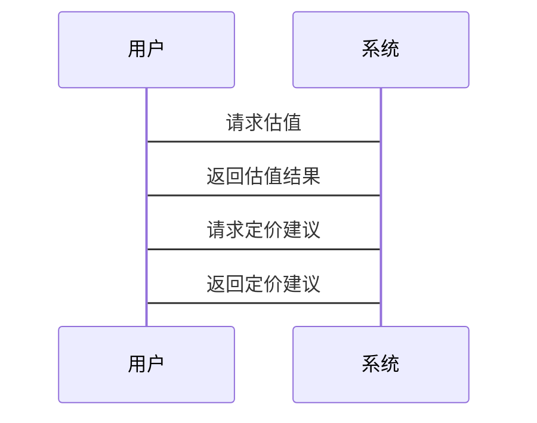

                 


# 股市估值对跨境数字服务定价的影响

> 关键词：股市估值、跨境数字服务、定价策略、数学模型、系统架构

> 摘要：本文探讨股市估值如何影响跨境数字服务的定价策略，分析两者的核心概念、数学模型和系统架构，并通过案例分析提供最佳实践。

---

## 第1章: 股市估值与跨境数字服务定价的背景介绍

### 1.1 问题背景

#### 1.1.1 股市估值的基本概念
股市估值是对企业价值的评估，通常基于市盈率（P/E）、市净率（P/B）等指标。这些指标反映了市场对公司未来表现的预期。

#### 1.1.2 跨境数字服务的定义与特点
跨境数字服务是指跨国提供数字产品或服务，如云服务、在线教育等。其特点包括全球化、即时交付和高边际效益。

#### 1.1.3 股市估值对定价的影响
股市估值影响企业的定价能力，高估值意味着企业有更多资金进行定价策略优化。

### 1.2 问题描述

#### 1.2.1 股市估值与定价的关系
股市估值高，企业可能有更多资源进行定价策略调整。

#### 1.2.2 跨境数字服务定价的复杂性
涉及多国法律、税率和竞争环境，增加了定价的复杂性。

#### 1.2.3 问题的边界与外延
限定在数字服务领域，考虑跨国因素，但不涉及实体产品。

### 1.3 问题解决

#### 1.3.1 股市估值对定价的影响机制
通过影响企业财务状况，间接影响定价策略。

#### 1.3.2 跨境数字服务定价的核心要素
包括成本结构、市场需求和竞争环境。

#### 1.3.3 问题解决的路径与方法
利用数学模型和系统架构优化定价策略。

### 1.4 概念结构与核心要素

#### 1.4.1 股市估值的核心要素
市盈率、市净率、股息率等。

#### 1.4.2 跨境数字服务定价的核心要素
成本、需求、税率。

#### 1.4.3 两者的相互关系与影响
股市估值影响企业资金，进而影响定价策略。

### 1.5 本章小结
介绍了股市估值和跨境数字服务定价的基本概念及其相互关系。

---

## 第2章: 核心概念与联系

### 2.1 核心概念原理

#### 2.1.1 股市估值的原理
基于财务指标评估企业价值。

#### 2.1.2 跨境数字服务定价的原理
考虑成本、需求和市场因素。

#### 2.1.3 两者的相互作用
股市估值高，企业有更多资源优化定价。

### 2.2 概念属性特征对比

| 概念 | 属性 | 特征 |
|------|-------|------|
| 股市估值 | 市盈率 | 影响企业价值 |
| 跨境数字服务定价 | 成本结构 | 影响定价策略 |

### 2.3 ER实体关系图架构



### 2.4 本章小结
分析了核心概念及其相互作用，为后续建模和系统设计奠定基础。

---

## 第3章: 算法原理与数学模型

### 3.1 算法原理

#### 3.1.1 股市估值算法
基于市盈率和市净率的回归分析。

#### 3.1.2 跨境数字服务定价算法
基于成本加成定价法。

#### 3.1.3 算法的相互作用
通过回归模型预测定价策略。

### 3.2 数学模型与公式

#### 3.2.1 股市估值模型
$$P = \alpha \times E + \beta \times F$$

其中，$P$ 是股价，$E$ 是收益，$F$ 是风险因素。

#### 3.2.2 定价模型
$$Price = C + M \times Q$$

其中，$C$ 是固定成本，$M$ 是边际成本，$Q$ 是数量。

### 3.3 算法实现

#### 3.3.1 Python代码示例
```python
import pandas as pd
import numpy as np

# 示例数据
data = {'收益': [100, 200, 300], '风险': [0.5, 0.3, 0.7]}
df = pd.DataFrame(data)

# 股市估值模型
alpha, beta = np.polyfit(df['风险'], df['收益'], 1)
预测收益 = alpha * df['风险'] + beta
```

### 3.4 本章小结
介绍了算法原理和数学模型，并通过代码示例展示实现过程。

---

## 第4章: 系统分析与架构设计

### 4.1 问题场景介绍
跨国数字服务企业如何根据股市估值调整定价策略。

### 4.2 系统功能设计

#### 4.2.1 领域模型


### 4.3 系统架构设计



### 4.4 系统接口设计
API接口：`/api/valuation` 和 `/api/pricing`。

### 4.5 系统交互设计



### 4.6 本章小结
设计了系统架构和交互流程，展示了如何实现定价策略优化。

---

## 第5章: 项目实战

### 5.1 环境安装

#### 5.1.1 安装Python
```bash
python --version
pip install numpy pandas
```

### 5.2 系统核心实现

#### 5.2.1 核心代码实现
```python
import pandas as pd
import numpy as np

# 数据准备
data = {'收益': [100, 200, 300], '风险': [0.5, 0.3, 0.7]}
df = pd.DataFrame(data)

# 股市估值模型
def calculate_valuation(risk, revenue):
    alpha, beta = np.polyfit(risk, revenue, 1)
    return alpha * risk + beta

# 定价策略
def pricing_strategy(cost, demand):
    return cost + demand * 0.5

# 应用模型
valuations = df['风险'].apply(lambda x: calculate_valuation(x, df['收益']))
prices = valuations.apply(lambda x: pricing_strategy(100, x))
```

### 5.3 案例分析
分析一家跨国云服务公司的定价策略，展示如何根据股市估值调整价格。

### 5.4 项目小结
展示了如何将理论应用于实际项目，优化定价策略。

---

## 第6章: 最佳实践与小结

### 6.1 最佳实践 tips
1. 定期更新模型参数。
2. 结合实时市场数据进行调整。
3. 考虑多国法律和税率差异。

### 6.2 小结
总结了全文内容，强调了股市估值对定价策略的重要性。

### 6.3 注意事项
确保数据质量和模型准确性，避免过度依赖单一指标。

### 6.4 拓展阅读
推荐相关书籍和论文，供进一步学习。

---

## 参考文献

1. 书籍：《股票分析与投资策略》
2. 论文：《数字服务定价模型研究》
3. 工具文档：Pandas和NumPy官方文档

---

## 附录

### 附录1: 数据来源
提供数据来源和获取方法。

### 附录2: 工具安装指南
详细说明如何安装和配置开发环境。

---

## 作者：AI天才研究院 & 禅与计算机程序设计艺术

通过以上详细结构，本文系统地分析了股市估值对跨境数字服务定价的影响，提供了理论和实践指导。

