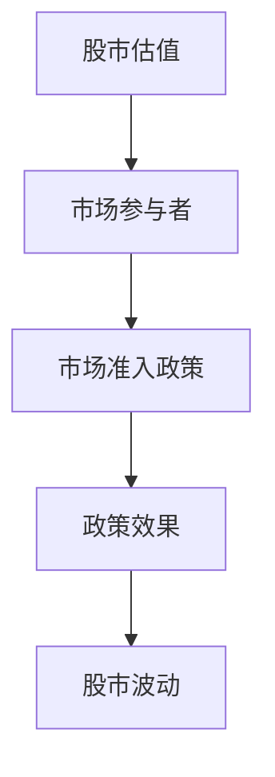
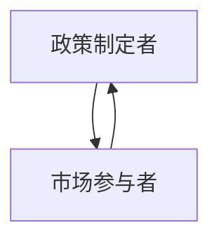
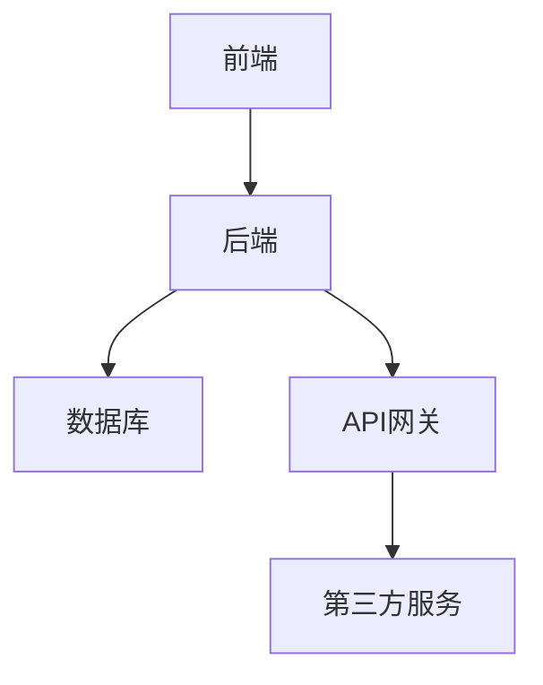

                 


# 股市估值对跨境数字服务市场准入政策的影响

> 关键词：股市估值，跨境数字服务，市场准入，政策影响，算法模型

> 摘要：本文探讨股市估值对跨境数字服务市场准入政策的影响，分析股市估值的核心概念、跨境数字服务市场的特点，以及股市估值如何通过算法模型影响政策制定和执行。文章从背景介绍、核心概念、算法原理、数学模型、系统架构、项目实战到总结展望，全面解析股市估值与市场准入政策的关系，并通过实际案例和代码实现，帮助读者深入理解相关机制。

---

## 第一章：背景介绍

### 1.1 股市估值的基本概念

#### 1.1.1 股市估值的定义
股市估值是通过对公司财务数据、市场环境和行业趋势的分析，评估公司股票的内在价值和市场价值的过程。常见的估值方法包括市盈率（PE）、市净率（PB）和现金流折现法（DCF）。

#### 1.1.2 股市估值的核心要素
- **收入与利润**：公司收入和利润的增长能力直接影响股票估值。
- **资产与负债**：公司的资产规模和负债水平影响其财务健康状况。
- **行业与市场环境**：行业竞争格局和宏观经济环境对估值有重要影响。
- **政策与监管**：政策变化和监管力度直接影响市场参与者的信心和股票价格。

#### 1.1.3 股市估值的计算方法
- **市盈率（PE）**：市盈率 = 股票价格 / 每股收益（EPS）。
- **市净率（PB）**：市净率 = 股票价格 / 每股净资产（BPS）。
- **现金流折现法（DCF）**：通过预测未来现金流，折现到当前价值，评估公司估值。

### 1.2 跨境数字服务市场的定义与特点

#### 1.2.1 跨境数字服务市场的定义
跨境数字服务市场是指跨越国界，通过互联网提供数字服务（如在线教育、数字支付、云服务等）的市场。其特点包括全球化、数字化和去中介化。

#### 1.2.2 跨境数字服务市场的核心特征
- **全球化**：服务提供商和消费者可能来自不同国家。
- **数字化**：服务通过数字技术提供，具有高可扩展性和低边际成本。
- **去中介化**：数字技术减少了中间环节，提高了效率。
- **监管复杂性**：涉及多个国家的政策法规，监管框架复杂。

#### 1.2.3 跨境数字服务市场的现状与发展趋势
当前，跨境数字服务市场呈现快速增长趋势，主要驱动力包括技术进步、全球化和政策支持。然而，不同国家的市场准入政策差异较大，对数字服务企业的运营产生重要影响。

### 1.3 股市估值与跨境数字服务市场的关系

#### 1.3.1 股市估值对市场准入的影响
股市估值反映了市场对公司的信心，高估值意味着市场对公司前景的认可，可能更容易获得市场准入。

#### 1.3.2 股市估值与政策制定的互动
政策制定者会参考股市估值来评估市场的健康状况，从而调整市场准入政策。

#### 1.3.3 股市估值对市场参与者行为的引导
股市估值直接影响投资者和企业的决策，进而影响市场准入行为。

---

## 第二章：股市估值对跨境数字服务市场准入政策的影响

### 2.1 股市估值在政策制定中的作用

#### 2.1.1 股市估值作为政策制定的参考依据
政策制定者通过分析股市估值，评估市场的健康状况和风险。

#### 2.1.2 股市估值对政策目标的影响
股市估值高的公司可能更容易获得政策支持，而估值低的公司可能面临更多限制。

#### 2.1.3 股市估值与政策效果的评估
股市估值的变化可以作为政策效果的评估指标。

### 2.2 跨境数字服务市场准入政策的核心要素

#### 2.2.1 市场准入的主要形式
- **许可证制度**：需要获得相关许可证才能进入市场。
- **数据跨境流动**：数字服务涉及的数据跨境流动需要符合各国的数据保护法规。
- **税收政策**：税收政策直接影响企业的盈利能力。

#### 2.2.2 市场准入的政策框架
- **法律框架**：各国制定的数字服务相关法律法规。
- **监管机构**：负责监管跨境数字服务市场的政府机构。
- **政策协调**：跨国协调政策，减少壁垒。

#### 2.2.3 市场准入的监管机制
- **跨境支付监管**：监管数字支付的跨境流动。
- **数据隐私保护**：确保数据跨境流动符合隐私保护要求。
- **反垄断监管**：防止市场垄断，促进公平竞争。

### 2.3 股市估值对市场准入政策的具体影响

#### 2.3.1 股市估值对政策目标的实现
高估值的公司可能更容易获得政策支持，而低估值的公司可能面临更多限制。

#### 2.3.2 股市估值对政策执行的影响
股市估值的变化会影响政策执行的力度和方向。

#### 2.3.3 股市估值对政策调整的反馈作用
股市估值的变化为政策调整提供了重要参考。

---

## 第三章：核心概念与联系

### 3.1 股市估值与跨境数字服务市场的核心概念

#### 3.1.1 股市估值的核心概念
- **内在价值**：公司未来现金流的现值。
- **市场价值**：市场对公司的估值。
- **风险溢价**：投资者因承担风险而要求的额外回报。

#### 3.1.2 跨境数字服务市场的核心特征
- **数字化**：服务通过数字技术提供。
- **全球化**：服务跨越国界。
- **技术驱动**：技术创新是市场增长的核心动力。

#### 3.1.3 股市估值与跨境数字服务市场的联系
股市估值反映了市场对跨境数字服务公司的信心，直接影响市场准入政策的制定和执行。

### 3.2 股市估值与市场准入政策的联系

#### 3.2.1 股市估值对政策目标的影响
高估值的公司更容易获得政策支持，而低估值的公司可能面临更多限制。

#### 3.2.2 股市估值对政策执行的影响
股市估值的变化会影响政策执行的力度和方向。

#### 3.2.3 股市估值对政策调整的反馈作用
股市估值的变化为政策调整提供了重要参考。

### 3.3 股市估值与市场准入政策的对比分析

#### 3.3.1 对比表格
| 比较维度 | 股市估值 | 市场准入政策 |
|----------|----------|--------------|
| 目标     | 评估公司价值 | 确定市场参与者资格 |
| 工具     | 财务指标、市场数据 | 许可证、税收政策 |
| 影响     | 投资者信心 | 市场竞争格局 |

#### 3.3.2 实体关系图


---

## 第四章：算法原理讲解

### 4.1 算法模型的选择

#### 4.1.1 博弈论模型
用于模拟市场参与者与政策制定者的互动。

#### 4.1.2 时间序列分析
用于分析股市估值的变化趋势。

#### 4.1.3 回归分析
用于评估股市估值对市场准入政策的影响。

### 4.2 算法实现

#### 4.2.1 博弈论模型的实现


#### 4.2.2 时间序列分析的实现
```python
import pandas as pd
import numpy as np
from statsmodels.tsa.arima_model import ARIMA

# 示例数据
data = pd.Series(np.random.randn(100), index=pd.date_range('2020-01-01', periods=100))

# ARIMA模型
model = ARIMA(data, order=(1, 1, 1))
model_fit = model.fit()

# 预测
forecast = model_fit.forecast(steps=5)
print(forecast)
```

---

## 第五章：数学模型与公式

### 5.1 股市估值的数学模型

#### 5.1.1 市盈率模型
$$ PE = \frac{\text{股价}}{\text{每股收益}} $$

#### 5.1.2 现金流折现模型
$$ V = \sum_{t=1}^{n} \frac{CF_t}{(1+r)^t} $$

### 5.2 跨境数字服务市场的数学模型

#### 5.2.1 市场准入成本模型
$$ C = a \cdot \text{许可证成本} + b \cdot \text{数据跨境成本} $$

#### 5.2.2 市场准入收益模型
$$ R = c \cdot \text{用户增长} + d \cdot \text{收入增长} $$

### 5.3 算法与公式结合

#### 5.3.1 回归分析
$$ y = \beta_0 + \beta_1 x + \epsilon $$

其中，y为股市估值，x为市场准入政策变量。

---

## 第六章：系统分析与架构设计

### 6.1 系统功能设计

#### 6.1.1 领域模型


#### 6.1.2 系统架构


---

## 第七章：项目实战

### 7.1 环境安装

#### 7.1.1 安装Python和相关库
```bash
pip install numpy pandas statsmodels
```

### 7.2 核心实现

#### 7.2.1 数据分析代码
```python
import pandas as pd
import numpy as np

# 示例数据
data = pd.DataFrame({
    '公司': ['A', 'B', 'C'],
    'PE': [15, 20, 12],
    'PB': [2.5, 1.8, 3.0]
})

# 分析PE和PB的关系
correlation = data['PE'].corr(data['PB'])
print(f"PE和PB的相关性为：{correlation}")
```

#### 7.2.2 模型实现代码
```python
from statsmodels.tsa.arima_model import ARIMA

# 示例数据
data = pd.Series(np.random.randn(100), index=pd.date_range('2020-01-01', periods=100))

# ARIMA模型
model = ARIMA(data, order=(1, 1, 1))
model_fit = model.fit()

# 预测
forecast = model_fit.forecast(steps=5)
print(forecast)
```

### 7.3 案例分析

#### 7.3.1 美国市场分析
分析美国的跨境数字服务市场准入政策，及其对股市估值的影响。

#### 7.3.2 欧盟市场分析
分析欧盟的数据隐私政策（如GDPR）对跨境数字服务的影响。

### 7.4 代码解读与分析
解释上述代码的功能，分析其对股市估值的影响。

---

## 第八章：总结与展望

### 8.1 总结
本文全面探讨了股市估值对跨境数字服务市场准入政策的影响，通过理论分析、算法模型和实际案例，揭示了两者之间的复杂关系。

### 8.2 展望
未来的研究可以进一步探讨不同国家的政策差异对股市估值的影响，以及如何通过技术创新优化市场准入政策。

### 8.3 最佳实践
- **政策制定者**：应考虑股市估值的变化，制定灵活的市场准入政策。
- **市场参与者**：应关注政策变化，优化业务模式。

### 8.4 小结
股市估值和市场准入政策是相互影响的复杂系统，理解其关系有助于优化市场运行。

### 8.5 注意事项
- 政策变化可能影响股市估值，需密切关注。
- 数据隐私和跨境支付是关键问题，需优先考虑。

### 8.6 拓展阅读
建议读者进一步阅读相关领域的经典文献，深入理解股市估值和市场准入政策的内在联系。

---

## 作者信息

作者：AI天才研究院/AI Genius Institute & 禅与计算机程序设计艺术 /Zen And The Art of Computer Programming

---

**声明：本文为AI天才研究院原创，未经授权不得转载。**

