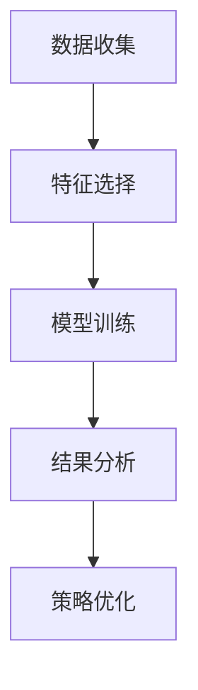
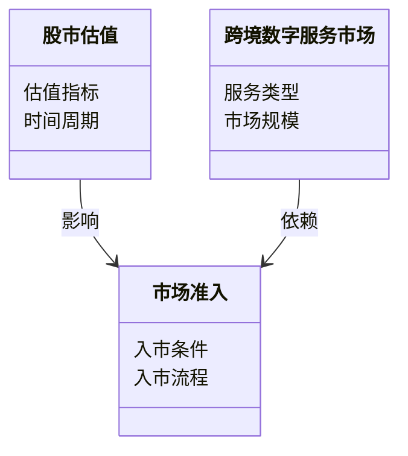
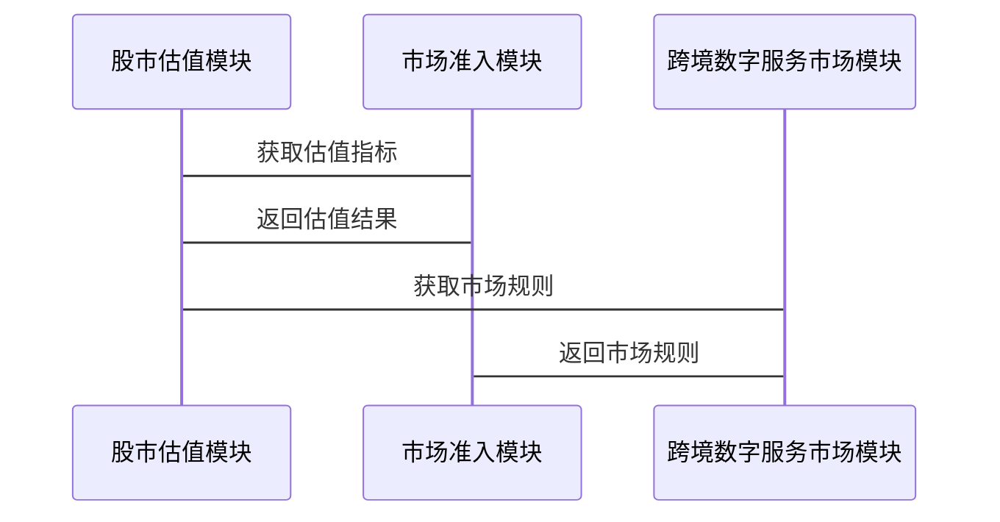

                 


```markdown
# 股市估值对跨境数字服务市场准入的影响

> 关键词：股市估值，跨境数字服务，市场准入，企业价值，数据驱动决策，算法分析

> 摘要：本文深入探讨了股市估值与跨境数字服务市场准入之间的关系，分析了股市估值如何影响企业的市场准入能力，并提出了基于数据驱动的决策方法。通过详细的技术分析和实际案例，本文揭示了如何利用股市估值优化企业的市场准入策略。

---

## 第一部分: 背景介绍

### 第1章: 股市估值与跨境数字服务市场准入的背景

#### 1.1 问题背景
##### 1.1.1 股市估值的核心概念
股市估值是衡量企业价值的重要指标，通常通过市盈率（P/E）、市净率（P/B）等指标来评估企业的市场价值。

##### 1.1.2 跨境数字服务市场的定义与特征
跨境数字服务市场是指跨越国界的数字服务交易市场，其特征包括高技术门槛、强监管环境和快速变化的市场需求。

##### 1.1.3 市场准入的定义与影响
市场准入是指企业进入特定市场的合法途径，其影响包括企业的市场扩展能力、品牌影响力和盈利能力。

#### 1.2 问题描述
##### 1.2.1 股市估值与企业价值的关系
股市估值反映了市场对企业的认可程度，直接影响企业的融资能力和市场扩展能力。

##### 1.2.2 跨境数字服务市场的准入门槛
跨境数字服务市场通常具有较高的准入门槛，包括技术标准、法律法规和市场竞争等。

##### 1.2.3 问题解决的方向与目标
通过优化股市估值，企业可以降低市场准入门槛，提高其在国际市场的竞争力。

#### 1.3 问题解决
##### 1.3.1 股市估值对市场准入的影响路径
股市估值通过影响企业的融资能力、品牌影响力和市场信任度，间接影响市场准入。

##### 1.3.2 跨境数字服务市场的准入策略
企业需要通过技术创新、合规运营和品牌建设来提高市场准入能力。

##### 1.3.3 企业如何通过股市估值优化市场准入
通过提升股市估值，企业可以降低市场准入成本，增强其在国际市场中的竞争力。

#### 1.4 边界与外延
##### 1.4.1 股市估值的边界条件
股市估值受市场环境、企业财务状况和行业竞争格局的影响。

##### 1.4.2 跨境数字服务市场的边界条件
跨境数字服务市场的边界包括法律、政策和技术标准。

##### 1.4.3 相关概念的外延与扩展
股市估值和市场准入的概念在不同行业中具有不同的表现形式。

#### 1.5 概念结构与核心要素
##### 1.5.1 股市估值的核心要素
- 企业财务状况
- 市场供需关系
- 行业竞争格局

##### 1.5.2 跨境数字服务市场的核心要素
- 服务类型
- 市场规模
- 市场规则

##### 1.5.3 市场准入的核心要素
- 入市条件
- 入市流程
- 入市成本

---

## 第二部分: 核心概念与联系

### 第2章: 股市估值与市场准入的核心概念

#### 2.1 核心概念原理
##### 2.1.1 股市估值的原理
股市估值通过对企业财务数据的分析，评估其市场价值。

##### 2.1.2 跨境数字服务市场的原理
跨境数字服务市场通过技术和数据驱动的创新，满足全球客户需求。

##### 2.1.3 市场准入的原理
市场准入通过合规和优化策略，降低企业进入市场的难度。

#### 2.2 概念属性特征对比
##### 2.2.1 股市估值与市场准入的属性对比
| 属性 | 股市估值 | 市场准入 |
|------|----------|----------|
| 评估指标 | P/E, P/B | 入市条件、成本 |
| 影响因素 | 市场供需、企业财务 | 法律法规、行业竞争 |
| 目标 | 企业价值评估 | 市场扩展能力 |

##### 2.2.2 跨境数字服务市场的属性特征
- 全球化特征
- 数字化特征
- 创新驱动特征

##### 2.2.3 市场准入的属性特征
- 法律合规性
- 市场竞争性
- 资源依赖性

#### 2.3 ER实体关系图
```mermaid
er
  entity 股市估值 {
    <属性: 估值指标>
    <属性: 时间周期>
    <属性: 市场类型>
  }

  entity 跨境数字服务市场 {
    <属性: 服务类型>
    <属性: 市场规模>
    <属性: 市场规则>
  }

  entity 市场准入 {
    <属性: 入市条件>
    <属性: 入市流程>
    <属性: 入市成本>
  }

  relationship 股市估值与市场准入 {
    <关联方式: 通过估值影响准入>
  }
```

---

## 第三部分: 算法原理讲解

### 第3章: 股市估值对市场准入影响的算法分析

#### 3.1 算法原理
##### 3.1.1 数据收集与特征选择
通过收集企业的财务数据和市场数据，选择关键特征如P/E、P/B等。

##### 3.1.2 模型训练与验证
使用回归模型或机器学习模型，训练股市估值与市场准入的关系。

##### 3.1.3 结果分析与优化
通过分析模型结果，优化企业的市场准入策略。

#### 3.2 算法流程图


#### 3.3 算法实现
##### 3.3.1 Python代码示例
```python
import pandas as pd
import numpy as np
from sklearn.linear_model import LinearRegression

# 数据加载
data = pd.read_csv('market_access.csv')

# 特征选择
features = ['P/E', 'P/B']
target = 'access_cost'

# 模型训练
model = LinearRegression()
model.fit(data[features], data[target])

# 结果分析
coefficients = model.coef_
intercept = model.intercept_
print(f'回归系数: {coefficients}')
print(f'截距: {intercept}')
```

##### 3.3.2 数学模型与公式
$$ \text{access\_cost} = \beta_0 + \beta_1 \times \text{P/E} + \beta_2 \times \text{P/B} + \epsilon $$

---

## 第四部分: 系统分析与架构设计

### 第4章: 系统分析与架构设计

#### 4.1 问题场景介绍
企业希望通过优化股市估值，降低跨境数字服务市场的准入成本。

#### 4.2 系统功能设计
##### 4.2.1 领域模型


#### 4.3 系统架构设计
##### 4.3.1 系统架构图


#### 4.4 接口与交互设计
##### 4.4.1 接口设计
- 股市数据接口：提供实时股市数据
- 市场规则接口：提供市场准入规则

##### 4.4.2 交互设计


---

## 第五部分: 项目实战

### 第5章: 项目实战

#### 5.1 环境安装
- Python 3.8+
- Pandas, NumPy, Scikit-learn

#### 5.2 核心代码实现
##### 5.2.1 数据处理
```python
import pandas as pd
import numpy as np

# 数据加载
data = pd.read_csv('market_access.csv')

# 特征选择
features = ['P/E', 'P/B']
target = 'access_cost'

# 数据预处理
data = data.dropna()
```

##### 5.2.2 模型实现
```python
from sklearn.linear_model import LinearRegression

model = LinearRegression()
model.fit(data[features], data[target])
```

##### 5.2.3 结果分析
```python
print(f'回归系数: {model.coef_}')
print(f'截距: {model.intercept_}')
```

#### 5.3 实际案例分析
##### 5.3.1 案例描述
某跨境数字服务企业通过优化股市估值，降低了市场准入成本。

##### 5.3.2 数据分析与优化
通过模型分析，企业发现P/E指标对其市场准入成本影响最大。

#### 5.4 项目小结
通过数据驱动的方法，企业可以有效优化其市场准入策略。

---

## 第六部分: 最佳实践与总结

### 第6章: 最佳实践与总结

#### 6.1 最佳实践 tips
- 定期更新模型
- 优化企业财务表现
- 关注市场规则变化

#### 6.2 小结
股市估值与市场准入密切相关，企业应通过数据驱动的方法优化其市场策略。

#### 6.3 注意事项
- 模型结果仅供参考
- 企业需结合实际情况调整策略
- 注意市场环境变化

#### 6.4 拓展阅读
- 《股市估值分析》
- 《数字服务市场研究》

---

## 作者：AI天才研究院/AI Genius Institute & 禅与计算机程序设计艺术 /Zen And The Art of Computer Programming
```

