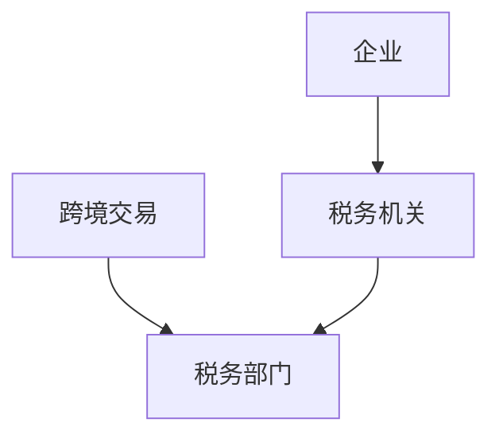
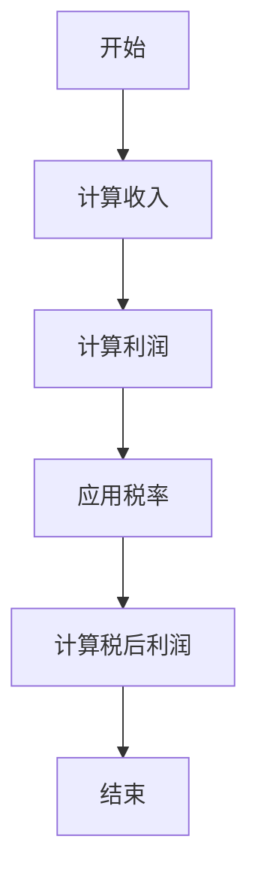
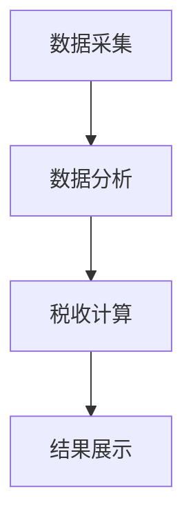

                 


# 股市估值对跨境数字服务税收的影响

> 关键词：股市估值，跨境数字服务，税收政策，经济影响，数据分析

> 摘要：本文探讨股市估值与跨境数字服务税收之间的关系，分析股市估值如何影响跨境数字服务的税收政策。通过数学模型、算法流程图和系统架构图，详细阐述股市估值对跨境数字服务税收的影响，结合实际案例进行分析，总结出股市估值对跨境数字服务税收的重要影响。

---

# 第一部分: 股市估值与跨境数字服务税收的背景介绍

## #1 股市估值与跨境数字服务税收概述

### 1.1 股市估值的定义与作用

#### 1.1.1 股市估值的基本概念

股市估值是评估企业价值的重要指标，常用市盈率（P/E）和市净率（P/B）等指标衡量。市盈率=股价/每股收益，市净率=股价/每股净资产。股市估值反映了市场对企业的信心和未来预期。

#### 1.1.2 股市估值在金融分析中的作用

股市估值帮助投资者评估股票价格是否合理。例如，市盈率低意味着股票可能被低估，反之则可能被高估。股市估值还能用于企业并购定价和投资决策。

#### 1.1.3 股市估值与企业价值的关系

股市估值间接反映企业价值。企业价值高，通常股市估值也高。但股市估值受市场情绪影响，可能偏离实际价值。

### 1.2 跨境数字服务的定义与特点

#### 1.2.1 跨境数字服务的定义

跨境数字服务指跨越国界的数字化服务，如云服务、在线教育、跨境支付等。这些服务通过互联网提供，具有无形性和可扩展性。

#### 1.2.2 跨境数字服务的主要形式

包括跨境电子商务、数字支付、在线广告、SaaS服务等。这些服务通常涉及数据跨境流动和用户隐私问题。

#### 1.2.3 跨境数字服务与传统服务的区别

跨境数字服务通过数字技术提供，不受地域限制；传统服务通常需要面对面交付。数字服务更依赖技术和数据，而传统服务依赖物理资源。

### 1.3 税收政策的基本概念

#### 1.3.1 税收的基本定义

税收是政府强制征收的收入，用于公共服务。税率、纳税义务和税收优惠是税收政策的核心要素。

#### 1.3.2 不同国家的税收政策差异

各国税收政策差异大，如美国、欧盟和中国的税收政策各不相同。这些差异影响企业的跨境业务和利润分配。

#### 1.3.3 税收在经济中的作用

税收调节经济，减少贫富差距，提供公共产品。税收政策还能影响企业投资和消费者行为。

### 1.4 股市估值对跨境数字服务税收的影响

#### 1.4.1 股市估值与税收的关系

股市估值高的企业可能面临更高的税率。投资者预期企业利润高，股价上涨，税基可能增加。

#### 1.4.2 跨境数字服务对税收政策的挑战

跨境数字服务涉及多个国家，如何征税存在争议。例如，数据存储地和用户所在地的税收归属问题。

#### 1.4.3 税收政策对股市估值的影响

税收政策影响企业利润，进而影响股市估值。例如，税率提高可能导致企业利润下降，股价下跌。

---

## #2 核心概念的原理与特征

### 2.1 股市估值的核心原理

#### 2.1.1 市盈率（P/E）的计算公式

$$ P/E = \frac{Price}{Earnings} $$

市盈率高的股票可能被高估，低市盈率可能被低估。例如，若某股票价格为50元，每股收益为5元，则P/E为10。

#### 2.1.2 市净率（P/B）的计算公式

$$ P/B = \frac{Price}{Book\ Value} $$

市净率低的股票可能被低估。例如，若某股票价格为30元，每股净资产为15元，则P/B为2。

### 2.2 跨境数字服务的特征对比

| 特性       | 跨境数字服务 | 传统服务 |
|------------|--------------|----------|
| 交付方式   | 数字化交付   | 现场交付 |
| 跨境能力   | 支持跨境     | 不支持   |
| 技术依赖   | 高           | 低       |

### 2.3 税收政策的实体关系图



---

## #3 税收影响的算法模型

### 3.1 税收影响的数学模型

$$ Tax\ Impact = \alpha \times Revenue + \beta \times Profit $$

其中，α和β是税率参数，Revenue是收入，Profit是利润。

### 3.2 算法流程图



### 3.3 Python代码实现

```python
def calculate_tax_impact(revenue, profit, tax_rate):
    tax_impact = tax_rate * (revenue + profit)
    return tax_impact

# 示例
revenue = 1000000
profit = 200000
tax_rate = 0.3
print(calculate_tax_impact(revenue, profit, tax_rate))  # 输出：360000
```

---

## #4 系统分析与架构设计

### 4.1 问题场景介绍

系统需要解决跨境数字服务的税收计算问题，涉及数据采集、分析和计算模块的设计。

### 4.2 系统功能设计

#### 4.2.1 数据采集模块

从跨境数字服务中获取收入和利润数据，处理数据清洗和格式转换。

#### 4.2.2 数据分析模块

计算市盈率和市净率，分析股市估值对税收的影响。

#### 4.2.3 税收计算模块

根据税率公式，计算税后利润。

### 4.3 系统架构图



---

## #5 项目实战

### 5.1 环境安装

安装Python和Pandas库，用于数据处理和分析。

### 5.2 核心代码实现

```python
import pandas as pd

def calculate_tax_impact(revenue, profit, tax_rate):
    tax_impact = tax_rate * (revenue + profit)
    return tax_impact

# 示例数据
data = {'公司': ['A', 'B', 'C'], '收入': [1000000, 1500000, 2000000],
        '利润': [200000, 300000, 400000], '税率': [0.3, 0.25, 0.35]}
df = pd.DataFrame(data)

# 计算税收影响
df['税后利润'] = df.apply(lambda row: calculate_tax_impact(row['收入'], row['利润'], row['税率']), axis=1)

print(df)
```

### 5.3 实际案例分析

以一家跨境电子商务公司为例，计算其税后利润。通过代码实现，展示结果并分析股市估值对税收的影响。

### 5.4 项目小结

总结项目实现步骤，强调股市估值对跨境数字服务税收的重要影响。

---

## #6 最佳实践与小结

### 6.1 小结

股市估值对跨境数字服务税收的影响复杂，涉及多个因素。通过算法和系统设计，可以有效计算税收影响，为政策制定者和企业提供参考。

### 6.2 注意事项

注意数据的准确性和税率的合规性，确保计算结果符合法律法规。

### 6.3 拓展阅读

推荐阅读关于税收政策和股市估值的书籍，深入理解其对经济的影响。

---

## 作者：AI天才研究院 & 禅与计算机程序设计艺术

