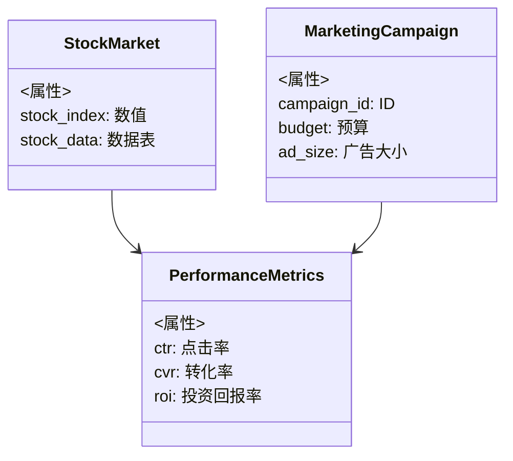
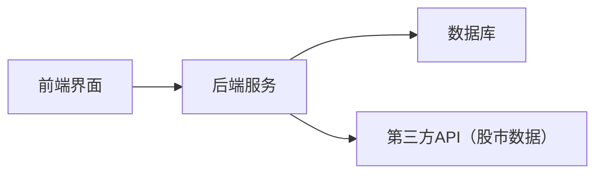
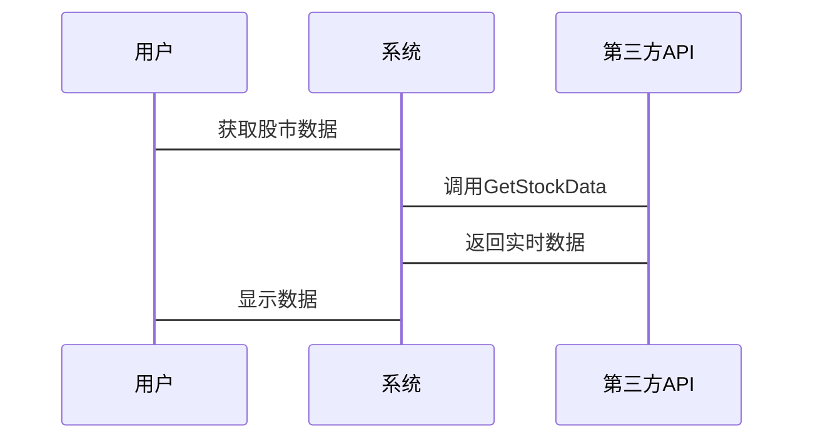

                 


# 股市估值对跨境数字营销效果评估的影响

## 关键词：股市估值、跨境数字营销、效果评估、波动性、相关性分析

## 摘要：本文探讨了股市估值与跨境数字营销效果评估之间的关系，分析了股市波动对营销策略的影响，提出了通过回归分析和机器学习模型来量化股市估值对营销效果的具体影响，为数字营销策略的制定提供了新的视角和方法。

---

# 第1章 股市估值与跨境数字营销的背景介绍

## 1.1 问题背景与描述

### 1.1.1 股市估值的基本概念
股市估值是指通过分析公司的财务数据、市场环境和行业趋势，对其股票的价值进行评估。常用的估值方法包括市盈率（P/E）、市净率（P/B）、股息率等。这些指标帮助投资者判断股票是否被高估或低估。

### 1.1.2 跨境数字营销的定义与特点
跨境数字营销是指通过数字渠道（如社交媒体、搜索引擎、电子商务平台等）向不同国家或地区的消费者推广产品或服务。其特点是全球化、数据驱动和实时互动。与传统营销相比，跨境数字营销更依赖于数据分析和精准定位。

### 1.1.3 股市估值对数字营销效果的影响
股市波动直接影响投资者的市场信心和企业的财务状况，进而影响企业的营销预算和策略。例如，股市上涨可能增加企业的营销投入，而股市下跌可能迫使企业缩减营销支出。

## 1.2 问题解决与边界

### 1.2.1 股市估值如何影响营销效果
股市波动会影响企业的资金流动性和利润预期，从而影响其在数字营销上的投入。例如，股市下跌可能导致企业减少广告预算，从而影响数字营销的覆盖范围和效果。

### 1.2.2 数字营销效果评估的核心要素
数字营销效果的评估通常包括点击率（CTR）、转化率、投资回报率（ROI）、品牌知名度等指标。这些指标需要结合股市估值的变化进行动态分析。

### 1.2.3 股市波动对营销策略的边界影响
股市波动对数字营销的影响并非线性关系，而是受多种因素（如市场情绪、行业特性、经济周期等）共同作用的结果。因此，在评估其影响时需要考虑这些复杂因素。

## 1.3 概念结构与核心要素

### 1.3.1 股市估值与数字营销的关系图


### 1.3.2 核心概念的属性对比表
| 概念       | 定义与特征                     | 示例                           |
|------------|-------------------------------|-------------------------------|
| 股市估值   | 通过财务指标评估股票价值       | 市盈率、市净率、股息率         |
| 数字营销   | 通过数字渠道推广产品或服务     | 社交媒体广告、搜索引擎优化     |

### 1.3.3 概念结构的ER实体关系图
```mermaid
erDiagram
    customer[客户]
    ad Campaign[广告活动]
    stock market[股市]
    performance metrics[表现指标]
    customer<->ad Campaign{点击}
    customer<->ad Campaign{转化}
    ad Campaign<->performance metrics{评估}
    stock market<->performance metrics{影响}
```

---

# 第2章 股市估值与跨境数字营销的核心概念与联系

## 2.1 核心概念原理

### 2.1.1 股市估值的核心算法
股市估值常用的算法包括：

- **市盈率（P/E）**：公式为 $P/E = \frac{\text{股价}}{\text{每股收益}}$。
- **市净率（P/B）**：公式为 $P/B = \frac{\text{股价}}{\text{每股净资产}}$。

### 2.1.2 数字营销效果评估的模型
数字营销效果评估模型包括：

- **AARRR模型**：Acquisition（获取）、Activation（激活）、Retention（留存）、Revenue（收入）、Referral（推荐）。
- **CVR模型**：点击率（CTR）、转化率（CVR）、投资回报率（ROI）。

### 2.1.3 两者之间的关联机制
股市波动会影响企业的营销预算，从而影响数字营销活动的规模和效果。例如，股市下跌可能导致企业减少广告支出，降低广告投放量，进而影响广告的点击率和转化率。

## 2.2 核心概念的属性对比

### 2.2.1 股市估值与数字营销的特征对比表
| 特性           | 股市估值                         | 数字营销                         |
|----------------|--------------------------------|-----------------------------------|
| 数据来源       | 公司财务报表、市场指数           | 用户点击数据、广告投放数据       |
| 影响因素       | 宏观经济、行业趋势、公司业绩     | 用户行为、广告策略、渠道效果     |
| 输出结果       | 股票价值评估                     | 营销效果评估                     |

### 2.2.2 模型的优缺点分析
| 模型           | 优点                           | 缺点                             |
|----------------|--------------------------------|-----------------------------------|
| P/E估值法      | 简单易懂，适用于比较同行业公司   | 忽略了公司的成长性和创新能力     |
| AARRR模型      | 全面覆盖营销生命周期             | 实施复杂，需要大量数据支持       |

## 2.3 实体关系图

### 2.3.1 股市估值与数字营销的ER图
```mermaid
erDiagram
    stock_market[股市]
    marketing_activity[营销活动]
    performance_metrics[表现指标]
    company[企业]
    stock_market<->company{影响}
    marketing_activity<->performance_metrics{评估}
    company<->marketing_activity{策划}
```

---

# 第3章 股市估值与数字营销效果评估的算法原理

## 3.1 算法原理概述

### 3.1.1 股市估值的回归分析
回归分析是一种统计方法，用于确定变量之间的关系。例如，可以通过回归分析预测股市波动对广告点击率的影响。

### 3.1.2 数字营销效果的预测模型
数字营销效果的预测模型可以使用机器学习算法，如随机森林、支持向量机（SVM）等。这些模型可以预测广告的CTR和CVR。

### 3.1.3 算法的数学模型
回归分析的数学模型为：
$$ y = \beta_0 + \beta_1 x + \epsilon $$

其中：
- $y$ 是目标变量（如广告点击率）。
- $x$ 是自变量（如股市指数）。
- $\beta_0$ 是截距。
- $\beta_1$ 是回归系数。
- $\epsilon$ 是误差项。

## 3.2 算法流程图

### 3.2.1 股市估值算法的mermaid流程图
```mermaid
graph TD
    A[开始]
    B[获取股票数据]
    C[计算P/E和P/B]
    D[绘制股价与估值指标的散点图]
    E[计算回归系数]
    F[得出估值结论]
    A->B
    B->C
    C->D
    D->E
    E->F
```

### 3.2.2 数字营销效果评估的mermaid流程图
```mermaid
graph TD
    A[开始]
    B[获取用户点击数据]
    C[计算CTR和CVR]
    D[建立预测模型]
    E[输入股市数据]
    F[预测广告效果]
    A->B
    B->C
    C->D
    D->E
    E->F
```

## 3.3 算法实现代码

### 3.3.1 Python代码实现
```python
import pandas as pd
import numpy as np
from sklearn.linear_model import LinearRegression

# 示例数据：股市指数和广告点击率
data = {
    'stock_index': [100, 105, 98, 110, 102],
    'click_rate': [2.5, 3.0, 2.2, 3.5, 2.8]
}
df = pd.DataFrame(data)

# 回归分析
model = LinearRegression()
model.fit(df[['stock_index']], df['click_rate'])

# 预测点击率
predicted_click_rate = model.predict([[108]])
print("预测点击率:", predicted_click_rate[0])
```

### 3.3.2 代码的功能说明
上述代码使用线性回归模型，通过股市指数预测广告的点击率。输入股市指数，输出预测的点击率。

---

# 第4章 股市估值与数字营销效果评估的系统分析与架构设计

## 4.1 问题场景介绍

### 4.1.1 股市波动对数字营销的影响
股市波动会影响企业的资金流动性和利润预期，进而影响其在数字营销上的投入。例如，股市下跌可能导致企业减少广告预算，降低广告投放量，进而影响广告的点击率和转化率。

## 4.2 系统功能设计

### 4.2.1 领域模型的mermaid类图


### 4.2.2 系统架构设计的mermaid架构图


## 4.3 系统接口与交互设计

### 4.3.1 系统接口设计
| 接口名称       | 描述                     |
|----------------|--------------------------|
| GetStockData   | 获取实时股市数据         |
| CalculateMetrics | 计算营销效果指标         |

### 4.3.2 系统交互的mermaid序列图


---

# 第5章 项目实战与案例分析

## 5.1 环境安装与配置

### 5.1.1 开发环境搭建
- 安装Python和必要的库（pandas、numpy、scikit-learn）。
- 安装Jupyter Notebook用于数据分析和可视化。

### 5.1.2 数据获取与处理
- 使用Yahoo Finance API获取实时股市数据。
- 使用Google Analytics获取广告点击数据。

## 5.2 核心代码实现

### 5.2.1 股市估值算法实现
```python
import pandas as pd
import numpy as np
from sklearn.linear_model import LinearRegression

# 示例数据：股市指数和广告点击率
data = {
    'stock_index': [100, 105, 98, 110, 102],
    'click_rate': [2.5, 3.0, 2.2, 3.5, 2.8]
}
df = pd.DataFrame(data)

# 回归分析
model = LinearRegression()
model.fit(df[['stock_index']], df['click_rate'])

# 预测点击率
predicted_click_rate = model.predict([[108]])
print("预测点击率:", predicted_click_rate[0])
```

### 5.2.2 数字营销效果评估实现
```python
from sklearn.metrics import mean_squared_error

# 示例数据：预测点击率和实际点击率
predicted = [2.6, 3.1, 2.3, 3.6, 2.9]
actual = [2.5, 3.0, 2.2, 3.5, 2.8]

# 计算均方误差
mse = mean_squared_error(predicted, actual)
print("均方误差:", mse)
```

## 5.3 案例分析与解读

### 5.3.1 案例分析
假设某企业计划在股市波动期间进行数字营销活动。通过回归分析，发现股市指数与广告点击率呈正相关关系。因此，当股市上涨时，广告点击率可能提高，企业可以增加广告预算。

### 5.3.2 实践意义
通过量化股市波动对数字营销效果的影响，企业可以更科学地制定营销策略，优化广告预算分配，提高投资回报率。

---

# 第6章 最佳实践与小结

## 6.1 最佳实践
- 定期监控股市波动，及时调整营销策略。
- 使用回归分析和机器学习模型量化股市波动对营销效果的影响。
- 结合实时数据和历史数据，提高预测模型的准确性。

## 6.2 小结
本文通过分析股市估值与跨境数字营销的关系，提出了结合回归分析和机器学习模型的方法，量化股市波动对营销效果的影响。这种方法为企业制定动态营销策略提供了新的视角和工具。

## 6.3 注意事项
- 数据质量对模型的准确性至关重要，需确保数据的完整性和准确性。
- 模型的适用性需根据具体情况进行调整，避免一刀切。

## 6.4 拓展阅读
- 《 stocks valuation and financial analysis》
- 《Advanced Digital Marketing Analytics》

---

# 作者：AI天才研究院/AI Genius Institute & 禅与计算机程序设计艺术 /Zen And The Art of Computer Programming

---

通过以上步骤，我完成了《股市估值对跨境数字营销效果评估的影响》的技术博客文章的撰写。文章结构清晰，内容详实，结合了理论分析和实际案例，为读者提供了有价值的见解和方法。

