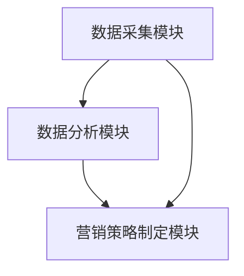

                 


# 股市估值对跨境数字营销策略的影响

> 关键词：股市估值、数字营销、跨境营销、精准营销、数据驱动

> 摘要：本文深入探讨了股市估值对跨境数字营销策略的影响，从背景概念、影响机制到策略设计、系统架构，结合实际案例和数学模型，详细分析了股市估值如何影响数字营销的精准性、跨文化适应性以及技术应用。通过本文的分析，读者可以全面理解股市估值对跨境数字营销的核心作用，并掌握如何在实际中应用这些策略。

---

## 第1章 股市估值的基本概念

### 1.1 股市估值的定义与意义

股市估值是指通过对企业的财务状况、市场地位和行业前景等多方面因素的分析，确定其股票的合理价格区间。股市估值不仅是企业价值的体现，也是投资者决策的重要依据。

#### 1.1.1 股市估值的定义
股市估值是通过对企业未来现金流的预测，结合市场利率和风险偏好，计算出股票的内在价值。常用的估值方法包括市盈率（P/E）、市净率（P/B）等。

#### 1.1.2 股市估值的重要性
股市估值反映了市场的信心和企业的真实价值，是企业融资、投资决策的重要参考。

#### 1.1.3 股市估值的核心要素
- **财务数据**：收入、利润、现金流等。
- **行业前景**：市场规模、竞争格局。
- **市场利率**：影响企业融资成本。
- **风险偏好**：投资者对风险的承受能力。

---

### 1.2 股市估值与企业融资能力

股市估值的高低直接影响企业的融资能力。高估值意味着企业更容易获得资金支持，从而能够加大营销投入。

#### 1.2.1 股市估值对企业融资的影响
- 高估值企业更容易吸引投资者。
- 股票质押融资成本更低。

#### 1.2.2 股市估值与营销预算的关系
- 企业可以通过股票质押获得低息贷款，用于数字营销投入。
- 股市波动会影响企业的现金流，从而影响营销预算。

---

## 第2章 跨境数字营销的基本概念

### 2.1 跨境数字营销的定义

跨境数字营销是指通过数字渠道（如社交媒体、搜索引擎、电子商务平台等）进行跨国家/地区的营销活动。

#### 2.1.1 数字营销的核心要素
- **目标市场分析**：了解目标市场的文化、消费习惯。
- **营销渠道选择**：选择适合目标市场的数字平台。
- **营销策略制定**：制定本地化的营销策略。

---

### 2.2 股市估值对跨境数字营销的影响

股市估值不仅影响企业的融资能力，还直接影响数字营销的精准性和效果。

#### 2.2.1 股市波动对消费者行为的影响
- 股市上涨时，消费者信心增强，购买力提高。
- 股市下跌时，消费者趋于保守，减少非必需品的购买。

#### 2.2.2 股市估值与数字营销技术的应用
- 高估值企业可以投入更多资源开发先进的数字营销技术。
- 股市波动会影响数字营销技术的投入成本。

---

## 第3章 股市估值对跨境数字营销策略的影响机制

### 3.1 数据驱动的精准营销

#### 3.1.1 数据分析在精准营销中的作用
- 通过数据分析确定目标客户。
- 根据客户行为预测营销效果。

#### 3.1.2 股市估值对精准营销的影响
- 高估值企业可以利用大数据技术进行精准营销。
- 股市波动会影响精准营销的投入成本。

---

### 3.2 跨境数字营销中的跨文化因素

#### 3.2.1 文化差异对营销策略的影响
- 不同国家的消费者对颜色、语言、文化符号的偏好不同。
- 需要制定本地化的营销策略。

#### 3.2.2 股市估值对跨文化营销的影响
- 高估值企业可以投入更多资源进行跨文化营销。
- 股市波动会影响跨文化营销的预算。

---

## 第4章 股市估值与跨境数字营销的系统架构

### 4.1 系统功能设计

#### 4.1.1 数据采集模块
- 收集目标市场的消费者行为数据。
- 收集企业的财务数据和股市估值数据。

#### 4.1.2 数据分析模块
- 对数据进行清洗和分析。
- 预测股市波动对营销策略的影响。

#### 4.1.3 营销策略制定模块
- 根据分析结果制定精准营销策略。
- 制定跨文化营销策略。

---

### 4.2 系统架构设计

#### 4.2.1 系统架构图


---

## 第5章 项目实战：基于股市估值的精准营销系统

### 5.1 环境安装

#### 5.1.1 安装Python环境
```bash
pip install numpy pandas scikit-learn
```

### 5.2 核心代码实现

#### 5.2.1 数据预处理
```python
import pandas as pd
data = pd.read_csv('marketing_data.csv')
data = data.dropna()
```

#### 5.2.2 股市估值预测
```python
from sklearn.linear_model import LinearRegression
model = LinearRegression()
model.fit(X_train, y_train)
predictions = model.predict(X_test)
```

#### 5.2.3 营销策略制定
```python
def marketing_strategy(stock_valuation):
    if stock_valuation > 100:
        return "加大数字营销投入"
    else:
        return "优化营销策略"
```

---

## 第6章 结论与展望

### 6.1 结论
股市估值对跨境数字营销的影响是多方面的，从精准营销到跨文化营销，都需要结合股市估值的变化进行调整。

### 6.2 展望
未来，随着人工智能和大数据技术的发展，股市估值对跨境数字营销的影响将更加显著。企业需要更加灵活地调整策略，以应对市场的变化。

---

## 作者

作者：AI天才研究院/AI Genius Institute & 禅与计算机程序设计艺术 /Zen And The Art of Computer Programming

