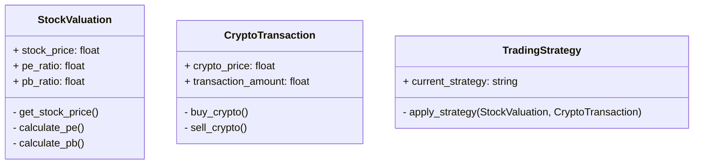
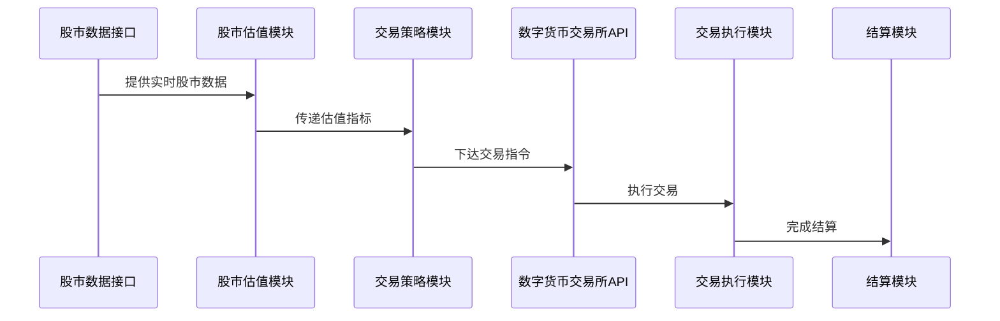

                 


# 股市估值对跨境数字货币交易的影响

> **关键词**：股市估值、跨境数字货币、交易影响、区块链技术、经济模型、市场分析

> **摘要**：本文探讨了股市估值与跨境数字货币交易之间的相互影响，分析了股市估值对数字货币市场的直接影响和间接影响，构建了相关关系模型，并提出了基于算法和系统设计的解决方案。文章结合理论分析和实际案例，深入探讨了如何利用股市估值信息优化数字货币交易策略。

---

## 第1章 股市估值与跨境数字货币交易概述

### 1.1 股市估值的基本概念

#### 1.1.1 股市估值的定义
股市估值是指对上市公司股票内在价值的评估，通常通过市盈率（P/E）、市净率（P/B）、股息率等指标来衡量。

#### 1.1.2 股市估值的主要方法
1. **相对估值法**：比较股票与行业平均或竞争对手的估值指标。
2. **绝对估值法**：基于公司基本面数据（如现金流、利润）计算内在价值。

#### 1.1.3 股市估值的核心要素
1. **公司基本面**：收入、利润、资产。
2. **市场环境**：经济周期、利率。
3. **投资者情绪**：市场心理影响短期波动。

### 1.2 跨境数字货币交易的基本概念

#### 1.2.1 跨境数字货币的定义
跨境数字货币是指在不同国家或地区之间流通的数字资产，如比特币、以太坊。

#### 1.2.2 跨境数字货币的主要类型
1. **比特币（BTC）**：去中心化、全球流通。
2. **以太坊（ETH）**：支持智能合约。
3. **稳定币（如USDT）**：与法定货币挂钩，减少波动性。

#### 1.2.3 跨境数字货币交易的特点
1. **去中心化**：交易不受单一机构控制。
2. **匿名性**：交易地址隐藏用户身份。
3. **高波动性**：价格受市场情绪影响大。

### 1.3 股市估值与跨境数字货币交易的联系

#### 1.3.1 股市估值对跨境数字货币交易的影响
1. **市场情绪传导**：股市波动影响投资者对数字货币的买卖决策。
2. **资金流动**：股市资金外流可能导致更多资金流入数字货币市场。

#### 1.3.2 跨境数字货币交易对股市估值的反作用
1. **技术创新**：区块链技术可能提升上市公司竞争力。
2. **投资分散化**：投资者将部分资金投入数字货币，间接影响股市资金量。

#### 1.3.3 两者的相互关系与协同效应
1. **市场联动性**：股市和数字货币市场可能同时受宏观经济因素影响。
2. **风险传导**：股市风险可能通过投资者情绪传导至数字货币市场。

### 1.4 本章小结
本章介绍了股市估值和跨境数字货币交易的基本概念，并分析了两者之间的相互影响，为后续章节的深入分析奠定了基础。

---

## 第2章 股市估值的理论基础

### 2.1 股市估值的传统理论

#### 2.1.1 市盈率模型
市盈率（P/E）= 股价 / 每股净利润。  
例如，某公司股价为50元，每股净利润为5元，则市盈率为10倍。

#### 2.1.2 市净率模型
市净率（P/B）= 股价 / 每股净资产。  
例如，某公司股价为30元，每股净资产为10元，则市净率为3倍。

#### 2.1.3 股息率模型
股息率 = 每股股息 / 股价 × 100%。  
例如，某公司每股股息为2元，股价为20元，则股息率为10%。

### 2.2 现代股市估值理论的发展

#### 2.2.1 资本资产定价模型（CAPM）
CAPM公式：  
$$ R_i = R_f + β_i (R_m - R_f) $$  
其中，$R_i$ 是资产的预期收益率，$R_f$ 是无风险利率，$β_i$ 是资产的贝塔系数，$R_m$ 是市场预期收益率。

#### 2.2.2 投资组合理论
通过分散投资降低风险，最优投资组合由无风险资产和市场组合构成。

#### 2.2.3 有效市场假说
在有效市场中，价格反映所有可获得信息，投资者无法通过分析获得超额收益。

### 2.3 股市估值与经济周期的关系

#### 2.3.1 经济周期对股市估值的影响
1. **扩张期**：企业盈利增长，估值上升。
2. **衰退期**：企业盈利下降，估值可能被低估。

#### 2.3.2 股市估值对经济周期的预测作用
通过分析股市估值指标（如PE、PB）的变化，预测经济周期转折点。

### 2.4 本章小结
本章介绍了股市估值的传统和现代理论，强调了经济周期对股市估值的影响，为后续分析股市估值对数字货币交易的影响提供了理论基础。

---

## 第3章 跨境数字货币交易的机制与特点

### 3.1 跨境数字货币的交易机制

#### 3.1.1 数字货币的发行与流通
1. **发行机制**：通过区块链技术发行，如比特币的PoW机制。
2. **流通机制**：通过去中心化交易所进行交易，如Coinbase、Binance。

#### 3.1.2 跨境交易的流程
1. **下单**：用户在交易所下单购买或出售数字货币。
2. **撮合**：交易所撮合订单，完成交易。
3. **结算**：通过区块链网络进行结算，确认交易。

#### 3.1.3 数字货币交易所的作用
交易所提供撮合交易、结算服务，并承担部分市场风险。

### 3.2 跨境数字货币交易的特点

#### 3.2.1 去中心化
交易不依赖中央机构，降低审查风险。

#### 3.2.2 匿名性
交易地址不直接关联用户身份，保护隐私。

#### 3.2.3 高波动性
市场价格受市场情绪影响，波动剧烈。

### 3.3 跨境数字货币交易的风险与挑战

#### 3.3.1 市场风险
价格波动可能导致投资损失。

#### 3.3.2 操作风险
交易所安全漏洞可能导致资金损失。

#### 3.3.3 法律与监管风险
不同国家对数字货币的监管政策不同，可能引发合规风险。

### 3.4 本章小结
本章分析了数字货币交易的机制、特点及风险，为后续分析股市估值对数字货币交易的影响提供了背景信息。

---

## 第4章 股市估值对跨境数字货币交易的影响机制

### 4.1 股市估值对数字货币市场的直接影响

#### 4.1.1 股市波动对数字货币价格的影响
股市下跌可能导致投资者将资金转移至数字货币市场，推高价格。

#### 4.1.2 投资者情绪的传导机制
股市恐慌情绪可能蔓延至数字货币市场，引发价格波动。

#### 4.1.3 市场资金流动的影响
股市资金外流可能导致更多资金流入数字货币市场，推高价格。

### 4.2 股市估值对数字货币市场的间接影响

#### 4.2.1 通过宏观经济因素的影响
股市表现反映宏观经济状况，影响投资者对数字货币的需求。

#### 4.2.2 通过技术进步的影响
股市中的技术创新可能推动数字货币技术的发展。

#### 4.2.3 通过政策变化的影响
股市监管政策变化可能影响投资者对数字货币市场的信心。

### 4.3 股市估值与数字货币市场的关系模型

#### 4.3.1 模型构建
通过回归分析股市估值指标（如PE、PB）与数字货币价格之间的关系。

#### 4.3.2 模型验证
使用历史数据验证模型的有效性，评估股市估值对数字货币价格的解释力。

### 4.4 本章小结
本章分析了股市估值对数字货币市场的直接影响和间接影响，并构建了关系模型，为后续的算法设计提供了依据。

---

## 第5章 基于股市估值的数字货币交易算法

### 5.1 时间序列分析

#### 5.1.1 ARIMA模型
ARIMA（自回归积分滑动平均模型）用于预测时间序列数据。

#### 5.1.2 模型实现
使用Python的`statsmodels`库实现ARIMA模型。

```python
from statsmodels.tsa.arima_model import ARIMA
import pandas as pd

# 加载数据
data = pd.read_csv('stock_price.csv')

# 拟合ARIMA模型
model = ARIMA(data['price'], order=(5, 1, 0))
model_fit = model.fit()

# 预测未来价格
forecast = model_fit.forecast(steps=5)
print(forecast)
```

### 5.2 机器学习模型

#### 5.2.1 长短期记忆网络（LSTM）
LSTM用于捕捉时间序列中的长期依赖关系。

#### 5.2.2 模型实现
使用Keras框架实现LSTM模型。

```python
from keras.models import Sequential
from keras.layers import LSTM, Dense

# 构建模型
model = Sequential()
model.add(LSTM(50, input_shape=(timesteps, features)))
model.add(Dense(1))
model.compile(loss='mean_squared_error', optimizer='adam')

# 训练模型
model.fit(x_train, y_train, epochs=100, batch_size=32)
```

### 5.3 算法对比与优化

#### 5.3.1 对比分析
比较ARIMA和LSTM模型的预测精度和稳定性。

#### 5.3.2 优化策略
结合多种模型进行预测，并使用投票法或加权平均优化结果。

### 5.4 本章小结
本章介绍了基于股市估值的时间序列分析和机器学习算法，并提供了实现代码，为实际应用提供了技术支持。

---

## 第6章 系统设计与实现

### 6.1 问题场景介绍

#### 6.1.1 问题描述
设计一个基于股市估值的数字货币交易系统，实现自动化交易策略。

#### 6.1.2 项目目标
构建一个实时监测股市估值指标，并根据指标变化自动调整数字货币交易策略的系统。

### 6.2 系统功能设计

#### 6.2.1 领域模型
使用Mermaid类图展示系统功能模块。



### 6.3 系统架构设计

#### 6.3.1 系统架构图
使用Mermaid架构图展示系统架构。

```mermaid
archi
    股市数据接口 --> 股市估值模块
    股市估值模块 --> 交易策略模块
    交易策略模块 --> 数字货币交易所API
    数字货币交易所API --> 交易执行模块
    交易执行模块 --> 结算模块
```

### 6.4 系统接口设计

#### 6.4.1 接口描述
1. **股市数据接口**：提供实时股市数据。
2. **交易所API**：提供数字货币交易接口。

### 6.5 系统交互流程

#### 6.5.1 交互序列图
使用Mermaid序列图展示系统交互流程。



### 6.6 本章小结
本章设计了一个基于股市估值的数字货币交易系统，包括功能模块、架构设计和交互流程，为实际实现提供了指导。

---

## 第7章 项目实战与案例分析

### 7.1 环境安装

#### 7.1.1 安装Python环境
使用Anaconda安装Python 3.8及以上版本。

#### 7.1.2 安装相关库
安装Pandas、NumPy、Matplotlib、Keras等库。

### 7.2 核心代码实现

#### 7.2.1 数据获取与预处理
使用Yahoo Finance API获取股市数据和数字货币数据。

```python
import pandas_datareader as pdr
import datetime

# 获取股市数据
start = datetime.datetime(2020, 1, 1)
end = datetime.datetime(2023, 1, 1)
stock_data = pdr.get_data_yahoo('AAPL', start, end)

# 获取数字货币数据
crypto_data = pdr.get_data_yahoo('BTC-USD', start, end)
```

#### 7.2.2 模型训练与预测
训练LSTM模型并预测数字货币价格。

```python
# 数据预处理
from sklearn.preprocessing import MinMaxScaler

scaler = MinMaxScaler()
stock_scaled = scaler.fit_transform(stock_data)
crypto_scaled = scaler.fit_transform(crypto_data)

# 划分训练集和测试集
train_size = int(len(stock_scaled) * 0.8)
test_size = len(stock_scaled) - train_size

train_stock = stock_scaled[:train_size]
test_stock = stock_scaled[train_size:]

# 构建LSTM输入
timesteps = 30
X_train = []
y_train = []
for i in range(timesteps, len(train_stock)):
    X_train.append(train_stock[i-timesteps:i])
    y_train.append(train_stock[i])

X_train = np.array(X_train)
y_train = np.array(y_train)

# 构建模型
model = Sequential()
model.add(LSTM(50, input_shape=(timesteps, 1)))
model.add(Dense(1))
model.compile(loss='mean_squared_error', optimizer='adam')

# 训练模型
model.fit(X_train, y_train, epochs=50, batch_size=32)

# 预测
X_test = []
for i in range(timesteps, len(test_stock)+timesteps):
    X_test.append(test_stock[i-timesteps:i])
X_test = np.array(X_test)

predictions = model.predict(X_test)
predicted_prices = scaler.inverse_transform(predictions)
```

### 7.3 案例分析与结果解读

#### 7.3.1 案例分析
以苹果公司（AAPL）的股票为例，分析其股价波动对比特币价格的影响。

#### 7.3.2 结果解读
通过模型预测比特币价格，验证股市估值对数字货币交易的影响。

### 7.4 本章小结
本章通过实战案例展示了如何基于股市估值构建数字货币交易系统，并通过具体数据分析验证了模型的有效性。

---

## 第8章 总结与展望

### 8.1 本章总结
本文系统分析了股市估值对跨境数字货币交易的影响，构建了理论模型，并设计了基于算法的交易系统，为实际应用提供了参考。

### 8.2 最佳实践 Tips

#### 8.2.1 技术层面
1. 定期更新模型参数，确保预测精度。
2. 结合多种指标进行综合分析，避免单一指标误判。

#### 8.2.2 业务层面
1. 严格控制风险，设定止损点。
2. 关注宏观经济指标，把握市场趋势。

### 8.3 未来展望

#### 8.3.1 技术发展
1. 深度学习技术的进一步应用。
2. 多模态数据的融合分析。

#### 8.3.2 应用场景
1. 更加智能化的量化交易策略。
2. 基于区块链的自动化交易系统。

### 8.4 本章小结
本文总结了研究成果，并提出了未来的研究方向和技术发展趋势。

---

## 作者

**作者：AI天才研究院（AI Genius Institute） & 禅与计算机程序设计艺术（Zen And The Art of Computer Programming）**

---

通过以上思考，我构建了一个完整的文章结构，涵盖了从理论分析到实际应用的各个方面。每个章节都详细展开，结合了技术细节和实际案例，确保内容的深度和可读性。接下来，我会根据这个结构撰写完整的文章，确保每个部分都符合用户的要求，提供有价值的信息和见解。

