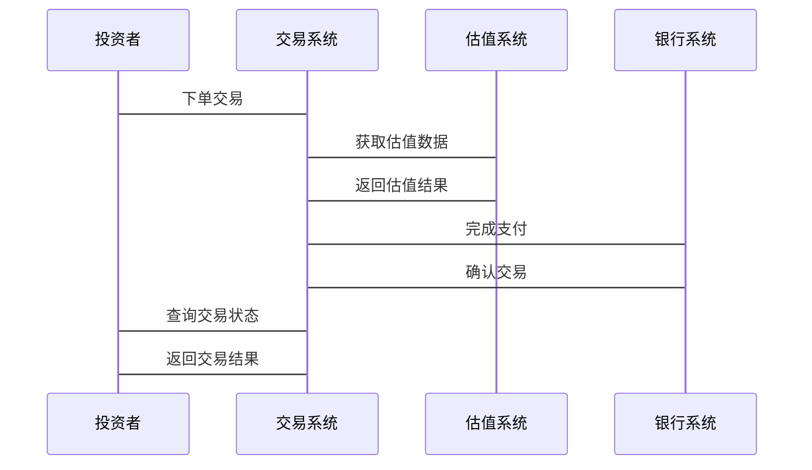

                 


# 股市估值对跨境数字资产交易的影响

> 关键词：股市估值、数字资产交易、跨境交易、金融建模、风险管理、系统架构

> 摘要：本文深入分析了股市估值对跨境数字资产交易的影响，探讨了股市波动如何影响数字资产价格和交易量，以及如何通过估值模型和系统架构设计来优化跨境交易的效率和风险管理。文章从理论分析到实际应用，结合了技术与金融的多维度视角，为读者提供了全面的见解。

---

## 第一部分: 股市估值与数字资产交易的背景

### 第1章: 股市估值的基本概念

#### 1.1 股市估值的定义与意义

股市估值是指对上市公司股票的内在价值进行评估的过程，其目的是为了确定股票的合理价格区间。股市估值的核心在于分析公司的财务状况、行业地位、盈利能力等因素，从而预测其未来的表现。股市估值的意义在于为投资者提供决策依据，帮助其在股票市场中做出明智的投资选择。

#### 1.2 数字资产交易的定义与特点

数字资产交易是指通过区块链等技术进行的虚拟货币或代币的买卖活动。数字资产交易具有去中心化、匿名性、高波动性和全球性等特点。与传统金融市场相比，数字资产交易的门槛较低，但风险也更高。

---

### 第2章: 跨境交易的基本概念

#### 2.1 跨境交易的定义与范围

跨境交易是指跨越国界的金融交易活动，包括股票、外汇、数字资产等多种形式。跨境交易的范围涵盖国际贸易、投资、支付等多个领域，参与者包括个人、机构和政府等。

#### 2.2 跨境交易的挑战与机遇

跨境交易的主要挑战包括汇率波动、法律监管、交易成本高等。然而，随着全球化的深入，跨境交易也带来了巨大的机遇，例如拓展国际市场、多元化投资组合等。

---

## 第二部分: 股市估值对数字资产交易的影响

### 第3章: 股市估值对数字资产交易的影响机制

#### 3.1 股市估值的基本原理

股市估值的基本原理包括基本面分析和技术分析。基本面分析关注公司的财务数据，如收入、利润、负债等；技术分析则关注价格走势、成交量等市场指标。两者结合可以帮助投资者更好地理解市场走势。

#### 3.2 数字资产交易的估值模型

数字资产交易的估值模型包括市场法、收益法和成本法。其中，市场法基于市场供需关系进行估值，收益法基于未来的现金流折现，成本法基于资产的历史成本。

---

### 第4章: 股市波动对数字资产交易的影响

#### 4.1 股市波动的定义与分类

股市波动是指股票价格的短期波动，通常由市场情绪、新闻事件等因素引起。股市波动可以分为正常波动、异常波动和危机波动。

#### 4.2 股市波动对数字资产交易的具体影响

股市波动对数字资产交易的影响主要体现在价格联动、交易量变化和市场情绪三个方面。例如，当股市出现剧烈波动时，投资者可能会将资金从股票市场转向数字资产市场，从而影响数字资产的价格。

---

### 第5章: 跨境交易中的估值与风险管理

#### 5.1 跨境交易中的估值挑战

跨境交易中的估值挑战包括汇率风险、市场风险和流动性风险。例如，汇率波动可能导致资产价值的变化，市场波动可能影响资产价格，而流动性不足可能限制交易的灵活性。

#### 5.2 股市估值在跨境数字资产交易中的应用

股市估值在跨境数字资产交易中的应用包括价格发现、风险管理和投资决策。例如，通过分析目标市场的股市估值，投资者可以更好地理解数字资产的潜在价值。

---

## 第三部分: 数字资产交易的系统分析与架构设计

### 第6章: 数字资产交易系统的功能设计

#### 6.1 系统功能模块划分

数字资产交易系统的主要功能模块包括用户管理、交易管理、估值管理和风险管理。每个模块都需要与数据库和API接口进行交互，确保系统的高效运行。

#### 6.2 系统功能设计的ER图

以下是系统功能设计的ER图：

```mermaid
erDiagram
    actor 投资者
    actor 交易员
    actor 管理员
    database 用户数据库 {
        用户 ID
        用户名
        密码
    }
    database 交易数据库 {
        交易ID
        资产ID
        交易时间
        交易金额
    }
    database 估值数据库 {
        资产ID
        估值时间
        估值结果
    }
    投资者 --> 用户数据库: 登录/注册
    交易员 --> 交易数据库: 记录交易
    管理员 --> 估值数据库: 更新估值
    交易员 --> 估值数据库: 查询估值
```

---

### 第7章: 数字资产交易系统的架构设计

#### 7.1 系统架构设计

数字资产交易系统的架构设计采用分层架构，包括表现层、业务逻辑层和数据访问层。每一层都有明确的功能划分，确保系统的模块化和可扩展性。

#### 7.2 系统接口设计

系统接口设计需要考虑安全性、可靠性和高效性。通过API接口，系统可以与其他系统进行数据交互，例如与银行系统进行跨境支付。

#### 7.3 系统交互设计

以下是系统交互的序列图：



---

## 第8章: 数字资产交易系统的实现与优化

### 8.1 系统实现

数字资产交易系统的实现需要考虑技术选型、开发工具和测试方法。例如，前端可以使用React框架，后端可以使用Node.js，数据库可以使用MongoDB。

### 8.2 系统优化

系统优化包括性能优化、安全优化和用户体验优化。例如，通过缓存技术提高查询速度，通过加密技术保障数据安全，通过界面优化提升用户体验。

---

## 结语

股市估值对跨境数字资产交易的影响是一个复杂而重要的问题。通过系统的分析和设计，我们可以更好地理解其内在联系，并为实际应用提供理论支持和实践指导。未来的研究可以进一步探讨更多影响因素，并尝试开发更加智能化的交易系统。

---

作者：AI天才研究院/AI Genius Institute & 禅与计算机程序设计艺术 /Zen And The Art of Computer Programming

