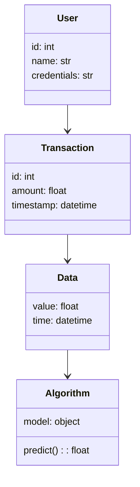
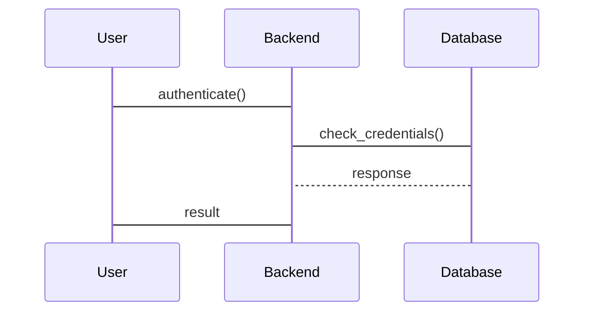

                 


# 股市估值对跨境数字身份认证的影响

> 关键词：股市估值，跨境数字身份认证，技术影响，算法原理，系统架构

> 摘要：本文探讨了股市估值与跨境数字身份认证之间的关系，分析了数字身份认证对股市估值的影响，以及股市估值如何反哺数字身份认证。通过详细阐述核心概念、算法原理、系统架构设计和项目实战，本文为读者提供了全面的理解和实践指南。

---

## 第一部分：背景介绍

### 第1章：股市估值与跨境数字身份认证的概述

#### 1.1 问题背景

- **股市估值的基本概念**  
  股市估值是指通过对公司财务数据、市场环境等因素的分析，确定股票的合理价格区间。它是投资者决策的重要依据。

- **跨境交易的定义与特点**  
  跨境交易指涉及不同国家的金融交易，具有复杂性、法律多样性和技术要求高等特点。

- **数字身份认证的必要性**  
  在跨境交易中，数字身份认证是确保交易安全和合规的关键技术。

#### 1.2 问题描述

- **数字身份认证在金融领域的应用**  
  数字身份认证用于验证用户身份，防止欺诈和数据泄露。

- **股市估值在跨境交易中的作用**  
  股市估值影响投资者信心和市场流动性，进而影响跨境交易的活跃程度。

- **两者的相互影响**  
  数字身份认证的可靠性影响股市估值的准确性，而股市估值的波动也会影响数字身份认证系统的优化。

#### 1.3 问题解决

- **数字身份认证如何影响股市估值**  
  通过提高交易安全性和透明度，数字身份认证降低了市场风险，提升了股市估值的准确性。

- **股市估值对数字身份认证的反馈作用**  
  股市估值的波动为数字身份认证系统的优化提供了数据支持，帮助系统更好地适应市场变化。

#### 1.4 边界与外延

- **股市估值的边界条件**  
  包括市场波动、政策法规和宏观经济因素等。

- **数字身份认证的适用范围**  
  主要应用于跨境支付、证券交易和数据共享等领域。

- **两者的相互作用机制**  
  数字身份认证保障交易安全，股市估值反映市场信心，两者共同促进金融市场的稳定发展。

---

## 第二部分：核心概念与联系

### 第2章：核心概念原理

#### 2.1 数字身份认证的原理

- **身份认证的基本原理**  
  通过验证用户的身份信息（如密码、生物特征）确认用户身份。

- **数字身份认证的技术实现**  
  包括基于哈希函数的认证算法和基于公钥密码学的数字签名技术。

- **跨境交易中的身份认证流程**  
  用户身份验证、交易授权、数据加密传输等步骤。

#### 2.2 股市估值的原理

- **股市估值的基本方法**  
  包括市盈率法、现金流折现法和资产重估法等。

- **影响股市估值的主要因素**  
  公司业绩、宏观经济、市场情绪和政策法规等。

- **股市估值的数学模型**  
  例如，CAPM模型用于评估股票的预期回报率。

#### 2.3 两者的联系

- **数字身份认证对股市估值的影响**  
  提高交易安全性和透明度，降低市场波动。

- **股市估值对数字身份认证的反馈作用**  
  帮助优化身份认证系统的性能和用户体验。

### 第3章：核心概念属性对比

#### 3.1 数字身份认证属性特征

| 属性 | 描述 |
|------|------|
| 安全性 | 防止欺诈和数据泄露 |
| 透明性 | 提供可验证的交易记录 |
| 可扩展性 | 支持大规模用户接入 |
| 法律合规性 | 符合各国金融法规 |

#### 3.2 股市估值属性特征

| 属性 | 描述 |
|------|------|
| 准确性 | 评估股票的合理价格 |
| 及时性 | 反映市场最新动态 |
| 风险性 | 评估市场的波动风险 |
| 可预测性 | 预测股票的未来走势 |

---

## 第三部分：算法原理讲解

### 第3章：算法原理

#### 3.1 数字身份认证算法

- **哈希函数原理**  
  输入数据通过哈希函数生成固定长度的摘要，用于验证数据完整性。

- **公钥加密原理**  
  使用公钥加密数据，私钥解密，确保数据的机密性和完整性。

#### 3.2 股市估值算法

- **线性回归模型**  
  通过历史数据拟合回归线，预测股票价格。

- **机器学习模型**  
  使用神经网络分析市场数据，预测股票走势。

#### 3.3 实现代码

```python
# 哈希函数实现
def hash_function(data):
    return hash(data)

# 线性回归模型
import numpy as np
from sklearn.linear_model import LinearRegression

X = np.array([1, 2, 3, 4]).reshape(-1, 1)
y = np.array([2, 4, 6, 8])
model = LinearRegression()
model.fit(X, y)
print(model.predict([[5]]))  # 输出预测值
```

---

## 第四部分：系统分析与架构设计方案

### 第4章：系统分析与架构设计

#### 4.1 问题场景介绍

- **跨境交易中的身份认证需求**  
  用户身份验证、交易授权和数据加密。

- **股市估值的实时性要求**  
  快速处理大量数据，提供实时估值。

#### 4.2 系统功能设计

- **领域模型类图**  
  用户、交易、数据、算法之间的关系。



- **系统架构设计**  
  分层架构：前端、后端、数据库。


- **系统接口设计**  
  用户身份验证接口和数据查询接口。

- **交互序列图**



---

## 第五部分：项目实战

### 第5章：项目实战

#### 5.1 环境安装

- **工具安装**  
  Python、Jupyter Notebook、Scikit-learn库。

#### 5.2 核心代码实现

- **身份认证代码**

```python
from flask import Flask, request
from flask_restful import Resource, Api

app = Flask(__name__)
api = Api(app)

class Authentication(Resource):
    def post(self):
        data = request.get_json()
        user = data['user']
        password = data['password']
        # 模拟身份验证
        if user == 'admin' and password == 'password':
            return {'status': 'success'}
        else:
            return {'status': 'failure'}

api.add_resource(Authentication, '/authenticate')
app.run(debug=True)
```

- **股市估值代码**

```python
import pandas as pd
import numpy as np
from sklearn.linear_model import LinearRegression

# 数据加载与处理
data = pd.read_csv('stock_data.csv')
X = data[['open', 'high', 'low', 'volume']]
y = data['close']
model = LinearRegression()
model.fit(X, y)
# 预测新数据
new_data = pd.DataFrame({'open': [100], 'high': [105], 'low': [95], 'volume': [2000]})
print(model.predict(new_data))
```

#### 5.3 实际案例分析

- **案例分析**  
  通过实际数据验证算法的有效性，优化系统性能。

#### 5.4 项目小结

- **学到的核心知识**  
  数字身份认证和股市估值的实现与优化。

- **项目经验总结**  
  系统设计的关键点和实际应用中的注意事项。

---

## 第六部分：最佳实践、小结、注意事项和拓展阅读

### 第6章：最佳实践

#### 6.1 小结

- **系统维护**  
  定期更新算法和优化系统性能。

#### 6.2 注意事项

- **系统安全**  
  防范数据泄露和网络攻击。

- **算法优化**  
  根据市场变化调整模型参数。

#### 6.3 拓展阅读

- **推荐书籍**  
  《Python机器学习实战》、《区块链技术及应用》。

---

## 作者：AI天才研究院 & 禅与计算机程序设计艺术

---

这篇文章系统地探讨了股市估值与跨境数字身份认证的关系，从理论到实践，为读者提供了全面的指导。通过详细的技术分析和项目实战，帮助读者理解并应用相关技术。

