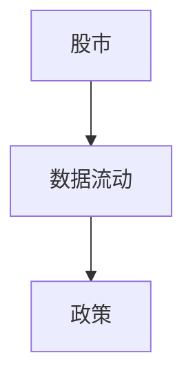
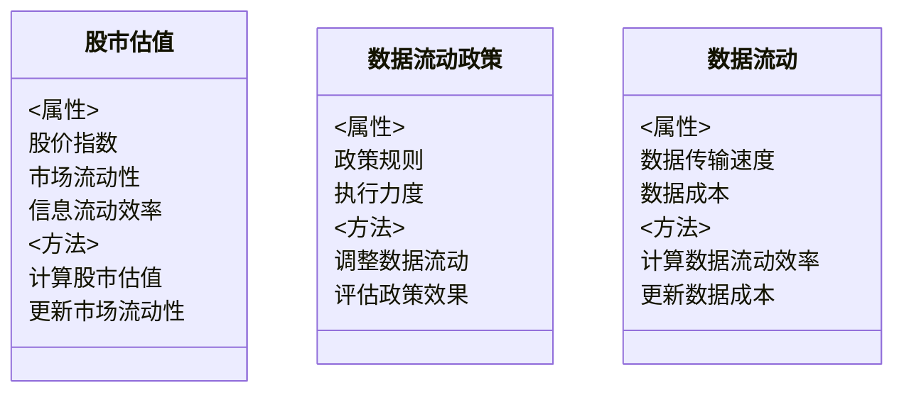
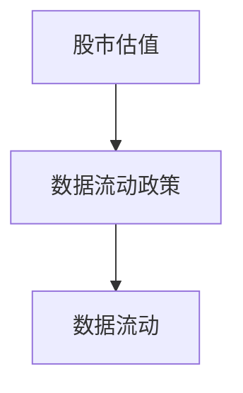
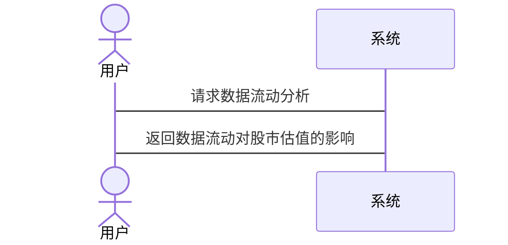

                 

# 股市估值对跨境数据流动政策的影响

## 关键词：股市估值、跨境数据流动、政策影响、数据流动效率、市场信息

## 摘要：本文探讨了股市估值与跨境数据流动政策之间的相互影响。通过分析数据流动对金融市场的影响、政策对数据流动的调节作用，以及两者之间的互动机制，揭示了数据流动政策如何影响股市估值，并进一步探讨了政策设计的优化方向。

---

# 目录大纲

## 第一部分：背景介绍与核心概念

### 第1章：股市估值与跨境数据流动政策的背景

#### 1.1 数据流动对金融市场的影响
- 1.1.1 数据流动的定义与特征
- 1.1.2 数据流动对金融市场的依赖性
- 1.1.3 股市估值的核心要素

#### 1.2 跨境数据流动政策的现状
- 1.2.1 跨境数据流动的基本概念
- 1.2.2 全球主要经济体的跨境数据流动政策
- 1.2.3 政策对数据流动的影响

### 第2章：股市估值与跨境数据流动政策的相互作用

#### 2.1 数据流动对股市估值的影响
- 2.1.1 数据流动的效率与成本
- 2.1.2 数据流动对市场信息的影响
- 2.1.3 数据流动对市场波动的驱动作用

#### 2.2 政策对数据流动的影响
- 2.2.1 数据流动政策的分类
- 2.2.2 政策对数据流动效率的调节作用
- 2.2.3 政策对市场信息流动的约束与促进

#### 2.3 股市估值与政策的互动机制
- 2.3.1 数据流动作为政策工具
- 2.3.2 股市估值作为政策目标
- 2.3.3 互动机制的系统性分析

## 第二部分：核心概念与联系

### 第3章：核心概念的原理与属性

#### 3.1 股市估值的核心原理
- 3.1.1 股市估值的基本公式
- 3.1.2 股市估值的驱动因素
- 3.1.3 股市估值的动态变化

#### 3.2 跨境数据流动政策的核心原理
- 3.2.1 数据流动政策的基本框架
- 3.2.2 数据流动政策的实施机制
- 3.2.3 数据流动政策的经济影响

### 第4章：核心概念的对比与联系

#### 4.1 股市估值与数据流动的对比分析
- 4.1.1 概念属性对比
- 4.1.2 影响因素对比
- 4.1.3 动态变化对比

#### 4.2 数据流动政策与股市估值的联系
- 4.2.1 政策对数据流动的影响
- 4.2.2 数据流动对股市估值的影响
- 4.2.3 政策与数据流动的互动机制

### 第5章：实体关系与架构图

#### 5.1 实体关系图

---

## 第三部分：算法原理与数学模型

### 第6章：算法原理与数学模型

#### 6.1 数据流动对股市估值影响的量化模型
- 6.1.1 数据流动效率的度量
- 6.1.2 数据流动成本的计算
- 6.1.3 市场信息流动的数学模型

#### 6.2 算法实现与代码解析
- 6.2.1 使用博弈论模型分析数据流动的优化路径
- 6.2.2 网络流模型实现数据流动效率的计算
- 6.2.3 Python代码实现数据流动对股市估值影响的模拟

### 第7章：系统分析与架构设计

#### 7.1 系统功能设计
- 7.1.1 领域模型类图

#### 7.2 系统架构设计

#### 7.3 系统接口设计与交互

## 第四部分：项目实战与案例分析

### 第8章：项目实战与案例分析

#### 8.1 环境安装与数据准备
- 安装Python与相关库
- 数据收集与预处理

#### 8.2 核心实现与代码解读
- 数据流动模拟代码
- 股市估值计算代码

#### 8.3 案例分析与解读
- 案例：欧盟GDPR对跨境数据流动的影响
- 数据流动政策调整对股市估值的具体影响

## 第五部分：最佳实践与总结

### 第9章：最佳实践与总结

#### 9.1 小结
- 核心观点总结
- 关键启示

#### 9.2 注意事项
- 政策实施中的潜在风险
- 数据流动效率与成本的平衡

#### 9.3 扩展阅读
- 推荐相关书籍与论文
- 行业最新动态与趋势

---

## 作者：AI天才研究院/AI Genius Institute & 禅与计算机程序设计艺术 /Zen And The Art of Computer Programming

