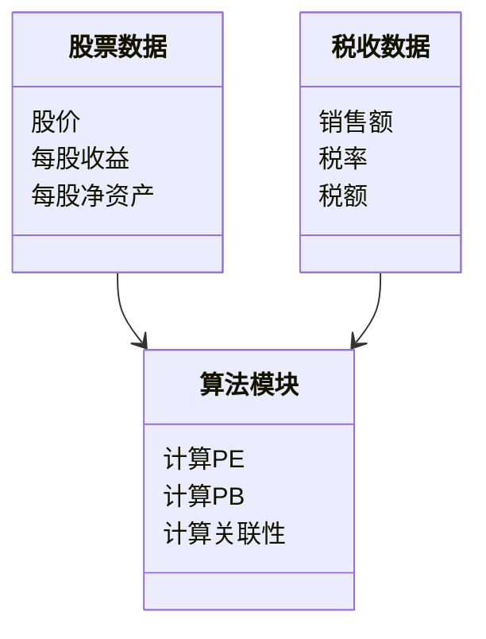

                 


# 股市估值对跨境电子商务税收的影响

## 关键词：股市估值、跨境电商、税收、算法、数学模型、系统架构

## 摘要：本文探讨股市估值与跨境电子商务税收之间的关系，分析其影响因素，提供算法模型和系统架构设计，帮助理解两者相互作用的机制。

---

## 第一章：背景介绍

### 1.1 股市估值的基本概念

股市估值是通过特定指标（如市盈率、市净率）评估公司价值的过程。常用方法包括PE、PB和现金流折现法。

- **市盈率（PE）**：股价与每股收益的比率，衡量市场对公司盈利能力的预期。
- **市净率（PB）**：股价与每股净资产的比率，反映公司资产价值。
- **现金流折现法**：通过未来现金流的现值评估企业价值。

### 1.2 跨境电子商务的基本概念

跨境电商通过互联网在全球范围内进行商品和服务交易，涉及多个环节和税收政策。

- **主要模式**：B2B、B2C、C2C。
- **税收特点**：涉及增值税、消费税，且不同国家政策差异大。

### 1.3 股市估值与跨境电子商务税收的关联性

股市估值影响投资者对跨境电商公司的投资决策，进而影响其税务规划和政策。

- **直接影响**：估值波动影响企业融资能力，影响税务负担。
- **间接影响**：税收政策影响企业利润，影响股市估值。

---

## 第二章：核心概念与联系

### 2.1 股市估值的核心原理

股市估值的核心是通过财务指标和市场情绪评估公司价值。

- **市盈率算法**：计算公式为PE = 股价 / 每股收益。
- **市净率算法**：计算公式为PB = 股价 / 每股净资产。
- **现金流折现法**：通过DCF模型评估公司未来现金流的现值。

### 2.2 跨境电子商务税收的核心原理

跨境电商税收涉及多个环节，包括进口关税、增值税和消费税。

- **征收方式**：根据不同国家政策，可能采用源泉扣缴或事后补缴。
- **计算方法**：销售额乘以税率，扣除相关成本后的应纳税所得额。

### 2.3 股市估值与跨境电子商务税收的联系

两者相互影响，股市估值反映企业价值，而税收政策影响企业盈利能力和估值。

- **模型**：建立数学模型，将股市估值与税收政策相关联，分析其相互作用。

---

## 第三章：算法原理讲解

### 3.1 股市估值算法

#### 市盈率算法

```python
# 示例代码：计算市盈率
import pandas as pd

# 假设df包含股票数据，包含'Close'和'Earnings Per Share'列
df['PE'] = df['Close'] / df['Earnings Per Share']
```

#### 市净率算法

```python
# 示例代码：计算市净率
df['PB'] = df['Close'] / df['Book Value Per Share']
```

### 3.2 跨境电子商务税收算法

#### 销售额计算法

```python
# 示例代码：计算应纳税额
sales = 1000000  # 销售额
tax_rate = 0.07  # 增值税率7%
tax = sales * tax_rate
```

### 3.3 股市估值与跨境电子商务税收的联合算法

#### 数据输入与清洗

```python
import pandas as pd
import numpy as np

# 假设df包含股票数据和跨境电商数据
df = pd.read_csv('data.csv')
df = df.dropna()  # 删除缺失值
```

#### 关联计算

```python
# 示例代码：计算关联影响
correlation = np.corrcoef(df['PE'], df['TaxRate'])[0, 1]
print(f"PE与税率的相关性为：{correlation}")
```

---

## 第四章：数学公式与模型

### 4.1 股市估值公式

- 市盈率公式：$$PE = \frac{\text{股价}}{\text{每股收益}}$$
- 现金流折现公式：$$\text{企业价值} = \sum_{t=1}^{n} \frac{\text{现金流}_t}{(1 + r)^t}$$

### 4.2 跨境电子商务税收公式

- 增值税计算：$$\text{税额} = \text{销售额} \times \text{税率}$$
- 应纳税所得额：$$\text{应纳税所得额} = \text{收入} - \text{成本} - \text{费用}$$

---

## 第五章：系统分析与架构设计

### 5.1 系统功能设计

#### 领域模型



---

## 第六章：项目实战

### 6.1 环境安装

- **工具**：Python、Pandas、Matplotlib
- **步骤**：安装必要的库，如`pip install pandas numpy matplotlib`

### 6.2 核心实现

```python
import pandas as pd
import matplotlib.pyplot as plt

# 数据加载
df = pd.read_csv('data.csv')

# 计算PE和PB
df['PE'] = df['Close'] / df['Earnings']
df['PB'] = df['Close'] / df['Book Value']

# 可视化
df.plot(kind='scatter', x='PE', y='TaxRate')
plt.show()
```

### 6.3 案例分析

分析某跨境电商企业的PE和TaxRate关系，展示如何通过算法优化税务规划，提升企业估值。

---

## 第七章：最佳实践

### 7.1 注意事项

- 数据质量：确保数据清洗和处理。
- 模型选择：根据具体情况选择合适的算法。
- 税收政策：关注政策变化，及时调整税务规划。

### 7.2 拓展阅读

- 推荐书籍：《企业税务规划与财务管理》、《股市投资分析》。

---

## 作者：AI天才研究院/AI Genius Institute & 禅与计算机程序设计艺术 /Zen And The Art of Computer Programming

