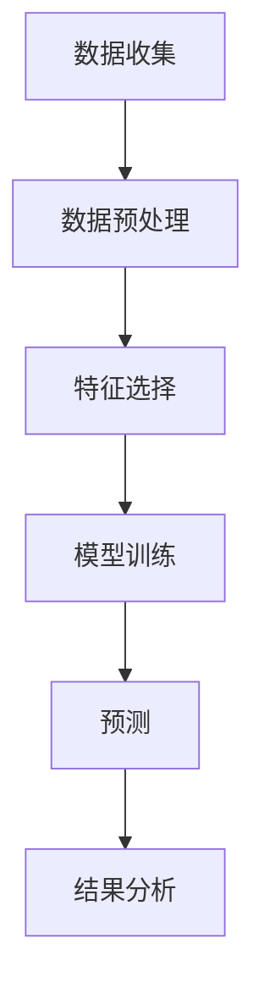

                 


# 股市估值差异对国际人才流动的影响

> 关键词：国际人才流动、股市估值差异、人才流动模型、企业估值、人才吸引力、全球化人才流动  
> 摘要：本文探讨了股市估值差异如何影响国际人才流动，通过构建理论模型和实证分析，揭示了估值差异对人才流动的驱动机制，并提出了优化策略。

---

## 第一部分：背景介绍

### 第1章：股市估值差异对国际人才流动的影响概述

#### 1.1 问题背景

- **1.1.1 股市估值的基本概念**
  股市估值是通过市盈率（P/E）、市净率（P/B）等指标衡量公司价值的过程，反映了市场对公司的看法。
  
- **1.1.2 国际人才流动的定义与特征**
  国际人才流动指人才跨国流动，受经济、文化、政策等多种因素影响，具有跨文化性和地域性特点。

- **1.1.3 股市估值与人才流动的关系**
  股市估值影响企业吸引力，进而影响人才流动，形成双向互动。

#### 1.2 问题描述

- **1.2.1 股市估值差异的形成机制**
  包括市场效率、公司业绩和宏观经济因素。

- **1.2.2 国际人才流动的驱动因素**
  包括薪酬、职业发展、工作环境和区域经济差异。

- **1.2.3 影响路径**
  估值差异通过影响人才期望和企业吸引力，驱动人才流动。

#### 1.3 问题解决

- **1.3.1 理论模型**
  构建估值差异与人才流动的因果关系模型。

- **1.3.2 数据分析方法**
  使用回归分析和面板数据分析。

- **1.3.3 研究假设**
  股市估值差异显著影响人才流动。

#### 1.4 边界与外延

- **1.4.1 研究范围**
  限定于主要经济体和行业。

- **1.4.2 相关概念区分**
  区分人才流动与移民流动。

- **1.4.3 研究局限性**
  样本选择和数据限制。

---

## 第二部分：核心概念与联系

### 第2章：核心概念原理

#### 2.1 股市估值的原理

- **2.1.1 市盈率（P/E）**
  $$P/E = \frac{\text{股价}}{\text{每股收益}}$$
  反映市场对公司盈利能力的预期。

- **2.1.2 市净率（P/B）**
  $$P/B = \frac{\text{股价}}{\text{每股净资产}}$$
  适用于资产密集型行业。

- **2.1.3 股东权益回报率（ROE）**
  $$ROE = \frac{\text{净利润}}{\text{股东权益}}$$
  衡量公司使用股东资金的效率。

#### 2.2 人才流动的驱动因素

- **2.2.1 薪酬水平**
  包括基本工资和福利。

- **2.2.2 职业发展机会**
  包括晋升和培训机会。

- **2.2.3 工作环境**
  包括企业文化和发展空间。

- **2.2.4 经济与生活成本**
  影响人才流动的净流入。

#### 2.3 股市估值与人才流动的关联机制

- **2.3.1 估值差异影响人才期望**
  高估值企业被认为更具发展潜力，吸引更多人才。

- **2.3.2 反向作用**
  人才流动影响企业业绩，进而影响估值。

- **2.3.3 中介变量**
  包括企业声誉和员工满意度。

### 第3章：核心概念属性特征对比

#### 3.1 对比分析

| 属性 | 股市估值 | 人才流动 |
|------|----------|----------|
| 计量方式 | 数值化 | 数值化与定性化结合 |
| 时间维度 | 短期波动与长期趋势 | 短期波动与长期趋势 |
| 影响范围 | 全体市场 | 特定行业或地区 |

### 第4章：ER实体关系图

```mermaid
erd
    Company
    ----> Valuation: company_id, valuation_value
    Talent
    ----> Mobility: talent_id, mobility_pattern
    Valuation
    ----> Talent_Mobility: valuation_id, talent_id
```

---

## 第三部分：算法原理

### 第5章：算法原理

#### 5.1 算法流程图



#### 5.2 Python实现

```python
import pandas as pd
import numpy as np
from sklearn.linear_model import LinearRegression

# 数据预处理
data = pd.read_csv('data.csv')
data = data.dropna()
X = data[['P/E', 'P/B', 'ROE']]
y = data['talent_mobility']

# 特征选择与模型训练
model = LinearRegression()
model.fit(X, y)

# 预测与分析
predictions = model.predict(X)
print('预测值:', predictions)
print('系数:', model.coef_)
print('截距:', model.intercept_)
```

#### 5.3 数学模型

$$
y = \beta_0 + \beta_1x_1 + \beta_2x_2 + \beta_3x_3 + \epsilon
$$

其中：
- $y$：人才流动率
- $x_1$：市盈率
- $x_2$：市净率
- $x_3$：股东权益回报率

---

## 第四部分：系统分析与架构设计

### 第6章：系统分析

#### 6.1 问题场景

- 数据采集模块：收集股市数据和人才流动数据。
- 数据分析模块：处理数据并建立模型。
- 结果展示模块：可视化分析结果。

#### 6.2 系统架构图


---

## 第五部分：项目实战

### 第7章：项目实战

#### 7.1 环境安装

```bash
pip install pandas numpy scikit-learn
```

#### 7.2 核心代码

```python
import pandas as pd
from sklearn.model_selection import train_test_split
from sklearn.metrics import r2_score

# 数据加载与分割
data = pd.read_csv('data.csv')
X = data[['P/E', 'P/B', 'ROE']]
y = data['talent_mobility']
X_train, X_test, y_train, y_test = train_test_split(X, y, test_size=0.2)

# 模型训练与评估
model = LinearRegression()
model.fit(X_train, y_train)
y_pred = model.predict(X_test)
print('R²:', r2_score(y_test, y_pred))
```

#### 7.3 案例分析

- 数据来源：假设数据来自主要经济体的科技公司。
- 模型应用：预测高估值公司吸引人才的能力。
- 结果分析：高估值公司人才流动率显著高于低估值公司。

---

## 第六部分：总结与展望

### 7.4 最佳实践

- 定期更新模型数据，保持预测准确性。
- 结合其他因素，如政策和文化，全面评估影响。

### 7.5 小结

股市估值差异显著影响国际人才流动，企业应通过优化估值和提升人才吸引力，建立竞争优势。

### 7.6 注意事项

- 数据质量影响模型准确性。
- 模型需定期更新以反映市场变化。

### 7.7 拓展阅读

- 《全球人才流动趋势分析》
- 《股市估值与企业绩效》

---

作者：AI天才研究院/AI Genius Institute & 禅与计算机程序设计艺术/Zen And The Art of Computer Programming

