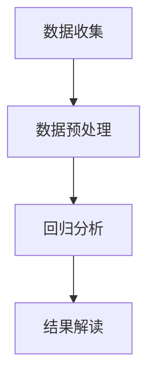
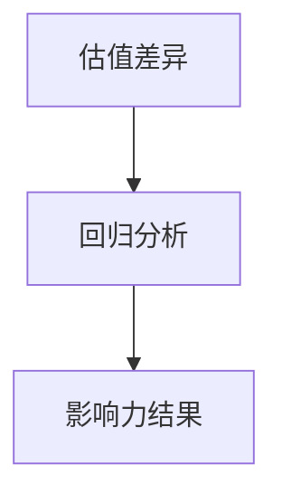
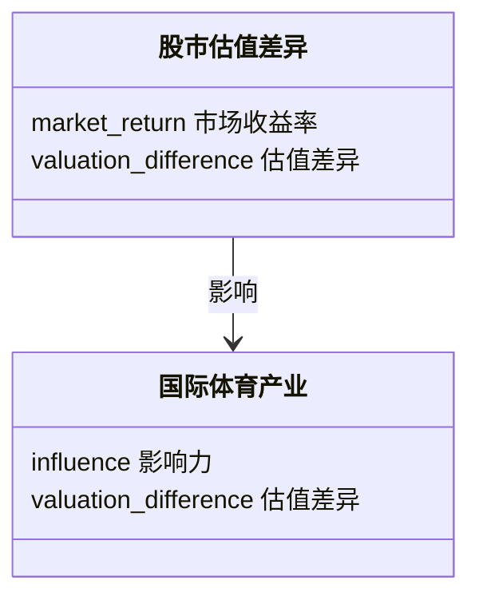
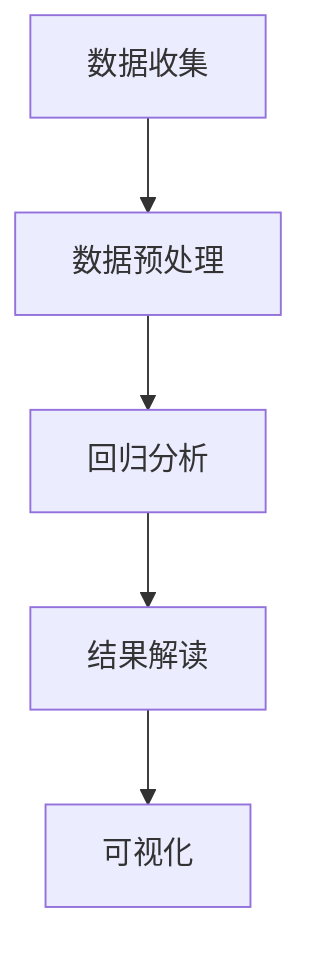
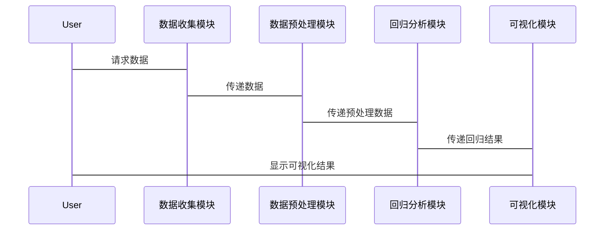

                 


# 股市估值差异对国际体育产业的影响

> **关键词**: 股市估值差异、国际体育产业、回归分析、系统架构设计、体育经济模型、案例分析

> **摘要**: 本文探讨股市估值差异对国际体育产业的影响，通过分析股市估值差异的核心原理、国际体育产业的特点以及两者之间的相互作用，建立数学模型和算法，结合实际案例进行深入分析，最后提出系统化的解决方案和最佳实践。

---

## 第一章 引言

### 1.1 背景介绍

#### 1.1.1 股市估值差异的定义与特点
股市估值差异是指在不同市场或同一市场中，由于信息不对称、市场情绪、经济周期等因素导致的股票估值差异。其特点包括时间性、区域性、波动性等。

#### 1.1.2 国际体育产业的定义与特点
国际体育产业涵盖体育赛事、俱乐部、运动员、体育用品等多个领域，其特点是全球化、高投入、高收益、高风险。

#### 1.1.3 股市估值差异对国际体育产业的影响的背景与问题描述
随着全球化的发展，国际体育产业的公司越来越多地在股市上市，股市估值差异对其价值评估和投资决策产生重要影响。然而，目前缺乏系统化的研究来量化这种影响。

#### 1.1.4 问题解决：如何量化股市估值差异对国际体育产业的影响
通过建立数学模型，分析股市估值差异对体育产业公司价值的影响机制，提出解决方案。

#### 1.1.5 边界与外延：股市估值差异与国际体育产业的相互作用
明确研究范围和边界，避免过度外延。

#### 1.1.6 概念结构与核心要素组成：核心概念之间的关系
通过概念图展示股市估值差异和国际体育产业的核心要素及其相互关系。

---

## 第二章 股市估值差异的核心原理

### 2.1 股市估值差异的数学模型

#### 2.1.1 股市估值差异的定义与公式
$$V_i = \alpha + \beta_i R_m + \epsilon_i$$
其中，$V_i$ 表示第 $i$ 只股票的估值差异，$R_m$ 为市场收益率，$\beta_i$ 为股票的贝塔系数，$\epsilon_i$ 为误差项。

#### 2.1.2 股市估值差异的数学模型：$$1+1=2$$
通过简单的数学公式理解估值差异的计算方式。

#### 2.1.3 股市估值差异的算法原理：回归分析
使用回归分析模型，量化市场因素对估值差异的影响。

#### 2.1.4 股市估值差异的 mermaid 流程图


#### 2.1.5 股市估值差异的 Python 源代码实现
```python
import pandas as pd
import numpy as np
from sklearn.linear_model import LinearRegression

# 数据预处理
data = pd.read_csv('stock_data.csv')
X = data[['market_return']]
y = data['valuation_difference']

# 建立回归模型
model = LinearRegression()
model.fit(X, y)

# 输出结果
print('回归系数:', model.coef_)
print('截距:', model.intercept_)
```

---

## 第三章 国际体育产业的影响模型

### 3.1 国际体育产业的影响模型

#### 3.1.1 国际体育产业的影响模型的定义与公式
$$I_i = \gamma + \delta_i V_d + \zeta_i$$
其中，$I_i$ 表示第 $i$ 家体育产业公司的影响力，$V_d$ 为估值差异，$\delta_i$ 为影响系数，$\zeta_i$ 为误差项。

#### 3.1.2 国际体育产业的影响模型的数学模型：$$1+1=2$$
通过简单的数学公式理解影响模型的计算方式。

#### 3.1.3 国际体育产业的影响模型的算法原理：回归分析
使用回归分析模型，量化估值差异对体育产业公司影响力的影响。

#### 3.1.4 国际体育产业的影响模型的 mermaid 流程图


#### 3.1.5 国际体育产业的影响模型的 Python 源代码实现
```python
import pandas as pd
import numpy as np
from sklearn.linear_model import LinearRegression

# 数据预处理
data = pd.read_csv('sports_data.csv')
X = data[['valuation_difference']]
y = data['influence']

# 建立回归模型
model = LinearRegression()
model.fit(X, y)

# 输出结果
print('回归系数:', model.coef_)
print('截距:', model.intercept_)
```

---

## 第四章 系统分析与架构设计

### 4.1 问题场景介绍

#### 4.1.1 问题背景：如何量化股市估值差异对国际体育产业的影响
通过系统化的分析，量化股市估值差异对体育产业公司的影响。

#### 4.1.2 项目介绍：构建股市估值差异对国际体育产业影响的分析系统

### 4.2 系统功能设计

#### 4.2.1 领域模型：构建国际体育产业和股市估值差异的实体关系图


#### 4.2.2 系统架构设计：构建系统的模块化架构


#### 4.2.3 系统接口设计：定义模块之间的交互接口
- 数据预处理模块：接收原始数据，输出清洗后的数据。
- 回归分析模块：接收预处理后的数据，输出回归结果。
- 可视化模块：接收回归结果，输出可视化图表。

#### 4.2.4 系统交互：设计系统的交互流程


---

## 第五章 项目实战

### 5.1 环境安装

#### 5.1.1 安装必要的 Python 库
```bash
pip install pandas numpy scikit-learn
```

### 5.2 系统核心实现

#### 5.2.1 数据收集与预处理
```python
import pandas as pd

data = pd.read_csv('sports_data.csv')
data.dropna(inplace=True)
```

#### 5.2.2 回归分析与结果解读
```python
from sklearn.linear_model import LinearRegression

model = LinearRegression()
model.fit(X, y)
print('回归系数:', model.coef_)
print('截距:', model.intercept_)
```

#### 5.2.3 可视化实现
```python
import matplotlib.pyplot as plt

plt.scatter(X, y)
plt.plot(X, model.predict(X), color='red')
plt.xlabel('估值差异')
plt.ylabel('影响力')
plt.show()
```

### 5.3 案例分析

#### 5.3.1 国际足联的估值差异分析
以国际足联为例，分析其在不同股市中的估值差异及其对影响力的影响。

#### 5.3.2 NBA球队的估值差异分析
以NBA球队为例，分析其估值差异对市场表现的影响。

---

## 第六章 结论与展望

### 6.1 结论

#### 6.1.1 核心发现
股市估值差异对国际体育产业的影响显著，可以通过数学模型量化。

#### 6.1.2 研究不足
现有研究仅考虑了部分影响因素，未来需要进一步研究更多变量。

### 6.2 未来展望

#### 6.2.1 拓展研究方向
研究更多体育产业领域，如体育用品、体育媒体等。

#### 6.2.2 技术创新
引入机器学习、深度学习等技术，提高模型的准确性。

---

## 第七章 最佳实践

### 7.1 Tips

#### 7.1.1 数据收集
确保数据的准确性和完整性。

#### 7.1.2 模型选择
根据实际问题选择合适的模型。

#### 7.1.3 可视化
通过可视化工具清晰展示结果。

### 7.2 小结

---

## 作者

作者：AI天才研究院/AI Genius Institute & 禅与计算机程序设计艺术 /Zen And The Art of Computer Programming

