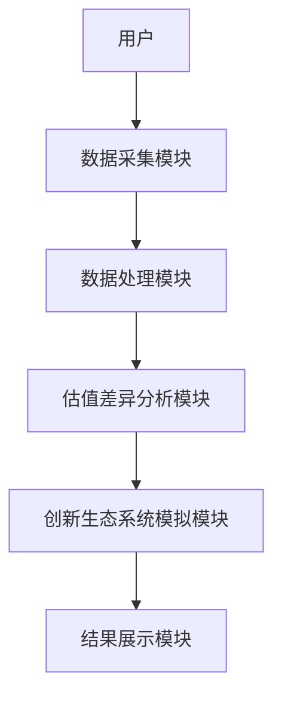
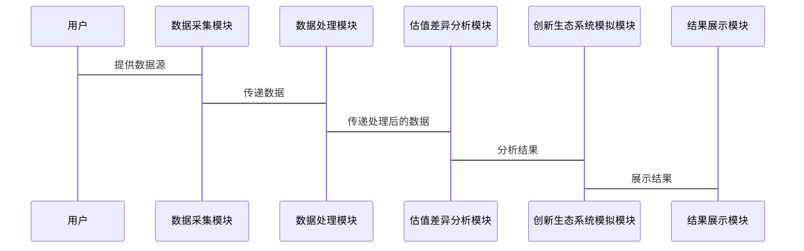

                 


# 股市估值差异对国际创新生态系统的影响

---

## 关键词：
- 股市估值差异
- 创新生态系统
- 股市差异
- 创新资源分配
- 创新主体

---

## 摘要：
股市估值差异对国际创新生态系统的影响是一个复杂而重要的课题。本文从背景介绍、核心概念、算法原理、系统分析、项目实战和最佳实践等多个维度展开，深入探讨股市估值差异如何影响创新生态系统的稳定性、资源配置和创新主体行为。通过统计分析、网络分析和数学建模等方法，本文揭示了估值差异对创新生态系统中各主体、资源和环境的综合影响，并提出了优化建议和实际案例分析，为政策制定者和投资者提供了理论支持和实践指导。

---

# 第一章: 股市估值差异的背景与定义

## 1.1 股市估值差异的背景
### 1.1.1 全球化背景下的股市差异
- 全球化背景下不同市场的估值差异现象
- 创新生态系统在全球化中的重要性
- 股市估值差异对创新资源分配的影响

### 1.1.2 创新生态系统的基本概念
- 创新生态系统的定义与核心要素
- 创新生态系统中的主体、资源和环境
- 创新生态系统与经济发展的关系

### 1.1.3 股市估值差异的定义与特征
- 股市估值差异的定义
- 不同市场间的估值差异表现
- 估值差异对创新主体的影响

## 1.2 股市估值差异的现状
### 1.2.1 不同市场间的估值差异分析
- 主要股市（如美股、A股、港股）的估值差异
- 不同行业、不同规模企业的估值差异

### 1.2.2 创新生态系统中的估值差异表现
- 创新企业与传统企业的估值差异
- 初创企业与成熟企业的估值差异

### 1.2.3 股市估值差异的影响因素
- 市场流动性
- 政策环境
- 投资者认知与预期

## 1.3 股市估值差异对创新生态系统的影响
### 1.3.1 创新企业的估值差异分析
- 高科技企业的估值差异
- 初创企业的估值差异与融资难度

### 1.3.2 投资者行为与估值差异的关系
- 投资者对创新企业的风险偏好
- 估值差异对投资决策的影响

### 1.3.3 估值差异对创新生态系统稳定性的影响
- 估值差异对创新资源分配的影响
- 创新生态系统的自我调节机制

## 1.4 本章小结
### 1.4.1 股市估值差异的核心概念
### 1.4.2 创新生态系统中的估值差异问题
### 1.4.3 本章研究的框架与意义

---

# 第二章: 创新生态系统的核心概念与联系

## 2.1 创新生态系统的核心要素
### 2.1.1 创新主体：企业、政府、科研机构
- 企业的创新角色
- 政府的政策支持
- 科研机构的技术供给

### 2.1.2 创新资源：资金、技术、人才
- 资金在创新生态系统中的作用
- 技术的流动与共享
- 人才的流动与合作

### 2.1.3 创新环境：政策、市场、文化
- 政策环境对创新的影响
- 市场需求与创新方向
- 创业文化对创新的促进

## 2.2 股市估值差异与创新生态系统的关系
### 2.2.1 股市估值差异对创新主体的影响
- 高估值对企业研发投入的激励
- 低估值对企业融资的限制

### 2.2.2 股市估值差异对创新资源分配的影响
- 高估值市场的资源虹吸效应
- 低估值市场的资源枯竭现象

### 2.2.3 股市估值差异对创新环境的影响
- 创新生态系统中的政策响应
- 市场预期与创新氛围的关系

## 2.3 创新生态系统中的实体关系图
### 2.3.1 创新主体之间的关系
- 企业与科研机构的合作关系
- 政府与企业的支持关系

### 2.3.2 创新资源的流动与分配
- 资金在不同创新主体间的流动
- 技术的共享与转化

### 2.3.3 创新环境对创新主体的影响
- 政策环境对创新主体的激励
- 市场环境对创新主体的约束

## 2.4 本章小结
### 2.4.1 创新生态系统的核心要素
### 2.4.2 股市估值差异对创新生态系统的影响
### 2.4.3 本章研究的逻辑框架

---

# 第三章: 股市估值差异的算法原理

## 3.1 股市估值差异的统计分析方法
### 3.1.1 数据收集与处理
- 数据来源：不同市场的股票数据
- 数据清洗与预处理

### 3.1.2 描述性统计分析
- 均值、中位数、标准差等指标的计算
- 不同市场估值差异的对比分析

### 3.1.3 假设检验与回归分析
- 股市估值差异的显著性检验
- 估值差异与创新绩效的回归分析

## 3.2 创新生态系统中估值差异的网络分析
### 3.2.1 网络分析的基本原理
- 网络图的构建与分析
- 网络中心性分析

### 3.2.2 创新主体之间的关系网络
- 企业间的合作网络
- 科研机构间的合作网络

### 3.2.3 估值差异在网络中的表现
- 高估值企业的网络中心性
- 低估值企业的网络边缘性

## 3.3 算法实现
### 3.3.1 数据预处理与清洗
```python
import pandas as pd
data = pd.read_csv('stock_data.csv')
data_clean = data.dropna()
```

### 3.3.2 网络分析算法实现
```python
import networkx as nx
G = nx.Graph()
G.add_nodes_from(list_of_nodes)
G.add_edges_from(list_of_edges)
```

### 3.3.3 结果分析与可视化
```python
nx.draw(G, node_size=500, node_color='red', edge_color='blue')
plt.show()
```

## 3.4 本章小结
### 3.4.1 股市估值差异的统计分析方法
### 3.4.2 创新生态系统中的网络分析方法
### 3.4.3 本章算法实现的核心步骤

---

# 第四章: 创新生态系统中的数学模型与公式

## 4.1 创新生态系统的基本模型
### 4.1.1 创新主体的相互作用模型
$$ V_i = \alpha + \beta X_i + \epsilon_i $$
其中，$V_i$ 是第 $i$ 家企业的估值，$X_i$ 是其创新投入，$\alpha$ 是截距，$\beta$ 是回归系数，$\epsilon_i$ 是误差项。

### 4.1.2 创新资源的分配模型
$$ R_i = \gamma S_i + \delta T_i $$
其中，$R_i$ 是第 $i$ 种创新资源的分配量，$S_i$ 是市场估值，$T_i$ 是技术创新水平。

### 4.1.3 创新环境的综合评价模型
$$ E = \sum_{j=1}^n \lambda_j A_j $$
其中，$E$ 是创新环境的综合评价，$\lambda_j$ 是第 $j$ 个环境因素的权重，$A_j$ 是第 $j$ 个环境因素的得分。

## 4.2 股市估值差异的数学公式
### 4.2.1 股市估值差异的计算公式
$$ \Delta V = V_{\text{high}} - V_{\text{low}} $$
其中，$\Delta V$ 是估值差异，$V_{\text{high}}$ 和 $V_{\text{low}}$ 分别是高估值和低估值的市场估值。

### 4.2.2 创新绩效与估值差异的关系
$$ P_i = \alpha \Delta V_i + \beta X_i + \gamma E_i + \epsilon_i $$
其中，$P_i$ 是第 $i$ 家企业的创新绩效，$\Delta V_i$ 是其估值差异，$X_i$ 是创新投入，$E_i$ 是创新环境评价，$\alpha$、$\beta$、$\gamma$ 是回归系数，$\epsilon_i$ 是误差项。

## 4.3 本章小结
### 4.3.1 创新生态系统的基本模型
### 4.3.2 股市估值差异的数学公式
### 4.3.3 本章模型的应用与意义

---

# 第五章: 创新生态系统中的系统分析与架构设计

## 5.1 系统分析
### 5.1.1 问题场景介绍
- 创新生态系统中的估值差异问题
- 系统的目标与范围

### 5.1.2 系统功能设计
- 数据采集与处理功能
- 估值差异分析功能
- 创新生态系统模拟功能

### 5.1.3 系统架构设计


## 5.2 系统架构设计
### 5.2.1 系统架构图
```mermaid
subgraph 数据流
    A[用户] --> B[数据采集模块]
    B --> C[数据处理模块]
    C --> D[估值差异分析模块]
end

subgraph 功能模块
    D --> E[创新生态系统模拟模块]
    E --> F[结果展示模块]
end
```

## 5.3 系统接口设计
### 5.3.1 系统接口
- 数据采集接口
- 分析模块接口
- 结果展示接口

### 5.3.2 接口交互流程


## 5.4 本章小结
### 5.4.1 系统分析的核心内容
### 5.4.2 系统架构设计的关键点
### 5.4.3 本章研究的意义

---

# 第六章: 项目实战与案例分析

## 6.1 项目实战
### 6.1.1 环境安装与数据准备
- 数据库安装与配置
- 数据集下载与预处理

### 6.1.2 系统核心实现
```python
def calculate_valuation_difference(data):
    high_val = data['high_val'].mean()
    low_val = data['low_val'].mean()
    return high_val - low_val

data = pd.read_csv('valuation_data.csv')
difference = calculate_valuation_difference(data)
print(f'Valuation Difference: {difference}')
```

### 6.1.3 代码应用与解读
- 代码的功能描述
- 代码运行结果的分析

## 6.2 案例分析
### 6.2.1 案例背景
- 某创新生态系统的现状
- 估值差异的具体表现

### 6.2.2 案例分析与解决
- 利用模型分析估值差异的原因
- 提出优化建议

## 6.3 本章小结
### 6.3.1 项目实战的核心步骤
### 6.3.2 案例分析的关键结论
### 6.3.3 本章研究的意义

---

# 第七章: 最佳实践与小结

## 7.1 最佳实践
### 7.1.1 创新生态系统中的估值差异管理
- 如何减少估值差异对创新资源分配的影响
- 如何优化创新生态系统的稳定性

### 7.1.2 投资者行为的优化建议
- 投资者如何正确评估创新企业的价值
- 投资者如何应对估值差异带来的风险

## 7.2 小结
### 7.2.1 本文的核心结论
### 7.2.2 本文的主要贡献
### 7.2.3 未来研究的方向

## 7.3 注意事项
- 创新生态系统中的估值差异问题具有动态性
- 需要结合具体市场环境进行分析
- 政策制定者和投资者需共同应对估值差异带来的挑战

## 7.4 拓展阅读
- 推荐相关书籍和文献
- 提供进一步研究的方向

---

# 附录

## 附录A: 数据来源与处理代码
```python
import pandas as pd
data = pd.read_csv('valuation_data.csv')
data_clean = data.dropna()
data_clean.to_csv('clean_valuation_data.csv', index=False)
```

## 附录B: 网络分析代码
```python
import networkx as nx
G = nx.Graph()
G.add_nodes_from(list_of_nodes)
G.add_edges_from(list_of_edges)
nx.draw(G, node_size=500, node_color='red', edge_color='blue')
plt.show()
```

## 附录C: 参考文献
- 文献1：XXX
- 文献2：XXX
- 文献3：XXX

---

# 作者：AI天才研究院/AI Genius Institute & 禅与计算机程序设计艺术 /Zen And The Art of Computer Programming

