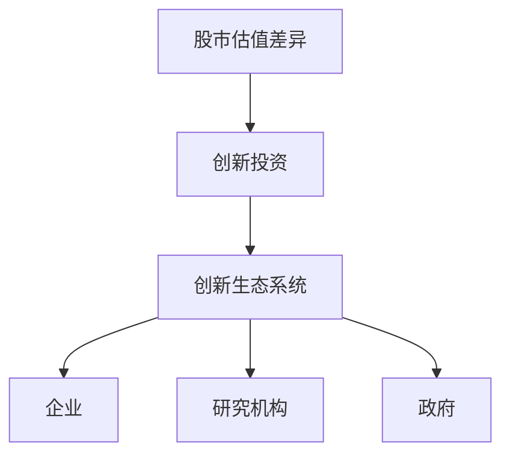
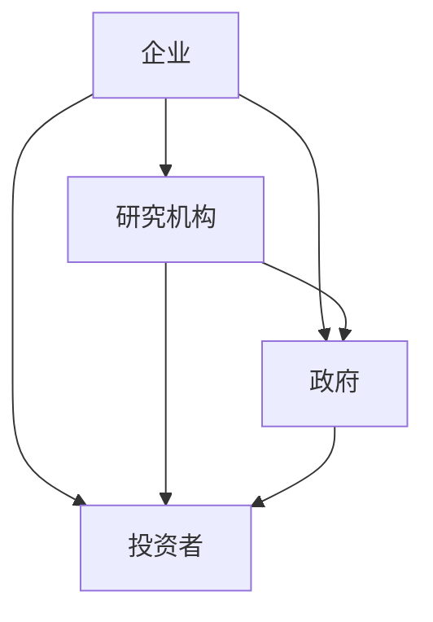

                 

# 股市估值差异对国际创新生态系统竞争力的影响

## 关键词：
股市估值差异, 创新生态系统, 国际竞争力, 金融体系, 创新投资

## 摘要：
本文探讨了股市估值差异对国际创新生态系统竞争力的影响，通过分析股市估值差异的形成机制、创新生态系统的结构及其相互作用，提出了如何优化股市估值差异以提升创新生态系统竞争力的策略。

---

## 第一部分: 背景介绍

### 1.1 什么是股市估值差异
- 股市估值差异的定义：不同市场中同一家公司的股票价格差异。
- 形成原因：市场流动性、信息不对称、投资者情绪等。
- 研究意义：理解股市估值差异对创新投资的影响。

### 1.2 创新生态系统的核心概念
- 创新生态系统的定义：由企业、研究机构、政府等组成的创新网络。
- 主要组成部分：企业、研究机构、政府、投资者。
- 核心特征：协同合作、资源共享、风险分担。

### 1.3 研究目标与范围
- 研究目标：分析股市估值差异对创新生态系统竞争力的影响。
- 研究范围：全球范围内的创新生态系统。

---

## 第二部分: 核心概念与联系

### 2.1 股市估值差异的理论基础
- 定义与分类：基于市场、行业、公司等的估值差异。
- 影响因素：市场流动性、信息不对称、投资者情绪。

### 2.2 创新生态系统的核心要素
- 企业：创新主体。
- 研究机构：创新支持。
- 政府：政策支持。
- 投资者：资金来源。

### 2.3 概念结构图

---

## 第三部分: 理论分析

### 3.1 股市估值差异的形成机制
- 市场流动性：影响股票价格。
- 信息不对称：影响投资者决策。
- 投资者情绪：影响短期波动。

### 3.2 创新生态系统结构
- 企业：主要创新主体。
- 研究机构：提供技术支持。
- 政府：政策支持。
- 投资者：资金来源。

### 3.3 估值差异与创新生态系统
- 估值差异影响创新投资：高估可能导致过度投资，低估可能导致投资不足。

---

## 第四部分: 系统分析与架构设计

### 4.1 系统模型
- 企业、研究机构、政府、投资者之间的互动关系。

### 4.2 架构设计

### 4.3 系统接口与交互
- 企业与投资者之间的资金接口。
- 研究机构与企业的技术接口。

---

## 第五部分: 项目实战

### 5.1 案例分析
- 某科技公司因估值差异导致创新投资变化。

### 5.2 数据分析
- 使用统计方法分析估值差异对创新投资的影响。

### 5.3 策略制定
- 优化估值差异：提高市场流动性、减少信息不对称。

---

## 第六部分: 结论与建议

### 6.1 总结
- 股市估值差异对创新生态系统竞争力的影响。
- 优化估值差异的重要性。

### 6.2 建议
- 政策制定者：改善市场流动性。
- 投资者：理性决策。

### 6.3 未来研究方向
- 更复杂的估值差异模型。

---

## 作者：
AI天才研究院/AI Genius Institute & 禅与计算机程序设计艺术/Zen And The Art of Computer Programming

