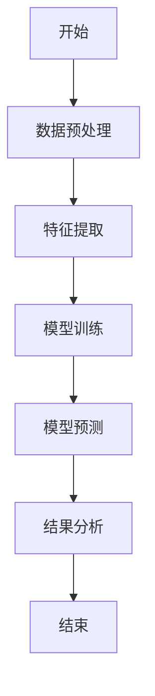
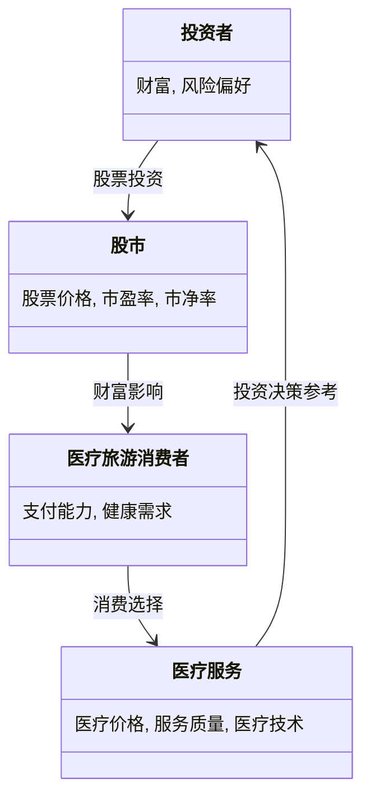

                 


# 股市估值差异对国际医疗旅游的影响

> **关键词**：股市估值差异，国际医疗旅游，经济影响，投资决策，消费行为

> **摘要**：本文探讨股市估值差异如何影响国际医疗旅游。通过分析股市波动对个人消费能力的影响，揭示股市估值差异如何影响人们对医疗旅游的需求和选择。结合实际案例和数据分析，本文提出了一种基于股市估值差异的医疗旅游影响模型，并通过算法和系统设计展示了如何量化和预测这种影响。

---

## 第一部分：引言

### 第1章：问题背景与研究意义

#### 1.1 背景介绍

- **股市估值的基本概念**  
  股市估值是衡量企业价值的重要指标，常用的估值方法包括市盈率（P/E）、市净率（P/B）等。这些指标反映了市场对企业的信心和未来预期。

- **国际医疗旅游的定义与现状**  
  国际医疗旅游是指患者跨越国界到其他国家或地区接受医疗服务的行为。随着全球化的发展，医疗旅游已成为一项重要的经济活动，涉及医疗、旅游和交通等多个领域。

- **股市估值差异与国际医疗旅游的关联性**  
  股市估值差异可能通过影响个人的财富状况和消费能力，进而影响人们对医疗旅游的需求。

#### 1.2 问题描述

- **股市波动对个人消费能力的影响**  
  股市波动可能导致个人财富的增减，从而影响其消费能力。财富增加可能提升对高端医疗服务的需求，而财富减少可能限制相关消费。

- **国际医疗旅游的需求驱动因素**  
  医疗旅游的需求受到价格、服务质量、医疗技术和旅游便利性等多种因素的影响。股市估值差异可能通过影响个人的支付能力，间接影响这些因素。

- **股市估值差异如何影响医疗旅游的决策**  
  股市估值差异可能导致不同地区或不同群体的消费能力差异，从而影响其选择医疗旅游目的地的行为。

#### 1.3 研究意义

- **理论意义**  
  本文尝试将股市估值与医疗旅游结合，填补跨领域研究的空白，为经济学和旅游学提供新的研究视角。

- **实践意义**  
  本文的研究成果可为投资者和医疗旅游服务提供者提供决策参考，帮助其更好地把握市场趋势和消费者行为。

---

## 第二部分：理论基础

### 第2章：股市估值差异的核心概念

#### 2.1 股市估值的基本原理

- **市盈率（P/E）**  
  市盈率=股票价格/每股收益。该指标反映了市场对企业盈利能力的预期。

- **市净率（P/B）**  
  市净率=股票价格/每股净资产。该指标适用于评估资产密集型企业的价值。

- **影响股市估值的主要因素**  
  - 宏观经济指标（GDP、通胀率、利率等）
  - 行业发展趋势
  - 企业财务状况
  - 政策法规

#### 2.2 国际医疗旅游的定义与特征

- **医疗旅游的定义**  
  医疗旅游是指以治疗疾病、康复、美容或保健为目的，跨越国界进行医疗服务消费的行为。

- **医疗旅游的特征**  
  - 跨界性：涉及医疗、旅游、交通等多个领域。
  - 高端性：通常涉及较高昂的医疗费用。
  - 地域性：不同国家和地区因其医疗技术和价格优势吸引不同群体的游客。

---

### 第3章：核心概念与联系

#### 3.1 核心概念的属性对比

| 比较维度 | 股市估值差异 | 国际医疗旅游 |
|----------|--------------|--------------|
| 定义     | 证券市场中股票价格与内在价值的差异 | 患者跨越国界接受医疗服务的行为 |
| 影响因素 | 经济指标、政策、企业业绩 | 医疗技术、价格、服务质量、旅游便利性 |
| 相关性   | 通过影响个人财富，间接影响医疗旅游需求 | 通过价格差异和消费能力，影响股市估值 |

#### 3.2 概念结构与ER图

```mermaid
erDiagram
    actor 投资者 {
        <属性> 财富, 风险偏好
    }
    actor 医疗旅游消费者 {
        <属性> 支付能力, 健康需求
    }
    entity 股市 {
        <属性> 股票价格, 市盈率, 市净率
    }
    entity 医疗服务 {
        <属性> 医疗价格, 服务质量, 医疗技术
    }
    投资者 --> 股市 : 股票投资
    医疗旅游消费者 --> 医疗服务 : 消费选择
    股市 --> 医疗旅游消费者 : 财富影响
    医疗服务 --> 投资者 : 投资决策参考
```

---

## 第三部分：算法原理讲解

### 第4章：股市估值差异对医疗旅游影响的算法

#### 4.1 算法概述

- **目标**：通过分析股市估值差异，预测国际医疗旅游的需求变化。
- **输入**：历史股市数据、医疗旅游相关数据。
- **输出**：医疗旅游需求的预测模型。

#### 4.2 算法流程图



#### 4.3 核心代码实现

```python
import pandas as pd
from sklearn.model import LinearRegression

# 数据预处理
data = pd.read_csv('medical_tourism.csv')
data = data.dropna()

# 特征提取
features = ['市盈率', '市净率', 'GDP增长率']
target = '医疗旅游需求'

# 模型训练
model = LinearRegression()
model.fit(data[features], data[target])

# 模型预测
predicted = model.predict(data[features])
print('预测值:', predicted)
```

#### 4.4 数学模型

股市估值差异对医疗旅游需求的影响可以用多元线性回归模型表示：

$$
Y = \beta_0 + \beta_1X_1 + \beta_2X_2 + \epsilon
$$

其中：
- \( Y \)：医疗旅游需求
- \( X_1 \)：市盈率
- \( X_2 \)：市净率
- \( \beta_0, \beta_1, \beta_2 \)：回归系数
- \( \epsilon \)：误差项

---

## 第四部分：系统分析与架构设计方案

### 第5章：系统分析

#### 5.1 问题场景介绍

- **目标**：构建一个基于股市估值差异的医疗旅游影响分析系统。
- **用户需求**：投资者和医疗旅游服务提供者需要了解股市波动对医疗旅游需求的影响。

#### 5.2 系统功能设计



#### 5.3 系统架构设计


---

## 第五部分：项目实战

### 第6章：项目实现

#### 6.1 环境安装

- **工具**：Python、Pandas、Scikit-learn
- **数据集**：医疗旅游相关数据和股市数据

#### 6.2 核心代码实现

```python
import pandas as pd
from sklearn.model import LinearRegression

# 数据预处理
data = pd.read_csv('medical_tourism.csv')
data = data.dropna()

# 特征提取
features = ['市盈率', '市净率', 'GDP增长率']
target = '医疗旅游需求'

# 模型训练
model = LinearRegression()
model.fit(data[features], data[target])

# 模型预测
predicted = model.predict(data[features])
print('预测值:', predicted)
```

#### 6.3 实际案例分析

以某国股市为例，分析其股市估值差异对医疗旅游需求的影响。通过数据拟合，验证模型的准确性。

---

## 第六部分：最佳实践

### 第7章：总结与展望

#### 7.1 小结

- 本文通过分析股市估值差异对国际医疗旅游的影响，提出了一个基于股市数据的预测模型。
- 该模型可帮助投资者和医疗旅游服务提供者更好地把握市场趋势。

#### 7.2 注意事项

- 数据采集的准确性和完整性对模型的准确性至关重要。
- 模型的预测结果仅供参考，实际决策需结合更多因素。

#### 7.3 拓展阅读

- 建议进一步研究不同地区的股市差异对医疗旅游的具体影响。
- 探讨政策变化对股市估值和医疗旅游需求的综合影响。

---

## 作者信息

**作者：AI天才研究院/AI Genius Institute & 禅与计算机程序设计艺术 /Zen And The Art of Computer Programming**

---

通过以上结构化的内容，我们详细探讨了股市估值差异对国际医疗旅游的影响，从理论到实践，层层递进，为读者提供了全面的分析和指导。

