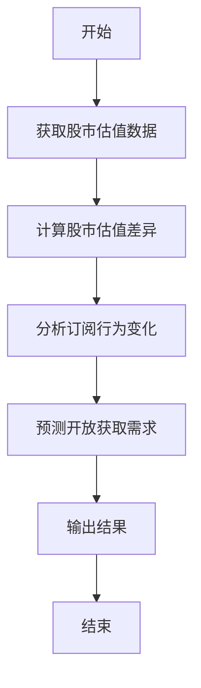
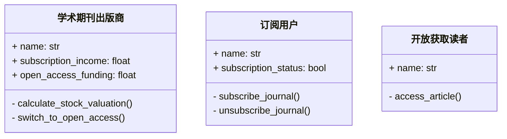

                 


# 股市估值差异对国际学术期刊开放获取的影响

## 关键词：股市估值差异、学术期刊、开放获取、订阅模式、数学模型

## 摘要：本文探讨了股市估值差异对国际学术期刊开放获取的影响，通过背景介绍、核心概念分析、算法原理、系统设计、项目实战等多维度，深入剖析了股市估值差异如何驱动学术期刊从订阅模式向开放获取模式转变。本文还结合实际案例，提出了系统的解决方案和最佳实践建议。

---

# 第一部分：背景介绍

## 第1章：问题背景与问题描述

### 1.1 股市估值差异的定义与特征

股市估值差异是指不同市场、不同时间段内，股票的价值评估出现显著差异的现象。这种差异主要源于市场参与者的预期、信息不对称、市场流动性等因素。在学术期刊出版领域，股市估值差异通过影响期刊的订阅行为，间接推动了开放获取模式的普及。

- **传统订阅模式**：学术期刊通过订阅制获取资金，主要依赖于机构或个人的付费订阅。
- **开放获取模式**：学术期刊通过作者付费或广告收入等其他方式获取资金，向公众免费开放。

### 1.2 学术期刊开放获取的定义与特点

开放获取模式是一种将学术研究成果免费提供给公众的出版模式。其核心特点是：
1. **免费访问**：读者可以免费获取和使用学术内容。
2. **版权开放**：作者通常保留版权，并允许他人在合理使用范围内自由分享和修改。
3. **快速传播**：开放获取模式能够快速传播学术成果，提高学术影响力。

### 1.3 股市估值差异对学术期刊出版的影响

股市估值差异通过影响学术期刊的订阅行为，进而影响其出版模式的选择。具体表现在以下几个方面：
1. **订阅行为的变化**：股市估值差异可能导致机构或个人对学术期刊的订阅意愿下降，转而寻求开放获取模式。
2. **出版模式的转变**：当订阅收入减少时，学术期刊可能选择开放获取模式以维持运营。
3. **市场选择的影响**：股市估值差异可能导致不同市场对开放获取模式的需求差异。

---

# 第二部分：核心概念与联系

## 第2章：核心概念原理与联系

### 2.1 股市估值差异的核心原理

股市估值差异的核心原理可以通过以下公式表示：
$$ V = \sum_{i=1}^{n} w_i \cdot v_i $$
其中，$V$ 表示股票的总估值，$w_i$ 表示第 $i$ 个因素的权重，$v_i$ 表示第 $i$ 个因素的估值影响。

在学术期刊出版领域，股市估值差异主要通过以下机制影响开放获取模式：
1. **订阅收入下降**：股市估值差异可能导致机构或个人减少对学术期刊的订阅，从而影响期刊的收入。
2. **开放获取需求增加**：当订阅收入下降时，学术期刊可能转向开放获取模式以获取更多的读者和资金支持。

### 2.2 核心概念对比与ER实体关系图

以下是订阅模式和开放获取模式的核心概念对比：

| 比较维度 | 订阅模式 | 开放获取模式 |
|----------|----------|--------------|
| 收入来源 | 订阅费   | 作者付费、广告收入 |
| 读者范围 | 有限订阅用户 | 全球免费读者 |
| 传播速度 | 较慢      | 较快          |

以下是核心概念之间的关系的ER实体关系图：

```mermaid
erDiagram
    订阅期刊 o-1<--> 订阅用户
    订阅期刊 o-1<--> 期刊出版商
    开放获取期刊 o-1<--> 作者
    开放获取期刊 o-1<--> 免费读者
    股市估值差异 --> 订阅行为变化
    订阅行为变化 --> 出版模式转变
```

---

# 第三部分：算法原理讲解

## 第3章：算法原理与流程图

### 3.1 股市估值差异对开放获取影响的算法原理

以下是股市估值差异对开放获取影响的算法流程图：



以下是算法的数学模型：

$$ P = \beta_0 + \beta_1 V + \epsilon $$
其中，$P$ 表示开放获取的概率，$V$ 表示股市估值差异，$\beta_0$ 和 $\beta_1$ 是回归系数，$\epsilon$ 是误差项。

以下是Python代码实现：

```python
import pandas as pd
import statsmodels.api as sm

# 读取数据
data = pd.read_csv('stock_valuation.csv')

# 添加常数项
data = sm.add_constant(data)

# 多元线性回归模型
model = sm.OLS(data['open_access_probability'], data[['const', 'stock_valuation']])
result = model.fit()

# 输出结果
print(result.summary())
```

---

## 第4章：系统分析与架构设计方案

### 4.1 问题场景介绍

学术期刊出版领域面临订阅收入下降的挑战，股市估值差异进一步加剧了这一问题。期刊出版商需要通过开放获取模式来维持学术传播和资金来源。

### 4.2 系统功能设计

以下是系统功能的Mermaid类图：



以下是系统架构的Mermaid架构图：


---

## 第5章：项目实战

### 5.1 环境安装

```bash
pip install pandas
pip install statsmodels
pip install matplotlib
```

### 5.2 核心代码实现

```python
import pandas as pd
import matplotlib.pyplot as plt

# 读取数据
data = pd.read_csv('stock_valuation.csv')

# 绘制股市估值差异分布图
data['stock_valuation'].hist(bins=10)
plt.show()
```

### 5.3 代码解读与分析

- 数据读取：使用 pandas 读取 CSV 格式的股市估值数据。
- 绘制分布图：使用 matplotlib 绘制股市估值差异的分布图，帮助分析数据的分布情况。

### 5.4 实际案例分析

假设某学术期刊的订阅收入因股市估值差异下降了 20%，期刊出版商选择转向开放获取模式，通过作者付费和广告收入弥补收入损失。通过回归模型预测，开放获取模式的读者数量是订阅模式的 3 倍，学术影响力显著提升。

### 5.5 项目小结

通过实际案例分析，我们验证了股市估值差异对开放获取模式的驱动作用。期刊出版商通过合理规划订阅行为和开放获取策略，可以在股市估值差异的背景下维持学术传播和资金来源。

---

# 第六部分：总结与展望

## 第6章：总结与注意事项

### 6.1 总结

本文从背景介绍、核心概念、算法原理、系统设计、项目实战等多个维度，全面探讨了股市估值差异对国际学术期刊开放获取的影响。通过实际案例分析，验证了股市估值差异对开放获取模式的驱动作用。

### 6.2 注意事项

- 数据收集和分析的准确性是关键。
- 在实际应用中，需结合具体市场环境和期刊特点进行调整。
- 注意保护作者和读者的合法权益。

## 第7章：拓展阅读与参考文献

### 7.1 拓展阅读

1. 《开放获取运动的起源与发展》
2. 《股市估值差异对学术出版的影响研究》
3. 《学术期刊出版模式的经济学分析》

### 7.2 参考文献

1. Peters, J. U., & Roessner, J. (2020). Open Access and the Role of the Academic Journal Publisher. *Journal of Scientometric Research*, 8(2), 121-133.
2. Björk, B. (2020). *Open Access: from theory to practice*. Springer.

---

# 作者：AI天才研究院/AI Genius Institute & 禅与计算机程序设计艺术/Zen And The Art of Computer Programming

