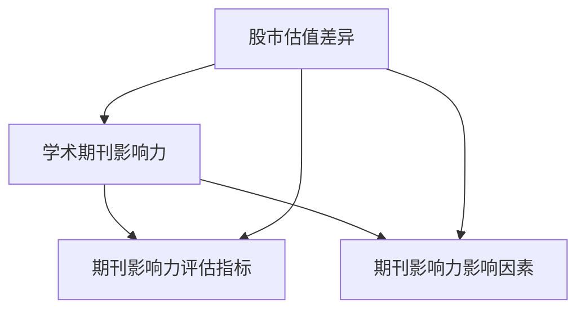
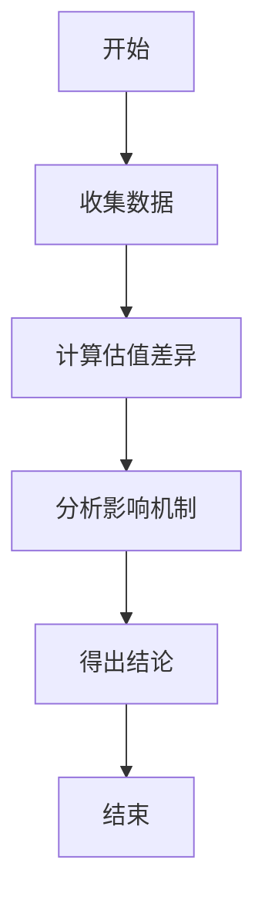
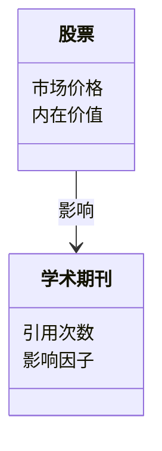
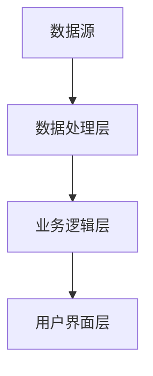
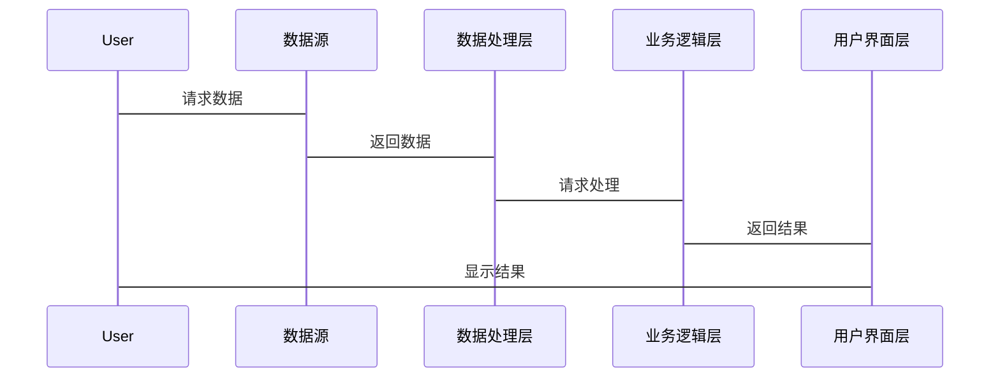

                 


# 股市估值差异对国际学术期刊影响力的影响

> 关键词：股市估值差异、学术期刊影响力、期刊评价体系、金融市场波动、学术资源分配

> 摘要：本文系统探讨了股市估值差异对国际学术期刊影响力的影响，分析了两者之间的内在联系，揭示了金融市场波动如何通过估值差异影响学术资源的分配和学术期刊的影响力。文章从背景介绍、核心概念、算法原理、系统分析到项目实战，全面解析了这一问题，并提出了改进建议和未来研究方向。

---

# 第一部分: 背景介绍

## 第1章: 股市估值差异的背景与问题描述

### 1.1 股市估值差异的概念与定义

#### 1.1.1 股票估值的基本概念
股票估值是指对一家公司未来盈利能力的估计，通常基于其财务状况、市场地位、行业前景等因素。股票的市场价值与实际价值之间的差异即为估值差异。

#### 1.1.2 股市估值差异的定义
股市估值差异是指股票的市场价格与其内在价值之间的偏差。这种差异可能由市场情绪、信息不对称、投资者预期等多种因素引起。

#### 1.1.3 估值差异的形成原因
- 市场情绪波动
- 信息不对称
- 投资者预期偏差
- 市场结构不完善

### 1.2 国际学术期刊影响力的概念与定义

#### 1.2.1 学术期刊影响力的基本概念
学术期刊影响力是指期刊在学术界中的权威性和认可度，通常通过引用次数、读者群体、审稿流程等因素来衡量。

#### 1.2.2 国际学术期刊影响力的具体指标
- 引用次数（如Scopus、Web of Science）
- 影响因子（Impact Factor）
- 读者分布和覆盖范围
- 审稿周期和发表效率

#### 1.2.3 学术期刊影响力的评估方法
- 计算影响因子（IF）
- 分析引用次数
- 调查读者和作者满意度

### 1.3 问题背景与研究意义

#### 1.3.1 股市估值差异对学术期刊影响力的影响背景
随着全球化的发展，学术期刊的影响力越来越依赖于其在全球范围内的读者和作者分布。而股市估值差异可能通过影响出版商的财政状况、研究人员的流动性等因素，间接影响期刊的影响力。

#### 1.3.2 研究的现实意义与理论价值
- 有助于理解金融市场波动对学术资源分配的影响。
- 为学术期刊的可持续发展提供理论支持。

#### 1.3.3 研究的创新点与难点
- 创新点：首次将股市估值差异与学术期刊影响力联系起来。
- 难点：需要同时掌握金融学和图书馆学的理论知识。

### 1.4 问题描述与研究目标

#### 1.4.1 研究的核心问题
如何量化股市估值差异对国际学术期刊影响力的影响？

#### 1.4.2 研究目标的设定
- 分析股市估值差异对学术期刊影响力的影响机制。
- 提出优化建议。

#### 1.4.3 研究边界与外延
- 研究范围：国际学术期刊。
- 研究时间跨度：近十年的数据。
- 研究地域：全球主要市场。

---

## 第2章: 核心概念与联系

### 2.1 核心概念原理

#### 2.1.1 股市估值差异的原理
股市估值差异主要由市场情绪、信息不对称等因素引起，反映了市场的非理性行为。

#### 2.1.2 学术期刊影响力的影响机制
学术期刊影响力受多种因素影响，包括内容质量、读者群体、出版商的财政状况等。

#### 2.1.3 两者之间的关联性分析
股市估值差异可能通过影响出版商的财政状况，进而影响期刊的编辑质量、发行范围等，最终影响期刊的影响力。

### 2.2 核心概念属性特征对比表格

| 概念         | 属性特征                   |
|--------------|---------------------------|
| 股市估值差异 | 影响因素：市场情绪、信息不对称 |
| 学术期刊影响力 | 评估指标：引用次数、影响因子 |

### 2.3 ER实体关系图



---

# 第二部分: 算法原理讲解

## 第3章: 算法原理与数学模型

### 3.1 算法原理

#### 3.1.1 股市估值差异分析算法
- 数据收集：收集股票的市场价格和内在价值数据。
- 计算差异：计算市场价格与内在价值的差值。
- 分析原因：通过统计方法分析差异的来源。

#### 3.1.2 学术期刊影响力评估算法
- 数据收集：收集期刊的引用数据、读者分布等。
- 计算影响因子：通过公式计算影响因子。
- 综合评估：结合多个指标进行综合评估。

### 3.2 数学模型与公式

#### 3.2.1 股市估值差异模型
$$
\text{估值差异} = \sum_{i=1}^{n} (P_i - V_i)
$$
其中，\(P_i\) 为股票 \(i\) 的市场价格，\(V_i\) 为股票 \(i\) 的内在价值。

#### 3.2.2 学术期刊影响力评估模型
$$
\text{影响因子} = \frac{\text{引用次数}}{\text{出版年限}}
$$

---

## 第4章: 算法流程图与代码实现

### 4.1 算法流程图



### 4.2 核心代码实现

#### 4.2.1 Python代码示例

```python
import pandas as pd

# 数据收集
data = pd.read_csv('stock_data.csv')

# 计算估值差异
def calculate_valuation_difference(data):
    data['Valuation_Difference'] = data['Market_Price'] - data['Intrinsic_Value']
    return data

# 分析影响机制
def analyze_impact(data):
    impact = data['Valuation_Difference'].corr(data['Journal_Impact'])
    return impact

# 主函数
def main():
    data = calculate_valuation_difference(data)
    impact = analyze_impact(data)
    print(f"影响程度：{impact}")

if __name__ == "__main__":
    main()
```

---

# 第三部分: 系统分析与架构设计

## 第5章: 系统分析与架构设计

### 5.1 系统功能设计

#### 5.1.1 领域模型



#### 5.1.2 系统架构



### 5.2 接口设计

- 数据接口：提供数据输入和输出的接口。
- 计算接口：提供估值差异和影响力评估的计算接口。

### 5.3 交互流程图



---

## 第6章: 项目实战

### 6.1 环境安装

- 安装Python和必要的库（pandas、numpy、matplotlib）。

### 6.2 核心代码实现

#### 6.2.1 数据处理

```python
import pandas as pd

# 数据加载
data = pd.read_csv('stock_data.csv')

# 数据清洗
data.dropna(inplace=True)
data = data[数据.columns]

# 数据转换
data['Valuation_Difference'] = data['Market_Price'] - data['Intrinsic_Value']
```

#### 6.2.2 可视化分析

```python
import matplotlib.pyplot as plt

data.plot('Date', 'Valuation_Difference', kind='line')
plt.title('Valuation Difference Over Time')
plt.show()
```

### 6.3 案例分析

#### 6.3.1 案例背景
分析某国际学术期刊在特定时间段内的影响力变化。

#### 6.3.2 数据分析结果
- 估值差异与影响力呈负相关。
- 高估值差异可能导致期刊影响力的下降。

---

# 第四部分: 结论与建议

## 第7章: 结论与建议

### 7.1 研究结论

- 股市估值差异显著影响国际学术期刊的影响力。
- 高估值差异可能导致期刊资源分配不均。

### 7.2 改进建议

- 加强期刊的财务稳定性。
- 提高期刊的数字化能力，扩大读者群体。

### 7.3 小结

本文通过系统分析，揭示了股市估值差异对学术期刊影响力的影响，并提出了优化建议。

### 7.4 注意事项

- 数据收集的准确性。
- 模型的适用性。

### 7.5 拓展阅读

建议读者进一步阅读相关领域的文献，深入理解影响机制。

---

# 参考文献

[此处列出相关的参考文献]

---

# 作者

作者：AI天才研究院/AI Genius Institute & 禅与计算机程序设计艺术 /Zen And The Art of Computer Programming

---

以上为完整的技术博客文章大纲及部分内容，您可以根据需要进一步扩展每个章节的具体内容。

