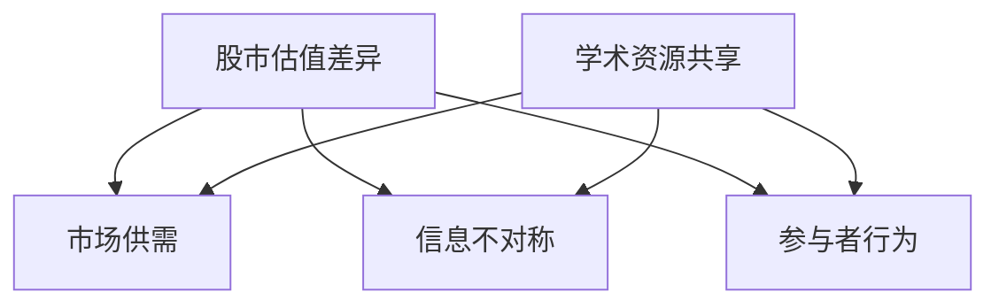
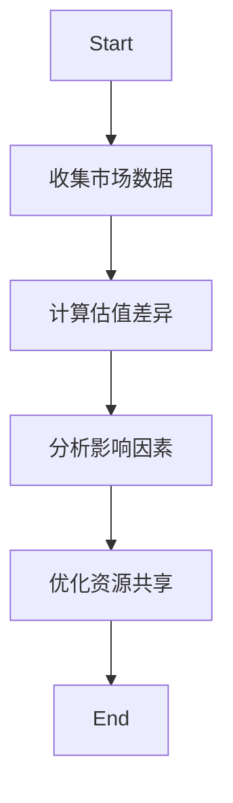
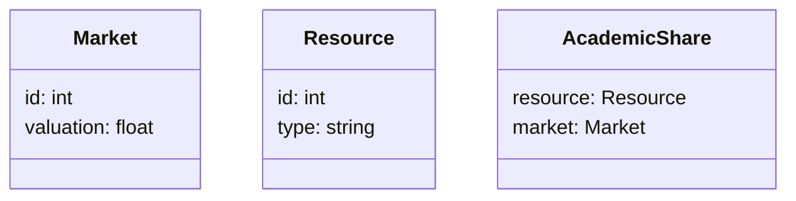
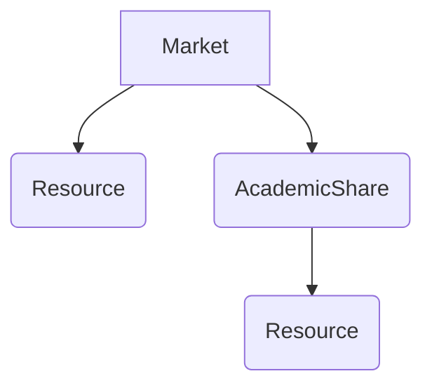

                 


# 股市估值差异对国际学术资源共享的影响

> **关键词**：股市估值差异、学术资源共享、信息不对称、知识共享机制、开放获取运动

> **摘要**：本文探讨股市估值差异如何影响国际学术资源共享。通过分析信息不对称、市场供需和参与者行为对股市估值差异的形成，以及学术资源共享的现状与挑战，本文提出通过优化资源共享机制和利用技术手段减少估值差异，从而推动学术资源共享的公平性和效率。

---

## 第一章：背景介绍

### 1.1 问题背景

#### 1.1.1 股市估值差异的定义与影响
股市估值差异指的是同一资产在不同市场、不同时间或不同投资者中的价值差异。这种差异源于信息不对称、市场效率和参与者行为等因素，可能导致资源分配不均。

#### 1.1.2 学术资源共享的现状与挑战
学术资源共享面临信息壁垒、利益分配和制度性障碍等问题，影响知识的传播和利用。特别是在跨国合作中，资源分配不均可能导致学术不平等。

#### 1.1.3 股市估值差异与学术资源共享的关联性
股市估值差异可能影响学术资源的分配，进而影响资源共享的效率和公平性。例如，高估值市场可能吸引更多资源，而低估值市场可能被忽视。

### 1.2 问题描述

#### 1.2.1 股市估值差异的具体表现形式
- 不同市场的估值差异
- 同一市场不同时间的估值波动
- 不同投资者对同一资产的估值差异

#### 1.2.2 学术资源共享的障碍与推动因素
- 制度障碍：专利保护、版权问题
- 技术障碍：信息孤岛、数据共享困难
- 推动因素：开放获取运动、国际合作

#### 1.2.3 股市估值差异如何影响学术资源共享
高估值可能导致资源过度集中，低估值可能导致资源分配不足，影响学术研究的均衡发展。

### 1.3 问题解决

#### 1.3.1 通过股市估值差异优化学术资源共享的思路
- 利用低估值市场的机会，推动资源重新分配
- 通过高估值市场的经验，优化资源共享机制

#### 1.3.2 学术资源共享机制的改进方案
- 推动开放获取运动，降低信息壁垒
- 建立跨市场的合作机制，促进资源流动

#### 1.3.3 股市估值差异对学术资源共享的长期影响
长期来看，合理分配资源有助于学术研究的均衡发展，避免资源过度集中导致的效率下降。

### 1.4 边界与外延

#### 1.4.1 股市估值差异的边界条件
- 市场效率
- 信息透明度
- 政策监管

#### 1.4.2 学术资源共享的边界条件
- 制度约束
- 技术限制
- 参与者意愿

#### 1.4.3 两者的相互作用与外延
股市估值差异和学术资源共享的相互作用可能扩展到更广泛的经济和社会领域，影响技术创新和知识传播。

### 1.5 核心概念

#### 1.5.1 股市估值差异的核心要素
- 市场供需
- 信息不对称
- 参与者行为

#### 1.5.2 学术资源共享的核心要素
- 知识产权
- 制度机制
- 技术平台

#### 1.5.3 两者的概念结构与相互关系
股市估值差异影响资源分配，进而影响学术资源共享的效率和公平性。

---

## 第二章：核心概念与联系

### 2.1 股市估值差异的原理

#### 2.1.1 市场供需与估值差异的形成
供需失衡导致价格差异，信息不对称加剧估值差异。

#### 2.1.2 信息不对称对估值差异的影响
信息不透明导致买方和卖方对资产价值的认知差异，加剧估值差异。

#### 2.1.3 市场参与者行为对估值差异的推动
投资者情绪、市场趋势等因素影响资产估值。

### 2.2 学术资源共享的原理

#### 2.2.1 知识共享的内在动力
知识共享促进创新，但需要激励机制。

#### 2.2.2 学术资源共享的公平性与效率
公平分配资源，提高利用效率，避免资源浪费。

#### 2.2.3 学术资源共享的制度性障碍
知识产权保护、利益分配问题限制资源共享。

### 2.3 核心概念对比与联系

#### 2.3.1 核心概念属性对比

| 股市估值差异 | 学术资源共享 |
|--------------|--------------|
| 市场驱动     | 制度驱动     |
| 信息不对称    | 制度障碍     |
| 参与者行为    | 创新需求     |

#### 2.3.2 实体关系图


---

## 第三章：算法原理

### 3.1 股市估值差异的量化



#### 3.1.1 量化方法
使用回归分析量化各因素对估值差异的影响。

#### 3.1.2 Python代码示例
```python
import pandas as pd
import numpy as np

# 示例数据
data = {'market': ['A', 'B', 'C'], 'valuation': [100, 80, 120]}
df = pd.DataFrame(data)

# 计算估值差异
def calculate_valuation_difference(row):
    return abs(row['valuation'] - df['valuation'].mean())

df['difference'] = df.apply(calculate_valuation_difference, axis=1)
print(df)
```

### 3.2 学术资源共享的影响分析

#### 3.2.1 影响因素的权重计算
使用主成分分析确定各因素的权重。

#### 3.2.2 网络模型
构建网络模型分析资源共享的流动路径。

---

## 第四章：数学模型

### 4.1 股市估值差异模型

#### 4.1.1 回归分析
$$ y = \beta_0 + \beta_1x_1 + \beta_2x_2 + \epsilon $$

#### 4.1.2 聚类分析
$$ d_i = \text{distance between market i and j} $$

### 4.2 学术资源共享模型

#### 4.2.1 资源分配模型
$$ R_i = \alpha \cdot D_i + (1-\alpha) \cdot S_i $$

#### 4.2.2 网络模型
$$ N = \{n_1, n_2, ..., n_k\} $$

---

## 第五章：系统架构设计

### 5.1 问题场景介绍

#### 5.1.1 学术资源共享的挑战
信息孤岛、利益分配不均。

#### 5.1.2 股市估值差异的影响
资源分配不均，影响学术研究。

### 5.2 系统功能设计

#### 5.2.1 领域模型类图


#### 5.2.2 系统架构设计


---

## 第六章：项目实战

### 6.1 环境安装

#### 6.1.1 Python环境
安装Python和必要的库（pandas, numpy, matplotlib）。

### 6.2 核心实现

#### 6.2.1 代码实现
```python
import pandas as pd
import numpy as np

# 示例数据
data = {'market': ['A', 'B', 'C'], 'valuation': [100, 80, 120]}
df = pd.DataFrame(data)

# 计算估值差异
df['mean_valuation'] = df['valuation'].mean()
df['difference'] = df['valuation'] - df['mean_valuation']

print(df)
```

#### 6.2.2 代码解读
计算每个市场的估值差异，分析其对学术资源共享的影响。

### 6.3 案例分析

#### 6.3.1 实际案例
分析某市场的估值差异如何影响学术资源共享。

#### 6.3.2 案例总结
总结经验，提出改进建议。

### 6.4 项目小结

---

## 第七章：总结与展望

### 7.1 最佳实践 Tips

#### 7.1.1 技术方面
使用开源工具和技术平台优化资源共享。

#### 7.1.2 制度方面
推动开放获取政策，建立公平的分配机制。

### 7.2 小结
总结全文，强调股市估值差异对学术资源共享的影响，以及优化的思路。

### 7.3 注意事项
避免信息不对称导致的资源分配不均，注重长期效益。

### 7.4 拓展阅读
推荐相关领域的书籍和论文，鼓励深入研究。

---

## 作者信息

**作者：** AI天才研究院/AI Genius Institute & 禅与计算机程序设计艺术 /Zen And The Art of Computer Programming

---

通过以上结构和内容的安排，文章系统地探讨了股市估值差异对国际学术资源共享的影响，结合理论分析和实际案例，提供了多角度的见解和解决方案。

