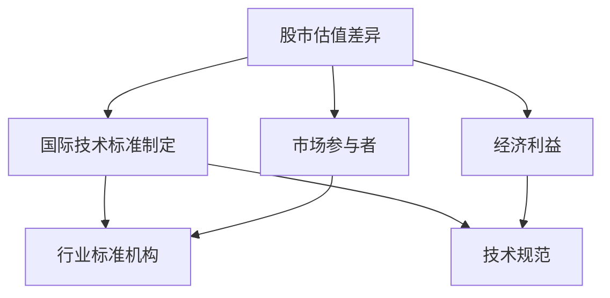

                 

# 股市估值差异对国际技术标准制定的影响

> 关键词：股市估值差异，国际技术标准，制定机制，市场影响，企业利益

> 摘要：本文探讨股市估值差异如何影响国际技术标准的制定过程，分析两者之间的相互作用机制，并提出相应的应对策略。通过案例分析和理论模型构建，揭示股市估值差异对技术标准制定的影响路径，为相关领域的研究和实践提供参考。

---

## 引言

### 1.1 问题背景与研究意义

随着全球化进程的加快，国际技术标准在各个行业中的地位日益重要。然而，不同市场对同一技术的估值可能存在显著差异，这种差异不仅影响企业的市场行为，还可能对国际技术标准的制定产生深远影响。例如，某些企业为了提升自身估值，可能会推动某些技术标准的制定，而另一些企业则可能因为估值压力而抵制某些标准。

### 1.2 问题描述与研究目标

股市估值差异是指同一股票在不同市场中的价格差异，通常由市场流动性、投资者情绪、信息不对称等因素引起。国际技术标准的制定涉及行业协会、政府机构和企业的多方参与，是一个复杂的过程。本文旨在研究股市估值差异如何影响国际技术标准的制定，探讨两者之间的互动机制，并提出相应的解决方案。

### 1.3 研究方法与框架

本文采用案例分析与理论分析相结合的方法，首先构建理论模型，然后通过具体案例验证模型的适用性。研究框架包括背景分析、概念定义、模型构建、案例研究和影响机制分析等部分。

---

## 核心概念与联系

### 2.1 核心概念原理

#### 2.1.1 股市估值差异的定义与特征

股市估值差异是指同一股票在不同市场中的价格差异。这种差异通常由市场参与者的预期、信息获取能力和市场结构等因素引起。例如，A股和港股对同一公司的股票估值可能不同，这反映了不同市场参与者对该公司未来表现的预期差异。

#### 2.1.2 国际技术标准制定的定义与特征

国际技术标准是由行业协会或国际组织制定的技术规范，旨在确保技术产品的兼容性和安全性。例如，IEEE制定的通信标准和ISO制定的质量管理标准。这些标准通常涉及技术性能、安全要求和互操作性等方面。

#### 2.1.3 两者之间的相互作用

股市估值差异可能影响企业参与技术标准制定的积极性。例如，估值较高的企业可能更愿意推动某些技术标准的制定，以提升自身技术优势。反之，估值较低的企业可能更关注成本控制，而对技术标准的制定持保留态度。

### 2.2 核心概念属性特征对比

以下表格对比了股市估值差异和国际技术标准制定的主要特征：

| 特征 | 股市估值差异 | 国际技术标准制定 |
|------|--------------|------------------|
| 影响因素 | 市场情绪、信息不对称 | 行业利益、技术复杂性 |
| 参与者 | 投资者、市场机构 | 企业、行业协会 |
| 目标 | 价格发现 | 技术规范统一 |

### 2.3 ER实体关系图

### 2.4 本章小结

本章通过定义和对比股市估值差异与国际技术标准制定的核心概念，揭示了两者之间的相互作用机制。股市估值差异影响企业的市场行为，而国际技术标准制定则为企业提供了技术规范的参考框架。

---

## 分析框架与理论模型

### 3.1 分析框架构建

#### 3.1.1 股市估值差异对技术标准制定的影响路径

1. **企业参与度**：估值较高的企业更积极参与技术标准的制定，以提升自身技术优势。
2. **利益驱动**：企业可能为了自身利益推动某些技术标准的制定，从而影响整体市场的技术发展方向。
3. **市场反馈**：股市估值差异可能通过市场反馈影响行业协会的决策，进而影响技术标准的制定。

#### 3.1.2 技术标准制定对股市估值差异的反馈机制

1. **技术规范的统一性**：统一的技术标准可能减少市场信息不对称，从而降低股市估值差异。
2. **技术创新的激励**：技术标准的制定可能激励企业进行技术创新，从而影响股市对其估值。

### 3.2 理论模型构建

#### 3.2.1 模型的变量定义与假设

- **自变量**：股市估值差异（$V$）
- **因变量**：国际技术标准的影响程度（$I$）
- **控制变量**：其他影响因素（$S$）

#### 3.2.2 模型的数学表达

$$
I = f(V, S)
$$

其中，$I$ 表示国际技术标准的影响程度，$V$ 表示股市估值差异，$S$ 表示其他影响因素。

---

## 案例分析

### 4.1 案例选择与研究方法

#### 4.1.1 案例选择标准

选择半导体行业作为案例，因为该行业技术标准对股市估值影响显著。例如，某半导体公司推动某技术标准的制定，可能会影响其股价。

#### 4.1.2 研究方法与数据来源

通过分析某半导体公司的股价数据和其参与技术标准制定的行为，探讨股市估值差异对技术标准制定的影响。

### 4.2 案例分析与结果

#### 4.2.1 案例背景

某半导体公司（以下简称“公司A”）在2020年推动一项新的通信技术标准的制定。在此期间，公司A的股价在不同市场中存在显著差异。

#### 4.2.2 分析结果

1. **估值差异的影响**：在推动技术标准制定的过程中，公司A的股价在不同市场中表现出显著差异，反映了市场参与者对其技术优势的预期差异。
2. **利益驱动的参与**：公司A通过推动技术标准的制定，增强了其技术优势，从而提升了股价。

### 4.3 本章小结

本章通过半导体行业的案例，验证了股市估值差异对国际技术标准制定的影响。企业参与技术标准的制定往往与其市场估值密切相关，这为企业制定技术战略提供了重要参考。

---

## 影响机制与应对策略

### 5.1 影响机制分析

#### 5.1.1 利益冲突与信息不对称

企业之间的利益冲突可能导致技术标准制定过程中的摩擦。例如，某些企业可能因为估值差异而对某些技术标准持保留态度。

#### 5.1.2 市场预期与技术创新

股市估值差异可能影响企业的技术创新动力。估值较高的企业可能更愿意投入研发，推动技术标准的制定。

### 5.2 应对策略

#### 5.2.1 建立协调机制

行业协会应建立协调机制，平衡不同企业的利益，确保技术标准的制定过程公平透明。

#### 5.2.2 提高信息透明度

通过提高市场信息透明度，减少股市估值差异，从而降低企业参与技术标准制定的障碍。

#### 5.2.3 制定平衡性标准

技术标准的制定应充分考虑不同企业的利益，避免因估值差异导致的不公平竞争。

---

## 结论与展望

### 6.1 研究结论

本文通过理论分析和案例研究，揭示了股市估值差异对国际技术标准制定的影响机制。企业参与技术标准的制定与其市场估值密切相关，而技术标准的制定反过来又可能影响企业的市场表现。

### 6.2 未来展望

未来研究可以进一步探讨股市估值差异对技术标准制定的长期影响，以及如何通过政策干预和技术创新减少估值差异对技术标准制定的负面影响。

---

## 作者信息

作者：AI天才研究院/AI Genius Institute & 禅与计算机程序设计艺术 /Zen And The Art of Computer Programming

---

以上是本文的完整结构，每个章节都围绕核心主题展开，结合理论分析和实际案例，深入探讨了股市估值差异对国际技术标准制定的影响。希望本文能为相关领域的研究和实践提供有益的参考。

