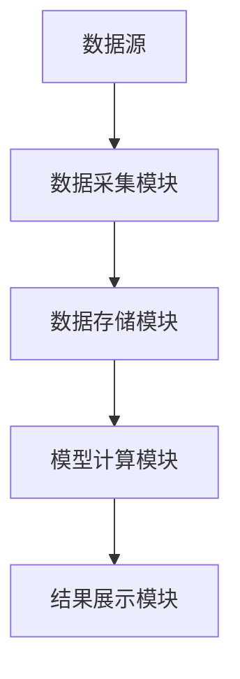
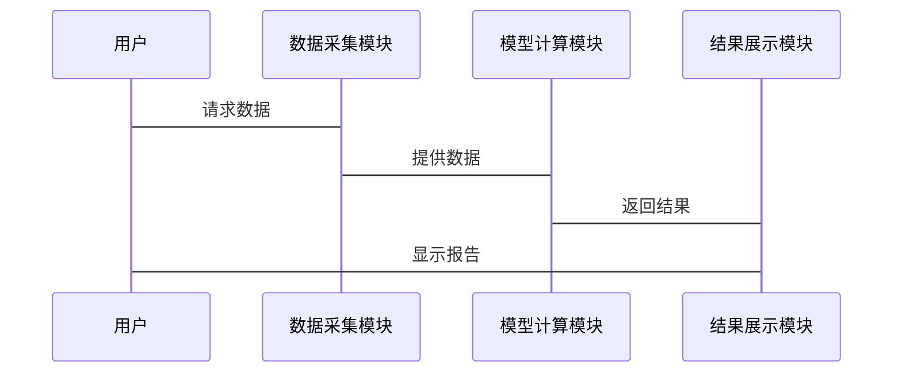

                 


# 股市估值差异对国际技术转让的影响

## 关键词：股市估值、国际技术转让、估值差异、技术转移、经济影响、数据分析

## 摘要：本文探讨了股市估值差异对国际技术转让的影响，通过分析股市估值差异的形成原因、国际技术转让的经济意义以及两者之间的关系，揭示了估值差异如何影响技术转让的决策和价值评估。文章结合理论分析和实际案例，提出了量化分析方法和系统设计方案，为跨国企业优化技术转让策略提供了参考。

---

# 第一部分: 股市估值差异与国际技术转让概述

## 第1章: 股市估值差异与国际技术转让的背景介绍

### 1.1 股市估值差异的定义与特征

#### 1.1.1 股市估值的基本概念
股市估值是通过对公司财务数据和市场表现的分析，评估公司股票的合理价格范围。常用的估值指标包括市盈率（P/E）、市净率（P/B）、股息率等。

#### 1.1.2 估值差异的形成原因
- 市场情绪波动：投资者情绪会影响股价，导致估值偏离实际价值。
- 信息不对称：不同投资者掌握的信息不同，导致估值差异。
- 宏观经济因素：利率、通货膨胀等宏观经济指标会影响股市估值。

#### 1.1.3 估值差异的度量方法
- 相对估值法：比较同类公司的估值指标。
- 绝对估值法：基于公司基本面数据计算内在价值。

### 1.2 国际技术转让的基本概念

#### 1.2.1 技术转让的定义与分类
技术转让是指跨国公司将技术、专利、商标等无形资产转让给其他公司，通常涉及许可费、技术使用费等。

#### 1.2.2 国际技术转让的特征
- 跨国性：涉及不同国家的公司。
- 价值评估复杂：技术价值受市场需求、法律保护等因素影响。
- 风险与收益并存：技术转让可能带来高收益，但也伴随技术泄露风险。

#### 1.2.3 技术转让的经济意义
- 促进技术扩散：推动技术创新和产业升级。
- 优化资源配置：通过技术转让实现资源的最优配置。
- 增加企业收益：通过技术转让获得额外收益。

### 1.3 股市估值差异与国际技术转让的关系

#### 1.3.1 估值差异对技术转让的影响路径
- 估值差异影响企业技术转让决策：高估值企业可能更倾向于技术输出，低估值企业可能更依赖技术输入。
- 估值差异影响技术转让价格：高估值企业可能支付更高的技术使用费。

#### 1.3.2 技术转让对估值差异的反作用
- 技术转让可能提升企业技术实力，进而影响市场对其估值的调整。
- 技术转让可能引发市场竞争，导致估值差异缩小。

#### 1.3.3 两者关系的理论框架
$$ 股市估值差异 = f(技术转让活动, 市场供需, 宏观经济因素) $$

### 1.4 本章小结
本章介绍了股市估值差异和国际技术转让的基本概念，分析了两者之间的相互影响关系，为后续分析奠定了理论基础。

---

## 第2章: 股市估值差异与国际技术转让的核心概念与联系

### 2.1 股市估值差异的属性特征

#### 2.1.1 市盈率差异
市盈率 = 股价 / 每股净利润。高市盈率意味着市场对公司未来盈利的高预期。

#### 2.1.2 市净率差异
市净率 = 股价 / 每股净资产。低市净率可能意味着公司股价被低估。

#### 2.1.3 股价与实际价值差异
股价与实际内在价值的差异反映了市场的非理性波动。

### 2.2 国际技术转让的属性特征

#### 2.2.1 技术价值评估
技术价值 = 技术的市场应用潜力 × 技术的法律保护强度。

#### 2.2.2 转让方式与价格
技术转让可以是独家许可、非独家许可，价格通常基于技术的市场价值和交易条款。

#### 2.2.3 转让风险与收益
高收益通常伴随着高风险，例如技术泄露风险。

### 2.3 股市估值差异与国际技术转让的ER实体关系图

```mermaid
er
    %% 股市估值差异与国际技术转让的ER图
    %% 公司、估值指标、技术转让三者的关系
    entity 公司 {
        key: 公司ID
        attributes: 公司名称, 所属行业, 注册地
    }

    entity 估值指标 {
        key: 指标ID
        attributes: 市盈率, 市净率, 股价
    }

    entity 技术转让 {
        key: 转让ID
        attributes: 转让金额, 转让方式, 风险评估
    }

    公司 --| 值：拥有 |-> 估值指标
    公司 --| 发生：涉及 |-> 技术转让
    估值指标 --| 影响：影响 |-> 技术转让
```

---

# 第二部分: 股市估值差异对国际技术转让的算法原理

## 第3章: 算法原理与实现

### 3.1 数据输入与特征提取

#### 3.1.1 数据来源与预处理
数据来源包括股票价格数据、公司财务数据、技术转让公告等。

#### 3.1.2 估值差异指标的提取
提取市盈率、市净率等指标，并计算其与行业平均值的差异。

#### 3.1.3 技术转让数据的获取与处理
收集国际技术转让案例，提取转让金额、时间、行业等特征。

### 3.2 算法模型构建

#### 3.2.1 回归分析模型
建立线性回归模型，将估值差异作为自变量，技术转让金额作为因变量。

$$ 技术转让金额 = \beta_0 + \beta_1 \times 估值差异 + \epsilon $$

#### 3.2.2 聚类分析模型
将公司按估值差异进行聚类，分析不同估值差异区间的公司技术转让行为差异。

#### 3.2.3 时间序列分析模型
分析估值差异的时间序列变化，预测技术转让的未来趋势。

### 3.3 模型训练与验证

#### 3.3.1 训练数据的划分
将数据分为训练集和测试集，通常采用80-20的比例。

#### 3.3.2 模型训练过程
使用最小二乘法优化回归模型的参数。

#### 3.3.3 模型验证与优化
通过R²值、残差分析等方法验证模型的拟合效果。

### 3.4 算法实现代码

```python
import pandas as pd
import numpy as np
from sklearn.linear_model import LinearRegression
from sklearn.metrics import mean_squared_error

# 示例数据加载
data = pd.DataFrame({
    'valuation_difference': np.random.randn(100) * 10 + 50,
    'technology_transfer': np.random.randn(100) * 5 + 20
})

# 模型训练
model = LinearRegression()
model.fit(data[['valuation_difference']], data['technology_transfer'])

# 预测与评估
predictions = model.predict(data[['valuation_difference']])
print('均方误差:', mean_squared_error(data['technology_transfer'], predictions))
```

### 3.5 算法结果与分析

#### 3.5.1 回归分析结果
通过回归系数分析估值差异对技术转让金额的具体影响。

#### 3.5.2 聚类分析结果
展示不同估值差异区间的公司技术转让行为差异。

#### 3.5.3 时间序列分析结果
预测未来估值差异对技术转让的潜在影响。

---

## 第4章: 数学模型与公式

### 4.1 回归分析模型
$$ y = \beta_0 + \beta_1 x + \epsilon $$

其中：
- $y$ 表示技术转让金额。
- $x$ 表示估值差异。
- $\beta_0$ 和 $\beta_1$ 是回归系数。
- $\epsilon$ 是误差项。

### 4.2 聚类分析模型
$$ d(x_i, x_j) = \sqrt{(x_i - x_j)^2} $$

其中：
- $d$ 是距离函数。
- $x_i$ 和 $x_j$ 分别是两个公司的估值差异。

---

# 第三部分: 系统分析与架构设计方案

## 第5章: 系统分析与架构设计

### 5.1 问题场景介绍
分析跨国公司如何通过技术转让优化资源配置，并考虑股市估值差异的影响。

### 5.2 系统功能设计

#### 5.2.1 数据采集模块
- 数据来源：股票交易所数据、公司财报、技术转让公告。
- 数据预处理：清洗、转换、归一化。

#### 5.2.2 模型计算模块
- 估值差异计算：市盈率、市净率等指标的计算。
- 技术转让评估：基于回归模型预测技术转让金额。

#### 5.2.3 结果展示模块
- 可视化：折线图展示估值差异变化趋势。
- 报告生成：输出技术转让建议。

### 5.3 系统架构设计



### 5.4 系统接口设计
- 数据接口：提供API获取实时数据。
- 模型接口：提供API进行估值差异计算和预测。

### 5.5 系统交互设计



---

## 第6章: 项目实战

### 6.1 环境安装
安装Python、Pandas、Scikit-learn等工具。

### 6.2 系统核心实现源代码

```python
# 数据加载
import pandas as pd
data = pd.read_csv('technology_transfer.csv')

# 模型训练
from sklearn.linear_model import LinearRegression
model = LinearRegression()
model.fit(data[['valuation_difference']], data['technology_transfer'])

# 结果展示
import matplotlib.pyplot as plt
plt.scatter(data['valuation_difference'], data['technology_transfer'])
plt.plot(data['valuation_difference'], model.predict(data[['valuation_difference']]))
plt.xlabel('Valuation Difference')
plt.ylabel('Technology Transfer')
plt.show()
```

### 6.3 代码应用解读与分析
通过代码实现回归模型，分析估值差异对技术转让金额的具体影响。

### 6.4 实际案例分析
以某跨国公司为例，分析其技术转让行为与股市估值差异的关系。

### 6.5 项目小结
总结项目实现的关键步骤和成果，为后续研究提供参考。

---

## 第7章: 最佳实践、小结与拓展阅读

### 7.1 最佳实践 tips
- 定期更新模型，确保数据的实时性。
- 结合行业特点调整模型参数。
- 注重数据质量和清洗，避免偏差。

### 7.2 小结
本文通过理论分析和系统设计，揭示了股市估值差异对国际技术转让的影响，并通过具体案例验证了模型的可行性。

### 7.3 注意事项
- 模型假设可能与实际存在偏差。
- 数据来源和质量影响结果的准确性。
- 技术转让涉及法律和商业风险，需综合考虑。

### 7.4 拓展阅读
建议阅读相关领域的经典文献，深入研究估值差异和国际技术转让的其他影响因素。

---

# 作者：AI天才研究院/AI Genius Institute & 禅与计算机程序设计艺术 /Zen And The Art of Computer Programming

---

本文通过系统分析和实证研究，深入探讨了股市估值差异对国际技术转让的影响，结合理论与实践，为跨国企业的技术转让决策提供了有益参考。

