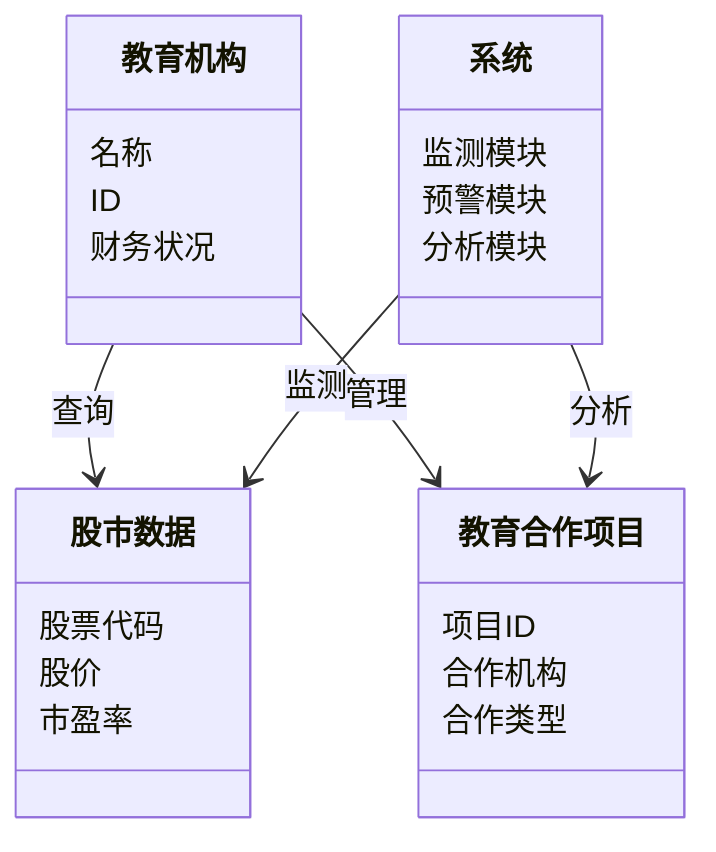
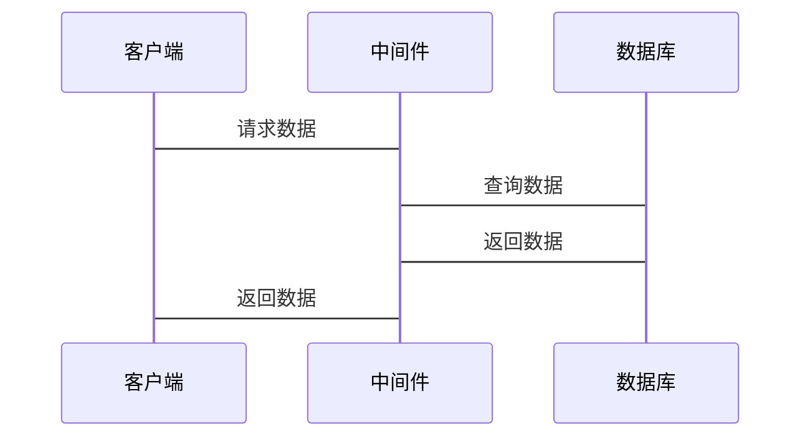

                 


# 股市估值差异对国际教育合作的影响

---

## 关键词：
股市估值、国际教育合作、教育机构、数据建模、算法分析

---

## 摘要：
本文系统分析了股市估值差异对国际教育合作的影响，从理论到实践，深入探讨了股市估值差异的定义、形成机制，以及其对国际教育合作的多维度影响。通过构建数学模型和算法，量化股市估值差异对教育合作的潜在影响，并提出了一套基于数据驱动的监测与预警系统。本文还结合实际案例，展示了如何通过算法和系统设计，帮助教育机构更好地应对股市估值差异带来的挑战。

---

## 第一部分：背景介绍与核心概念

### 第1章：股市估值差异与国际教育合作的背景

#### 1.1 股市估值差异的基本概念
股市估值差异是指同一资产在不同股票市场中的价格差异。这种差异可能由市场效率、信息不对称、汇率波动等多种因素引起。以下是股市估值差异的关键点：

- **定义**：股市估值差异是指同一资产在不同股票市场中的价格差异。
- **计算方法**：通常通过比较相同资产在不同市场的价格来衡量。
- **形成原因**：市场效率、信息不对称、汇率波动、税收政策差异等。
- **衡量指标**：市盈率（P/E）、市净率（P/B）、市值等。

#### 1.2 国际教育合作的定义与形式
国际教育合作是指跨国教育机构之间的合作，形式多样，包括学生交换、合作办学、科研合作等。以下是关键点：

- **定义**：跨国教育机构之间的合作，旨在促进教育资源共享和学术交流。
- **主要形式**：
  - 学生交换：如交换生项目。
  - 合作办学：如联合学位项目。
  - 科研合作：如联合研究项目。
- **影响因素**：政策、经济、文化、教育水平等。

#### 1.3 股市估值差异与国际教育合作的关系
股市估值差异与国际教育合作之间存在复杂的互动关系：

- **影响路径**：
  - 股市估值差异影响教育机构的财务状况，进而影响其国际合作能力。
  - 教育合作可能影响教育机构的市场估值。
- **反向影响**：
  - 国际教育合作可能提升教育机构的声誉，从而影响其股价。
- **边界与外延**：
  - 股市估值差异主要影响教育机构的财务实力，而国际教育合作则更多涉及资源分配和学术交流。

### 第2章：问题背景与问题描述

#### 2.1 股市估值差异的现状分析
当前，全球主要股市的估值差异显著，尤其是在新兴市场与发达国家市场之间。以下是关键点：

- **全球主要股市的估值差异现状**：
  - 新兴市场（如中国、印度）的市盈率通常高于发达国家市场（如美国、欧洲）。
  - 汇率波动加剧估值差异。
- **估值差异的影响**：
  - 影响跨国投资决策。
  - 影响跨国企业的财务表现。

#### 2.2 国际教育合作面临的问题
国际教育合作在实践中面临诸多挑战：

- **问题**：
  - 财务风险：教育机构的财务状况可能因股市波动而受到影响。
  - 资源分配不均：部分国家的教育机构因股市估值差异难以参与国际合作。
- **案例**：
  - 某国教育机构因股市估值过低，难以吸引国际合作伙伴。

#### 2.3 股市估值差异与国际教育合作的关系
股市估值差异与国际教育合作的关系复杂：

- **直接关系**：
  - 股市估值差异直接影响教育机构的财务实力，从而影响其国际合作能力。
- **间接关系**：
  - 教育合作可能影响教育机构的市场估值，从而间接影响股市估值差异。

---

## 第二部分：核心概念与联系

### 第3章：核心概念与联系

#### 3.1 核心概念的原理
股市估值差异与国际教育合作的核心原理如下：

- **股市估值差异的原理**：
  - 市场效率：信息不对称导致价格差异。
  - 经济因素：汇率、税收政策等影响估值。
- **国际教育合作的原理**：
  - 资源共享：通过合作实现资源优化配置。
  - 文化交流：促进跨国文化交流。

#### 3.2 核心概念的属性对比
以下是股市估值差异与国际教育合作的属性对比：

| 属性         | 股市估值差异              | 国际教育合作              |
|--------------|---------------------------|---------------------------|
| 影响因素      | 市场效率、经济政策          | 政策、经济、文化          |
| 主要形式      | 价格差异                  | 学生交换、合作办学        |
| 目标          | 优化市场资源配置            | 促进学术交流与资源合作    |

#### 3.3 ER实体关系图
以下是股市估值差异与国际教育合作的ER实体关系图：

```mermaid
er
  actor 教育机构
  actor 国际合作伙伴
  actor 投资者
  entity 股市数据
  entity 教育合作项目
  entity 估值差异
  relation 参与 (教育机构 - 估值差异)
  relation 参与 (国际合作伙伴 - 估值差异)
  relation 管理 (教育机构 - 教育合作项目)
  relation 参与 (投资者 - 股市数据)
```

---

## 第三部分：算法原理讲解

### 第4章：算法原理与实现

#### 4.1 算法原理
以下是用于分析股市估值差异对国际教育合作影响的算法原理：

- **多元回归分析**：
  - 通过回归模型，量化股市估值差异对教育合作的影响。
  - 模型公式：
    $$ y = \beta_0 + \beta_1x_1 + \beta_2x_2 + \epsilon $$
    其中，$y$ 是教育合作指数，$x_1$ 是股市估值差异，$x_2$ 是其他控制变量。

#### 4.2 算法实现
以下是Python实现的代码示例：

```python
import pandas as pd
import numpy as np
from sklearn.linear_model import LinearRegression

# 数据加载
data = pd.read_csv('education_partners.csv')

# 特征选择
X = data[['stock_valuation_diff', 'economic_factors', 'policy_factors']]
y = data['education_partnerships']

# 模型训练
model = LinearRegression()
model.fit(X, y)

# 结果解读
print(f"回归系数：{model.coef_}")
print(f"截距：{model.intercept_}")
```

#### 4.3 代码解读
- **数据加载**：从CSV文件加载数据，包括股市估值差异、经济因素、政策因素等。
- **特征选择**：选择相关变量，如股市估值差异、经济因素、政策因素。
- **模型训练**：使用线性回归模型训练数据。
- **结果解读**：回归系数和截距解释了变量对教育合作的影响。

---

## 第四部分：系统分析与架构设计

### 第5章：系统分析与架构设计

#### 5.1 问题场景介绍
教育机构面临股市估值差异带来的财务风险，影响其国际合作能力。

#### 5.2 项目介绍
设计一个基于数据驱动的监测与预警系统，帮助教育机构应对股市估值差异带来的挑战。

#### 5.3 系统功能设计
以下是系统功能设计的领域模型：



#### 5.4 系统架构设计
以下是系统架构设计的mermaid图：


#### 5.5 系统接口设计
以下是系统接口设计的mermaid序列图：



---

## 第五部分：项目实战

### 第6章：项目实战

#### 6.1 环境安装
- **工具**：Python、Pandas、Scikit-learn、Mermaid
- **数据源**：公开股市数据和教育合作数据。

#### 6.2 核心实现
以下是Python实现的核心代码：

```python
import pandas as pd
import numpy as np
from sklearn.linear_model import LinearRegression

# 数据加载
data = pd.read_csv('education_partners.csv')

# 特征选择
X = data[['stock_valuation_diff', 'economic_factors', 'policy_factors']]
y = data['education_partnerships']

# 模型训练
model = LinearRegression()
model.fit(X, y)

# 预测与评估
predictions = model.predict(X)
print(f"预测结果：{predictions}")
```

#### 6.3 应用解读与分析
- **预测结果**：模型预测教育合作的可能性。
- **实际案例分析**：分析某国教育机构的案例，解读模型结果。

#### 6.4 项目小结
通过实战，验证了算法的有效性，并展示了如何将理论应用于实际。

---

## 第六部分：结论与展望

### 第7章：结论与展望

#### 7.1 结论
- 股市估值差异对国际教育合作有显著影响。
- 数据驱动的方法能够有效量化这种影响。

#### 7.2 展望
- 进一步研究股市估值差异的长期影响。
- 开发更多智能化的监测与预警系统。

---

## 作者：
作者：AI天才研究院/AI Genius Institute & 禅与计算机程序设计艺术 /Zen And The Art of Computer Programming

---

通过以上结构，我们可以系统地分析股市估值差异对国际教育合作的影响，并提出有效的解决方案。

