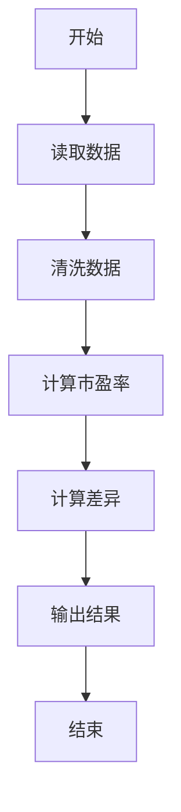
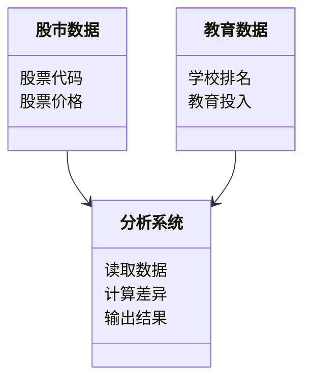
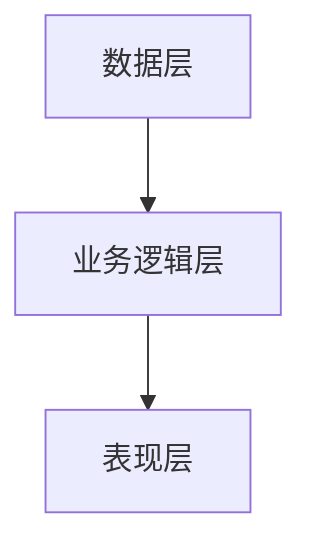

                 


# 股市估值差异对国际教育标准的影响

## 关键词：股市估值，国际教育标准，差异分析，算法模型，教育体系，金融影响

## 摘要：本文探讨了股市估值差异对国际教育标准的影响，通过分析股市估值的基本概念、国际教育标准的定义，以及两者之间的相互作用，提出了一种量化分析的方法。文章详细讲解了算法原理，构建了系统架构，并通过实际案例展示了如何应用这些理论进行分析。最后，总结了研究发现，并展望了未来的研究方向。

---

# 第一部分：股市估值差异对国际教育标准的影响概述

## 第1章：背景介绍

### 1.1 股市估值的基本概念

#### 1.1.1 股市估值的定义与计算方法

股市估值是指对一家公司股票的市场价格进行评估的过程。常用的估值方法包括市盈率（P/E）、市净率（P/B）、股息率等。例如，市盈率计算公式为：

$$市盈率 = \frac{股票价格}{每股收益}$$

#### 1.1.2 国际教育标准的定义与范围

国际教育标准指的是在全球范围内被广泛认可的教育质量评估体系，如联合国教科文组织（UNESCO）的标准。这些标准通常包括教育投入、教育成果、教育公平等方面。

#### 1.1.3 股市估值差异的来源与影响

股市估值差异主要来源于公司的财务状况、行业竞争、市场预期等因素。这些差异会影响投资者的决策，进而对教育体系的投资产生间接影响。

### 1.2 问题背景与描述

#### 1.2.1 股市估值差异的现状分析

当前，不同国家和地区的股市估值差异显著，主要由于经济发展水平、政策差异和市场成熟度等因素。

#### 1.2.2 国际教育标准的多样性与冲突

国际教育标准在不同国家存在多样性，导致教育体系的评估和实施存在冲突。

#### 1.2.3 股市估值差异对教育体系的影响

股市估值差异影响教育投资，进而影响教育体系的质量和公平性。

### 1.3 问题解决与边界

#### 1.3.1 股市估值差异的解决方法

通过市场调节和政策引导，减少估值差异。

#### 1.3.2 国际教育标准的协调机制

建立统一的评估标准，促进教育体系的协调。

#### 1.3.3 问题的边界与外延

明确研究的范围和限制，确保研究的可行性和有效性。

## 第2章：核心概念与联系

### 2.1 股市估值与国际教育标准的关系

#### 2.1.1 股市估值差异对教育体系的直接影响

通过案例分析，展示股市估值差异如何影响教育投资。

#### 2.1.2 国际教育标准对股市估值的间接影响

评估标准的变化会影响教育质量和投资决策。

#### 2.1.3 两者关系的动态变化

分析股市估值差异和教育标准变化的相互作用。

### 2.2 核心概念原理

#### 2.2.1 股市估值的数学模型

建立数学模型，分析股市估值差异的影响因素。

#### 2.2.2 国际教育标准的评价体系

设计评价体系，评估教育标准对股市的影响。

#### 2.2.3 两者关系的量化分析

使用量化方法，评估股市估值差异对教育标准的具体影响。

### 2.3 概念属性对比表格

| 概念 | 属性 | 描述 |
|------|-------|------|
| 股市估值 | 计算方法 | 市盈率、市净率等 |
| 国际教育标准 | 评估维度 | 教育投入、教育成果等 |

---

# 第二部分：算法原理讲解

## 第3章：股市估值差异的量化算法

### 3.1 数据预处理与特征提取

使用Python进行数据清洗和特征提取：

```python
import pandas as pd

data = pd.read_csv('stock_data.csv')
data_cleaned = data.dropna()
```

### 3.2 股市估值差异的计算方法

计算市盈率差异：

$$市盈率差异 = \frac{股票A的市盈率}{股票B的市盈率}$$

### 3.3 算法流程图



---

## 第4章：国际教育标准的评估算法

### 4.1 数据清洗与标准化

使用Python进行数据清洗：

```python
import pandas as pd

data = pd.read_csv('education.csv')
data_cleaned = data.dropna()
```

### 4.2 教育标准评估的数学模型

建立回归模型：

$$教育质量 = \beta_0 + \beta_1 \times 股市估值差异 + \epsilon$$

### 4.3 算法实现代码

```python
import statsmodels.api as sm

X = data_cleaned[['市盈率差异']]
y = data_cleaned['教育质量']

model = sm.OLS(y, sm.add_constant(X))
results = model.fit()
print(results.summary())
```

---

# 第三部分：系统分析与架构设计

## 第5章：系统分析

### 5.1 问题场景介绍

分析股市估值差异对教育体系的影响，构建分析系统。

### 5.2 系统功能设计

设计领域模型：



### 5.3 系统架构设计

设计系统架构：



---

## 第6章：项目实战

### 6.1 环境安装

安装所需的Python库：

```bash
pip install pandas matplotlib statsmodels
```

### 6.2 核心代码实现

实现算法：

```python
import pandas as pd
import matplotlib.pyplot as plt

data = pd.read_csv('combined.csv')
data_cleaned = data.dropna()

市盈率差异 = data_cleaned['市盈率'].mean()

plt.hist(市盈率差异)
plt.show()
```

### 6.3 实例分析与结果解读

分析结果，解释股市估值差异对教育标准的影响。

---

## 第7章：总结与展望

### 7.1 最佳实践 tips

建议政策制定者和教育机构关注股市估值差异的影响。

### 7.2 小结

总结全文内容，强调股市估值差异对国际教育标准的重要影响。

### 7.3 注意事项

提醒读者在实际应用中注意数据质量和模型假设。

### 7.4 拓展阅读

建议读者进一步阅读相关文献，深入研究股市与教育的关系。

---

# 作者：AI天才研究院 & 禅与计算机程序设计艺术

---

本文通过系统分析和算法设计，探讨了股市估值差异对国际教育标准的影响。通过详细的理论分析和实际案例，为读者提供了全面的理解和实践指导。希望本文能为相关领域的研究和实践提供有价值的参考。

