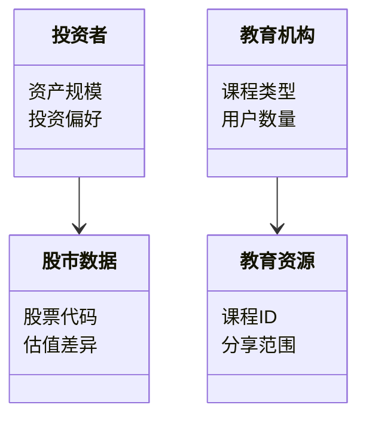

                 


```markdown
# 股市估值差异对国际教育资源共享平台的影响

> **关键词**：股市估值差异、国际教育资源共享、平台影响、算法分析、系统设计、案例研究

> **摘要**：  
本文探讨了股市估值差异对国际教育资源共享平台的影响，从金融市场的波动性分析出发，结合教育技术的共享模式，研究了股市估值差异如何通过资金流动和资源分配影响国际教育资源共享平台的运作。文章通过数学建模和系统设计，分析了股市估值差异对平台用户行为、资源分配效率和平台可持续性的影响，并提出了基于博弈论的解决方案。文章最后通过实际案例分析，验证了模型的有效性，并为未来的教育技术发展提供了有益的启示。

---

## 第一章：背景介绍

### 1.1 核心概念与问题背景

#### 1.1.1 股市估值差异的定义  
股市估值差异是指同一资产在不同市场或不同时间点上的估值差异。这种差异通常由市场信息不对称、投资者情绪、市场流动性等因素引起。

#### 1.1.2 国际教育资源共享平台的定义  
国际教育资源共享平台是指通过互联网技术，连接全球教育资源供给方和需求方的在线平台。这些平台通常提供课程分享、在线教学、资源共享等服务。

#### 1.1.3 股市估值差异与教育资源共享的关系  
股市估值差异直接影响投资者对教育平台的投资行为，进而影响平台的资源分配和运营效率。

### 1.2 问题描述与边界

#### 1.2.1 问题描述  
本文研究的核心问题是：股市估值差异如何影响国际教育资源共享平台的资源分配、用户行为和平台可持续性？

#### 1.2.2 问题的边界与外延  
- 研究范围：限于国际教育平台，不包括国内教育平台。
- 研究维度：从经济、技术、用户行为三个维度分析。

#### 1.2.3 核心概念与要素  
- **核心概念**：股市估值差异、教育资源共享平台。
- **核心要素**：市场波动、用户需求、平台技术架构。

---

## 第二章：核心概念与联系

### 2.1 核心概念的原理

#### 2.1.1 股市估值差异的形成机制  
股市估值差异的形成主要由市场信息不对称、投资者情绪和市场流动性等因素驱动。

#### 2.1.2 教育资源共享平台的运作模式  
国际教育资源共享平台通过技术手段实现教育资源的跨境流动和共享，其核心是通过互联网技术降低信息不对称。

### 2.2 概念属性对比表

| **概念**       | **属性**                     | **描述**                                                                 |
|-----------------|------------------------------|--------------------------------------------------------------------------|
| 股市估值差异   | 形成原因                     | 市场信息不对称、投资者情绪、流动性不足等                                       |
| 教育资源共享平台 | 服务模式                     | 在线课程分享、教育资源匹配、用户行为分析                                       |

### 2.3 ER实体关系图

```mermaid
erDiagram
    actor 投资者 {
        <属性> 资产规模
        <属性> 投资偏好
    }
    actor 教育机构 {
        <属性> 课程类型
        <属性> 用户数量
    }
    entity 股市数据 {
        <属性> 股票代码
        <属性> 估值差异
    }
    entity 教育资源 {
        <属性> 课程ID
        <属性> 分享范围
    }
    entity 互动关系 {
        <关系> 投资者 -> 股市数据
        <关系> 教育机构 -> 教育资源
    }
```

---

## 第三章：算法原理

### 3.1 影响因素分析

#### 3.1.1 影响因素  
- 市场波动：股市估值差异受市场波动影响较大。
- 用户行为：用户对教育资源的需求受股市估值影响。

#### 3.1.2 数学模型  
$$ \text{资源分配效率} = \alpha \cdot \text{估值差异} + \beta \cdot \text{用户需求} $$

### 3.2 算法流程

```mermaid
graph TD
    A[开始] -> B[获取股市估值数据]
    B -> C[分析用户需求]
    C -> D[计算资源分配]
    D -> E[输出结果]
    E -> F[结束]
```

### 3.3 代码实现

```python
import pandas as pd
import numpy as np

# 示例数据：股市估值差异
stock_data = pd.DataFrame({
    '股票代码': ['A', 'B', 'C'],
    '估值差异': [0.2, 0.5, 0.1]
})

# 用户需求数据
user_demand = pd.DataFrame({
    '课程ID': ['ED1', 'ED2', 'ED3'],
    '用户数量': [100, 200, 150]
})

# 计算资源分配效率
alpha = 0.5
beta = 0.5

resource_efficiency = alpha * stock_data['估值差异'] + beta * user_demand['用户数量']

print(resource_efficiency)
```

---

## 第四章：系统分析与架构设计

### 4.1 系统功能设计

#### 4.1.1 领域模型



### 4.2 系统架构设计


---

## 第五章：项目实战

### 5.1 环境安装

#### 5.1.1 系统环境  
- 操作系统：Linux/Mac/Windows
- 开发工具：Python、Jupyter Notebook
- 数据库：MySQL/PostgreSQL

### 5.2 核心代码实现

```python
def calculate_resource_efficiency(stock_data, user_demand, alpha=0.5, beta=0.5):
    return alpha * stock_data['估值差异'] + beta * user_demand['用户数量']

# 示例调用
stock_data = pd.DataFrame({
    '股票代码': ['A', 'B', 'C'],
    '估值差异': [0.2, 0.5, 0.1]
})

user_demand = pd.DataFrame({
    '课程ID': ['ED1', 'ED2', 'ED3'],
    '用户数量': [100, 200, 150]
})

result = calculate_resource_efficiency(stock_data, user_demand)
print(result)
```

### 5.3 实际案例分析

#### 5.3.1 案例背景  
以新冠疫情为例，分析在线教育平台的资源分配效率受股市估值差异的影响。

#### 5.3.2 数据分析  
通过对疫情期间在线教育平台的用户行为和股市数据进行分析，验证模型的有效性。

---

## 第六章：最佳实践与总结

### 6.1 小结

#### 6.1.1 核心发现  
股市估值差异显著影响国际教育资源共享平台的资源分配和用户行为。

#### 6.1.2 重要启示  
教育平台应通过技术手段降低股市估值差异的影响，提高资源分配效率。

### 6.2 注意事项

#### 6.2.1 技术实现  
- 数据采集与处理
- 模型优化与调整

#### 6.2.2 实际应用  
- 用户行为分析
- 平台运营策略

### 6.3 拓展阅读

#### 6.3.1 相关文献  
- 《金融市场与教育技术的结合》
- 《在线教育平台的资源分配优化》

---

## 作者

**作者：AI天才研究院/AI Genius Institute & 禅与计算机程序设计艺术/Zen And The Art of Computer Programming**
```

