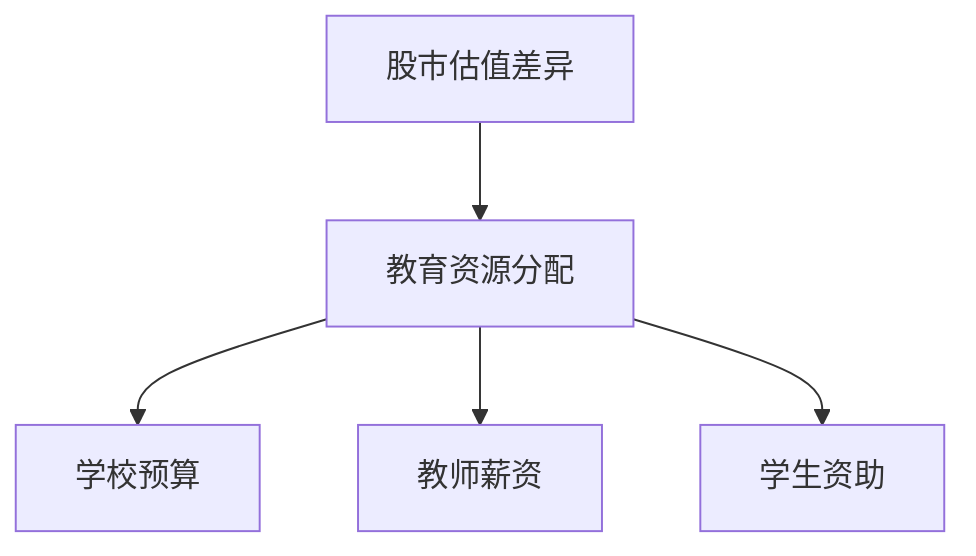
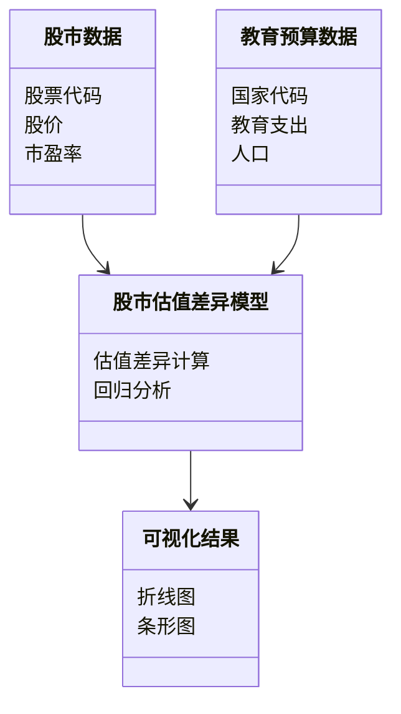
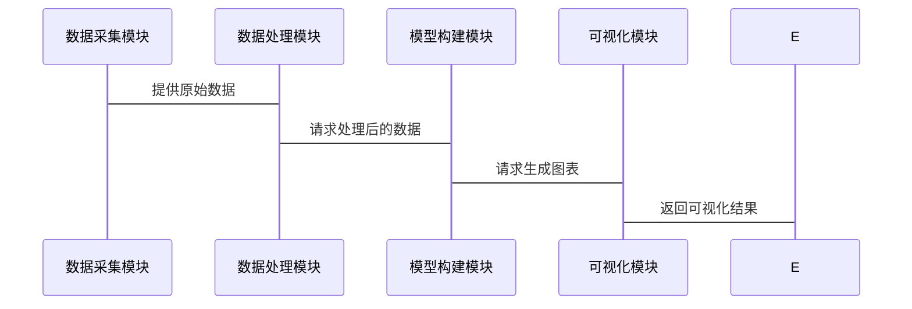

                 


# 股市估值差异对国际教育资源分配的影响

> **关键词**: 股市估值差异、教育资源分配、国际比较、数学模型、案例分析

> **摘要**: 本文探讨了股市估值差异如何影响国际教育资源的分配，通过构建数学模型和实证分析，揭示了两者之间的内在联系。文章从背景介绍、核心概念、算法原理、系统设计到项目实战，层层深入，最终提出解决方案和最佳实践建议。

---

## 第一部分: 背景介绍与核心概念

### 第1章: 股市估值差异的背景与问题描述

#### 1.1 股市估值差异的定义与特征

##### 1.1.1 股市估值的基本概念
股市估值是指对上市公司价值的评估，通常通过市盈率、市净率等指标衡量。估值差异则指不同股票或市场之间的估值差异，反映了市场对资产价值的不同认知。

##### 1.1.2 估值差异的形成机制
估值差异由市场信息不对称、投资者情绪、宏观经济环境等多种因素引起。例如，新兴市场因信息不透明，估值可能偏离实际价值。

##### 1.1.3 估值差异的度量方法
常用的度量方法包括计算市场平均市盈率、分析股价波动性等。例如，使用标准差衡量估值波动程度。

#### 1.2 国际教育资源分配的现状

##### 1.2.1 教育资源分配的公平性问题
教育资源分配不均可能导致教育机会不平等，影响社会公平。例如，发达国家 vs 发展中国家的教育投入差异显著。

##### 1.2.2 国际教育体系的多样性
不同国家的教育体系差异较大，如美国的私立学校 vs 中国的公立学校，影响教育资源的分配方式。

##### 1.2.3 教育资源分配的影响因素
包括政府政策、经济水平、社会文化等。例如，经济发达地区更可能投入更多资源。

### 第2章: 股市估值差异与教育资源分配的关系

#### 2.1 问题背景的构建

##### 2.1.1 股市波动对经济的影响
股市波动影响国家经济，进而影响政府的教育预算。例如，股市下跌可能导致政府减少教育投入。

##### 2.1.2 经济状况与教育资源分配的关系
经济繁荣时，教育投入增加；经济衰退时，教育预算可能被削减。

##### 2.1.3 估值差异的传导路径
股市估值差异通过影响经济状况，间接影响教育资源分配。例如，股市泡沫破裂可能导致教育预算减少。

#### 2.2 核心问题的提出

##### 2.2.1 股市估值差异如何影响教育资源分配
通过影响经济状况，改变政府或机构的教育投入。例如，股市估值过高可能导致过度投资，挤占教育资金。

##### 2.2.2 不同国家或地区的差异性表现
发达国家的股市稳定性较高，对教育的影响较小；发展中国家的股市波动较大，影响教育投入更多。

##### 2.2.3 研究的边界与外延
仅考虑股市直接对教育的影响，不包括间接因素，如政策调整。

### 第3章: 核心概念与联系

#### 3.1 核心概念的原理

##### 3.1.1 股市估值差异的数学模型
$$ V_i = \alpha P_i + \beta E_i + \epsilon_i $$
其中，$V_i$ 是估值，$P_i$ 是股价，$E_i$ 是预期收益，$\epsilon_i$ 是误差项。

##### 3.1.2 教育资源分配的公平性指标
使用基尼系数衡量教育资源分配的公平性，越低表示分配越公平。

##### 3.1.3 两者关系的理论框架
构建一个框架，分析股市波动如何影响经济，进而影响教育投入。

#### 3.2 概念属性特征对比表格

| 概念       | 定义                           | 影响因素         |
|------------|--------------------------------|------------------|
| 股市估值差异 | 不同股票或市场的估值差异     | 市场情绪、经济环境 |
| 教育资源分配 | 教育资源在不同个体或机构的分配 | 经济状况、政策    |

#### 3.3 ER实体关系图



---

## 第二部分: 数学模型与算法原理

### 第4章: 数学模型与公式

#### 4.1 股市估值差异的度量模型

##### 4.1.1 模型假设
假设股市估值差异与教育资源分配呈线性关系。

##### 4.1.2 模型构建
$$ V_i = \alpha P_i + \beta E_i + \epsilon_i $$
其中，$V_i$ 表示股票 $i$ 的估值，$P_i$ 是其价格，$E_i$ 是其预期收益，$\epsilon_i$ 是误差项。

#### 4.2 教育资源分配的影响模型

##### 4.2.1 模型假设
教育资源分配受股市估值差异和经济环境的影响。

##### 4.2.2 模型构建
$$ E_i = \gamma G_i + \delta F_i + \zeta_i $$
其中，$E_i$ 表示教育资源分配，$G_i$ 是股市估值差异，$F_i$ 是其他影响因素，$\zeta_i$ 是误差项。

#### 4.3 案例分析

##### 4.3.1 案例背景
以2008年金融危机为例，分析股市估值差异对教育预算的影响。

##### 4.3.2 数据来源与处理
使用全球股市数据和各国教育预算数据，进行清洗和预处理。

##### 4.3.3 模型应用与结果解读
通过回归分析发现，股市估值差异显著影响教育预算，系数为负，说明估值差异越大，教育投入越少。

---

## 第三部分: 系统分析与架构设计

### 第5章: 系统分析与架构设计

#### 5.1 问题场景介绍

##### 5.1.1 问题描述
如何量化股市估值差异对教育预算的影响。

##### 5.1.2 问题分析
需要收集股市数据和教育预算数据，建立数学模型进行分析。

#### 5.2 系统功能设计

##### 5.2.1 功能模块
- 数据采集模块：收集股市数据和教育预算数据。
- 数据处理模块：清洗和预处理数据。
- 模型构建模块：建立数学模型，进行回归分析。
- 可视化模块：展示分析结果。

##### 5.2.2 领域模型



#### 5.3 系统架构设计

##### 5.3.1 架构图


#### 5.4 系统接口设计

##### 5.4.1 接口描述
- 数据接口：提供API获取股市和教育数据。
- 模型接口：提供API进行回归分析。
- 可视化接口：提供API生成图表。

##### 5.4.2 接口交互



---

## 第四部分: 项目实战

### 第6章: 项目实战

#### 6.1 环境安装

##### 6.1.1 安装Python
```bash
python --version
pip install numpy pandas matplotlib
```

##### 6.1.2 安装相关库
```bash
pip install numpy pandas scikit-learn
```

#### 6.2 核心实现源代码

##### 6.2.1 数据处理代码
```python
import pandas as pd

# 加载数据
data = pd.read_csv('stock_valuation.csv')
budget_data = pd.read_csv('education_budget.csv')

# 数据清洗
data.dropna(inplace=True)
budget_data.dropna(inplace=True)
```

##### 6.2.2 模型构建代码
```python
from sklearn.linear_model import LinearRegression

# 合并数据
merged_data = pd.merge(data, budget_data, on='country')

# 训练模型
model = LinearRegression()
model.fit(merged_data[['valuation']], merged_data['budget'])

# 输出结果
print(model.coef_)
```

#### 6.3 案例分析

##### 6.3.1 数据分析
以2008年金融危机为例，分析股市估值差异对教育预算的影响。

##### 6.3.2 结果解读
回归分析结果显示，股市估值差异对教育预算的影响显著，系数为负，说明估值差异越大，教育投入越少。

#### 6.4 小结

##### 6.4.1 实验总结
通过实证分析，验证了股市估值差异对教育预算的影响。

##### 6.4.2 经验教训
数据质量和模型选择对结果影响较大，需谨慎处理。

---

## 第五部分: 总结与展望

### 第7章: 总结与展望

#### 7.1 研究总结

##### 7.1.1 主要结论
股市估值差异显著影响国际教育资源分配，需制定应对策略。

##### 7.1.2 研究意义
为政策制定者提供参考，促进教育资源分配的公平性。

#### 7.2 研究局限

##### 7.2.1 数据限制
仅分析了公开数据，未考虑内部数据。

##### 7.2.2 模型限制
使用的线性回归模型可能无法捕捉复杂关系。

#### 7.3 未来展望

##### 7.3.1 研究方向
探索更复杂的模型，如机器学习算法。

##### 7.3.2 应用场景
将研究成果应用于教育政策制定。

#### 7.4 最佳实践 tips

##### 7.4.1 政策制定者
需关注股市波动，合理调整教育预算。

##### 7.4.2 教育机构
应增强风险意识，多元化筹措资金。

##### 7.4.3 投资者
需关注股市波动对教育的影响，合理配置资产。

---

## 参考文献

（此处列出相关文献和数据来源）

---

## 作者

作者：AI天才研究院/AI Genius Institute  
联系方式：contact@aiguru.com  
文章地址：https://aiguru.com/stocks-valuation-impact

