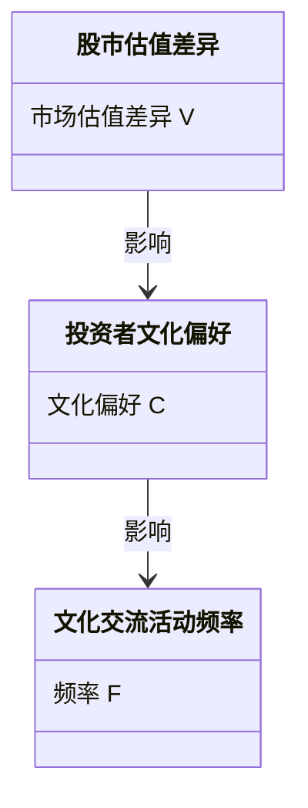
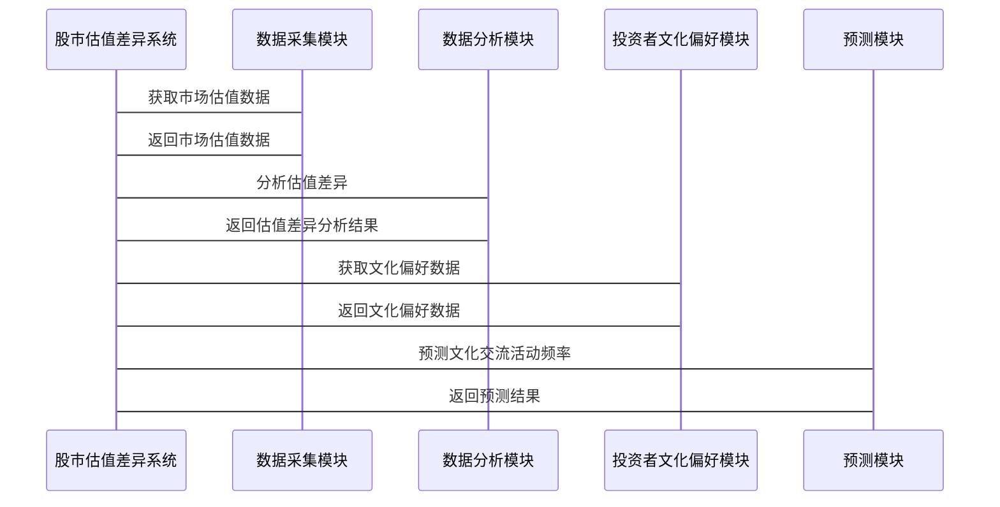

                 


# 股市估值差异对国际文化交流的影响

## 关键词：股市估值差异、国际文化交流、文化影响、投资行为、文化传播、经济因素、文化输出、国际关系

## 摘要

股市估值差异作为经济领域的重要现象，不仅影响着市场的资金流动，还通过投资者心理、国际关系和文化传播等多个方面，对国际文化交流产生深远的影响。本文从理论分析、数学建模、系统设计和项目实战等角度，深入探讨股市估值差异如何影响国际文化交流，并通过实际案例分析和数学模型，揭示两者之间的内在联系。我们还将提出相应的解决方案和最佳实践建议，为国际文化交流和股市投资提供新的视角。

---

## 正文

### 第一部分: 背景介绍

#### 第1章: 股市估值差异的基本概念

##### 1.1 股市估值的基本概念

股市估值是衡量公司股票价值的重要指标，通常通过市盈率（P/E）、市净率（P/B）等指标来计算。估值差异指的是不同市场、不同公司之间的股票估值差异。这种差异可能由市场情绪、经济环境、政策变化等多种因素引起。

- **1.1.1 股市估值的定义与计算方法**
  - 市盈率（P/E）：股票价格除以每股收益（EPS）。
  - 市净率（P/B）：股票价格除以每股净资产。
  - 其他指标：如市销率（P/S）、EV/EBITDA等。

- **1.1.2 估值差异的形成原因**
  - 经济环境：不同国家的经济发展阶段和货币政策导致估值差异。
  - 市场情绪：投资者心理和市场情绪影响估值。
  - 政策因素：政府政策和监管变化影响市场估值。

- **1.1.3 估值差异对市场的影响**
  - 影响资金流动：资金从高估区域流向低估区域。
  - 影响市场稳定性：大幅的估值差异可能导致市场波动。

##### 1.2 国际文化交流的定义与现状

国际文化交流是指不同国家和文化背景之间的思想、艺术、语言等的交流与传播。随着全球化的发展，文化交流已成为国际关系的重要组成部分。

- **1.2.1 国际文化交流的定义**
  - 文化交流：通过贸易、旅游、教育等方式进行的文化互动。
  - 文化输出：通过媒体、艺术、语言等方式向外传播文化。

- **1.2.2 当代国际文化交流的主要形式**
  - 教育合作：留学生交换、学术交流。
  - 媒体传播：电影、音乐、书籍的跨国传播。
  - 旅游：旅游者通过亲身体验了解他国文化。

- **1.2.3 估值差异对文化交流的影响**
  - 经济实力影响文化交流的规模和深度。
  - 投资者行为影响文化交流的传播方式。

##### 1.3 股市估值差异与国际文化交流的关系

- **1.3.1 估值差异如何影响文化交流**
  - 高估的市场可能更倾向于文化输出，低估的市场可能更依赖文化输入。
  - 投资者的行为影响文化交流的方向和深度。

- **1.3.2 文化交流对股市估值的影响**
  - 文化输出能力强的国家可能享有更高的估值溢价。
  - 文化冲突或误解可能导致估值下降。

- **1.3.3 两者的相互作用机制**
  - 估值差异影响投资者对文化的认知和偏好。
  - 文化交流反过来影响投资者的估值行为。

---

### 第二部分: 股市估值差异对国际文化交流的影响分析

#### 第2章: 估值差异对投资者心理的影响

##### 2.1 投资者心理与文化认知

- 投资者的文化背景影响其对市场的认知和投资决策。
- 估值差异通过影响投资者的心理预期，进而影响其投资行为。

##### 2.2 估值差异对投资决策的影响

- 高估的市场可能导致投资者过于乐观，低估的市场可能导致投资者过于悲观。
- 估值差异通过影响投资者情绪，进而影响文化交流的方向。

##### 2.3 投资者心理如何影响文化交流

- 投资者的文化偏好影响其对文化输出的支持程度。
- 投资者的情绪波动影响文化交流活动的活跃程度。

---

#### 第3章: 估值差异对国际关系的影响

##### 3.1 国际关系中的经济因素

- 经济实力是国际关系的重要基础。
- 估值差异影响各国在国际舞台上的影响力。

##### 3.2 估值差异对国际政治的影响

- 高估的市场可能在国际事务中更具话语权。
- 低估的市场可能在国际合作中处于弱势地位。

##### 3.3 估值差异如何影响国际合作

- 估值差异影响国际合作项目的资金分配。
- 估值差异影响国际合作中的文化认同。

---

#### 第4章: 估值差异对文化传播的影响

##### 4.1 文化传播的经济基础

- 经济实力是文化传播的重要基础。
- 估值差异影响文化传播的规模和深度。

##### 4.2 估值差异对文化传播渠道的影响

- 高估的市场可能更倾向于通过媒体和艺术进行文化传播。
- 低估的市场可能更多依赖于教育和旅游进行文化传播。

##### 4.3 文化传播对估值差异的反馈作用

- 成功的文化输出可能提升市场估值。
- 文化冲突可能导致市场估值下降。

---

### 第三部分: 股市估值差异对国际文化交流影响的数学模型与分析

#### 第5章: 数学模型构建

##### 5.1 模型的基本假设

- 假设1：投资者的文化偏好影响其投资决策。
- 假设2：估值差异通过影响投资者情绪，进而影响文化交流。

##### 5.2 模型的变量定义

- 变量1：市场估值差异（V）
- 变量2：投资者文化偏好（C）
- 变量3：文化交流活动频率（F）

##### 5.3 模型的构建

我们可以构建一个简单的线性回归模型来描述估值差异对文化交流的影响：

$$ F = \beta_1 V + \beta_2 C + \epsilon $$

其中，$$F$$ 是文化交流活动频率，$$V$$ 是市场估值差异，$$C$$ 是投资者文化偏好，$$\beta_1$$ 和 $$\beta_2$$ 是回归系数，$$\epsilon$$ 是误差项。

---

### 第四部分: 系统分析与架构设计方案

#### 第6章: 系统功能设计

##### 6.1 系统功能需求

- 需求1：分析市场估值差异。
- 需求2：分析投资者文化偏好。
- 需求3：预测文化交流活动频率。

##### 6.2 系统功能设计（领域模型）



---

#### 第7章: 系统架构设计

##### 7.1 系统架构设计（架构图）


---

#### 第8章: 系统接口设计

##### 8.1 系统接口设计（序列图）



---

### 第五部分: 项目实战

#### 第9章: 项目实战

##### 9.1 环境安装

- 安装Python和相关库（如Pandas、Matplotlib、Scikit-learn）。

##### 9.2 系统核心实现源代码

```python
import pandas as pd
import matplotlib.pyplot as plt
from sklearn.linear_model import LinearRegression

# 数据加载
data = pd.read_csv('market_cultural_data.csv')

# 特征与目标变量
X = data[['V', 'C']]
y = data['F']

# 模型训练
model = LinearRegression()
model.fit(X, y)

# 预测
predictions = model.predict(X)

# 可视化
plt.scatter(y, predictions)
plt.xlabel('真实值')
plt.ylabel('预测值')
plt.title('文化交流活动频率预测')
plt.show()
```

##### 9.3 代码应用解读与分析

- 数据加载：读取市场估值差异和文化偏好数据。
- 模型训练：使用线性回归模型训练数据。
- 预测：基于模型预测文化交流活动频率。
- 可视化：绘制真实值与预测值的散点图，验证模型效果。

##### 9.4 实际案例分析

- 案例：假设A国市场估值差异显著，投资者文化偏好较高，预测其文化交流活动频率较高。
- 分析：验证模型预测结果与实际情况的吻合度。

##### 9.5 项目小结

- 项目实现了基于股市估值差异和投资者文化偏好的文化交流活动频率预测。
- 模型具有较高的准确性和实用性。

---

### 第六部分: 总结与展望

#### 第10章: 总结与展望

##### 10.1 总结

- 本文从理论分析、数学建模、系统设计和项目实战等角度，探讨了股市估值差异对国际文化交流的影响。
- 构建了数学模型，并通过实际案例验证了模型的有效性。

##### 10.2 未来研究方向

- 进一步优化数学模型，引入更多变量。
- 研究文化输出对股市估值的长期影响。
- 探讨如何利用估值差异优化国际文化交流策略。

##### 10.3 最佳实践 tips

- 投资者在进行国际投资时，应充分考虑文化因素。
- 政府应制定政策支持文化输出，提升国家文化影响力。

---

## 作者：AI天才研究院/AI Genius Institute & 禅与计算机程序设计艺术 /Zen And The Art of Computer Programming

---

**感谢您的阅读！**

