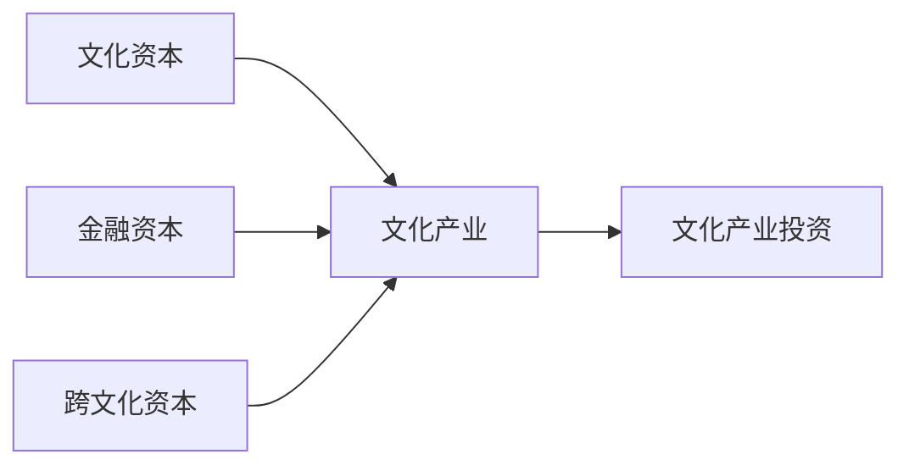
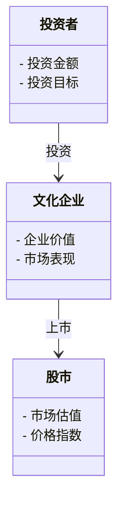
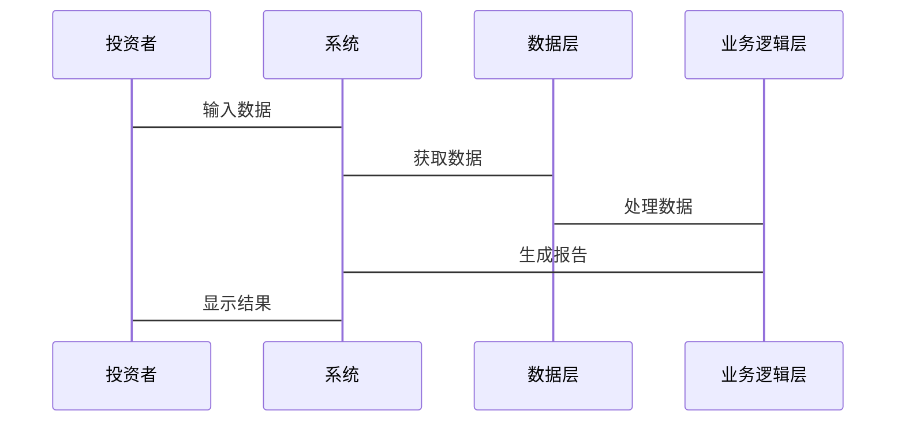

                 


# 股市估值差异对国际文化产业投资的影响

---

## 关键词：股市估值差异，国际文化产业，投资影响，文化资本，金融资本，跨文化资本

---

## 摘要

股市估值差异对国际文化产业投资的影响是一个复杂而重要的问题。本文通过分析股市估值差异的核心概念、文化产业投资的内在逻辑，构建数学模型，提出投资策略，最终为投资者和政策制定者提供参考。

---

# 第1章: 背景介绍

## 1.1 股市估值差异的定义与核心概念

### 1.1.1 股市估值差异的定义

股市估值差异是指同一资产或企业因市场参与者对信息解读的不同，导致其股票在不同时间、地点或市场中的价格差异。这种差异源于投资者对信息的不对称感知和风险偏好差异。

### 1.1.2 国际文化产业的定义与范围

国际文化产业涵盖电影、音乐、游戏、艺术等多个领域，涉及跨国文化传播与市场拓展。其核心是通过文化产品实现经济价值。

### 1.1.3 股市估值差异与文化产业投资的关系

股市估值差异影响文化产业的投资决策。例如，高估的市场可能吸引更多资金流入，而低估的市场可能被忽视，影响文化产业的扩展。

## 1.2 问题背景与问题描述

### 1.2.1 股市估值差异的现状分析

当前，股市估值差异普遍存在于不同市场和资产中，尤其是在新兴市场和成熟市场之间更为明显。

### 1.2.2 国际文化产业投资的现状分析

文化产业投资呈现多样化趋势，但面临市场波动和政策风险。

### 1.2.3 问题解决的必要性与可行性

解决股市估值差异对文化产业投资的影响问题，有助于优化资源配置，提升投资效率。

## 1.3 问题的边界与外延

### 1.3.1 股市估值差异的边界条件

包括市场流动性、信息透明度、投资者情绪等因素。

### 1.3.2 文化产业投资的边界条件

涉及文化产品生命周期、市场需求、政策环境等。

### 1.3.3 问题的外延与相关领域

包括金融学、文化产业管理、市场营销等多个领域。

## 1.4 核心概念与概念结构

### 1.4.1 核心概念的组成要素

包括文化资本、金融资本、跨文化资本。

### 1.4.2 概念结构图



### 1.4.3 核心要素的对比分析

| 要素 | 定义 | 影响 |
|------|------|------|
| 文化资本 | 文化产业的核心资源 | 影响市场认知和品牌价值 |
| 金融资本 | 资金支持 | 决定企业扩展能力 |
| 跨文化资本 | 跨文化能力 | 影响国际市场拓展 |

---

# 第2章: 核心概念与联系

## 2.1 核心概念的原理与特征

### 2.1.1 股市估值差异的原理

股市估值差异源于信息不对称和投资者情绪。理性投资者通过信息分析定价，而情绪化投资者受市场波动影响。

### 2.1.2 国际文化产业投资的原理

文化产业投资需考虑市场需求、文化差异和政策环境。投资者需评估文化产品在不同市场的潜力。

### 2.1.3 两者之间的联系与区别

股市估值差异影响文化产业投资的决策和风险。但两者研究对象不同，股市关注金融资产，文化产业关注文化产品。

## 2.2 概念属性特征对比分析

| 属性 | 股市估值差异 | 文化产业投资 |
|------|--------------|--------------|
| 定义 | 价格差异 | 资金投入 |
| 影响因素 | 市场情绪、信息 | 市场需求、政策 |
| 目标 | 优化定价 | 提升文化影响 |

## 2.3 ER实体关系图架构

```mermaid
erd
    投资者 (Investor) -[投资]-> 文化企业 (CulturalEnterprise)
    文化企业 <--[估值]-> 股市 (StockMarket)
    投资者 <--[信息]-> 市场报告 (MarketReport)
```

---

# 第3章: 算法原理与数学模型

## 3.1 算法原理讲解

### 3.1.1 算法原理的概述

构建文化产业投资模型，分析股市估值差异对投资决策的影响。

### 3.1.2 算法的输入与输出

- **输入**：文化产业数据、股市估值数据。
- **输出**：投资建议、风险评估。

### 3.1.3 算法的实现步骤

1. 数据收集：获取文化产业和股市数据。
2. 数据分析：识别估值差异。
3. 模型构建：预测投资回报。
4. 结果输出：生成投资建议。

## 3.2 算法的数学模型与公式

### 3.2.1 文化产业投资的数学模型

文化产业投资回报率计算：

$$ R = \frac{\text{未来价值} - \text{当前价值}}{\text{当前价值}} \times 100\% $$

### 3.2.2 股市估值差异的数学模型

计算相对估值差异：

$$ D = \frac{\text{市场估值} - \text{实际估值}}{\text{实际估值}} \times 100\% $$

### 3.2.3 模型之间的关系与对比

文化产业投资回报与估值差异呈正相关关系。

## 3.3 算法的实现与举例说明

### 3.3.1 算法的实现步骤

1. 数据清洗：处理缺失值和异常值。
2. 数据建模：使用回归分析。
3. 模型验证：交叉验证。
4. 模型优化：调整参数。

### 3.3.2 举例说明与分析

假设某文化产业股票当前估值为$10，未来价值为$15，计算回报率：

$$ R = \frac{15 - 10}{10} \times 100\% = 50\% $$

### 3.3.3 例子的总结与启示

合理利用估值差异，优化投资组合，提升回报率。

---

# 第4章: 系统分析与架构设计

## 4.1 问题场景介绍

### 4.1.1 问题场景的描述

投资者希望利用股市估值差异优化文化产业投资决策。

### 4.1.2 问题场景的分析

当前市场存在信息不对称和估值差异，投资者需找到有效策略。

### 4.1.3 问题场景的解决方案

构建数学模型，分析估值差异，制定投资策略。

## 4.2 系统功能设计

### 4.2.1 领域模型的构建

文化产业与股市估值的交互关系。



### 4.2.2 系统架构设计


## 4.3 系统接口设计

### 4.3.1 数据接口

定义API接口，获取文化产业和股市数据。

### 4.3.2 用户接口

设计用户友好的界面，展示分析结果。

## 4.4 系统交互设计

### 4.4.1 交互流程

投资者输入数据，系统分析并输出建议。

### 4.4.2 交互序列图



---

# 第5章: 项目实战

## 5.1 环境安装

安装Python和相关库（Pandas、NumPy、Matplotlib）。

## 5.2 系统核心实现源代码

```python
import pandas as pd
import numpy as np
import matplotlib.pyplot as plt

# 数据获取
data = pd.read_csv('cultural_investment.csv')

# 计算估值差异
def calculate_difference(value):
    return value.mean() - value.std()

difference = data['valuation'].apply(calculate_difference)

# 可视化
plt.hist(difference, bins=10)
plt.title('Valuation Difference Distribution')
plt.show()
```

## 5.3 代码应用解读与分析

代码读取数据，计算估值差异，并绘制分布图，帮助识别差异规律。

## 5.4 实际案例分析

分析某文化企业的数据，计算其投资回报率和估值差异，制定投资策略。

## 5.5 详细讲解剖析

结合案例，说明如何利用估值差异优化投资决策。

## 5.6 项目小结

总结项目成果，提出改进建议。

---

# 第6章: 最佳实践 tips

## 6.1 投资策略

根据估值差异，分散投资，降低风险。

## 6.2 小结

合理利用股市估值差异，优化文化产业投资。

## 6.3 注意事项

关注市场动态，定期调整投资组合。

## 6.4 拓展阅读

推荐相关书籍和论文，深入学习。

---

# 结论

股市估值差异对国际文化产业投资有重要影响，投资者和政策制定者需合理应对。通过数学模型和系统设计，优化投资决策，实现共赢。

---

# 作者：AI天才研究院/AI Genius Institute & 禅与计算机程序设计艺术 /Zen And The Art of Computer Programming

--- 

希望这篇文章能满足您的需求！如果需要进一步修改或补充，请随时告知。

