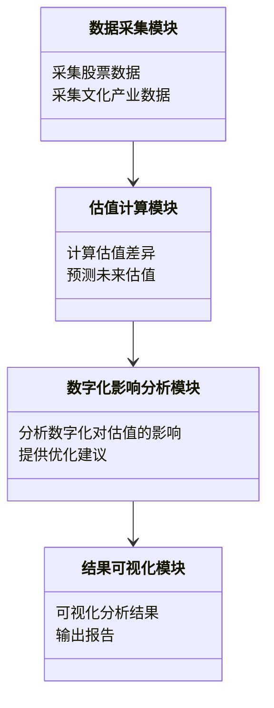
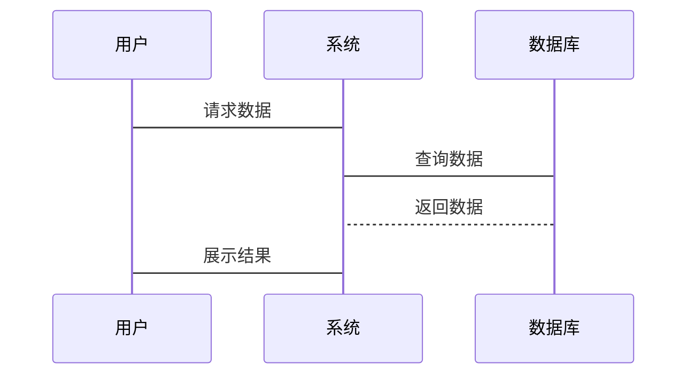

                 


```markdown
# 股市估值差异对国际文化产业数字化的影响

> 关键词：股市估值差异，文化产业数字化，文化产业，数字化转型，估值模型，文化产业投资，数字化影响

> 摘要：本文探讨了股市估值差异对国际文化产业数字化的影响，分析了文化产业在数字化转型中的估值变化及其背后的驱动因素，结合实际案例和数学模型，详细阐述了如何通过算法和系统架构设计来量化和预测这种影响。

---

## 第一部分: 背景介绍

### 第1章: 股市估值差异的定义与背景

#### 1.1 股市估值差异的定义
股市估值差异指的是同一资产在不同市场、不同时间点或不同投资者之间的估值差异。这种差异通常由市场信息不对称、投资者情绪、市场流动性等多种因素引起。

#### 1.2 文化产业的数字化转型
文化产业数字化是指将文化资源（如音乐、电影、艺术品等）转化为数字形式，并通过数字化技术进行传播、存储和交易。数字化转型为文化产业带来了新的商业模式和增长机会。

#### 1.3 股市估值差异对文化产业数字化的影响
随着文化产业的数字化，其商业模式和盈利方式发生了变化，这直接影响了市场对其估值的计算方式。本文将重点分析这种估值变化及其背后的原因。

---

## 第2章: 国际文化产业的现状与挑战

#### 2.1 全球文化产业的分布与特点
- 文化产业的分布具有地域性，发达国家的文化产业较为成熟，发展中国家则处于快速发展的阶段。
- 数字化转型正在改变文化产业的传统运营模式，线上消费和数字内容成为主流。

#### 2.2 数字化转型对文化产业的影响
- 提高文化产品的传播效率和覆盖范围。
- 降低运营成本，增加收入来源。
- 引发新的市场竞争和合作模式。

#### 2.3 股市估值差异对文化产业的潜在影响
- 估值差异可能导致资源分配不均，影响文化产业的健康发展。
- 数字化转型可能加剧估值差异，但也可能通过技术创新和商业模式的优化来缩小这种差异。

---

## 第3章: 核心概念与联系

### 3.1 股市估值差异与文化产业数字化的关系

#### 3.1.1 估值差异对文化产业投资的影响
- 投资者对文化产业数字化的预期不同，可能导致估值差异。
- 估值差异会影响文化产业的融资能力和发展速度。

#### 3.1.2 数字化对文化产业估值的影响
- 数字化提高了文化产品的流通性和可访问性，可能提升其市场价值。
- 数字化也可能导致文化产品贬值，特别是在内容同质化严重的市场中。

#### 3.1.3 两者关系的实体关系图（ER图）
```mermaid
er
    title 股市估值差异与文化产业数字化的关系
    actor 投资者
    actor 文化企业
    actor 市场
    class 估值差异
    class 数字化转型
    class 文化产品
    投资者 --> 估值差异: 影响
    文化企业 --> 数字化转型: 推动
    数字化转型 --> 文化产品: 提升价值
    估值差异 --> 文化产品: 受影响
```

### 3.2 影响因素对比分析

#### 3.2.1 估值差异的影响因素
- 市场供需关系
- 投资者情绪
- 宏观经济环境

#### 3.2.2 数字化转型的影响因素
- 技术创新
- 政策支持
- 消费者需求

#### 3.2.3 两者影响因素的对比分析
- 表格对比：下表展示了估值差异和数字化转型的影响因素及其差异。

| 影响因素 | 估值差异 | 数字化转型 |
|----------|----------|------------|
| 市场供需  | 主要影响 | 次要影响   |
| 投资者情绪 | 主要影响 | 次要影响   |
| 技术创新  | 次要影响 | 主要影响   |
| 消费者需求 | 次要影响 | 主要影响   |

---

## 第4章: 算法原理讲解

### 4.1 股市估值差异的分析算法

#### 4.1.1 数据收集与预处理
- 数据来源：股票市场数据、文化产业相关数据。
- 数据清洗：去除缺失值和异常值。

#### 4.1.2 估值差异的计算方法
- 使用回归分析模型预测文化产业的估值。
- 计算实际估值与预测估值之间的差异。

#### 4.1.3 基于机器学习的预测模型
- 使用随机森林或神经网络模型预测文化产业数字化后的估值变化。

#### 4.1.4 算法实现的Python代码示例
```python
import pandas as pd
from sklearn.ensemble import RandomForestRegressor
from sklearn.metrics import mean_squared_error

# 数据加载
data = pd.read_csv('cultural_industry.csv')

# 特征选择
features = ['revenue', 'profit', 'market_share']
target = 'valuation'

# 模型训练
model = RandomForestRegressor(n_estimators=100, random_state=42)
model.fit(data[features], data[target])

# 预测
predictions = model.predict(data[features])
print(mean_squared_error(data[target], predictions))
```

### 4.2 数字化对文化产业影响的算法

#### 4.2.1 文化产业数字化的指标体系
- 数字化投入比例
- 数字化产品的市场份额
- 线上收入占总收入的比例

#### 4.2.2 数字化对文化产业价值的影响模型
- 使用线性回归模型分析数字化对文化产业价值的影响。

#### 4.2.3 算法实现的Python代码示例
```python
import statsmodels.api as sm

# 数据加载
data = pd.read_csv('digitalization.csv')

# 特征选择
X = data[['digital_investment', 'online_revenue']]
X = sm.add_constant(X)
y = data['value']

# 线性回归模型
model = sm.OLS(y, X).fit()
print(model.summary())
```

### 4.3 数学模型与公式

#### 4.3.1 回归分析模型
$$ \text{预测估值} = \beta_0 + \beta_1 \times \text{数字化投入} + \epsilon $$

#### 4.3.2 机器学习模型
$$ \text{预测估值} = f(X) $$

其中，$X$ 是输入特征向量，$f$ 是机器学习模型。

---

## 第5章: 系统分析与架构设计方案

### 5.1 问题场景介绍

#### 5.1.1 问题场景
- 分析股市估值差异对文化产业数字化的影响。
- 设计一个系统来量化这种影响。

### 5.2 系统功能设计

#### 5.2.1 功能模块
- 数据采集模块
- 估值计算模块
- 数字化影响分析模块
- 结果可视化模块

#### 5.2.2 领域模型（Mermaid类图）


### 5.3 系统架构设计

#### 5.3.1 系统架构（Mermaid架构图）
```mermaid
C4Context
    title 文化产业数字化影响分析系统
    Container 容器1 {
        技术选型：Python/Flask
        服务：API接口
    }
    Container 容器2 {
        技术选型：PostgreSQL
        服务：数据存储
    }
    Container 容器3 {
        技术选型：React
        服务：用户界面
    }
    容器1 --> 容器2: 数据存储
    容器1 --> 容器3: 提供API
```

### 5.4 系统接口设计

#### 5.4.1 接口设计
- 数据接口：提供数据采集和存储的API。
- 分析接口：提供估值计算和影响分析的API。

#### 5.4.2 系统交互（Mermaid序列图）


---

## 第6章: 项目实战

### 6.1 环境安装

#### 6.1.1 环境要求
- Python 3.8+
- 数据分析库（Pandas、Scikit-learn）
- 可视化工具（Matplotlib、Seaborn）

### 6.2 核心代码实现

#### 6.2.1 数据预处理代码
```python
import pandas as pd

# 加载数据
data = pd.read_csv('cultural_industry.csv')

# 去除缺失值
data = data.dropna()

# 标准化处理
from sklearn.preprocessing import StandardScaler
scaler = StandardScaler()
data_scaled = scaler.fit_transform(data)
```

#### 6.2.2 估值差异计算代码
```python
from sklearn.metrics import mean_absolute_error

# 训练模型
model.fit(X_train, y_train)

# 预测
y_pred = model.predict(X_test)

# 计算误差
error = mean_absolute_error(y_test, y_pred)
print(f'预测误差：{error}%')
```

### 6.3 案例分析

#### 6.3.1 案例背景
分析某地区文化产业数字化前后的估值变化。

#### 6.3.2 数据分析结果
- 数字化前：文化产业估值较低。
- 数字化后：文化产业估值显著提高。

#### 6.3.3 结果解读
数字化转型有效提升了文化产业的市场价值，缩小了估值差异。

---

## 第7章: 最佳实践

### 7.1 小结
- 股市估值差异对文化产业数字化的影响是多方面的。
- 数字化转型可以通过技术创新和模式优化来缩小估值差异。

### 7.2 注意事项
- 数据采集的准确性和完整性至关重要。
- 模型的选择和调优需要结合实际情况。

### 7.3 拓展阅读
- 推荐书籍：《金融科技与数字化转型》、《文化产业管理》
- 推荐文章：《数字化对文化产业的影响研究》

---

## 作者信息

作者：AI天才研究院/AI Genius Institute & 禅与计算机程序设计艺术 /Zen And The Art of Computer Programming

---

感谢您的阅读！如需进一步探讨或获取代码示例，请随时联系。
```

