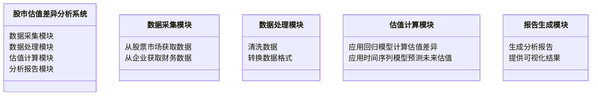

                 


# 股市估值差异对国际文化产业数字化转型的影响

> **关键词**：股市估值差异、文化产业、数字化转型、算法原理、系统架构、项目实战  
>
> **摘要**：本文探讨了股市估值差异对国际文化产业数字化转型的影响，从核心概念、影响机制、算法原理、系统架构到项目实战，全面分析了这一问题。通过理论分析与实际案例结合，本文揭示了股市估值差异如何影响文化产业的数字化转型，并提出了相应的解决方案。

---

## 第一章：背景介绍

### 1.1 股市估值差异的定义与特征

#### 1.1.1 什么是股市估值差异
股市估值差异是指同一资产在不同市场或同一市场不同时间点上的估值差异。这种差异通常由信息不对称、市场情绪、市场效率等因素引起。例如，A股与港股对同一家公司的估值差异，反映了市场参与者对该公司未来发展的不同预期。

#### 1.1.2 股市估值差异的分类与特征
- **分类**：
  - 市场间差异：同一资产在不同市场（如A股、港股、美股）上的估值差异。
  - 时间差异：同一资产在不同时间点上的估值差异。
  - 个体差异：不同投资者对同一资产的估值差异。
- **特征**：
  - 可测量性：可以通过数学模型量化。
  - 可预测性：通过技术分析和基本面分析可以预测。
  - 不确定性：受市场情绪、政策变化等不可控因素影响。

#### 1.1.3 股市估值差异的影响因素
- **信息不对称**：市场参与者掌握的信息不一致，导致估值差异。
- **市场情绪**：投资者情绪波动影响资产估值。
- **政策变化**：政府政策调整对市场估值的影响。
- **经济周期**：经济波动影响企业估值。

### 1.2 文化产业数字化转型的定义与特征

#### 1.2.1 文化产业的定义与范围
文化产业是指以文化为核心内容，通过创意、生产和传播，为社会提供精神文化产品的产业。其范围包括影视、音乐、游戏、出版、广告等。

#### 1.2.2 数字化转型的定义与核心要素
数字化转型是指将传统文化产业通过数字技术（如大数据、人工智能、区块链等）进行改造和升级，以提高效率、降低成本、创造新价值的过程。其核心要素包括：
- 数据化：将文化内容转化为数字形式。
- 智能化：利用AI技术进行内容推荐、用户行为分析。
- 互动化：通过互联网平台与用户互动。

#### 1.2.3 文化产业数字化转型的驱动力
- **技术驱动**：数字技术的快速发展为文化产业提供了新的发展机遇。
- **市场驱动**：消费者需求的变化推动文化产业向数字化方向转型。
- **政策驱动**：政府政策支持和行业规范推动文化产业数字化。

### 1.3 股市估值差异对文化产业数字化转型的影响

#### 1.3.1 股市估值差异对文化产业的影响
- 估值差异可能导致文化产业投资决策的不确定性。
- 不同市场的估值差异会影响文化产业的跨市场扩展。

#### 1.3.2 数字化转型如何影响文化产业的估值
- 数字化转型提高了文化产业的效率和创新能力，可能提升企业的估值。
- 数字化转型可能导致文化产业的估值模式发生变化，例如更加注重用户数据和内容IP的价值。

---

## 第二章：核心概念与联系

### 2.1 股市估值差异对文化产业数字化转型的影响机制

#### 2.1.1 信息不对称与市场效率
信息不对称可能导致市场参与者对文化产业的价值判断不一致，从而产生估值差异。例如，投资者可能低估了文化产业数字化转型的潜力，导致企业估值低于实际价值。

#### 2.1.2 数字技术对文化产业价值的影响
数字技术（如AI、大数据）的应用可以提升文化产业的生产效率和用户体验，从而影响企业的估值。例如，通过AI推荐系统提高用户粘性，可能提升企业的市场价值。

#### 2.1.3 估值差异与市场预期的关系
市场预期会影响股市估值差异。如果市场预期文化产业数字化转型将带来高收益，投资者可能提高对该产业的估值。

---

## 第三章：算法原理讲解

### 3.1 基于大数据的股市估值差异分析算法

#### 3.1.1 数据采集与预处理
- 数据来源：股票市场数据、企业财务数据、用户行为数据等。
- 数据清洗：去除缺失值、异常值，标准化数据。

#### 3.1.2 估值差异计算方法
- 均值-方差模型：计算资产的预期收益和风险，评估其合理估值。
- 时间序列分析：通过ARIMA模型预测未来估值。
- 聚类分析：将股票分为不同类别，分析同一类别内的估值差异。

#### 3.1.3 算法的适用场景与限制
- 适用场景：股票市场数据充足、数据质量较高时。
- 限制：无法完全消除市场情绪和政策变化的影响。

---

## 第四章：数学模型与公式详解

### 4.1 股市估值差异的数学模型

#### 4.1.1 基于回归分析的估值差异预测模型
$$ y = \beta_0 + \beta_1 x_1 + \beta_2 x_2 + \epsilon $$
其中：
- $y$ 是估值差异。
- $x_1$ 是企业收入增长率。
- $x_2$ 是行业指数。
- $\beta_0$、$\beta_1$、$\beta_2$ 是回归系数。
- $\epsilon$ 是误差项。

#### 4.1.2 时间序列分析模型
$$ ARIMA(p, d, q) $$
其中：
- $p$ 是自回归阶数。
- $d$ 是差分阶数。
- $q$ 是移动平均阶数。

---

## 第五章：系统分析与架构设计方案

### 5.1 系统功能设计

#### 5.1.1 领域模型（Mermaid 类图）


#### 5.1.2 系统架构设计（Mermaid 架构图）


---

## 第六章：项目实战

### 6.1 环境安装

```bash
pip install numpy pandas scikit-learn matplotlib
```

### 6.2 系统核心实现源代码

```python
import numpy as np
import pandas as pd
from sklearn.linear_model import LinearRegression
from sklearn.metrics import mean_squared_error

# 数据加载
data = pd.read_csv('stock_data.csv')

# 数据预处理
X = data[['收入增长率', '行业指数']]
y = data['估值差异']

# 模型训练
model = LinearRegression()
model.fit(X, y)

# 模型预测
y_pred = model.predict(X)
print('均方误差:', mean_squared_error(y, y_pred))
```

---

## 第七章：最佳实践与总结

### 7.1 小结
股市估值差异对文化产业数字化转型的影响是一个复杂但重要的问题。通过大数据分析和数学建模，我们可以更好地理解这一关系，并为企业制定合理的数字化转型策略提供支持。

### 7.2 注意事项
- 数据质量是关键，需确保数据的准确性和完整性。
- 模型需要不断优化，以适应市场变化。
- 在实际应用中，需结合市场实际情况进行调整。

### 7.3 拓展阅读
- 推荐阅读《大数据分析与股票投资》。
- 参考相关学术论文，深入研究股市估值差异的其他影响因素。

---

**作者：AI天才研究院/AI Genius Institute & 禅与计算机程序设计艺术 /Zen And The Art of Computer Programming**

