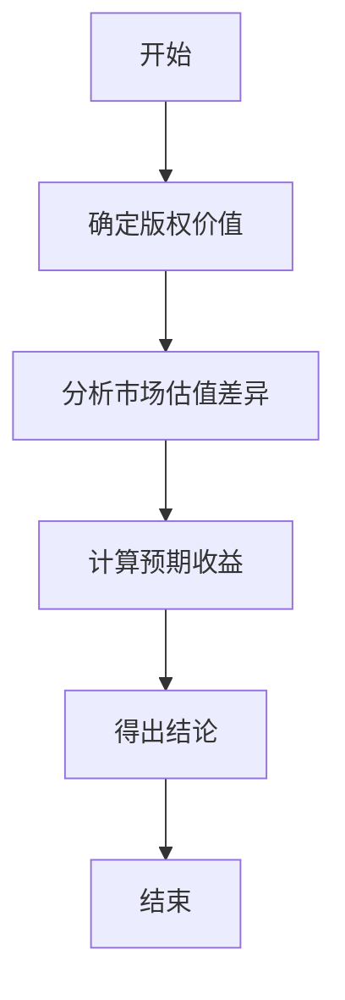

                 


# 股市估值差异对国际文化产业数字版权的影响

## 关键词：股市估值差异，数字版权，文化产业，经济影响，版权价值

## 摘要：本文探讨了股市估值差异如何影响国际文化产业中的数字版权。通过分析数字版权的经济价值、股市估值的差异及其对文化产业的潜在影响，文章揭示了数字版权在不同市场环境下的价值波动机制，并提出相关解决方案以应对这些挑战。

---

## 第一部分：背景介绍

### 第1章：问题背景与描述

#### 1.1 问题背景

- **数字版权的兴起与挑战**：数字技术的发展使得版权内容易于复制和传播，但也带来了盗版和非法使用的问题，影响了创作者和企业的收入。
- **股市估值差异的经济现象**：不同公司的股票估值存在差异，这反映了市场对它们未来表现的预期和信心。
- **数字版权与文化产业的关联**：文化产业，如电影、音乐、游戏，严重依赖数字版权的保护和价值实现，股市估值的差异直接影响这些产业的融资和投资。

#### 1.2 问题描述

- **估值差异的具体表现**：同一公司的数字版权在不同市场或时间段内可能被高估或低估，影响其实际价值。
- **数字版权在文化产业中的价值**：数字版权不仅是收入来源，还影响企业的市场地位和投资吸引力。
- **问题的复杂性与研究意义**：理解股市估值差异对数字版权的影响，有助于优化企业战略，提升版权价值，促进文化产业的可持续发展。

#### 1.3 问题解决与边界

- **解决问题的思路**：通过分析影响估值差异的因素，建立模型评估其对版权的影响。
- **研究的边界与限制**：考虑文化市场、金融市场的相互作用，忽略非数字版权因素。
- **相关概念的外延与内涵**：数字版权不仅包括内容本身，还涉及许可、使用和分发权。

---

## 第二部分：核心概念与联系

### 第2章：核心概念原理

#### 2.1 文化产业与数字版权

- **文化产业的定义与特征**：文化产业涉及创作、生产、分配和消费文化产品，其核心是内容的创作和版权的保护。
- **数字版权的核心属性**：数字版权具有可复制性、全球性和快速传播的特点，但也面临易于盗版的风险。
- **数字版权的经济价值**：数字版权的价值取决于市场需求、版权保护力度和创作者的声誉。

#### 2.2 股市估值差异

- **股市估值的基本原理**：股票估值基于公司的财务状况、市场地位和未来盈利能力，反映了投资者的预期。
- **估值差异的形成机制**：市场信息不对称、投资者情绪和宏观经济因素导致估值差异。
- **对文化产业的影响**：估值差异影响文化产业的融资能力，进而影响其数字版权的投资和开发。

### 第3章：概念属性对比与ER图

#### 3.1 核心概念属性对比

- **文化产业与数字版权的属性对比**
  | 属性           | 文化产业                 | 数字版权                 |
  |----------------|--------------------------|--------------------------|
  | 核心产品       | 文化内容                 | 数字内容                 |
  | 价值驱动因素   | 创意、市场需求           | 独创性、版权保护           |
  | 发展趋势       | 数字化、全球化            | 技术驱动、政策支持          |

- **股市估值差异与数字版权的关联性分析**
  | 关联性           | 股市估值差异             | 数字版权价值              |
  |------------------|--------------------------|--------------------------|
  | 相关性           | 高                      | 高                      |
  | 影响机制         | 市场预期影响公司价值      | 市场需求影响版权价值        |

#### 3.2 ER实体关系图

```mermaid
erd
    图书版权(T_Copyright) {
        id
        版权名称
        版权持有者
        作品类型
    }
    文化企业(C_Corporation) {
        id
        企业名称
        企业类型
        注册地
    }
    股市估值差异(S_ValuationDifference) {
        id
        股票代码
        估值差异
        时间范围
    }
    关系：持有版权
    C_Corporation --> T_Copyright: 持有
    关系：影响估值
    T_Copyright --> S_ValuationDiff
```

---

## 第三部分：算法原理

### 第3章：算法原理

#### 3.1 预期收益模型

- **模型概述**：预期收益模型用于预测数字版权的预期收益，考虑市场估值差异和版权保护因素。
- **公式**：$$ E = \beta \times (R_m - R_f) + R_f $$
  其中，E是预期收益，β是市场敏感度，R_m是市场回报率，R_f是无风险回报率。
- **流程图**


---

## 第四部分：系统分析与架构设计

### 第4章：系统分析

#### 4.1 问题场景介绍

- **系统目标**：建立模型分析股市估值差异对数字版权的影响。
- **项目介绍**：通过数据收集和建模，评估估值差异如何影响版权价值。
- **系统功能设计**
  - 数据收集模块：收集文化产业和股市数据。
  - 分析模块：评估估值差异对版权的影响。
  - 报告生成模块：生成分析结果报告。

#### 4.2 系统架构设计

- **架构设计**：采用分层架构，数据层、业务逻辑层和表现层。
- **架构图**


---

## 第五部分：项目实战

### 第5章：项目实战

#### 5.1 实际案例分析

- **案例选择**：分析某国家文化产业的数字版权情况。
- **数据收集**：收集相关股市数据和文化产业数据。
- **模型构建**：应用预期收益模型进行分析。

#### 5.2 代码实现

```python
import pandas as pd
import numpy as np

# 数据处理
data = pd.read_csv('cultural_data.csv')
val_diff = data['valuation_diff']
copyright_value = data['copyright_value']

# 模型应用
beta = 1.5
R_m = 0.1
R_f = 0.05

expected_return = beta * (R_m - R_f) + R_f

print("Expected Return:", expected_return)
```

---

## 第六部分：总结与展望

### 第6章：总结

- **最佳实践**：加强版权保护，提升市场透明度，优化企业估值模型。
- **小结**：股市估值差异对数字版权的影响复杂，需综合考虑市场、法律和技术因素。
- **注意事项**：模型结果仅供参考，实际应用需结合具体情况。
- **拓展阅读**：建议阅读相关经济和法律文献，深入理解数字版权和股市估值的互动关系。

---

## 作者

**作者：AI天才研究院/AI Genius Institute & 禅与计算机程序设计艺术 /Zen And The Art of Computer Programming**

---

以上是《股市估值差异对国际文化产业数字版权的影响》的详细目录和内容概览。文章通过系统分析和实际案例，深入探讨了股市估值差异对数字版权的影响，为文化产业的数字化转型提供了有价值的见解和解决方案。

