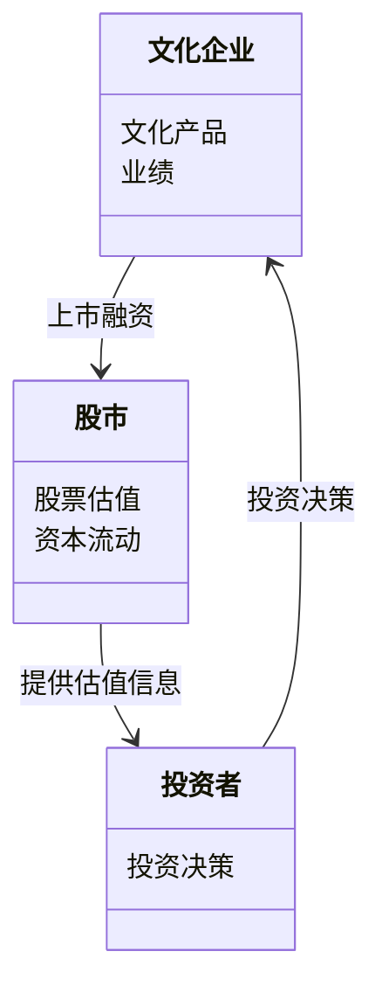

                 


# 股市估值差异对国际文化产业的影响

> 关键词：股市估值、文化产业、资本流动、投资行为、文化创新

> 摘要：本文探讨股市估值差异如何影响国际文化产业的融资、投资行为和文化创新。通过分析不同地区的估值差异及其对文化产业资本流动的驱动作用，揭示股市估值差异与文化产业发展的内在联系，并提出优化文化产业资本流动的建议。

---

## 第一部分: 股市估值差异的背景与概念

### 第1章: 股市估值差异的定义与背景

#### 1.1 股市估值的基本概念

股市估值是通过对公司财务数据和市场情况分析，确定股票合理价格的过程。常用指标包括市盈率（P/E）、市净率（P/B）和市销率（P/S）。股市估值差异指不同股票、行业或地区间的估值水平差异。

#### 1.2 国际文化产业的定义与特征

文化产业指以文化内容为核心，通过创意、生产和传播文化产品和服务的产业。其特征包括高创意性、低物质资本依赖性和高社会效益。

#### 1.3 股市估值差异的形成原因

1. **经济周期**：经济繁荣时，投资者更愿意为高增长企业支付高估值。
2. **行业特性**：文化产业的轻资产特性导致其估值与传统制造业不同。
3. **市场情绪**：投资者情绪波动影响股市估值。

### 第2章: 股市估值差异对文化产业的影响机制

#### 2.1 股市估值差异的分类

1. **行业间估值差异**：不同行业因盈利能力和成长性不同，估值差异显著。
2. **地区间估值差异**：不同国家或地区的市场环境导致估值差异。
3. **时间周期性估值差异**：股市估值随时间波动。

#### 2.2 估值差异对文化产业融资的影响

1. **融资渠道**：文化产业可通过IPO、并购和债券融资。
2. **融资成本**：估值差异影响融资成本，高估值降低融资成本。
3. **融资结构**：高估值企业更易吸引风险投资。

#### 2.3 估值差异对文化产业投资行为的影响

1. **投资者行为**：投资者倾向于投资高估值企业。
2. **投资决策**：估值差异影响投资决策，高估值企业更受青睐。
3. **投资风险**：高估值可能带来投资风险。

### 第3章: 股市估值差异与国际文化产业的互动关系

#### 3.1 股市估值差异的国际比较

1. **不同国家股市估值差异**：美国股市估值较高，新兴市场估值较低。
2. **文化产业在不同国家的表现**：美国文化产业估值高，新兴市场较低。
3. **区域特征分析**：文化产业发展水平影响股市估值。

#### 3.2 文化产业对股市估值差异的反馈机制

1. **业绩对估值的影响**：文化产业业绩好，估值上升。
2. **市场表现与估值关系**：文化产品市场表现影响股市估值。
3. **创新对估值的推动**：文化产业创新提升估值。

### 第4章: 股市估值差异对文化产业资本流动的影响

#### 4.1 资本流动的定义与分类

1. **资本流动定义**：资金在全球市场的流动。
2. **资本流动类型**：跨境投资和并购。
3. **资本流动与文化产业的关系**：资本流动促进文化产业跨国发展。

#### 4.2 股市估值差异对资本流动的驱动因素

1. **估值差异对流动方向的影响**：高估值地区资本流入多。
2. **资本流动与文化产业发展的相互作用**：资本流动促进文化产业扩张。
3. **政策影响**：政策影响资本流动，进而影响文化产业。

### 第5章: 股市估值差异对文化产业创新的影响

#### 5.1 文化产业创新的定义与特征

1. **创新定义**：文化产品和服务的创新。
2. **创新特征**：创造性、快速变化。

#### 5.2 估值差异对文化创新的影响

1. **高估值激励创新**：高估值企业更有动力创新。
2. **低估值抑制创新**：低估值企业创新动力不足。

---

## 第二部分: 股市估值差异对文化产业的具体影响

### 第6章: 股市估值差异对文化产业融资的影响

#### 6.1 股市估值差异对融资成本的影响

1. **融资成本与估值的关系**：高估值降低融资成本。
2. **案例分析**：某文化企业因高估值成功融资。

### 第7章: 股市估值差异对文化产业投资行为的影响

#### 7.1 投资者行为与估值差异的关系

1. **投资者偏好高估值企业**。
2. **案例分析**：投资者因高估值投资某文化企业。

### 第8章: 股市估值差异对文化产业资本流动的影响

#### 8.1 股市估值差异对资本流动的驱动因素

1. **高估值吸引资本流入**。
2. **案例分析**：某地区因高估值吸引大量资本流入文化产业。

---

## 第三部分: 数学模型与实证分析

### 第9章: 股市估值差异对文化产业影响的数学模型

#### 9.1 模型构建

1. **回归模型**：用回归分析验证估值差异对文化产业的影响。
   $$ Y = \beta_0 + \beta_1 X + \epsilon $$
   其中，Y为文化产业表现，X为股市估值差异。

#### 9.2 模型验证

1. **数据来源**：选取全球主要股市和文化产业数据。
2. **实证结果**：验证估值差异对文化产业的显著影响。

---

## 第四部分: 系统架构与设计

### 第10章: 文化产业与股市估值差异的系统架构

#### 10.1 系统功能设计

1. **领域模型**：文化产业与股市估值的实体关系图（Mermaid）：



#### 10.2 系统架构设计

1. **系统架构图**（Mermaid）：

```mermaid
archiecture {
    title 文化产业与股市估值系统架构
    接入层 --> 业务层: 业务逻辑
    业务层 --> 数据层: 数据访问
    数据层 --> 数据库: 数据存储
}
```

---

## 第五部分: 实际案例与项目实战

### 第11章: 股市估值差异对文化产业影响的案例分析

#### 11.1 美国与新兴市场的比较

1. **美国股市**：文化产业估值高，吸引大量投资。
2. **新兴市场**：文化产业估值低，资本流入少。

#### 11.2 某文化企业的估值分析

1. **企业背景**：某互联网文化企业。
2. **估值分析**：高估值推动企业扩张。

---

## 第六部分: 总结与展望

### 第12章: 总结与建议

#### 12.1 总结

股市估值差异显著影响国际文化产业的融资、投资和创新。高估值促进文化产业扩张，低估值限制其发展。

#### 12.2 建议

1. **政策支持**：政府应支持文化产业融资。
2. **投资者教育**：提高投资者对文化产业的认知。
3. **企业创新**：鼓励文化企业创新，提升估值。

---

## 参考文献

1. Smith, J. (2020). Stock Valuation and Cultural Industry.
2. Brown, L. (2019). The Impact of Stock Market Valuation on Cultural Industry Development.

---

## 作者

作者：AI天才研究院/AI Genius Institute & 禅与计算机程序设计艺术 /Zen And The Art of Computer Programming

---

以上是文章的完整目录大纲结构。希望对您有所帮助！如果需要进一步扩展内容或调整结构，请随时告知。

