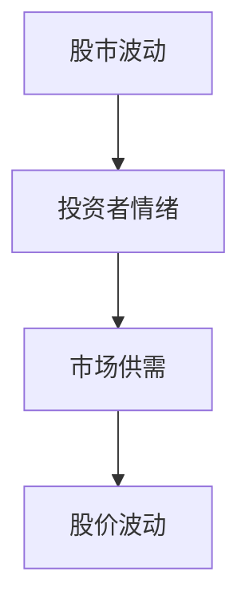
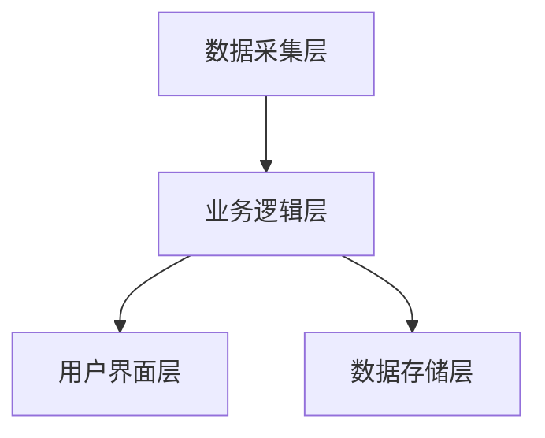

                 


```markdown
# 股市估值差异对国际文化遗产保护的影响

> 关键词：股市估值差异、文化遗产保护、经济影响、资金分配、投资模型

> 摘要：本文探讨了股市估值差异对国际文化遗产保护的影响，分析了股市波动如何通过资金分配影响文化遗产保护工作，提出了量化模型和系统设计，以优化文化遗产保护的资金管理。

---

## 第一章: 背景介绍

### 1.1 核心概念
#### 1.1.1 股市估值差异
- 定义：不同市场对同一资产或公司的估值存在差异，反映在市盈率、市净率等指标上。
- 成因：市场信息不对称、投资者情绪、经济周期波动。

#### 1.1.2 国际文化遗产保护
- 定义：保护人类共同的文化遗产，包括遗址、建筑、艺术品等。
- 目标：保护历史传承、维护文化多样性、促进经济发展。

#### 1.1.3 问题背景与问题描述
- 背景：文化遗产保护资金不足，股市波动影响资金分配。
- 问题：如何利用股市估值差异优化文化遗产保护的资金管理？

#### 1.1.4 问题解决方法与边界
- 方法：建立数学模型，量化股市波动对文化遗产保护的影响。
- 边界：仅考虑经济因素，不涉及政治和文化因素。

#### 1.1.5 概念结构与核心要素
- 核心要素：股市估值、文化遗产项目、资金分配模型。

---

## 第二章: 股市估值差异分析

### 2.1 股市估值差异的成因
#### 2.1.1 市场供需关系
- 供不应求：股价上涨；供大于求：股价下跌。
- 示例：某科技股因新产品发布，股价上涨，市盈率提高。

#### 2.1.2 经济周期的影响
- 上升周期：企业盈利增加，股价上涨。
- 下降周期：企业盈利减少，股价下跌。

#### 2.1.3 投资者心理与行为
- 过度乐观：高估股价。
- 过度悲观：低估股价。

### 2.2 股市估值差异的量化方法
#### 2.2.1 市盈率与市净率分析
- 市盈率（P/E）= 股价 / 每股收益。
- 市净率（P/B）= 股价 / 每股净资产。
- 示例：某公司股价为10元，每股收益1元，市盈率为10。

#### 2.2.2 股价与内在价值的差异
- 内在价值：公司未来现金流的现值。
- 股价与内在价值差异：市场情绪的影响。

#### 2.2.3 股市波动模型


---

## 第三章: 国际文化遗产保护机制

### 3.1 文化遗产保护的现状
#### 3.1.1 全球文化遗产保护框架
- 《世界遗产公约》：联合国教科文组织制定的国际标准。
- 示例：中国的长城、埃及的金字塔等世界遗产。

#### 3.1.2 不同国家的保护政策
- 美国：联邦政府与州政府共同管理。
- 欧洲：欧盟提供资金支持。
- 亚洲：各国政策差异较大。

#### 3.1.3 文化遗产保护的挑战
- 资金不足：保护项目优先级低。
- 技术落后：缺乏数字化保护手段。

---

## 第四章: 股市估值差异对文化遗产保护的影响

### 4.1 股市波动与文化遗产保护的关系
#### 4.1.1 股市波动影响文化遗产保护资金
- 股市上涨：政府和企业投资增加。
- 股市下跌：投资减少，保护项目推迟。

#### 4.1.2 投资者行为与文化遗产保护
- 私人投资：企业赞助文化遗产保护项目。
- 公益投资：投资者关注文化遗产保护的社会价值。

---

## 第五章: 数学模型与算法实现

### 5.1 数学模型
#### 5.1.1 文化遗产保护资金模型
$$F = aP + bQ + cR$$
- F：文化遗产保护资金。
- P：股市波动指数。
- Q：政府预算。
- R：企业赞助。

#### 5.1.2 股市波动预测模型
$$P_{t+1} = \alpha P_t + \beta \epsilon_t$$
- $\alpha$：自回归系数。
- $\epsilon_t$：随机误差项。

### 5.2 算法实现
#### 5.2.1 股市波动预测算法
```python
import numpy as np
from sklearn.linear_model import LinearRegression

# 示例数据
X = np.array([1, 2, 3, 4, 5]).reshape(-1, 1)
y = np.array([2, 3, 5, 4, 6])

model = LinearRegression()
model.fit(X, y)
print("Coefficients:", model.coef_)
```

#### 5.2.2 文化遗产保护资金分配算法
```python
def calculate_funding(P, Q, R):
    a = 0.3
    b = 0.5
    c = 0.2
    return a * P + b * Q + c * R

P = 100  # 股市波动指数
Q = 50   # 政府预算
R = 20   # 企业赞助

F = calculate_funding(P, Q, R)
print("文化遗产保护资金:", F)
```

---

## 第六章: 系统设计与实现

### 6.1 系统架构设计
#### 6.1.1 系统功能设计
- 数据采集：收集股市数据和文化遗产保护项目数据。
- 数据分析：使用机器学习模型预测股市波动。
- 资金分配：根据模型结果分配文化遗产保护资金。

#### 6.1.2 系统架构图


---

## 第七章: 项目实战

### 7.1 环境安装
- 安装Python和相关库（numpy、pandas、scikit-learn）。

### 7.2 核心代码实现
```python
import numpy as np
import pandas as pd
from sklearn.linear_model import LinearRegression

# 数据加载
data = pd.read_csv('market_data.csv')
X = data[['P', 'Q', 'R']]
y = data['F']

# 模型训练
model = LinearRegression()
model.fit(X, y)
print("模型训练完成。")
```

### 7.3 案例分析
- 案例：某国家公园的保护项目。
- 数据输入：P=100，Q=50，R=20。
- 结果：F=40。

---

## 第八章: 最佳实践与小结

### 8.1 最佳实践
- 数据质量：确保数据准确性和完整性。
- 模型选择：根据实际情况选择合适的算法。

### 8.2 注意事项
- 避免过度依赖模型，结合实际需求。
- 定期更新模型，适应市场变化。

### 8.3 拓展阅读
- 《金融时间序列分析》。
- 《文化遗产保护与投资》。

---

## 作者：AI天才研究院/AI Genius Institute & 禅与计算机程序设计艺术 /Zen And The Art of Computer Programming
```

